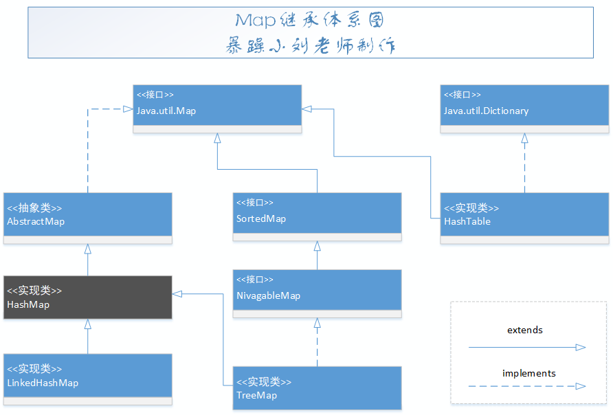
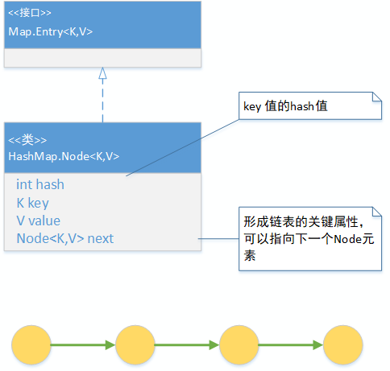
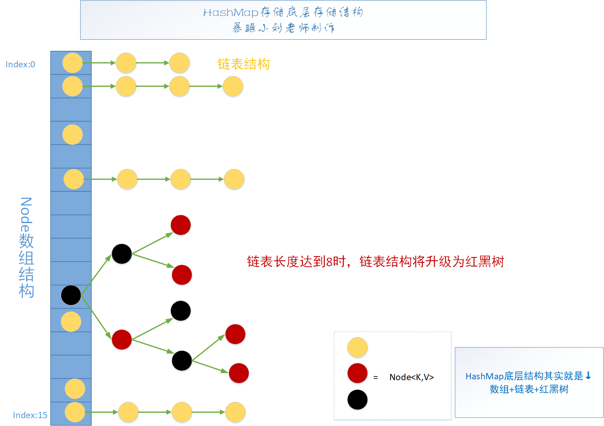
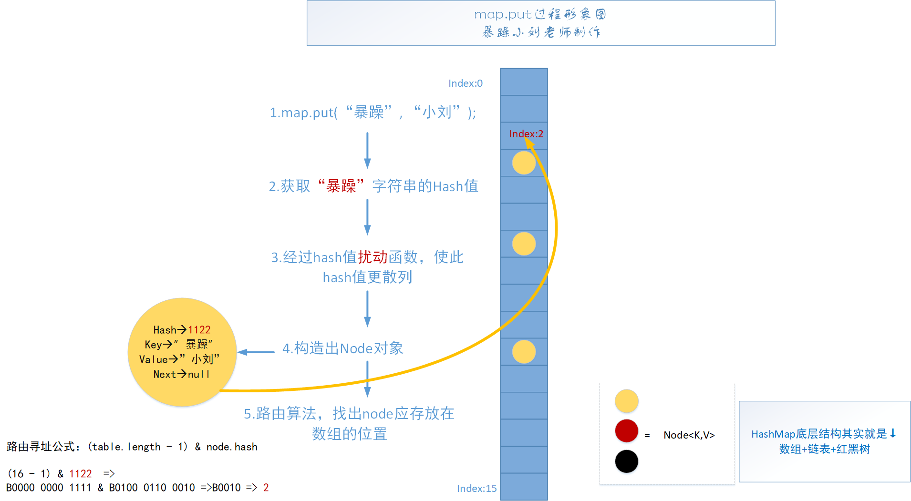

# HashMap源码分析

[HashMap全B站最细致源码分析课程](https://www.bilibili.com/video/BV1LJ411W7dP?from=search&seid=3479960677317118328)

[HashMap带注释源码](HashMap.java)

## 第一部分，基础入门：

### 有没有一种方式整合数组和链表数据结构的优势？散列表

**核心理论：**

Hash也称散列、哈希，对应的英文都是Hash。基本原理就是把任意长度的输入，通过Hash算法变成固定长度的输出。
这个映射的规则就是对应的Hash算法，而原始数据映射后的二进制串就是哈希值。

**Hash的特点：**
1.从hash值不可以反向推导出原始的数据
2.输入数据的微小变化会得到完全不同的hash值，相同的数据会得到相同的值
3.哈希算法的执行效率要高效，长的文本也能快速地计算出哈希值
4.hash算法的冲突概率要小

由于hash的原理是将输入空间的值映射成hash空间内，而hash值的空间远小于输入的空间。
根据抽屉原理，一定会存在不同的输入被映射成相同输出的情况。
抽屉原理：桌上有十个苹果，要把这十个苹果放到九个抽屉里，无论怎样放，我们会发现至少会有一个抽屉里面放不少于两个苹果。这一现象就是我们所说的“抽屉原理”。

## 第二部分，HashMap原理讲解：

### 1.HashMap的继承体系是什么样的？



### 2.Node数据结构分析？

```java
static class Node<K,V> implements Map.Entry<K,V> {
    final int hash;  // 会经过扰动函数得到hash值
    final K key;
    V value;
    Node<K,V> next;
    ...
}

interface Entry<K,V> {
    K getKey();

    V getValue();

    V setValue(V value);

    boolean equals(Object o);

    int hashCode();
}
```



### 3.底层存储结构介绍？

**数组+链表+红黑树：**



### 4.put数据原理分析？



## 第三部分，手撕源码：

### 1.HashMap核心属性分析（threshold, loadFactory, size, modCount）

**常量：**

```java
public class HashMap<K,V> extends AbstractMap<K,V>
implements Map<K,V>, Cloneable, Serializable {

/**
 * The default initial capacity - MUST be a power of two.
 * 默认的初始容量，必须是二的次方
 */
static final int DEFAULT_INITIAL_CAPACITY = 1 << 4; // aka 16
/**
 * The maximum capacity, used if a higher value is implicitly specified
 * by either of the constructors with arguments.
 * MUST be a power of two <= 1<<30.
 * 最大容量，1<<30=1073741824
 */
static final int MAXIMUM_CAPACITY = 1 << 30;
/**
 * The load factor used when none specified in constructor.
 */
static final float DEFAULT_LOAD_FACTOR = 0.75f;

/**
 * The bin count threshold for using a tree rather than list for a
 * bin.  Bins are converted to trees when adding an element to a
 * bin with at least this many nodes. The value must be greater
 * than 2 and should be at least 8 to mesh with assumptions in
 * tree removal about conversion back to plain bins upon
 * shrinkage.
 * 树化阈值参数1
 */
static final int TREEIFY_THRESHOLD = 8;

/**
 * The bin count threshold for untreeifying a (split) bin during a
 * resize operation. Should be less than TREEIFY_THRESHOLD, and at
 * most 6 to mesh with shrinkage detection under removal.
 * 树降级为链表的阈值
 */
static final int UNTREEIFY_THRESHOLD = 6;

/**
 * The smallest table capacity for which bins may be treeified.
 * (Otherwise the table is resized if too many nodes in a bin.)
 * Should be at least 4 * TREEIFY_THRESHOLD to avoid conflicts
 * between resizing and treeification thresholds.
 * 树化阈值参数2，当哈希表中的table容量超过64时，才会允许树化，否则先扩容
 */
static final int MIN_TREEIFY_CAPACITY = 64;
```

**属性：**

```java
/**
 * The table, initialized on first use, and resized as
 * necessary. When allocated, length is always a power of two.
 * (We also tolerate length zero in some operations to allow
 * bootstrapping mechanics that are currently not needed.)
 * 哈希表
 */
transient Node<K,V>[] table;

/**
 * Holds cached entrySet(). Note that AbstractMap fields are used
 * for keySet() and values().
 */
transient Set<Map.Entry<K,V>> entrySet;

/**
 * The number of key-value mappings contained in this map.
 * 当前哈希表中的元素个数
 */
transient int size;

/**
 * The number of times this HashMap has been structurally modified
 * Structural modifications are those that change the number of mappings in
 * the HashMap or otherwise modify its internal structure (e.g.,
 * rehash).  This field is used to make iterators on Collection-views of
 * the HashMap fail-fast.  (See ConcurrentModificationException).
 * 当前哈希表结构修改次数
 */
transient int modCount;

/**
 * The next size value at which to resize (capacity * load factor).
 *
 * @serial
 * 扩容阈值，当你的哈希表中的元索超过阔值时，触发扩容
 */
// (The javadoc description is true upon serialization.
// Additionally, if the table array has not been allocated, this
// field holds the initial array capacity, or zero signifying
// DEFAULT_INITIAL_CAPACITY.)
int threshold;

/**
 * The load factor for the hash table.
 *
 * @serial
 * 负载因子
 * threshold = capacity * loadFactor
 */
final float loadFactor;
```

### 2.构造方法分析

```java
public HashMap(int initialCapacity, float loadFactor) {
    if (initialCapacity < 0)
        throw new IllegalArgumentException("Illegal initial capacity: " +
                                           initialCapacity);
    if (initialCapacity > MAXIMUM_CAPACITY)
        initialCapacity = MAXIMUM_CAPACITY;
    if (loadFactor <= 0 || Float.isNaN(loadFactor))
        throw new IllegalArgumentException("Illegal load factor: " +
                                           loadFactor);
    this.loadFactor = loadFactor;
    this.threshold = tableSizeFor(initialCapacity);
}

/**
 * Returns a power of two size for the given target capacity.
 * 
 * 1.返回一个大于等于当前值cap的一个的数字，并且这个数字一定是2的次方数
 * 假如cap为10，那么n= 9 = 0b1001
 * 0b1001 | 0b0100 = 0b1101
 * 0b1101 | 0b0011 = 0b1111
 * 0b1111 | 0b0011 = 0b1111
 *
 *
 * n = 0b1111 = 15
 * 
 * 2.这里的cap必须要减1，如果不减，并且如果传入的cap为16，那么算出来的值为32
 * 
 * 3.这个方法就是为了把最高位1的后面都变为1，这个数字一定是2的次方数
 * 0001 1101 1100 -> 0001 1111 1111 -> +1 -> 0010 1111 1111
 */
static final int tableSizeFor(int cap) {
    int n = cap - 1;
    n |= n >>> 1;
    n |= n >>> 2;
    n |= n >>> 4;
    n |= n >>> 8;
    n |= n >>> 16;
    return (n < 0) ? 1 : (n >= MAXIMUM_CAPACITY) ? MAXIMUM_CAPACITY : n + 1;
}
```

### 3.HashMap put 方法分析 => putVal方法分析

```java
/**
 * Computes key.hashCode() and spreads (XORs) higher bits of hash
 * to lower.  Because the table uses power-of-two masking, sets of
 * hashes that vary only in bits above the current mask will
 * always collide. (Among known examples are sets of Float keys
 * holding consecutive whole numbers in small tables.)  So we
 * apply a transform that spreads the impact of higher bits
 * downward. There is a tradeoff between speed, utility, and
 * quality of bit-spreading. Because many common sets of hashes
 * are already reasonably distributed (so don't benefit from
 * spreading), and because we use trees to handle large sets of
 * collisions in bins, we just XOR some shifted bits in the
 * cheapest possible way to reduce systematic lossage, as well as
 * to incorporate impact of the highest bits that would otherwise
 * never be used in index calculations because of table bounds.
 *
 * 在往haspmap中插入一个元素的时候，由元素的hashcode经过一个扰动函数之后再与table的长度进行与运算才找到插入位置，下面的这个hash()方法就是所谓的扰动函数
 * 作用：让key的hashCode值的高16位也参与putVal()中的路由运算，hash()方法返回的值的低十六位是有hashCode的高低16位共同的特征的
 * 举例：
 * 假设key.hashCode = 0b 0010 0101 1010 1100  0011 1111 0010 1110
 *
 *   0b 0010 0101 1010 1100  0011 1111 0010 1110 
 * ^ 0b 0000 0000 0000 0000  0010 0101 1010 1100
 * = 0b 0010 0101 1010 1100  0001 1010 1000 0010
 *
 * key=null的情况，该Node存放在哈希表第0个位置
 */
static final int hash(Object key) {
    int h;
    return (key == null) ? 0 : (h = key.hashCode()) ^ (h >>> 16);
}

/**
 * Associates the specified value with the specified key in this map.
 * If the map previously contained a mapping for the key, the old
 * value is replaced.
 *
 * @param key key with which the specified value is to be associated
 * @param value value to be associated with the specified key
 * @return the previous value associated with <tt>key</tt>, or
 *         <tt>null</tt> if there was no mapping for <tt>key</tt>.
 *         (A <tt>null</tt> return can also indicate that the map
 *         previously associated <tt>null</tt> with <tt>key</tt>.)
 */
public V put(K key, V value) {
    return putVal(hash(key), key, value, false, true);
}

@Override
public V putIfAbsent(K key, V value) {
    return putVal(hash(key), key, value, true, true);
}

/**
 * Implements Map.put and related methods.
 *
 * @param hash hash for key
 * @param key the key
 * @param value the value to put
 * @param onlyIfAbsent if true, don't change existing value 只有不存在key时才插入，一般为false，如果key存在，则替换当前值
 * @param evict if false, the table is in creation mode.
 * @return previous value, or null if none
 */
final V putVal(int hash, K key, V value, boolean onlyIfAbsent,
               boolean evict) {
    // tab：引用当前hashMap的散列表
    // p：表示当前散列表的元素
    // n：表示散列表数组的长度
    // i：表示路由寻址结果
    Node<K,V>[] tab; Node<K,V> p; int n, i;
    // 延迟初始化逻辑，第一次调用putval()方法的时候才进行初始化hashmap中最耗内存的talbe
    if ((tab = table) == null || (n = tab.length) == 0)
        n = (tab = resize()).length;
    
    // 1. 最简单的一种情况，寻找到的桶位，刚好是null，这个时候直接构建Node节点放进去就行了
    if ((p = tab[i = (n - 1) & hash]) == null)
        tab[i] = newNode(hash, key, value, null);
    
    else {
        // e：node临时元素，如果key不为null，并且找到了当前要插入的key一致的node元素，就保存在e中
        // k：表示临时的一个key
        Node<K,V> e; K k;

        // 2. 表示该桶位中的第一个元素与你当前插入的node元素的key一致，表示后序要进行替换操作
        if (p.hash == hash &&
            ((k = p.key) == key || (key != null && key.equals(k))))
            e = p;

        // 3. 表示当前桶位已经树化了
        else if (p instanceof TreeNode)
            e = ((TreeNode<K,V>)p).putTreeVal(this, tab, hash, key, value);
        
        // 4. 当前捅位是一个链表
        else {
            for (int binCount = 0; ; ++binCount) {
                // 4.1 迭代到最后一个元素了也没有找到要插入的key一致的node，说明需要插入到当前链表的末尾
                if ((e = p.next) == null) {
                    p.next = newNode(hash, key, value, null);
                    if (binCount >= TREEIFY_THRESHOLD - 1) // -1 for 1st
                        treeifyBin(tab, hash);
                    break;
                }

                // 4.2 找到了与要插入的key一致的node元素
                if (e.hash == hash &&
                    ((k = e.key) == key || (key != null && key.equals(k))))
                    break;
                p = e;
            }
        }
        // 4.3 如果找到了与要插入的key一致的node元素，那么进行替换
        if (e != null) { // existing mapping for key
            V oldValue = e.value;
            if (!onlyIfAbsent || oldValue == null)
                e.value = value;
            afterNodeAccess(e);
            return oldValue;
        }
    }
    // modeCoun：表示散列表table结构的修改次数，替换Node元素的value不算
    ++modCount;

    //插入新元素，size自增，如果自增后的值大于扩容阀值，则触发扩容。
    if (++size > threshold)
        resize();
    afterNodeInsertion(evict);
    return null;
}

/**
 * Replaces all linked nodes in bin at index for given hash unless
 * table is too small, in which case resizes instead.
 * 
 * 由上putVal()可知 binCount >= TREEIFY_THRESHOLD - 1 && tab.length >= MIN_TREEIFY_CAPACITY才会数化
 * 只是 binCount >= TREEIFY_THRESHOLD - 1 会优先resize()
 */
final void treeifyBin(Node<K,V>[] tab, int hash) {
    int n, index; Node<K,V> e;
    if (tab == null || (n = tab.length) < MIN_TREEIFY_CAPACITY)
        resize();
    else if ((e = tab[index = (n - 1) & hash]) != null) {
        TreeNode<K,V> hd = null, tl = null;
        do {
            TreeNode<K,V> p = replacementTreeNode(e, null);
            if (tl == null)
                hd = p;
            else {
                p.prev = tl;
                tl.next = p;
            }
            tl = p;
        } while ((e = e.next) != null);
        if ((tab[index] = hd) != null)
            hd.treeify(tab);
    }
}
```

### 4.HashMap resize 扩容方法分析(核心)


当在table长度位16中的元素移到table长度位32的table中的时候；我们可以知道，原来在15这个槽位的元素的hash()值的后四位一定是1111（因为跟1111即table长度-1  进行与运算得到了1111）。所以所以当table长度变为32的时候，原来在15这个槽位的元素要么还在15这个槽位，要么在31这个操作（因为原来15这个槽位的元素后五位一定是11111或者01111，跟 11111即table新长度-1 进行与运算一定得到 01111或者11111）

```java
/**
 * Initializes or doubles table size.  If null, allocates in
 * accord with initial capacity target held in field threshold.
 * Otherwise, because we are using power-of-two expansion, the
 * elements from each bin must either stay at same index, or move
 * with a power of two offset in the new table.
 *
 * @return the table
 * 为什么需要扩容？
 * 为了解决哈希冲突导致的链化影响查询效率的问题，扩容会缓解该问题。
 */
final Node<K,V>[] resize() {
    // oldTab：引用扩容前的哈希表
    Node<K,V>[] oldTab = table;
    // oldCap：表示扩容之前table数组的长度
    int oldCap = (oldTab == null) ? 0 : oldTab.length;
    // oldThr：表示扩容之前的扩容阈值，触发本次扩容的阈值
    int oldThr = threshold;
    // newCap：扩容之后table数组的大小
    // newThr：扩容之后，下次再次触发扩容的条件
    int newCap, newThr = 0;
    // 条件如果成立说明 HashMap 中的散列表已经初始化过了，这是一次正常扩容
    if (oldCap > 0) {
        //扩容之前的table数组大小已经达到最大阈值后，则不扩容，且设置扩容条件为 int 最大值。
        if (oldCap >= MAXIMUM_CAPACITY) {
            threshold = Integer.MAX_VALUE;
            return oldTab;
        }
        // oldCap左移一位实现数值翻倍，并且赋值给newCap，newCap 小于数组最大值限制 且 扩容之前的阈值 >= 16
        // ①这种情况下，则下一次扩容的阈值等于当前阈值翻倍，意思是当前hash表的数组如果还没占满16，说明还不需要扩容，虽然此时总的键值对个数已经超过阈值了(假如oldCap为8， < DEFAULT_INITIAL_CAPACITY，那么此条件不成立newThr将不会赋值)
        else if ((newCap = oldCap << 1) < MAXIMUM_CAPACITY &&
                 oldCap >= DEFAULT_INITIAL_CAPACITY)
            newThr = oldThr << 1; // double threshold
    }

    // ②oldCap == 0（说明hashmap中的散列表是null）且oldThr > 0，下面几种情况都会出现oldCap == 0，oldThr > 0：
    // 1.new HashMap(int initialCapacity);
    // 2.new HashMap(int initialCapacity, float loadFactor);
    // 3.new HashMap(Map<? extends K, ? extends V> m);并且这个map有数据
    else if (oldThr > 0) // initial capacity was placed in threshold
        newCap = oldThr;

    // oldCap == 0，oldThr == 0
    // new HashMap();
    else {               // zero initial threshold signifies using defaults
        newCap = DEFAULT_INITIAL_CAPACITY;  //16
        newThr = (int)(DEFAULT_LOAD_FACTOR * DEFAULT_INITIAL_CAPACITY);  //12
    }

    // 对应上面①不成立或者②成立的情况（即使用②中的构造函数初始化）
    if (newThr == 0) {
        // newThr为零时，通过newCap和loadFactor计算出一个newThr
        float ft = (float)newCap * loadFactor;
        newThr = (newCap < MAXIMUM_CAPACITY && ft < (float)MAXIMUM_CAPACITY ?
                  (int)ft : Integer.MAX_VALUE);
    }

    threshold = newThr;

    // 新建一个数组或者创建出一个更长、更大的数组
    @SuppressWarnings({"rawtypes","unchecked"})
    Node<K,V>[] newTab = (Node<K,V>[])new Node[newCap];
    table = newTab;

    //说明，hashMap本次扩容之前，table不为null
    if (oldTab != null) {
        for (int j = 0; j < oldCap; ++j) {
            // 当前node节点
            Node<K,V> e;
            //说明当前桶位中有数据，但是数据具体是 单个数据，还是链表 还是 红黑树 并不知道
            if ((e = oldTab[j]) != null) {
                // 方便JVM GC时回收内存
                oldTab[j] = null;

                // 第一种情况：当前桶位只有一个元素，从未发生过碰撞，这情况 直接计算出当前元素应存放在 新数组中的位置，然后扔进去就可以了
                if (e.next == null)
                    newTab[e.hash & (newCap - 1)] = e;

                //第二种情况：当前节点已经树化
                else if (e instanceof TreeNode)
                    ((TreeNode<K,V>)e).split(this, newTab, j, oldCap);

                // 第三种情况：桶位已经形成链表
                else { // preserve order
                    // 低位链表：存放在扩容之后的数组的下标位置，与当前数组的下标位置一致。
                    Node<K,V> loHead = null, loTail = null;
                    // 高位链表：存放在扩容之后的数组的下表位置为 当前数组下标位置 + 扩容之前数组的长度
                    Node<K,V> hiHead = null, hiTail = null;
                    Node<K,V> next;
                    do {
                        //hash-> .... 1 1111
                        //hash-> .... 0 1111
                        // 0b 10000
                        next = e.next;
                        if ((e.hash & oldCap) == 0) {
                            if (loTail == null)
                                loHead = e;
                            else
                                loTail.next = e;
                            loTail = e;
                        }
                        else {
                            if (hiTail == null)
                                hiHead = e;
                            else
                                hiTail.next = e;
                            hiTail = e;
                        }
                    } while ((e = next) != null);
                    // 如果低位链表有数据
                    if (loTail != null) {
                        loTail.next = null;
                        newTab[j] = loHead;
                    }
                    // 如果高位链表有数据
                    if (hiTail != null) {
                        hiTail.next = null;
                        newTab[j + oldCap] = hiHead;
                    }
                }
            }
        }
    }
    return newTab;
}
```

### 5.HashMap get 方法分析

```java
public V get(Object key) {
    Node<K,V> e;
    return (e = getNode(hash(key), key)) == null ? null : e.value;
}

final Node<K,V> getNode(int hash, Object key) {
    //tab：引用当前hashMap的散列表
    //first：桶位中的头元素
    //e：临时node元素
    //n：table数组长度
    Node<K,V>[] tab; Node<K,V> first, e; int n; K k;

    // 如果哈希表为空，或key对应的桶为空，返回null
    if ((tab = table) != null && (n = tab.length) > 0 &&
            (first = tab[(n - 1) & hash]) != null) {
        //第一种情况：定位出来的桶位元素 即为咱们要get的数据
        if (first.hash == hash && // always check first node
                ((k = first.key) == key || (key != null && key.equals(k))))
            return first;

        //说明当前桶位不止一个元素，可能 是链表 也可能是 红黑树
        if ((e = first.next) != null) {
            //第二种情况：桶位升级成了 红黑树
            if (first instanceof TreeNode)
                return ((TreeNode<K,V>)first).getTreeNode(hash, key);
            //第三种情况：桶位形成链表
            do {
                if (e.hash == hash &&
                        ((k = e.key) == key || (key != null && key.equals(k))))
                    return e;

            } while ((e = e.next) != null);
        }
    }
    return null;
}
```

### 6.HashMap remove 方法分析

```java
public V remove(Object key) {
    Node<K,V> e;
    return (e = removeNode(hash(key), key, null, false, true)) == null ?
            null : e.value;
}

@Override
public boolean remove(Object key, Object value) {
    return removeNode(hash(key), key, value, true, true) != null;
}

final Node<K,V> removeNode(int hash, Object key, Object value,
                           boolean matchValue, boolean movable) {
    // tab：引用当前hashMap中的散列表
    // p：当前node元素
    // n：表示散列表数组长度
    // index：表示寻址结果
    Node<K,V>[] tab; Node<K,V> p; int n, index;

    if ((tab = table) != null && (n = tab.length) > 0 &&
            (p = tab[index = (n - 1) & hash]) != null) {
        // 说明路由的桶位是有数据的，需要进行查找操作，并且删除

        // node：查找到的结果
        // e：当前Node的下一个元素
        Node<K,V> node = null, e; K k; V v;

        // 第一种情况：当前桶位中的元素 即为 你要删除的元素
        if (p.hash == hash &&
                ((k = p.key) == key || (key != null && key.equals(k))))
            node = p;


        else if ((e = p.next) != null) {
            // 说明，当前桶位 要么是 链表 要么 是红黑树

            if (p instanceof TreeNode)  // 判断当前桶位是否升级为 红黑树了
                //第二种情况，红黑树查找操作
                node = ((TreeNode<K,V>)p).getTreeNode(hash, key);
            else {
                //第三种情况，链表的情况
                do {
                    if (e.hash == hash &&
                            ((k = e.key) == key ||
                                    (key != null && key.equals(k)))) {
                        node = e;
                        break;
                    }
                    p = e;
                } while ((e = e.next) != null);
            }
        }


        //判断node不为空的话，说明按照key查找到需要删除的数据了
        if (node != null && (!matchValue || (v = node.value) == value ||
                (value != null && value.equals(v)))) {

            //第一种情况：node是树节点，说明需要进行树节点移除操作
            if (node instanceof TreeNode)
                ((TreeNode<K,V>)node).removeTreeNode(this, tab, movable);

            //第二种情况：桶位元素即为查找结果，则将该元素的下一个元素放至桶位中
            else if (node == p)
                tab[index] = node.next;

            //第三种情况：将当前元素p的下一个元素 设置成 要删除元素的 下一个元素。
            else
                p.next = node.next;

            // modeCoun：表示散列表table结构的修改次数，替换Node元素的value不算
            ++modCount;
            --size;
            afterNodeRemoval(node);
            return node;
        }
    }

    return null;
}
```

### 7.HashMap replace 方法分析

```java
@Override
public boolean replace(K key, V oldValue, V newValue) {
    Node<K,V> e; V v;
    if ((e = getNode(hash(key), key)) != null &&
            ((v = e.value) == oldValue || (v != null && v.equals(oldValue)))) {
        e.value = newValue;
        afterNodeAccess(e);
        return true;
    }
    return false;
}

@Override
public V replace(K key, V value) {
    Node<K,V> e;
    if ((e = getNode(hash(key), key)) != null) {
        V oldValue = e.value;
        e.value = value;
        afterNodeAccess(e);
        return oldValue;
    }
    return null;
}
```

## 附录：其它常用方法

### isEmpty()

```java
/**
 * 如果map中没有键值对映射，返回true
 * 
 * @return <如果map中没有键值对映射，返回true
 */
public boolean isEmpty() {
    return size == 0;
}
```

### putMapEntries()

```java
    final void putMapEntries(Map<? extends K, ? extends V> m, boolean evict) {
        int s = m.size();
        if (s > 0) {
            // table为null，代表这里使用HashMap(Map<? extends K, ? extends V> m)构造函数 或者其它方式实例化hashmap但是还没往里面添加过元素
            if (table == null) { // pre-size
                //前面讲到，initial capacity*load factor就是当前hashMap允许的最大元素数目。那么不难理解，s/loadFactor+1即为应该初始化的容量。
                float ft = ((float)s / loadFactor) + 1.0F;
                int t = ((ft < (float)MAXIMUM_CAPACITY) ?
                        (int)ft : MAXIMUM_CAPACITY);
                if (t > threshold)
                    threshold = tableSizeFor(t);
            }
            //table已经初始化，并且map的大小大于临界值
            else if (s > threshold)
                //扩容处理
                resize();
            //将map中所有键值对添加到hashMap中
            for (Map.Entry<? extends K, ? extends V> e : m.entrySet()) {
                K key = e.getKey();
                V value = e.getValue();
                putVal(hash(key), key, value, false, evict);
            }
        }
    }
```

### putAll()

```java
/**
 * 将参数map中的所有键值对映射插入到hashMap中，如果有碰撞，则覆盖value。
 * @param m 参数map
 * @throws NullPointerException 如果map为null
 */
public void putAll(Map<? extends K, ? extends V> m) {
    putMapEntries(m, true);
}
```

### clear()

```java
/**
 * 删除map中所有的键值对
 */
public void clear() {
    Node<K,V>[] tab;
    modCount++;
    if ((tab = table) != null && size > 0) {
        size = 0;
        for (int i = 0; i < tab.length; ++i)
            tab[i] = null;
    }
}
```

### containsValue( Object value)

```java
/**
 * 如果hashMap中的键值对有一对或多对的value为参数value，返回true
 *
 * @param value 参数value
 * @return 如果hashMap中的键值对有一对或多对的value为参数value，返回true
 */
public boolean containsValue(Object value) {
    Node<K,V>[] tab; V v;
    //
    if ((tab = table) != null && size > 0) {
        //遍历数组table
        for (int i = 0; i < tab.length; ++i) {
            //遍历桶中的node
            for (Node<K,V> e = tab[i]; e != null; e = e.next) {
                if ((v = e.value) == value ||
                    (value != null && value.equals(v)))
                    return true;
            }
        }
    }
    return false;
}
```