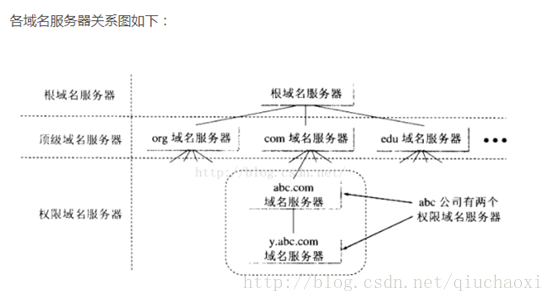
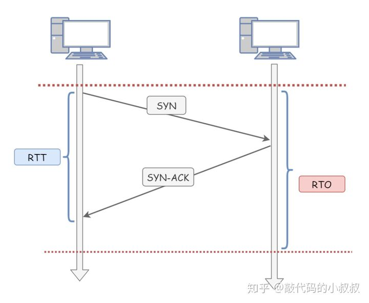
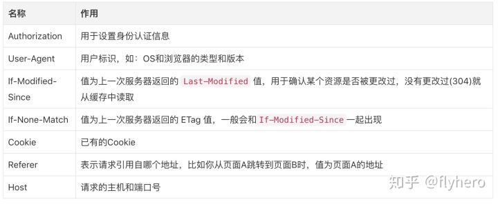
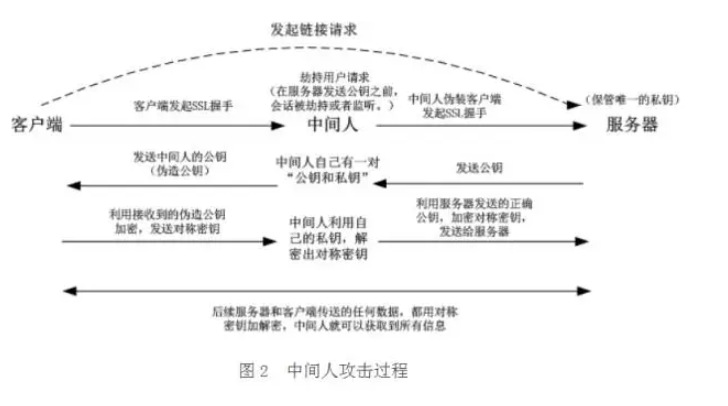
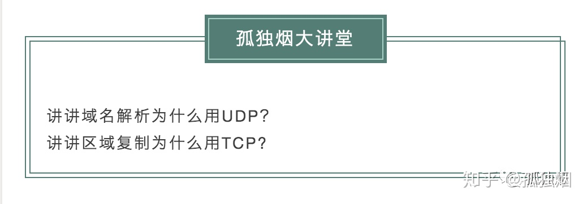

# 计算机网络模型

## 7层、4层和5层


- OSI参考模型
  - OSI（Open System Interconnect），即开放式系统互联。一般都叫OSI参考模型，是ISO（国际标准化组织）组织在1985年研究的网络互连模型。ISO为了更好的使网络应用更为普及，推出了OSI参考模型，这样所有的公司都按照统一的标准来指定自己的网络，就可以互通互联了。
  - OSI定义了网络互连的七层框架（物理层、数据链路层、网络层、传输层、会话层、表示层、应用层）。

> 

- **TCP/IP参考模型**
- TCP/IP四层协议（数据链路层、网络层、传输层、应用层）
  1. 应用层 应用层最靠近用户的一层，是为计算机用户提供应用接口，也为用户直接提供各种网络服务。我们常见应用层的网络服务协议有：HTTP，HTTPS，FTP，TELNET等。
  2. 传输层 建立了主机端到端的链接，传输层的作用是为上层协议提供端到端的可靠和透明的数据传输服务，包括处理差错控制和流量控制等问题。该层向高层屏蔽了下层数据通信的细节，使高层用户看到的只是在两个传输实体间的一条主机到主机的、可由用户控制和设定的、可靠的数据通路。我们通常说的，TCP UDP就是在这一层。端口号既是这里的“端”。
  3. 网络层 本层通过IP寻址来建立两个节点之间的连接，为源端的运输层送来的分组，选择合适的路由和交换节点，正确无误地按照地址传送给目的端的运输层。就是通常说的IP层。这一层就是我们经常说的IP协议层。IP协议是Internet的基础。
  4. 数据链路层 通过一些规程或协议来控制这些数据的传输，以保证被传输数据的正确性。实现这些规程或协议的`硬件`和软件加到物理线路，这样就构成了数据链路。

## 每层的作用

### 物理层（比特流）

**解决数据在不同物理介质之间的传输。**

因为计算机的世界里只有0和1，任何数据从上层到达物理层都可以看成是由0和1组成的比特流，而物理层需要解决的就是通过不同的物理介质将这些比特流从一台计算机传输到另一台计算机，物理介质可以是双绞线、光纤、无线电波等，我们需要（对其物理连接方式、电气特性、机械特性）制定统一的标准，例如通过电信号传播需要规定其高低电平等。

### 数据链路层（帧）

**解决数据在网卡（相同同地理位置的两台计算机）之间的传输。**

通过有线或者无线的方式，可以实现多台计算机网卡间的互连，每张网卡有全球唯一的MAC地址，数据链路层将上层数据封装成帧，可以将数据由网卡经过交换机等设备发送到相邻的计算机上。

### 网络层（包）

**解决数据在不同地理位置的两台计算机之间的传输。**

因为数据包的发送本质上是把数据包发送给局网中所有的计算机，计算机判断数据包的接受者的MAC地址，如果一致就接收，如果不一致就丢包。但是计算机网络是在是庞大，给几十亿台计算机每一台发送数据包是不可能的。所以需要新的一组地址来表示计算机的位置。这就是IP层的作用。   判断一个计算机的位置需要IP地址+MAC地址。首先通过IP地址（路由）找到计算机所在的局网，然后广播（发送给每一台计算机）。

### 传输层（段）

**解决数据在不同应用之间的传输**。

虽然我们已经把数据成功从计算机A传送到计算机B了，可是，计算机B里面有各种各样的应用程序，计算机该如何知道这些数据是给谁的呢？

这个时候，端口(Port)这个家伙就上场了，也就是说，我们在从计算机A传数据给计算表B的时候，还得指定一个端口，以供特定的应用程序来接受处理。
也就是说，传输层的功能就是建立端口到端口的通信。相比网络层的功能是建立主机到主机的通信。

也就是说，有了IP和端口，我们就可以进行通信了。这个时候可能有人会说，我输入IP地址的时候并没有指定一个端口啊。其实呢，对于有些传输协议，已经有设定了一些默认端口了。例如http的传输默认端口是80，这些端口信息也会包含在数据包里的。

### 应用层

**规定应用程序通讯的数据格式。**

终于说到应用层了，应用层这一层最接近我们用户了。

虽然我们收到了传输层传来的数据，可是这些传过来的数据五花八门，有html格式的，有mp4格式的，各种各样。你确定你能看的懂？

因此我们需要指定这些数据的格式规则，收到后才好解读渲染。而**应用层**的功能，就是用来规定应用程序的数据格式的。

## 请你说一说IP地址作用，以及MAC地址作用

MAC地址是一个硬件地址，用来定义网络设备的位置，主要由数据链路层负责。

而IP地址是IP协议提供的一种统一的地址格式，为互联网上的每一个网络和每一台主机分配一个逻辑地址，以此来屏蔽物理地址的差异。

## 什么是ARP协议 (Address Resolution Protocol，地址解析协议)？

- **ARP协议完成了IP地址与物理地址的映射**。每一个主机都设有一个 ARP 高速缓存，里面有**所在的局域网**上的各主机和路由器的 IP 地址到硬件地址的映射表。当源主机要发送数据包到目的主机时，会先检查自己的ARP高速缓存中有没有目的主机的MAC地址，如果有，就直接将数据包发到这个MAC地址，如果没有，就向**所在的局域网**发起一个ARP请求的广播包（在发送自己的 ARP 请求时，同时会带上自己的 IP 地址到硬件地址的映射），收到请求的主机检查自己的IP地址和目的主机的IP地址是否一致，如果一致，则先保存源主机的映射到自己的ARP缓存，然后给源主机发送一个ARP响应数据包。源主机收到响应数据包之后，先添加目的主机的IP地址与MAC地址的映射，再进行数据传送。如果源主机一直没有收到响应，表示ARP查询失败。
- 如果所要找的主机和源主机不在同一个局域网上，那么就要通过 ARP 找到一个位于本局域网上的某个路由器的硬件地址，然后把分组发送给这个路由器，让这个路由器把分组转发给下一个网络。剩下的工作就由下一个网络来做。


# UDP、TCP

## TCP、UDP 协议的区别？

tcp 和 udp 是 OSI 模型中的运输层中的协议。tcp 提供可靠的通信传输，而 udp 则常被用于让广播和细节控制交给应用的通信传输。 
两者的区别大致如下：

**1） 连接**

TCP是面向连接的传输层协议，即传输数据之前必须先建立好连接。

UDP无连接。

**2） 服务对象**

TCP是点对点的两点间服务，即一条TCP连接只能有两个端点；

UDP支持一对一，一对多，多对一，多对多的交互通信。

**3） 可靠性**

TCP是可靠交付：无差错，不丢失，不重复，按序到达。

UDP是尽最大努力交付，不保证可靠交付。

**4）拥塞控制，流量控制**

TCP有拥塞控制和流量控制保证数据传输的安全性。

UDP没有拥塞控制，网络拥塞不会影响源主机的发送效率。

**5) 数据报文**

TCP面向字节流，实际上是TCP把数据看成一连串无结构的字节流

UDP是面向报文的

**6） 报文长度**

TCP是动态报文长度，即TCP报文长度是根据接收方的窗口大小和当前网络拥塞情况决定的。

UDP面向报文，不合并，不拆分，保留上面传下来报文的边界。

**7) 首部开销**

TCP首部开销大，首部20个字节。

UDP首部开销小，8字节。（源端口，目的端口，数据长度，校验和）

## TCP和UDP各自适用的场景

从特点上我们已经知道，TCP 是可靠的但传输速度慢，UDP 是不可靠的但传输速度快。因此在选用具体协议通信时，应该根据通信数据的要求而决定。

若通信数据完整性需让位与通信实时性，则应该选用TCP 协议（如文件传输、重要状态的更新等）；反之，则使用 UDP 协议（如视频传输、实时通信等）。

## 在浏览器中输入url地址到显示页面的过程？


总体来说分为以下几个过程:

- DNS解析
- TCP连接
- 发送HTTP请求
- 服务器处理请求并返回HTTP报文
- 浏览器解析渲染页面
- 连接结束

**第一步、浏览器中输入域名www.baidu.com**

**第二步、域名解析**

 浏览器会把输入的域名解析成对应的IP，过程如下：

1. 浏览器查找浏览器缓存，如果有域名对应的IP地址则返回，如果没有继续查找。

2. 浏览器查看本机的host文件，如果有域名对应的IP地址则返回，如果没有继续查找。

3. 然后是路由器缓存，路由器一般有自己的缓存，如果有域名对应的IP地址则返回，如果没有继续查找。

4. 接着是对本地DNS服务器进行递归查询，看是否有域名对应的IP。主机向本地域名服务器的查询一般都是采用递归查询。所谓递归查询就是如果主机所询问的本地域名服务器不知道被查询域名的IP地址，那么本地域名服务器就以DNS客户的身份，向其他根域名服务器继续发出查询请求报文，而不是让该主机自己进行下一步查询。（本地域名服务器地址是通过DHPC协议获取地址，DHPC是负责分配IP地址的）

5. 本地域名服务器采用迭代查询，它先向一个根域名服务器查询。本地域名服务器向根域名服务器的查询一般都是采用迭代查询。所谓迭代查询就是当根域名服务器收到本地域名服务器发出的查询请求报文后，要么告诉本地域名服务器下一步应该查询哪一个域名服务器，然后本地服务器自己进行后续的查询。（而不是替代本地服务器进行后续查询）。

6. 根域名服务器告诉本地域名服务器，下一次应查询的顶级域名服务器dns.com的IP地址。

7. 本地域名服务器向顶级域名服务器dns.com进行查询。

8. 顶级域名服务器dns.com告诉本地域名服务器，下一次应查询的权限域名服务器dns.baidu.com的IP地址。

9. 本地域名服务器向权限域名服务器dns.baidu.com进行查询。

10. 权限域名服务器dns.baidu.com告诉本地域名服务器，所查询的主机www.baidu.com的IP地址。

本地域名服务器最后把查询结果告诉主机。



**第三步、浏览器与目标服务器建立TCP连接**

1. 主机浏览器通过DNS解析得到了目标服务器的IP地址后，与服务器建立TCP连接。

2. TCP3次握手连接：浏览器所在的客户机向服务器发出连接请求报文；服务器接收报文后，同意建立连接，向客户机发出确认报文；客户机接收到确认报文后，再次向服务器发出报文，确认已接收到确认报文；此处客户机与服务器之间的TCP连接建立完成，开始通信。

**第四步、浏览器通过http协议向目标服务器发送请求**

请求行，请求头，请求实体内容。浏览器向主机发起一个HTTP-GET方法报文请求。请求中包含访问的URL，也就是http://www.baidu.com/ ，KeepAlive，长连接，还有User-Agent用户浏览器操作系统信息，编码等。值得一提的是Accep-Encoding和Cookies项。Accept-Encoding一般采用gzip，压缩之后传输html文件。Cookies如果是首次访问，会提示服务器建立用户缓存信息，如果不是，可以利用Cookies对应键值，找到相应缓存，缓存里面存放着用户名，密码和一些用户设置项。

**第五步、服务器给出响应，将指定文件发送给浏览器**

状态行，响应头，响应实体内容，返回状态码200 OK，表示服务器可以响应请求，返回报文，由于在报头中Content-type为“text/html”，浏览器以HTML形式呈现，而不是下载文件。

***注意*：**但是，对于大型网站存在多个主机站点，往往不会直接返回请求页面，而是重定向。返回的状态码就不是200OK，而是301,302以3开头的重定向码，浏览器在获取了重定向响应后，在响应报文中Location项找到重定向地址，浏览器重新第一步访问即可。

补充一点的就是，重定向是为了负载均衡或者导入流量，提高SEO排名。利用一个前端服务器接受请求，然后负载到不同的主机上，可以大大提高站点的业务并发处理能力；重定向也可将多个域名的访问，集中到一个站点；由于baidu.com，www.baidu.com会被搜索引擎认为是两个网站，照成每个的链接数都会减少从而降低排名，永久重定向会将两个地址关联起来，搜索引擎会认为是同一个网站，从而提高排名。

**第六步、TCP释放链接**

1. 浏览器所在主机向服务器发出连接释放报文，然后停止发送数据；

2. 服务器接收到释放报文后发出确认报文，然后将服务器上未传送完的数据发送完；

3. 服务器数据传输完毕后，向客户机发送连接释放报文；

4. 客户机接收到报文后，发出确认，然后等待一段时间后，释放TCP连接；

**第七步、浏览器显示页面中所有文本。**

浏览器接收到返回的数据包，根据浏览器的渲染机制对相应的数据进行渲染。渲染后的数据，进行相应的页面呈现和脚步的交互。

## TCP 三次握手和四次挥手


`序列号seq`：占4个字节，用来标记数据段的顺序，TCP把连接中发送的所有数据字节都编上一个序号，第一个字节的编号由本地随机产生；给字节编上序号后，就给每一个报文段指派一个序号；序列号seq就是这个报文段中的第一个字节的数据编号。

`确认号ack`：占4个字节，期待收到对方下一个报文段的第一个数据字节的序号；序列号表示报文段携带数据的第一个字节的编号；而确认号指的是期望接收到下一个字节的编号；因此当前报文段最后一个字节的编号+1即为确认号。

`确认ACK`：占1位，仅当ACK=1时，确认号字段才有效。ACK=0时，确认号无效

`同步SYN`：连接建立时用于同步序号。当SYN=1，ACK=0时表示：这是一个连接请求报文段。若同意连接，则在响应报文段中使得SYN=1，ACK=1。因此，SYN=1表示这是一个连接请求，或连接接受报文。SYN这个标志位只有在TCP建产连接时才会被置1，握手完成后SYN标志位被置0。

`终止FIN`：用来释放一个连接。FIN=1表示：此报文段的发送方的数据已经发送完毕，并要求释放运输连接

PS：ACK、SYN和FIN这些大写的单词表示标志位，其值要么是1，要么是0；ack、seq小写的单词表示序号。


### 三次握手过程理解


`第一次握手`：建立连接时，客户端发送syn包（syn=j）到服务器，并进入SYN_SENT状态，等待服务器确认；SYN：同步序列编号（Synchronize Sequence Numbers）。

`第二次握手`：服务器收到syn包，必须确认客户的SYN（ack=j+1），同时自己也发送一个SYN包（syn=k），即SYN+ACK包，此时服务器进入SYN_RECV状态；

`第三次握手`：客户端收到服务器的SYN+ACK包，向服务器发送确认包ACK(ack=k+1），此包发送完毕，客户端和服务器进入ESTABLISHED（TCP连接成功）状态，完成三次握手。

### 四次挥手过程理解 


`第一次挥手`：客户端发出释放FIN=1，自己序列号seq=u，进入FIN-WAIT-1状态

`第二次挥手`：服务器收到客户端的后，发出ACK=1确认标志和客户端的确认号ack=u+1，自己的序列号seq=v，进入CLOSE-WAIT状态

`第三次挥手`：客户端收到服务器确认结果后，进入FIN-WAIT-2状态。此时服务器发送释放FIN=1信号，确认标志ACK=1，确认序号ack=u+1，自己序号seq=w，服务器进入LAST-ACK（最后确认态）

`第四次挥手`：客户端收到回复后，发送确认ACK=1，ack=w+1，自己的seq=u+1，客户端进入TIME-WAIT（时间等待）。客户端经过2个最长报文段寿命后，客户端CLOSE；服务器收到确认后，立刻进入CLOSE状态。

### 为什么不能用两次握手进行连接？

答：3次握手完成两个重要的功能，既要双方做好发送数据的准备工作(双方都知道彼此已准备好)，也要允许双方就初始序列号进行协商，这个序列号在握手过程中被发送和确认。

现在把三次握手改成仅需要两次握手，死锁是可能发生的。作为例子，考虑计算机S和C之间的通信，假定C给S发送一个连接请求分组，S收到了这个分组，并发 送了确认应答分组。

按照两次握手的协定，S认为连接已经成功地建立了，可以开始发送数据分组。可是，C在S的应答分组在传输中被丢失的情况下，将不知道S 是否已准备好，不知道S建立什么样的序列号，C甚至怀疑S是否收到自己的连接请求分组。

在这种情况下，C认为连接还未建立成功，将忽略S发来的任何数据分 组，只等待连接确认应答分组。而S在发出的分组超时后，重复发送同样的分组。这样就形成了死锁。

### 如果已经建立了连接，但是客户端突然出现故障了怎么办？

TCP还设有一个保活计时器，显然，客户端如果出现故障，服务器不能一直等下去，白白浪费资源。服务器每收到一次客户端的请求后都会重新复位这个计时器，时间通常是设置为2小时，若两小时还没有收到客户端的任何数据，服务器就会发送一个探测报文段，以后每隔75秒钟发送一次。若一连发送10个探测报文仍然没反应，服务器就认为客户端出了故障，接着就关闭连接。

### 为什么要进行三次握手？

为了防止服务器端开启一些无用的连接增加服务器开销以及防止已失效的连接请求报文段突然又传送到了服务端，因而产生错误。

由于网络传输是有延时的(要通过网络光纤和各种中间代理服务器)，在传输的过程中，比如客户端发起了SYN=1创建连接的请求(第一次握手)。

如果服务器端就直接创建了这个连接并返回包含SYN、ACK和Seq等内容的数据包给客户端，这个数据包因为网络传输的原因丢失了，丢失之后客户端就一直没有接收到服务器返回的数据包。

客户端可能设置了一个超时时间，时间到了就关闭了连接创建的请求。再重新发出创建连接的请求，而服务器端是不知道的，如果没有第三次握手告诉服务器端客户端收的到服务器端传输的数据的话，

服务器端是不知道客户端有没有接收到服务器端返回的信息的。

---

TCP作为一种可靠传输控制协议，其**核心思想**：既要保证数据可靠传输，又要提高传输的效率，而用**三次恰恰可以满足以上两方面的需求！**

**TCP可靠传输的精髓**：TCP连接的一方A，由操作系统动态随机选取一个**32位长的序列号（Initial Sequence Number），**假设A的初始序列号为1000，以该序列号为原点，对自己将要发送的每个字节的数据进行编号，1001，1002，1003…，并把自己的初始序列号ISN告诉B，让**B有一个思想准备**，什么样编号的数据是合法的，什么编号是非法的，比如编号900就是非法的，同时B还可以对A每一个编号的字节数据进行确认。如果A收到B确认编号为2001，则意味着字节编号为1001-2000，共1000个字节已经安全到达。

同理B也是类似的操作，假设B的初始序列号ISN为2000，以该序列号为原点，对自己将要发送的每个字节的数据进行编号，2001，2002，2003…，并把自己的初始序列号ISN告诉A，以便A可以确认B发送的每一个字节。如果B收到A确认编号为4001，则意味着字节编号为2001-4000，共2000个字节已经安全到达。

**一句话概括，TCP连接握手，握的是啥？**

**通信双方数据原点的序列号！**

以此核心思想我们来分析二、三、四次握手的过程。

**四次握手的过程：**

**1.1 **A 发送同步信号**SYN** + **A's Initial sequence number **

**1.2 **B 确认收到A的同步信号，并记录 A's ISN 到本地，命名 **B's ACK sequence number**

**1.3 **B发送同步信号**SYN** + **B's Initial sequence number **

**1.4 **A确认收到B的同步信号，并记录 B's ISN 到本地，命名 **A's ACK sequence number**

很显然1.2和1.3 这两个步骤可以合并，**只需要三次握手，**可以提高连接的速度与效率。

**二次握手的过程：**

**2.1 **A 发送同步信号**SYN** + **A's Initial sequence number **

**2.2** B发送同步信号**SYN** + **B's Initial sequence number** + **B's ACK sequence number**

这里有一个问题，A与B就A的初始序列号达成了一致，这里是1000。**但是**B无法知道A是否已经接收到自己的同步信号，如果这个同步信号丢失了，**A和B就B的初始序列号将无法达成一致。**

于是TCP的设计者将**SYN这个同步标志位SYN设计成占用一个字节的编号（FIN标志位也是）**，既然是一个字节的数据，按照TCP对有数据的TCP segment 必须确认的原则，所以在这里A必须给B一个确认，以确认A已经接收到B的同步信号。

有童鞋会说，如果A发给B的确认丢了，该如何？

A会超时重传这个ACK吗？不会！**TCP不会为没有数据的ACK超时重传**。

那该如何是好？**B如果没有收到A的ACK，会超时重传自己的SYN同步信号，一直到收到A的ACK为止。**

**-------------------**
补充阅读：

**第一个包，即A发给B的SYN 中途被丢，没有到达B**

A会周期性超时重传，直到收到B的确认

**第二个包，即B发给A的SYN +ACK 中途被丢，没有到达A**

B会周期性超时重传，直到收到A的确认

**第三个包，即A发给B的ACK 中途被丢，没有到达B**

A发完ACK，单方面认为TCP为 Established状态，而B显然认为TCP为Active状态：

a. 假定此时双方都没有数据发送，B会周期性超时重传，直到收到A的确认，收到之后B的TCP 连接也为 Established状态，双向可以发包。

b. 假定此时A有数据发送，B收到A的 Data + ACK，自然会切换为established 状态，并接受A的 Data。

c. 假定B有数据发送，数据发送不了，会一直周期性超时重传SYN + ACK，直到收到A的确认才可以发送数据。

### 为什么要进行四次挥手？

- 关闭连接时，客户端向服务端发送 FIN 时，仅仅表示客户端不再发送数据了但是还能接收数据。

- 服务器收到客户端的 FIN 报文时，先回一个 ACK 应答报文，而服务端可能还有数据需要处理和发送，等服务端不再发送数据时，才发送 FIN 报文给客户端来表示同意现在关闭连接。

从上面过程可知，服务端通常需要等待完成数据的发送和处理，所以服务端的 ACK 和 FIN 一般都会分开发送，从而比三次握手导致多了一次。

### 为什么TIME_WAIT状态需要经过2MSL(最大报文段生存时间)才能返回到CLOSE状态？

答：虽然按道理，四个报文都发送完毕，我们可以直接进入CLOSE状态了，但是我们必须假象网络是不可靠的，有可以最后一个ACK丢失。所以TIME_WAIT状态就是用来重发可能丢失的ACK报文。在Client发送出最后的ACK回复，但该ACK可能丢失。Server如果没有收到ACK，将不断重复发送FIN片段。所以Client不能立即关闭，它必须确认Server接收到了该ACK。

Client会在发送出ACK之后进入到TIME_WAIT状态。Client会设置一个计时器，等待2MSL的时间。如果在该时间内再次收到FIN，那么Client会重发ACK并再次等待2MSL。所谓的2MSL是两倍的MSL(Maximum Segment Lifetime)。MSL指一个片段在网络中最大的存活时间，2MSL就是一个发送和一个回复所需的最大时间。如果直到2MSL，Client都没有再次收到FIN，那么Client推断ACK已经被成功接收，则结束TCP连接。

----

具体分析：主动断开的一侧为A，被动断开的一侧为B。

**第一个消息：A发FIN**

**第二个消息：B回复ACK**

**第三个消息：B发出FIN**

此时此刻：B单方面认为自己与A达成了共识，即双方都同意关闭连接。

此时，B能释放这个TCP连接占用的内存资源吗？**不能，B一定要确保A收到自己的ACK、FIN。**

所以B需要静静地等待A的第四个消息的到来：

**第四个消息：A发出ACK，用于确认收到B的FIN**

当B接收到此消息，即认为双方达成了同步：双方都知道连接可以释放了，此时B可以安全地释放此TCP连接所占用的内存资源、端口号。

所以**被动关闭的B无需任何wait time，直接释放资源。**

但，A并不知道B是否接到自己的ACK，A是这么想的：

1）如果B没有收到自己的ACK，会超时重传FiN

那么A再次接到重传的FIN，会再次发送ACK

2）如果B收到自己的ACK，也不会再发任何消息，包括ACK

无论是1还是2，A都需要等待，要取这两种情况等待时间的最大值，**以应对最坏的情况发生**，这个最坏情况是：

去向ACK消息最大存活时间（MSL) + 来向FIN消息的最大存活时间(MSL)。

这恰恰就是**2MSL( Maximum Segment Life)。**

等待2MSL时间，A就可以放心地释放TCP占用的资源、端口号，**此时可以使用该端口号连接任何服务器。**

**为何一定要等2MSL？**
**如果不等，释放的端口可能会重连刚断开的服务器端口，这样依然存活在网络里的老的TCP报文可能与新TCP连接报文冲突，造成数据冲突，为避免此种情况，需要耐心等待网络老的TCP连接的活跃报文全部死翘翘，2MSL时间可以满足这个需求（尽管非常保守）！**

总结：

**1、防止客户端最后一次发给服务器的确认在网络中丢失以至于客户端关闭，而服务端并未关闭，导致资源的浪费。**

**2、等待最大的2msl可以让本次连接的所有的网络包在链路上消失，以防造成不必要的干扰。**如果client直接closed，然后又向server发起了一个新连接，我们不能保证这个新连接和刚关闭的连接的端口号是不同的。假设新连接和已经关闭的老端口号是一样的，如果前一次滞留的某些数据仍然在网络中，这些延迟数据会在新连接建立后到达Server，所以socket就认为那个延迟的数据是属于新连接的，数据包就会发生混淆。所以client要在TIME_WAIT状态等待2倍的MSL，这样保证本次连接的所有数据都从网络中消失。


## TCP可靠传输

### 1.TCP 可靠传输概览

首先解释一下，什么是可靠传输：可靠传输就是保证接收方收到的字节流和发送方发出的字节流是完全一样的。

网络层是没有可靠传输机制的，尽自己最大的努力进行交付。而传输层使用 TCP 实现可靠传输，TCP 保证可靠传输的机制有如下几种：

*   1）校验和 Checksum（稍作了解即可）
*   2）序列号和确认应答机制（重要）
*   3）重传机制（重要）
*   4）流量控制（滑动窗口协议）（非常重要）
*   5）拥塞控制（重要）

以上除了校验和大家可以只稍作了解之外，其他都是非常重要的，务必烂熟于心。

### 2. 校验和

所谓 TCP 的校验和（Checksum）就是说：由发送端计算待发送 TCP 报文段的校验和，然后接收端对接收到的 TCP 报文段验证其校验和（TCP 的校验和是一个端到端的校验和）。其目的是为了发现 TCP 的首部和数据在发送端到接收端之间是否发生了变动。如果接收方检测到校验和有差错，则该 TCP 报文段会被直接丢弃。
> 关于校验和是如何计算和验证的，并非高频重点知识，本文就不详细解释了，感兴趣的童鞋可自行百度

TCP 在计算校验和时，需要加上一个 12 字节的伪首部。
> 其实 UDP 也有校验和机制，只不过是可选的，而 TCP 的校验和是必须的，TCP 和 UDP 在计算校验和时都需要加上一个 12 字节的伪首部。

解释下伪首部的概念，伪首部的数据是从 IP 数据报头获取的，共有 12 字节，包含如下信息：源 IP 地址、目的 IP 地址、保留字节 (置 0)、传输层协议号 (TCP 是 6)、TCP 报文长度 (首部 + 数据)：


伪首部是为了增加 TCP 校验和的检错能力：如根据目的 IP 地址检查这个 TCP 报文是不是传给我的、根据传输层协议号检查传输层协议是否选对了...... 伪首部只在校验的时候使用。

### 3. 序列号和确认应答机制

TCP 报文段的首部中有一个序号字段，在之前的文章 关于 TCP 三次握手和四次挥手，满分回答在此 已经解释过：指的是该报文段第一个字节的序号（一个字节占一个序号）


确认应答机制就是接收方收到 TCP 报文段后就会返回**一个确认应答消息**：


确认应答机制和重传机制不分家，两者紧密相连。下面我们详细讲解一下重传机制

### 4. 重传机制

在错综复杂的网络，并不一定能如上图那么顺利地传输报文，报文存在丢失的可能性。报文丢失的可能因素有很多种，包括应用故障，路由设备过载，或暂时的服务宕机。报文级别速度是很高的，通常来说报文的丢失是暂时的，因此 TCP 能够发现和恢复报文丢失显得尤为重要。

重传机制是 TCP 最基本的错误恢复功能，常见的重传机制有如下：

*   超时重传
*   快速重传

**① 超时重传**

大概一说到重传大家第一个想到的就是超时重传吧。超时重传就是 TCP 发送方在发送报文的时候，设定一个定时器，如果在规定的时间内没有收到接收方发来的 ACK 确认报文，发送方就会重传这个已发送的报文段。

对于发送方没有正确接收到接收方发来的 ACK 确认报文的情况，有以下两种（也就是在这两种情况下会发生超时重传）：

*   第一种情况：报文段丢失


*   第二种情况：接收方的 ACK 确认报文丢失


超时重传时间我们一般用 RTO（Retransmission Timeout） 来表示，那么，这个 RTO 设置为多少最合适呢，也就是说经过多长时间进行重传最好？

在这之前，我们先讲解一下 RTT（Round-Trip Time 往返时延） 的概念：RTT 就是数据从网络一端传送到另一端所需的时间，也就是报文段的往返时间。


显然，⭐ 超时重传时间 RTO 的值应该略大于报文往返 RTT 的值：



我们可以假想一下，如果超时重传时间 RTO 远大于或小于 RTT，会发生什么情况：

*   RTO 远大于 RTT：网络的空闲时间增大，降低了网络传输效率


*   RTO 小于 RTT：不必要的重传，导致网络负荷增大


如果超时重传的数据又超时了该怎么办呢？TCP 的策略是重传的超时间隔加倍。

也就是说，每进行一次超时重传，都会将下一次重传的超时时间间隔设为先前值的两倍。

超时触发重传存在的问题是，超时周期可能相对较长。有没有一种机制可以减少超时重传的等待时间呢？于是 「快速重传」 机制应运而生

**快速重传**

快速重传（Fast Retransmit）机制不以时间为驱动，而是以数据驱动重传。

快速重传机制的原理：每当接收方收到比期望序号大的失序报文段到达时，就向发送方发送一个冗余 ACK，指明下一个期待字节的序号。

举个例子：发送方已经发送 1、2、3、4、5报文段

*   接收方收到报文段 1，返回 1 的 ACK 确认报文（确认号为报文段 2 的第一个字节）
*   接收方收到报文段 3，仍然返回 1 的 ACK 确认报文（确认号为报文段 2 的第一个字节）
*   接收方收到报文段 4，仍然返回 1 的 ACK 确认报文（确认号为报文段 2 的第一个字节）
*   接收方收到报文段 5，仍然返回 1 的 ACK 确认报文（确认号为报文段 2 的第一个字节）
*   接收方收到 3 个对于报文段 1 的冗余 ACK，认为报文段 2 丢失，于是重传报文段 2
*   最后，接收方收到了报文段 2，此时因为报文段 3、4、5 都收到了，所以返回 6 的 ACK 确认报文（确认号为报文段 6 的第一个字节）

一图胜千言：


### 4. 滑动窗口协议

可以说不知道滑动窗口协议 = 不知道 TCP。该知识点的分量之重，大家一定好好把握。

**① 累积确认**

上文讲快速重传的时候，不知道大家有没有注意到这句话 “ 最后，接收方收到了报文段 2，此时因为报文段 3、4、5 都收到了，所以返回 6 的 ACK 确认报文 ”。

为什么这里会直接返回报文段 6 的确认应答呢，之前我们不是说每发送一个 TCP 报文段，就进行一次确认应答吗（只有收到了上一个报文段的确认应答后才能发送下一个报文段的）？按照这个模式，我们应该先返回报文段 3 的确认应答啊。

其实只有收到了上一个报文段的确认应答后才能发送下一个报文段的这种模式效率非常低下。每个报文段的往返时间越长，网络的吞吐量就越低，通信的效率就越低。

举个例子：如果你说完一句话，我在处理其他事情，没有及时回复你，你就等着我做完其他事情后回复你，你才能说下一句话，很显然这不现实。

为此，TCP 引入了 窗口 的概念。窗口大小就是指无需等待确认应答，可以继续发送数据的最大值。

⭐ 窗口的实现实际上是操作系统开辟的一个缓冲区，发送方在等待确认应答报文返回之前，必须在缓冲区中保留已发送的数据。如果在规定时间间隔内收到确认应答报文，就可以将数据从缓冲区中清除。

假设窗口大小为 3 个 TCP 段，那么发送方就可以「连续发送」 3 个 TCP 段，并且中途即使有 ACK响应报文丢失，也可以通过「下一个确认应答进行确认」。

如下图：ACK 300 即使丢失了，也不会进行数据重发，可以通过下一个确认应答进行确认。只要发送方收到了 ACK 400 的确认应答，就意味着 400 之前的所有数据「接收方」都收到了。这个模式就叫累积确认或者累积应答。


**② 发送方的滑动窗口**

我们先来看看发送方的窗口，下图就是发送方缓存的数据，根据处理的情况分成四个部分：

*   已发送并收到 ACK 确认应答的数据
*   已发送但未收到 ACK 确认应答的数据
*   未发送但总大小在接收方处理范围内的数据
*   未发送但总大小超过接收方处理范围的数据


当发送方把数据全部发送出去后，可用窗口的大小就为 0 了，表明可用窗口耗尽，在没收到 ACK 确认之前无法继续发送数据：


当收到之前发送的数据 32~36 字节的 ACK 确认应答后，如果发送窗口的大小没有变化，则**滑动窗口往右边移动 5 个字节，因为有 5 个字节的数据被确认应答**，接下来 52~56 字节又变成了可用窗口，那么后续也就可以发送 52~56 这 5 个字节的数据了：


**③ 接收方的滑动窗口**

接收方的滑动窗口可分为三个部分：

*   已成功接收并确认的数据
*   未收到数据但可以接收的数据
*   未收到数据且不可以接收的数据（超出接收方窗口大小）


同样的，接收方的滑动窗口在成功接收并确认的数据后，窗口右移。

### 5. 流量控制

想象一下这个场景：主机 A 一直向主机 B 发送数据，不考虑主机 B 的接收能力，则可能导致主机 B 的接收缓冲区满了而无法再接收数据，从而导致大量的数据丢包，引发重传机制。而在重传的过程中，若主机 B 的接收缓冲区情况仍未好转，则会将大量的时间浪费在重传数据上，降低传送数据的效率。

所以引入了流量控制机制，主机 B 通过告诉主机 A 自己接收缓冲区的大小，来使主机 A 控制发送的数据量。总结来说：所谓流量控制就是控制发送方发送速率，保证接收方来得及接收。

TCP 实现流量控制主要就是通过 滑动窗口协议。

上文我们提到了滑动窗口大小，但是没说窗口大小在哪里设置，其实这个和 TCP 报文首部中的 窗口大小 Window 字段有关。回顾一下上篇文章 关于 TCP 三次握手和四次挥手，满分回答在此 中讲过的 TCP 报文的首部格式，其中就有一个 16 位的 窗口大小 Window 字段：


该字段的含义是指自己接收缓冲区的剩余大小，于是发送端就可以根据这个接收端的处理能力来发送数据，而不会导致接收端处理不过来。

所以，通常来说窗口大小是由接收方来决定的。

这段话大家一定要理解哦：接收端会在发送 ACK 确认应答报文时，将自己的即时窗口大小（接收窗口 rwnd）填入，并跟随 ACK 报文一起发送出去。而发送方根据接收到的 ACK 报文中的窗口大小的值改变自己的发送速度。如果接收到窗口大小的值为 0，那么发送方将停止发送数据。并定期地向接收端发送窗口探测数据段，提醒接收端把窗口大小告诉发送端。

一图胜前言：


### 6. 拥塞控制

所谓拥塞就是说：在某段时间，对网络中某一资源的需求超过了该资源所能提供的可用部分（即 需大于供)，网络的性能变差。

如果网络出现拥塞，TCP 报文可能会大量丢失，此时就会大量触发重传机制，从而导致网络拥塞程度更高，严重影响传输。

> 其实只要「发送方」没有在规定时间内接收到 ACK 应答报文，也就是**触发了重传机制，就会认为网络出现了拥塞。**

因此当出现拥塞时，应当控制发送方的速率。这一点和流量控制很像，但是出发点不同。

流量控制是为了让接收方能来得及接收，而拥塞控制是为了降低整个网络的拥塞程度，防止过多的数据注入到网络中。

为了调节发送方所要发送数据的量，定义了「拥塞窗口 cwnd」的概念。拥塞窗口是发送方维护的一个状态变量，它会根据网络的拥塞程度动态变化：

*   只要网络中出现了拥塞，cwnd 就会减少
*   若网络中没有出现拥塞，cwnd 就会增大

在引入拥塞窗口概念之前，发送窗口大小和接收窗口大小基本是相等的关系（取决于接收窗口大小）。引入拥塞窗口后，发送窗口的大小就等于拥塞窗口和接收窗口的最小值。

TCP 的拥塞控制采用了四种算法：

*   慢开始
*   拥塞避免
*   快重传
*   快恢复

下面详细讲解这四种算法

**① 慢开始**

慢开始的思路就是：TCP 在刚建立连接完成后，如果立即把大量数据字节注入到网络，那么很有可能引起网络阻塞。好的方法是先探测一下，一点一点地提高发送数据包的数量，即由小到大逐渐增大拥塞窗口数值。cwnd 初始值为 1，每经过一个传播轮次，cwnd 加倍（指数增长）。


当然不能一直执行慢启动，这里会设置一个慢启动轮限 ssthresh 状态变量：

*   当 cwnd &lt; ssthresh 时，继续使用慢启动算法
*   当 cwnd &gt;= ssthresh 时，开始使用「拥塞避免算法」

**② 拥塞避免**

拥塞避免算法的思路是让拥塞窗口 cwnd 缓慢增大，即每经过一个往返时间 cwnd 加 1。


注意，无论是慢开始阶段还是拥塞避免，只要出现了网络拥塞（触发超时重传机制），慢开始轮限 sshresh 和 拥塞窗口大小 cwnd 的值会发生变化（乘法减小）：

*   ssthresh 设为 cwnd/2
*   cwnd 重置为 1

由于拥塞窗口大小重置为 1 了，所以就会重新开始执行慢启动算法。


**③ 快重传和快恢复**

快速重传和快速恢复算法一般同时使用。

当触发快速重传机制，即接收方收到三个重复的 ACK 确认的时候，就会执行快重传算法（触发快速重传机制和超时重传机制的情况不同，TCP 认为触发快速重传的情况并不严重，因为大部分没丢，只丢了一小部分），快速重传做的事情有：

*   cwnd = cwnd/2
*   ssthresh = cwnd
*   重新进入拥塞避免阶段

后来的 “快速恢复” 算法是在上述的“快速重传”算法后添加的，当收到 3 个重复ACK时，TCP 最后进入的不是拥塞避免阶段，而是快速恢复阶段。

快速恢复的思想是“**数据包守恒**”原则，即同一个时刻在网络中的数据包数量是恒定的，只有当“老”数据包离开了网络后，才能向网络中发送一 个“新”的数据包，如果发送方收到一个重复的 ACK，那么根据 TCP 的 ACK 机制就表明有一个数据包离开了网络，于是 cwnd 加 1。如果能够严格按照该原则那么网络中很少会发生拥塞，事实上拥塞控制的目的也就在修正违反该原则的地方。

具体来说快速恢复的主要步骤是：

*   把 cwnd 设置为 ssthresh 的值加 3，然后重传丢失的报文段，加 3 的原因是因为收到 3 个重复的 ACK，表明有 3 个“老”的数据包离开了网络。
*   再收到重复的 ACK 时，拥塞窗口 cwnd 增加 1
*   当收到新的数据包的 ACK 时，把 cwnd 设置为第一步中的 ssthresh 的值。原因是因为该 ACK 确认了新的数据，说明从重复 ACK 时的数据都已收到，该恢复过程已经结束，可以回到恢复之前的状态了，也即再次进入拥塞避免状态。

## 说一下ARQ协议？

ARQ协议，即自动重传请求（Automatic Repeat-reQuest），意思是如果发送方在发送后一段时间之内没有收到确认回执，它通常会重新发送。ARQ协议包括停止等待ARQ协议和连续ARQ协议。

（1）停止等待ARQ协议

停止等待ARQ协议是指，在停止等待中如果接收端没有收到发送端发来的分组，接收端就不会给发送端发送确认回执，此时发送端会重新发送之前的报文分组。发送端会维护一个超时计时器，超时时间会设置的比数据在传输往返过程的时间要长一些。

（2）连续ARQ协议

连续ARQ协议是指，发送端维护一个“窗口”，“窗口”内可以有多个分组，窗口的大小就是窗口中分组的个数，凡是位于“窗口”内的分组可以连续发送出去而不必等待接收端返回的确认回执，对按序到达的最后一个分组，接收端会向发送端发送确认回执，如果有分组没有正确到达，会返回最后一个正确达到的分组序号，该序号后面的分组会重新发送给接收端。

举个例子，窗口大小为4，发送时第1、2、4号分组均成功发送，3号分组发送失败，接收端会给发送端发送2号分组的确认回执，然后发送端会把2号分组之后的数据（3号分组和4号分组）重新再发送一遍，即使4号分组是发送成功的。

在连续ARQ协议中，发送端会维护一块发送端的数据缓存，“窗口”里的分组都会在这个缓存中，当需要重新发送“窗口”中的分组报文时，便会从缓存里读取分组并发送。

连续 ARQ 协议可提高信道利用率。

# HTTP协议

## 请你来说一说http协议

**1）HTTP协议：**

HTTP协议是Hyper Text Transfer Protocol（超文本传输协议）的缩写，是用于从万维网（WWW:World Wide Web）服务器传输超文本到本地浏览器的传送协议。

HTTP是一个基于TCP/IP通信协议来传递数据（HTML 文件，图片文件，查询结果等）。

HTTP是一个属于应用层的面向对象的协议，由于其简捷、快速的方式，适用于分布式超媒体信息系统。它于1990年提出，经过几年的使用与发展，得到不断地完善和扩展。目前在WWW中使用的是HTTP/1.0的第六版，HTTP/1.1的规范化工作正在进行之中，而且HTTP-NG（Next Generation of HTTP）的建议已经提出。

HTTP协议工作于客户端-服务端架构为上。浏览器作为HTTP客户端通过URL向HTTP服务端即WEB服务器发送所有请求。Web服务器根据接收到的请求后，向客户端发送响应信息。

**2）HTTP协议特点**

1、简单快速：

客户向服务器请求服务时，只需传送请求方法和路径。请求方法常用的有GET、HEAD、POST。每种方法规定了客户与服务器联系的类型不同。由于HTTP协议简单，使得HTTP服务器的程序规模小，因而通信速度很快。

2、灵活：

HTTP允许传输任意类型的数据对象。正在传输的类型由Content-Type加以标记。

3、无连接：

无连接的含义是限制每次连接只处理一个请求。服务器处理完客户的请求，并收到客户的应答后，即断开连接。采用这种方式可以节省传输时间。

4、无状态：

HTTP协议是无状态协议。无状态是指协议对于事务处理没有记忆能力。缺少状态意味着如果后续处理需要前面的信息，则它必须重传，这样可能导致每次连接传送的数据量增大。另一方面，在服务器不需要先前信息时它的应答就较快。

5、支持B/S及C/S模式。

6、默认端口80

7、基于TCP协议

**3）HTTP过程概述：**

HTTP协议定义Web客户端如何从Web服务器请求Web页面，以及服务器如何把Web页面传送给客户端。HTTP协议采用了请求/响应模型。客户端向服务器发送一个请求报文，请求报文包含请求的方法、URL、协议版本、请求头部和请求数据。服务器以一个状态行作为响应，响应的内容包括协议的版本、成功或者错误代码、服务器信息、响应头部和响应数据。

**HTTP 请求/响应的步骤如下：**

1、客户端连接到Web服务器

一个HTTP客户端，通常是浏览器，与Web服务器的HTTP端口（默认为80）建立一个TCP套接字连接。例如，http://www.baidu.com。

2、发送HTTP请求

通过TCP套接字，客户端向Web服务器发送一个文本的请求报文，一个请求报文由请求行、请求头部、空行和请求数据4部分组成。

3、服务器接受请求并返回HTTP响应

Web服务器解析请求，定位请求资源。服务器将资源复本写到TCP套接字，由客户端读取。一个响应由状态行、响应头部、空行和响应数据4部分组成。

4、释放连接TCP连接

若connection 模式为close，则服务器主动关闭TCP连接，客户端被动关闭连接，释放TCP连接;若connection 模式为keepalive，则该连接会保持一段时间，在该时间内可以继续接收请求;

5、客户端浏览器解析HTML内容

客户端浏览器首先解析状态行，查看表明请求是否成功的状态代码。然后解析每一个响应头，响应头告知以下为若干字节的HTML文档和文档的字符集。客户端浏览器读取响应数据HTML，根据HTML的语法对其进行格式化，并在浏览器窗口中显示。


## HTTP协议

**HTTP 基本概念**

HTTP 是什么？描述一下
HTTP 是超文本传输协议，也就是HyperText Transfer Protocol。
能否详细解释「超文本传输协议」？
HTTP的名字「超文本协议传输」，它可以拆成三个部分：

- 超文本
- 传输
- 协议


### 1. 「协议」

在生活中，我们也能随处可见「协议」，例如：

- 刚毕业时会签一个「三方协议」；
- 找房子时会签一个「租房协议」；


生活中的协议，本质上与计算机中的协议是相同的，协议的特点:

- 「协」字，代表的意思是必须有**两个以上的参与者**。例如三方协议里的参与者有三个：你、公司、学校三个；租房协议里的参与者有两个：你和房东。
- 「仪」字，代表的意思是对参与者的一种**行为约定和规范**。例如三方协议里规定试用期期限、毁约金等；租房协议里规定租期期限、每月租金金额、违约如何处理等。

针对 HTTP 协议，我们可以这么理解。
HTTP 是一个用在计算机世界里的协议。它使用计算机能够理解的语言确立了一种计算机之间交流通信的规范（两个以上的参与者），以及相关的各种控制和错误处理方式（行为约定和规范）。

#### 协议内容

#### 请求（Request）

客户端发送一个HTTP请求到服务端的格式：

- 请求行
- 请求头
- 请求体


#### 响应（Response）

服务端响应客户端格式：

- 状态行
- 响应头
- 响应体


### 2. 「传输」

所谓的「传输」，很好理解，就是把一堆东西从 A 点搬到 B 点，或者从 B 点 搬到 A 点。
别轻视了这个简单的动作，它至少包含两项重要的信息。
HTTP 协议是一个**双向协议**。
我们在上网冲浪时，浏览器是请求方 A ，百度网站就是应答方 B。双方约定用 HTTP 协议来通信，于是浏览器把请求数据发送给网站，网站再把一些数据返回给浏览器，最后由浏览器渲染在屏幕，就可以看到图片、视频了。


数据虽然是在 A 和 B 之间传输，但允许中间有中转或接力。
就好像第一排的同学想穿递纸条给最后一排的同学，那么传递的过程中就需要经过好多个同学（中间人），这样的传输方式就从「A < --- > B」，变成了「A <-> N <-> M <-> B」。
而在 HTTP 里，需要中间人遵从 HTTP 协议，只要不打扰基本的数据传输，就可以添加任意额外的东西。
针对传输，我们可以进一步理解了 HTTP。
HTTP 是一个在计算机世界里专门用来在**两点之间传输数据**的约定和规范。

### 3. 「超文本」

HTTP 传输的内容是「超文本」。
我们先来理解「文本」，在互联网早期的时候只是简单的字符文字，但现在「文本」。的涵义已经可以扩展为图片、视频、压缩包等，在 HTTP 眼里这些都算做「文本」。
再来理解「超文本」，它就是超越了普通文本的文本，它是文字、图片、视频等的混合体最关键有超链接，能从一个超文本跳转到另外一个超文本。
HTML 就是最常见的超文本了，它本身只是纯文字文件，但内部用很多标签定义了图片、视频等的链接，在经过浏览器的解释，呈现给我们的就是一个文字、有画面的网页了。
OK，经过了对 HTTP 里这三个名词的详细解释，就可以给出比「超文本传输协议」这七个字更准确更有技术含量的答案：
**HTTP 是一个在计算机世界里专门在「两点」之间「传输」文字、图片、音频、视频等「超文本」数据的「约定和规范」。**
那「HTTP 是用于从互联网服务器传输超文本到本地浏览器的协议HTTP」 ，这种说法正确吗？
这种说法是不正确的。因为也可以是「服务器< -- >服务器」，所以采用两点之间的描述会更准确

## 请求头和响应头

### 请求和响应常见通用头


**注意**

Content-Type，内容类型，一般是指网页中存在的Content-Type，用于定义网络文件的类型和网页的编码，决定浏览器将以什么形式、什么编码读取这个文件。

常见的媒体格式类型如下：


以application开头的媒体格式类型：


### 常见请求头



### 常见响应头


## Http协议的请求方法

截止到HTTP1.1共有下面几种方法：


请求和响应常见通用头


### 注意

Content-Type，内容类型，一般是指网页中存在的Content-Type，用于定义网络文件的类型和网页的编码，决定浏览器将以什么形式、什么编码读取这个文件。

常见的媒体格式类型如下：


以application开头的媒体格式类型：


### 常见请求头


### 常见响应头


## HTTP Get 和 Post 区别

### 语义上

Get 方法的含义是请求从服务器获取资源，这个资源可以是静态的文本、页面、图片视频等。
比如，你打开我的文章，浏览器就会发送 GET 请求给服务器，服务器就会返回文章的所有文字及资源。


而POST 方法则是相反操作，它向 URI 指定的资源提交数据，数据就放在报文的 body 里。
比如，你在我文章底部，敲入了留言后点击「提交」（暗示你们留言），浏览器就会执行一次 POST 请求，把你的留言文字放进了报文 body 里，然后拼接好 POST 请求头，通过 TCP 协议发送给服务器。


GET 和 POST 方法都是安全和幂等的吗？
先说明下安全和幂等的概念：

- 在 HTTP 协议里，所谓的「安全」是指请求方法不会「破坏」服务器上的资源。
- 所谓的「幂等」，意思是多次执行相同的操作，结果都是「相同」的。

那么很明显 **GET 方法就是安全且幂等的**，因为它是「只读」操作，无论操作多少次，服务器上的数据都是安全的，且每次的结果都是相同的。
POST 因为是「新增或提交数据」的操作，会修改服务器上的资源，所以是**不安全的**，且多次提交数据就会创建多个资源，所以**不是幂等的**。

### 语法上

|                  | GET                                                          | POST                                                         |
| :--------------- | :----------------------------------------------------------- | ------------------------------------------------------------ |
| 后退按钮/刷新    | 无害                                                         | 数据会被重新提交（浏览器应该告知用户数据会被重新提交）。     |
| 书签             | 可收藏为书签                                                 | 不可收藏为书签                                               |
| 缓存             | 能被缓存                                                     | 不能缓存                                                     |
| 编码类型         | application/x-www-form-urlencoded                            | application/x-www-form-urlencoded 或 multipart/form-data。为二进制数据使用多重编码。 |
| 历史             | 参数保留在浏览器历史中。                                     | 参数不会保存在浏览器历史中。                                 |
| 对数据长度的限制 | 是的。当发送数据时，GET 方法向 URL 添加数据；URL 的长度是受限制的（URL 的最大长度是 2048 个字符）。 | 无限制。                                                     |
| 对数据类型的限制 | 只允许 ASCII 字符。                                          | 没有限制。也允许二进制数据。                                 |
| 安全性           | 与 POST 相比，GET 的安全性较差，因为所发送的数据是 URL 的一部分。在发送密码或其他敏感信息时绝不要使用 GET ！ | POST 比 GET 更安全，因为参数不会被保存在浏览器历史或 web 服务器日志中。 |
| 可见性           | 数据在 URL 中对所有人都是可见的。                            | 数据不会显示在 URL 中。                                      |


## 请你说一说HTTP返回码

HTTP协议的响应报文由状态行、响应头部和响应包体组成，其响应状态码总体描述如下：

1xx：指示信息--表示请求已接收，继续处理。

2xx：成功--表示请求已被成功接收、理解、接受。

3xx：重定向--要完成请求必须进行更进一步的操作。

4xx：客户端错误--请求有语法错误或请求无法实现。

5xx：服务器端错误--服务器未能实现合法的请求。

常见状态代码、状态描述的详细说明如下。

200 OK：客户端请求成功。

206 partial content服务器已经正确处理部分GET请求，实现断点续传或同时分片下载，该请求必须包含Range请求头来指示客户端期望得到的范围

300 multiple choices（可选重定向）:被请求的资源有一系列可供选择的反馈信息，由浏览器/用户自行选择其中一个。

301 moved permanently（永久重定向）：该资源已被永久移动到新位置，将来任何对该资源的访问都要使用本响应返回的若干个URI之一。

302 move temporarily(临时重定向)：请求的资源现在临时从不同的URI中获得，

304：not modified :如果客户端发送一个待条件的GET请求并且该请求以经被允许，而文档内容未被改变，则返回304,该响应不包含包体（即可直接使用缓存）。

403 Forbidden：服务器收到请求，但是拒绝提供服务。

404 not Found：请求资源不存在，举个例子：输入了错误的URL。

## 请你讲讲HTTP1.1和1.0的区别

**缓存处理**

在HTTP1.0中主要使用header里的If-Modified-Since、Expires来做为缓存判断的标准，

HTTP1.1则引入了更多的缓存控制策略例如Entity tag，If-Unmodified-Since, If-Match, If-None-Match等更多可供选择的缓存头来控制缓存策略。

**带宽优化及网络连接的使用**

HTTP1.0中，存在一些浪费带宽的现象，例如客户端只是需要某个对象的一部分，而服务器却将整个对象送过来了，并且不支持断点续传功能，

HTTP1.1则在请求头引入了range头域，它允许只请求资源的某个部分，即返回码是206（Partial Content），这样就方便了开发者自由的选择以便于充分利用带宽和连接。

**错误通知的管理**

在HTTP1.1中新增了24个错误状态响应码，如409（Conflict）表示请求的资源与资源的当前状态发生冲突；410（Gone）表示服务器上的某个资源被永久性的删除。

**Host头处理**

在HTTP1.0中认为每台服务器都绑定一个唯一的IP地址，因此，请求消息中的URL并没有传递主机名（hostname）。但随着虚拟主机技术的发展，在一台物理服务器上可以存在多个虚拟主机（Multi-homed Web Servers），并且它们共享一个IP地址。

HTTP1.1的请求消息和响应消息都应支持Host头域，且请求消息中如果没有Host头域会报告一个错误（400 Bad Request）。

**长连接**

HTTP 1.1支持长连接（PersistentConnection）和请求的流水线（Pipelining）处理，在一个TCP连接上可以传送多个HTTP请求和响应，减少了建立和关闭连接的消耗和延迟，在HTTP1.1中默认开启Connection： keep-alive，一定程度上弥补了HTTP1.0每次请求都要创建连接的缺点。

## HTTP 2.0

HTTP 2.0 是 2015 年开发出来的标准，它主要做的改变如下

- `头部压缩`，由于 HTTP 1.1 经常会出现 **User-Agent、Cookie、Accept、Server、Range** 等字段可能会占用几百甚至几千字节，而 Body 却经常只有几十字节，所以导致头部偏重。HTTP 2.0 使用 `HPACK` 算法进行压缩。
- `二进制格式`，HTTP 2.0 使用了更加靠近 TCP/IP 的二进制格式，而抛弃了 ASCII 码，提升了解析效率
- `强化安全`，由于安全已经成为重中之重，所以 HTTP2.0 一般都跑在 HTTPS 上。
- `多路复用`，即每一个请求都是是用作连接共享。一个请求对应一个id，这样一个连接上可以有多个请求。


## HTTPS为什么安全？

1、http为什么不安全？

http协议属于明文传输协议，交互过程以及数据传输都没有进行加密，通信双方也没有进行任何认证，通信过程非常容易遭遇劫持、监听、篡改，严重情况下，会造成恶意的流量劫持等问题，甚至造成个人隐私泄露（比如银行卡卡号和密码泄露）等严重的安全问题。

可以把http通信比喻成寄送信件一样，A给B寄信，信件在寄送过程中，会经过很多的邮递员之手，他们可以拆开信读取里面的内容（因为http是明文传输的）。A的信件里面的任何内容（包括各类账号和密码）都会被轻易窃取。除此之外，邮递员们还可以伪造或者修改信件的内容，导致B接收到的信件内容是假的。

比如常见的，在http通信过程中，“中间人”将广告链接嵌入到服务器发给用户的http报文里，导致用户界面出现很多不良链接； 或者是修改用户的请求头URL，导致用户的请求被劫持到另外一个网站，用户的请求永远到不了真正的服务器。这些都会导致用户得不到正确的服务，甚至是损失惨重。

2、https如何保证安全？

要解决http带来的问题，就要引入加密以及身份验证机制。

如果Server（以后简称服务器）给Client（以后简称 客户端）的消息是密文的，只有服务器和客户端才能读懂，就可以保证数据的保密性。同时，在交换数据之前，验证一下对方的合法身份，就可以保证通信双方的安全。那么，问题来了，服务器把数据加密后，客户端如何读懂这些数据呢？这时服务器必须要把加密的密钥（对称密钥，后面会详细说明）告诉客户端，客户端才能利用对称密钥解开密文的内容。**但是，服务器如果将这个对称密钥以明文的方式给客户端，还是会被中间人截获，中间人也会知道对称密钥，依然无法保证通信的保密性。但是，如果服务器以密文的方式将对称密钥发给客户端，客户端又如何解开这个密文，得到其中的对称密钥呢？**

说到这里，大家是不是有点儿糊涂了？一会儿密钥，一会儿对称密钥，都有点儿被搞晕的节奏。在这里，提前给大家普及一下，这里的密钥，指的是非对称加解密的密钥，是用于TLS握手阶段的； 对称密钥，指的是对称加解密的密钥，是用于后续传输数据加解密的。下面将详细说明。

**这时，我们引入了非对称加解密的概念。****在非对称加解密算法里，公钥加密的数据，有且只有唯一的私钥才能够解密**，所以服务器只要把公钥发给客户端，客户端就可以用这个公钥来加密进行数据传输的对称密钥。客户端利用公钥将对称密钥发给服务器时，即使中间人截取了信息，也无法解密，**因为私钥只部署在服务器，其他任何人都没有私钥，因此，只有服务器才能够解密。**服务器拿到客户端的信息并用私钥解密之后，就可以拿到加解密数据用的对称密钥，通过这个对称密钥来进行后续通信的数据加解密。除此之外，非对称加密可以很好的管理对称密钥，保证每次数据加密的对称密钥都是不相同的，这样子的话，即使客户端病毒拉取到通信缓存信息，也无法窃取正常通信内容。

上述通信过程，可以画成以下交互图：


但是这样似乎还不够，如果通信过程中，在三次握手或者客户端发起HTTP请求过程中，客户端的请求被中间人劫持，那么中间人就可以伪装成“假冒客户端”和服务器通信；中间人又可以伪装成“假冒服务器”和客户端通信。接下来，我们详细阐述中间人获取对称密钥的过程：

中间人在收到服务器发送给客户端的公钥（这里是“正确的公钥”）后，并没有发给客户端，而是中间人将自己的公钥（这里中间人也会有一对公钥和私钥，这里称呼为“伪造公钥”）发给客户端。之后，客户端把对称密钥用这个“伪造公钥”加密后，发送过程中经过了中间人，中间人就可以用自己的私钥解密数据并拿到对称密钥，此时中间人再把对称密钥用“正确的公钥”加密发回给服务器。此时，客户端、中间人、服务器都拥有了一样的对称密钥，后续客户端和服务器的所有加密数据，中间人都可以通过对称密钥解密出来。

中间人获取对称密钥的过程如下：



为了解决此问题，我们引入了数字证书的概念。服务器首先生成公私钥，将公钥提供给相关机构（CA），CA将公钥放入数字证书并将数字证书颁布给服务器，此时服务器就不是简单的把公钥给客户端，而是给客户端一个数字证书，数字证书中加入了一些数字签名的机制，保证了数字证书一定是服务器给客户端的。中间人发送的伪造证书，不能够获得CA的认证，此时，客户端和服务器就知道通信被劫持了。加入了CA数字签名认证的SSL会话过程如下所示：


所以综合以上三点：非对称加密算法（**公钥和私钥**）交换对称密钥+数字证书验证身份（**验证公钥是否是伪造的**）+利用**对称密钥**加解密后续传输的数据=**安全**

补充：

[漫画：什么是 HTTPS 协议？](http://mp.weixin.qq.com/s?__biz=MzIxMjE5MTE1Nw==&mid=2653197101&idx=1&sn=d1fe482561d3d079363032ec182c5b3b&chksm=8c99e1f7bbee68e10f8470453637a7d434751a9414ceeffbbb9601f5ae2ba64e26fa6a88a99b&scene=21#wechat_redirect)

SSL(Secure Sockets Layer 安全套接字协议),及其继任者传输层安全（Transport Layer Security，TLS）是为网络通信提供安全及数据完整性的一种安全协议。TLS与SSL在传输层与应用层之间对网络连接进行加密。

## 请说明一下http和https的区别

1） https协议要申请证书到ca，需要一定经济成本；

2） http是明文传输，https是加密的安全传输；

3） 连接的端口不一样，http是80，https是443；

4）http连接很简单，没有状态；https是ssl加密的传输，身份认证的网络协议，相对http传输比较安全。


## HTTPS优缺点

**HTTPS优点：**

HTTPS传输数据过程中使用密钥进行加密，所以安全性更高

HTTPS协议可以认证用户和服务器，确保数据发送到正确的用户和服务器

**HTTPS缺点：**

HTTPS握手阶段延时较高：由于在进行HTTP会话之前还需要进行SSL握手，因此HTTPS协议握手阶段延时增加

HTTPS部署成本高：一方面HTTPS协议需要使用证书来验证自身的安全性，所以需要购买CA证书；另一方面由于采用HTTPS协议需要进行加解密的计算，占用CPU资源较多，需要的服务器配置或数目高

## 请你来说一下数字证书是什么，里面都包含那些内容

**1）概念：**

数字证书是数字证书在一个身份和该身份的持有者所拥有的公/私钥对之间建立了一种联系，由认证中心（CA）或者认证中心的下级认证中心颁发的。根证书是认证中心与用户建立信任关系的基础。在用户使用数字证书之前必须首先下载和安装。

认证中心是一家能向用户签发数字证书以确认用户身份的管理机构。为了防止数字凭证的伪造，认证中心的公共密钥必须是可靠的，认证中心必须公布其公共密钥或由更高级别的认证中心提供一个电子凭证来证明其公共密钥的有效性，后一种方法导致了多级别认证中心的出现。

**2）数字证书颁发过程：**

数字证书颁发过程如下：用户产生了自己的密钥对，并将公共密钥及部分个人身份信息传送给一家认证中心。认证中心在核实身份后，将执行一些必要的步骤，以确信请求确实由用户发送而来，然后，认证中心将发给用户一个数字证书，该证书内附了用户和他的密钥等信息，同时还附有对认证中心公共密钥加以确认的数字证书。当用户想证明其公开密钥的合法性时，就可以提供这一数字证书。

**3）内容：**

数字证书的格式普遍采用的是X.509V3国际标准，一个标准的X.509数字证书包含以下一些内容：

1、证书的版本信息；

2、证书的序列号，每个证书都有一个唯一的证书序列号；

3、证书所使用的签名算法；

4、证书的发行机构名称，命名规则一般采用X.500格式；

5、证书的有效期，通用的证书一般采用UTC时间格式；

6、证书所有人的名称，命名规则一般采用X.500格式；

7、证书所有人的公开密钥；

8、证书发行者对证书的签名。

## 什么是无状态协议，HTTP 是无状态协议吗，怎么解决

`无状态协议(Stateless Protocol)` 就是指**浏览器对于事务的处理没有记忆能力**。举个例子来说就是比如客户请求获得网页之后关闭浏览器，然后再次启动浏览器，登录该网站，但是服务器并不知道客户关闭了一次浏览器。
HTTP 就是一种无状态的协议，他对用户的操作没有记忆能力。可能大多数用户不相信，他可能觉得每次输入用户名和密码登陆一个网站后，下次登陆就不再重新输入用户名和密码了。这其实不是 HTTP 做的事情，起作用的是一个叫做 `小甜饼(Cookie)` 的机制。它能够让浏览器具有`记忆`能力。
如果你的浏览器允许 cookie 的话，查看方式 **[chrome://settings/content/cookies](https://link.zhihu.com/?target=chrome%3A//settings/content/cookies)**


也就说明你的记忆芯片通电了...... 当你想服务端发送请求时，服务端会给你发送一个认证信息，服务器第一次接收到请求时，开辟了一块 Session 空间（创建了Session对象），同时生成一个 sessionId ，并通过响应头的 **Set-Cookie：JSESSIONID=XXXXXXX **命令，向客户端发送要求设置 Cookie 的响应； 客户端收到响应后，在本机客户端设置了一个 **JSESSIONID=XXXXXXX **的 Cookie 信息，该 Cookie 的过期时间为浏览器会话结束；


接下来客户端每次向同一个网站发送请求时，请求头都会带上该 Cookie信息（包含 sessionId ）， 然后，服务器通过读取请求头中的 Cookie 信息，获取名称为 JSESSIONID 的值，得到此次请求的 sessionId。这样，你的浏览器才具有了记忆能力。


还有一种方式是使用 JWT 机制，它也是能够让你的浏览器具有记忆能力的一种机制。与 Cookie 不同，JWT 是保存在客户端的信息，它广泛的应用于单点登录的情况。JWT 具有两个特点

- JWT 的 Cookie 信息存储在`客户端`，而不是服务端内存中。也就是说，JWT 直接本地进行验证就可以，验证完毕后，这个 Token 就会在 Session 中随请求一起发送到服务器，通过这种方式，可以节省服务器资源，并且 token 可以进行多次验证。
- JWT 支持跨域认证，Cookies 只能用在`单个节点的域`或者它的`子域`中有效。如果它们尝试通过第三个节点访问，就会被禁止。使用 JWT 可以解决这个问题，使用 JWT 能够通过`多个节点`进行用户认证，也就是我们常说的`跨域认证`。

## URI和URL的区别?

URI: Uniform Resource Identifier，统一资源标识符，用来唯一标识互联网中的一份资源。

URL: Uniform Resource Locator，统一资源定位符，我们访问网站的网址就是URL。

URL是URI的子集。

URI的目的就是唯一标识互联网中的一份资源，具体可以用资源名称、资源地址等，但是资源地址是目前使用最广泛的，因此URL就容易和URI混淆。URI相当于抽象类，URL就是这个抽象类的具体实现类。

# DNS

## 概念

DNS 的全称是 Domain Name System 或者 Domain Name Service，它主要的作用就是将人们所熟悉的网址 (域名) “翻译”成电脑可以理解的 IP 地址，这个过程叫做 DNS 域名解析。 打个比方，我们登百度的地址的时候，都是敲`www.baidu.com`，进行登陆，难道你会去敲IP地址登百度？明显，域名容易记忆。

而且，一个域名往往对应多个DNS地址，如下图所示


如果要全部都记住，嗯，我相信兄台记忆力一定十分惊人！

## 解析

OK，着重说DNS解析这块，流程图如下


如图所示，大致就是:浏览器输入地址，然后浏览器这个进程去调操作系统某个库里的gethostbyname函数(例如，Linux GNU glibc标准库的gethostbyname函数)，然后呢这个函数通过网卡给DNS服务器发UDP请求，接收结果，然后将结果给返回给浏览器。

这张图其实已经讲明白大致的流程，但是细节上可能有些差异。 例如

- (1)我们在用chrome浏览器的时候，其实会先去浏览器的dns缓存里头查询，dns缓存中没有，再去调用gethostbyname函数
- (2)gethostbyname函数在试图进行DNS解析之前首先检查域名是否在本地 Hosts 里，如果没找到再去DNS服务器上查

不过，看到这里！请回忆下这两道面试题？


现在，会回答了么？

什么，你还不懂怎么答？把文章拉到开头。从头看过。 不过呢，需要补充说明一下，DNS中也有一个地方用到了TCP协议。那就是**区域传送**！

DNS的规范规定了2种类型的DNS服务器，一个叫主DNS服务器，一个叫辅助DNS服务器。在一个区中主DNS服务器从自己本机的数据文件中读取该区的DNS数据信息，而辅助DNS服务器则从区的主DNS服务器中读取该区的DNS数据信息。当一个辅助DNS服务器启动时，它需要与主DNS服务器通信，并加载数据信息，这就叫做区传送（zone transfer）。 这种情况下，使用TCP协议。

讲到这里。其实面试官是可以深入追问的，如下所示



针对第一问，*为什么域名解析用UDP协议?*

因为UDP快啊！UDP的DNS协议只要一个请求、一个应答就好了。而使用基于TCP的DNS协议要三次握手、发送数据以及应答、四次挥手。但是UDP协议传输内容不能超过512字节。不过客户端向DNS服务器查询域名，一般返回的内容都不超过512字节，用UDP传输即可。

针对第二问，*为什么区域传送用TCP协议？*

因为TCP协议可靠性好啊！你要从主DNS上复制内容啊，你用不可靠的UDP？ 因为TCP协议传输的内容大啊，你用最大只能传512字节的UDP协议？万一同步的数据大于512字节，你怎么办？

## 原理

现在，讲最后一块DNS解析域名的原理！这块是重中之重！ 先介绍linux下一个`dig`命令，以显示解析域名的过程。 为了便于说明，我们来`dig`一下天猫的过程

```text
dig www.tmall.com
```

结果如下图所示


莫方，看不懂没事。 现在我们来读重点的两段。第一段代表请求参数如下图所示


这段为查询内容。 DNS的查询参数一般有三个

- (1)域名:服务器、邮件服务器(邮件地址中 @ 后面的部分)的名称
- (2)Class:在设置DNS方案时，互联网之外的网络也考虑到了，而Class就是用来识别网络的，不过现在只有互联网，所以它的值永远都是代表互联网的IN
- (3)记录类型:标识域名对应何种类型的记录。类型为A,表示域名对应的IP地址。类型为MX时,表示域名对应的是邮件服务器。类型为PTR,表示根据IP地址反查域名。类型为CNAME,表示查询域名相关别名。

当然，你这个时候要问我一个问题啦(注意上图红框)

*烟哥，我输入的明明是[http://www.tmall.com](https://link.zhihu.com/?target=http%3A//www.tmall.com)可是命令里解析的地址是www.tmall.com.啊,多了一个.的符号啊?这个.符号是什么意思呢？*

于是乎，又扯了一道经典面试题


OK，好，要讲明白这个问题。我们要先把域名的结构讲清楚！ `www.tmall.com`对应的真正的域名为`www.tmall.com.`。末尾的`.`称为根域名，因为每个域名都有根域名，因此我们通常省略。

根域名的下一级，叫做"顶级域名"（top-level domain，缩写为TLD），比如`.com、.net`；

再下一级叫做"次级域名"（second-level domain，缩写为SLD），比如`www.tmall.com`里面的`.tmall`，这一级域名是用户可以注册的；

再下一级是主机名（host），比如`www.tmall.com`里面的`www`，又称为"三级域名"，这是用户在自己的域里面为服务器分配的名称，是用户可以任意分配的。

那么解析流程就是**分级查询**！

(1)先在本机的DNS里头查，如果有就直接返回了。本机DNS就是下面这个东东


(2)本机DNS里头发现没有，就去根服务器里查。根服务器发现这个域名是属于`com`域，因此根域DNS服务器会返回它所管理的`com`域中的DNS 服务器的IP地址，意思是“虽然我不知道你要查的那个域名的地址，但你可以去`com`域问问看”

(3)本机的DNS接到又会向`com`域的DNS服务器发送查询消息。`com` 域中也没有`www.tmall.com`这个域名的信息，和刚才一样，`com`域服务器会返回它下面的`tmall.com`域的DNS服务器的IP地址。

以此类推，只要重复前面的步骤，就可以顺藤摸瓜找到目标DNS服务器

`ps`:温馨提醒，`dig +trace www.tmall.com` 可以看到解析过程。有兴趣的读者，自己实验一下。

扯了那么多东西，我们来看第二段内容，也就是响应体的部分！ 如下所示


很明显，第一行就是说`www.tmall.com`有一个别名是`www.tmall.com.danuoyi.tbcache.com`。后面几行就是这个`www.tmall.com.danuoyi.tbcache.com`地址的真实IP。

*为什么天猫要设一个别名到[http://www.tmall.com.danuoyi.tbcache.com](https://link.zhihu.com/?target=http%3A//www.tmall.com.danuoyi.tbcache.com)地址呢？* 于是乎，又一道经典面试题出现


说句实在话，我当初第一眼，见到这题的时候，我觉得应该是方便cdn配置。 回到我们的例子，如果烟哥的猜测正确，`www.tmall.com.danuoyi.tbcache.com`这个地址，应该是淘宝的一个cdn地址。 因此，我特意去查了域名备案记录。如下图所示


果然，就是一个淘宝的cdn环境。

# 网络安全

## 什么是 XSS 攻击，如何避免？

XSS 攻击：即跨站脚本攻击，它是 Web 程序中常见的漏洞。原理是攻击者往 Web 页面里插入恶意的脚本代码（css 代码、Javascript 代码等），当用户浏览该页面时，嵌入其中的脚本代码会被执行，从而达到恶意攻击用户的目的，如盗取用户 cookie、破坏页面结构、重定向到其他网站等。 

预防 XSS 的核心是必须对输入的数据做过滤处理。

## 什么是 CSRF 攻击，如何避免？

CSRF：Cross-Site Request Forgery（中文：跨站请求伪造），可以理解为攻击者盗用了你的身份，以你的名义发送恶意请求，比如：以你名义发送邮件、发消息、购买商品，虚拟货币转账等。 防御手段：

验证请求来源地址； 关键操作添加验证码； 在请求地址添加 token 并验证。