## 索引是什么

MySQL官方对索引的定义为：索引(Index)是帮助MySQL高校获取数据的数据结构。 

可以得到索引的本质：索引是数据结构，索引的目的是提高查询效率，可以类比英语新华字典，如果我们要查询MySQL这个单词，首先我们需要在目录（索引）定位到M，然后在定位到y，以此类推找到SQL。 

如果没有索引呢，那就需要从A到Z，去遍历的查找一遍，直到找到我们需要的，一个一个找和直接根据目录定位到数据，是不是差的天壤之别呢，这就是索引的妙用。 

## 索引底层数据结构

当数据量大的时候，索引的数据量也很大，所以索引不可能全部放到内存中，因此索引一般以文件的形式存储到硬盘上。

数据本身之外，数据库还维护着一个满足特定查找算法的数据结构，这些结构以某种方式指向数据，这样就可以基于这些数据结构实现高级查找算法。

## 索引算法种类

B-tree索引（重点掌握，之后文章详细讲解）

Hash索引

full-text索引

R-tree索引

## 索引的优势

类似大学图书馆书目索引，提高数据检索效率，降低数据库IO成本

通过索引列对数据进行排序，降低数据排序成本，降低了CPU消耗

## 索引的劣势

- 实际上索引也是一张表，该表保存了主键和索引字段，并指向实体表的记录，所以索引列也是要占用空间的

- 虽然索引大大提高了查询速度，同时却会降低更新表的速度，如果对表INSERT，，UPDATE和DELETE。因为更新表时，MySQL不仅要不存数据，还要保存一下索引文件每次更新添加了索引列的字段，都会调整因为更新所带来的键值变化后的索引信息

- 索引只是提高效率的一个因素，如果你的MySQL有大数据量的表，就需要花时间研究建立优秀的索引，或优化查询语句

## 索引分类

单值索引：即一个索引只包含单个列，一个表可以有多个单列索引

唯一索引：索引列的值必须唯一，但允许有空值

复合索引：即一个索引包含多个列

## 索引语法

创建一：create [unique] index indexName on tableName (columnName (length) )。

如果是CHAR，VARCHAR类型，length可以小于字段实际长度；如果是

BLOB和TEXT类型，必须指定length。

创建二：alter tableName add [unique] index [indexName] on (columnName (length) )

删除：DROP INDEX [indexName] ON mytable;

查看：SHOW INDEX FROM table_name\G

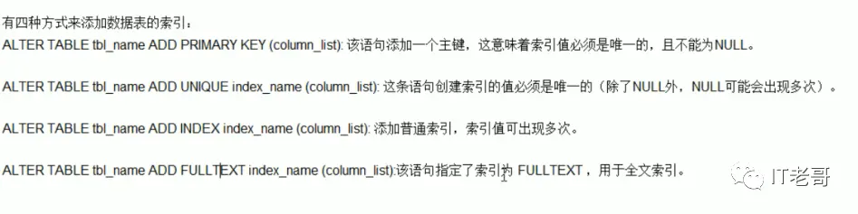

## 哪些情况需要建索引

- 主键自动建立唯一索引

- 频繁作为查询的条件的字段应该创建索引
- 查询中与其他表关联的字段，外键关系建立索引
- 频繁更新的字段不适合创建索引：因为每次更新不单单是更新了记录还会更新索引，加重IO负担
- Where条件里用不到的字段不创建索引
- 单间/组合索引的选择问题（在高并发下倾向创建组合索引）
- 查询中排序的字段，若通过索引去访问将大大提高排序的速度
-  查询中统计或者分组字段

## 哪些不适合建索引

- 表记录太少

- 经常增删改的表

- 数据重复且分布平均的表字段，因此应该只为经常查询和经常排序的数据列建立索引。注意，如果某个数据列包含许多重复的内容，为它建立索引就没有太大的实际效果。

## 一、Explain 用法

Explain + SQL 语句;

如：Explain select \* from user;
会生成如下 SQL 分析结果，下面详细对每个字段进行详解


## 二、id

是一组数字，代表多个表之间的查询顺序，或者包含子句查询语句中的顺序，id 总共分为三种情况，依次详解

- id 相同，执行顺序由上至下

  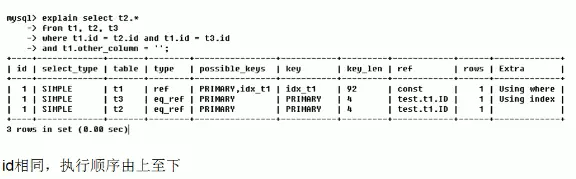

- id 不同，如果是子查询，id 号会递增，id 值越大优先级越高，越先被执行

  

- id 相同和不同的情况同时存在

  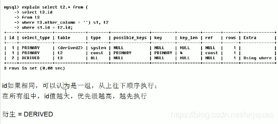

## 三、select_type 

select_type 包含以下几种值

- simple
- primary
- subquery
- derived
- union
- union result

### simple

简单的 select 查询，查询中不包含子查询或者 union 查询

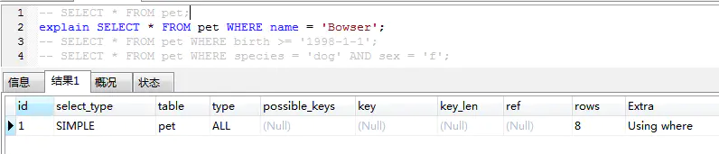

### primary

如果 SQL 语句中包含任何子查询，那么子查询的最外层会被标记为 primary


### subquery

在 select 或者 where 里包含了子查询，那么子查询就会被标记为 subQquery，同三.二同时出现


### derived

在 from 中包含的子查询，会被标记为衍生查询，会把查询结果放到一个临时表中


### union / union result 

如果有两个 select 查询语句，他们之间用 union 连起来查询，那么第二个 select 会被标记为 union，union 的结果被标记为 union result。它的 id 是为 null 的


## 四、table

表示这一行的数据是哪张表的数据

## 五、type

type 是代表 MySQL 使用了哪种索引类型，不同的索引类型的查询效率也是不一样的，type 大致有以下种类

- system
- const
- eq_ref
- ref
- range
- index
- all
  

### system

表中只有一行记录，system 是 const 的特例，几乎不会出现这种情况，可以忽略不计

### const

将主键索引或者唯一索引放到 where 条件中查询，MySQL 可以将查询条件转变成一个常量，只匹配一行数据，索引一次就找到数据了
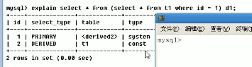

### eq_ref

在多表查询中，如 T1 和 T2，T1 中的一行记录，在 T2 中也只能找到唯一的一行，说白了就是 T1 和 T2 关联查询的条件都是主键索引或者唯一索引，这样才能保证 T1 每一行记录只对应 T2 的一行记录

举个不太恰当的例子，EXPLAIN SELECT \* from t1 , t2 where t1.id = t2.id


### ref

不是主键索引，也不是唯一索引，就是普通的索引，可能会返回多个符合条件的行。


### range

体现在对某个索引进行区间范围检索，一般出现在 where 条件中的 between、and、<、>、in 等范围查找中。


### index

将所有的索引树都遍历一遍，查找到符合条件的行。索引文件比数据文件还是要小很多，所以比不用索引全表扫描还是要快很多。

### all

没用到索引，单纯的将表数据全部都遍历一遍，查找到符合条件的数据

## 六、possible_keys

此次查询中涉及字段上若存在索引，则会被列出来，表示可能会用到的索引，但并不是实际上一定会用到的索引

## 七、key

此次查询中实际上用到的索引

## 八、key_len

表示索引中使用的字节数，通过该属性可以知道在查询中使用的索引长度，注意：这个长度是最大可能长度，并非实际使用长度，在不损失精确性的情况下，长度越短查询效率越高

## 九、ref

显示关联的字段。如果使用常数等值查询，则显示 const，如果是连接查询，则会显示关联的字段。


- tb_emp 表为非唯一性索引扫描，实际使用的索引列为 idx_name，由于 tb_emp.name='rose'为一个常量，所以 ref=const。

- tb_dept 为唯一索引扫描，从 sql 语句可以看出，实际使用了 PRIMARY 主键索引，ref=db01.tb_emp.deptid 表示关联了 db01 数据库中 tb_emp 表的 deptid 字段。

## 十、rows

根据表信息统计以及索引的使用情况，大致估算说要找到所需记录需要读取的行数，rows 越小越好

## 十一、extra

不适合在其他列显示出来，但在优化时十分重要的信息

### using  fileSort（重点优化）

俗称 " 文件排序 " ，在数据量大的时候几乎是“九死一生”，在 order by 或者在 group by 排序的过程中，order by 的字段不是索引字段，或者 select 查询字段存在不是索引字段，或者 select 查询字段都是索引字段，但是 order by 字段和 select 索引字段的顺序不一致，都会导致 fileSort

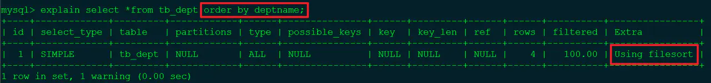

### using temporary（重点优化）

使用了临时表保存中间结果，常见于 order by 和 group by 中。


### USING index（重点）

表示相应的 select 操作中使用了覆盖索引（Coveing Index）,避免访问了表的数据行，效率不错！
如果同时出现 using where，表明索引被用来执行索引键值的查找；如果没有同时出现 using where，表面索引用来读取数据而非执行查找动作。

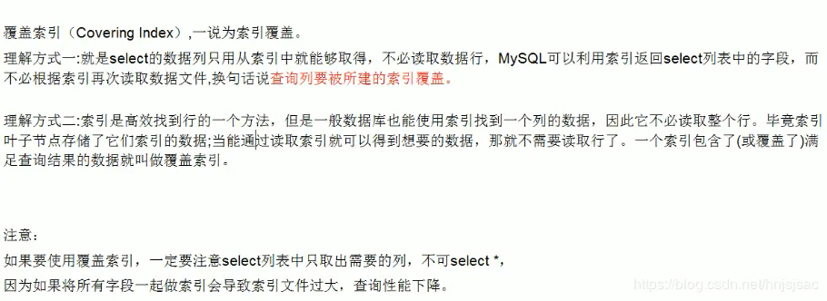

### Using wher

表明使用了 where 过滤

### using join buffer

使用了连接缓存

### impossible where

where 子句的值总是 false，不能用来获取任何元组

### select tables optimized away

在没有 GROUPBY 子句的情况下，基于索引优化 MIN/MAX 操作或者
对于 MyISAM 存储引擎优化 COUNT(\*)操作，不必等到执行阶段再进行计算，
查询执行计划生成的阶段即完成优化。

### distinct

优化 distinct，在找到第一匹配的元组后即停止找同样值的工作

```
【推荐】SQL性能优化的目标：至少要达到 range 级别，要求是ref级别，如果可以是consts最好。 
说明： 
1） consts 单表中最多只有一个匹配行（主键或者唯一索引），在优化阶段即可读取到数据。 
2） ref 指的是使用普通的索引（normal index）。 
3） range 对索引进行范围检索。 
反例：explain表的结果，type=index，索引物理文件全扫描，速度非常慢，这个index级别比较range还低，与全表扫描是小巫见大巫。
```

## 建表—开始索引优化

```sql
// 建表
CREATE TABLE IF NOT EXISTS staffs(
    id INT PRIMARY KEY AUTO_INCREMENT,
    name VARCHAR(24) NOT NULL DEFAULT "" COMMENT'姓名',
    age INT NOT NULL DEFAULT 0 COMMENT'年龄',
    pos VARCHAR(20) NOT NULL DEFAULT "" COMMENT'职位',
    add_time TIMESTAMP NOT NULL DEFAULT CURRENT_TIMESTAMP COMMENT'入职事件'
) CHARSET utf8 COMMENT'员工记录表';

// 插入数据
INSERT INTO `test`.`staffs` (`name`, `age`, `pos`, `add_time`) VALUES ('z3', 22, 'manager', now());
INSERT INTO `test`.`staffs` (`name`, `age`, `pos`, `add_time`) VALUES ('July', 23, 'dev', now());
INSERT INTO `test`.`staffs` (`name`, `age`, `pos`, `add_time`) VALUES ('2000', 23, 'dev', now());

// 建立复合索引（即一个索引包含多个字段）
ALTER TABLE staffs ADD INDEX idx_staffs_nameAgePos(name, age, pos);
```

## 优化一：全部用到索引

### 介绍

建立的复合索引包含了几个字段，查询的时候最好能全部用到，而且严格按照索引顺序，这样查询效率是最高的。（最理想情况，具体情况具体分析）

### SQL 案例

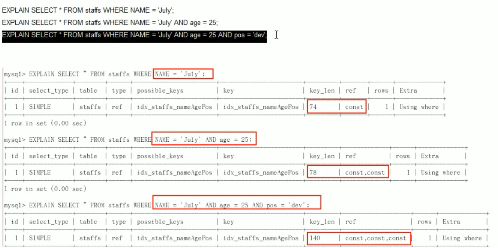

## 优化二：最左前缀法则

### 介绍

如果建立的是复合索引，索引的顺序要按照建立时的顺序，即从左到右，如：a->b->c（和 B+树的数据结构有关）

### 无效索引举例

- a->c：a 有效，c 无效
- b->c：b、c 都无效
- c：c 无效

### SQL 案例

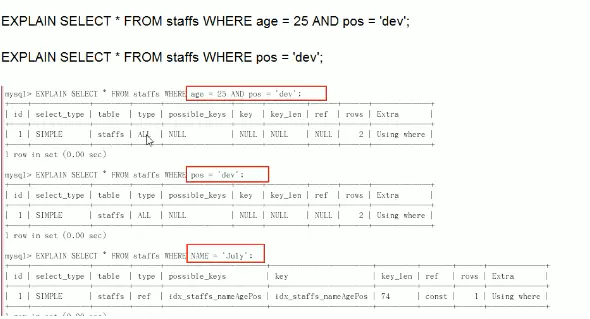

## 优化三：不要对索引做以下处理

### 以下用法会导致索引失效

- 计算，如：+、-、\*、/、!=、<>、is null、is not null、or
- 函数，如：sum()、round()等等
- 手动/自动类型转换，如：id = "1"，本来是数字，给写成字符串了

### SQL 案例

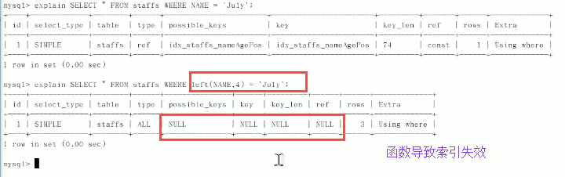

## 优化四：索引不要放在范围查询右边

### 举例

比如复合索引：a->b->c，当 where a="" and b>10 and 3=""，这时候只能用到 a 和 b，c 用不到索引，因为在范围之后索引都失效（和 B+树结构有关）

### SQL 案例

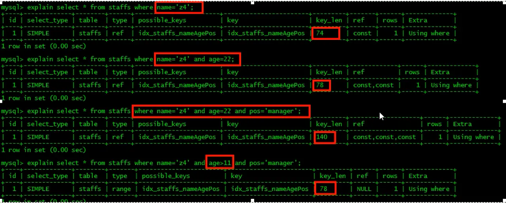

## 优化五：减少 select \* 的使用

### 使用覆盖索引

即：select 查询字段和 where 中使用的索引字段一致。

### SQL 案例

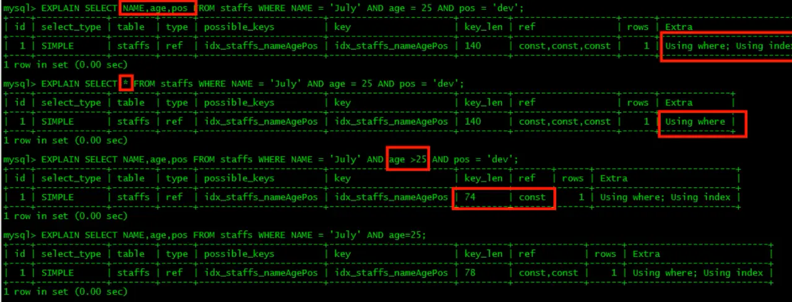

## 优化六：like 模糊搜索

### 失效情况

- like "%张三%"
- like "%张三"

### 解决方案

- 使用复合索引，即 like 字段是 select 的查询字段，如：select name from table where name like "%张三%"
- 使用 like "张三%"

### SQL 案例

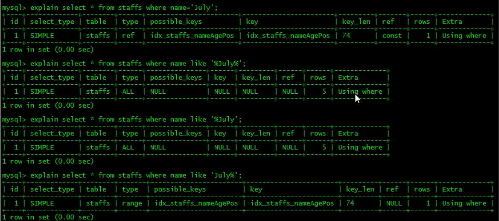

## 优化七：order by 优化

当查询语句中使用 order by 进行排序时，如果没有使用索引进行排序，会出现 filesort 文件内排序，这种情况在数据量大或者并发高的时候，会有性能问题，需要优化。

### filesort 出现的情况举例

- order by 字段不是索引字段
- order by 字段是索引字段，但是 select 中没有使用覆盖索引，如：`select * from staffs order by age asc;`
- order by 中同时存在 ASC 升序排序和 DESC 降序排序，如：`select a, b from staffs order by a desc, b asc;`
- order by 多个字段排序时，不是按照索引顺序进行 order by，即不是按照最左前缀法则，如：`select a, b from staffs order by b asc, a asc;`

### 索引层面解决方法

- 使用主键索引排序
- 按照最左前缀法则，并且使用覆盖索引排序，多个字段排序时，保持排序方向一致
- 在 SQL 语句中强制指定使用某索引，force index(索引名字)
- 不在数据库中排序，在代码层面排序

### order by 排序算法

- 双路排序

  > Mysql4.1 之前是使用双路排序，字面的意思就是两次扫描磁盘，最终得到数据，读取行指针和 ORDER BY 列，对他们进行排序，然后扫描已经排好序的列表，按照列表中的值重新从列表中读取对数据输出。也就是从磁盘读取排序字段，在 buffer 进行排序，再从磁盘读取其他字段。

文件的磁盘 IO 非常耗时的，所以在 Mysql4.1 之后，出现了第二种算法，就是单路排序。

- 单路排序

  > 从磁盘读取查询需要的所有列，按照 orderby 列在 buffer 对它们进行排序，然后扫描排序后的列表进行输出，
  > 它的效率更快一些，避免了第二次读取数据，并且把随机 IO 变成顺序 IO，但是它会使用更多的空间，
  > 因为它把每一行都保存在内存中了。

当我们无可避免要使用排序时，索引层面没法在优化的时候又该怎么办呢？尽可能让 MySQL 选择使用第二种单路算法来进行排序。这样可以减少大量的随机 IO 操作,很大幅度地提高排序工作的效率。下面看看单路排序优化需要注意的点

### 单路排序优化点

- 增大 max_length_for_sort_data

  > 在 MySQL 中,决定使用"双路排序"算法还是"单路排序"算法是通过参数 max*length_for* sort_data 来决定的。当所有返回字段的最大长度小于这个参数值时,MySQL 就会选择"单路排序"算法,反之,则选择"多路排序"算法。所以,如果有充足的内存让 MySQL 存放须要返回的非排序字段,就可以加大这个参数的值来让 MySQL 选择使用"单路排序"算法。

- 去掉不必要的返回字段，避免select * 

  > 当内存不是很充裕时,不能简单地通过强行加大上面的参数来强迫 MySQL 去使用"单路排序"算法,否则可能会造成 MySQL 不得不将数据分成很多段,然后进行排序,这样可能会得不偿失。此时就须要去掉不必要的返回字段,让返回结果长度适应 max_length_for_sort_data 参数的限制。

- 增大 sort_buffer_size 参数设置

  > 这个值如果过小的话,再加上你一次返回的条数过多,那么很可能就会分很多次进行排序,然后最后将每次的排序结果再串联起来,这样就会更慢,增大 sort_buffer_size 并不是为了让 MySQL 选择"单路排序"算法,而是为了让 MySQL 尽量减少在排序过程中对须要排序的数据进行分段,因为分段会造成 MySQL 不得不使用临时表来进行交换排序。

但是sort_buffer_size 不是越大越好：

- Sort_Buffer_Size 是一个 connection 级参数,在每个 connection 第一次需要使用这个 buffer 的时候,一次性分配设置的内存。
- Sort_Buffer_Size 并不是越大越好,由于是 connection 级的参数,过大的设置和高并发可能会耗尽系统内存资源。
- 据说 Sort_Buffer_Size 超过 2M 的时候,就会使用 mmap() 而不是 malloc() 来进行内存分配,导致效率降低。

## 优化八：group by 

其原理也是先排序后分组，其优化方式可参考order by。where高于having,能写在where限定的条件就不要去having限定了。

## 慢查询日志

- 慢查询日志是MySQL提供的一种日志记录，它用来记录查询响应时间超过阀值的SQL语句

- 这个时间阀值通过参数long_query_time设置，如果SQL语句查询时间大于这个值，则会被记录到慢查询日志中，这个值默认是10秒

- MySQL默认不开启慢查询日志，在需要调优的时候可以手动开启，但是多少会对数据库性能有点影响

### 如何开启慢查询日志

查看是否开启了慢查询日志

```sql
SHOW VARIABLES LIKE '%slow_query_log%'
```

用命令方式开启慢查询日志，但是重启MySQL后此设置会失效

```sql
set global slow_query_log = 1
```

永久生效开启方式可以在my.cnf里进行配置，在[mysqld]下新增以下两个参数，重启MySQL即可生效

```sql
slow_query_log=1
slow_query_log_file=日志文件存储路径
```

### 慢查询时间阀值

查看慢查询时间阀值

```sql
SHOW VARIABLES LIKE 'long_query_time%';
```

修改慢查询时间阀值

```sql
set global long_query_time=3;
```

修改后的时间阀值生效

```
需要重新连接或者新开一个回话才能看到修改值。
```

在MySQL配置文件中修改时间阀值

```sql
[mysqld]下配置
slow_query_log=1
slow_query_log_file=日志文件存储路径
long_query_time=3
log_output=FILE
```

### 慢查询日志分析工具

慢查询日志可能会数据量非常大，那么我们如何快速找到需要优化的SQL语句呢，这个神奇诞生了，它就是mysqldumpshow。

### mysqldumpslow --help语法


通过mysqldumpslow --help可知这个命令是由三部分组成：mysqldumpslow [日志查找选项] [日志文件存储位置]。

### 日志查找选项

- -s：是表示按何种方式排序
- c：访问次数
- l：锁定时间
- r：返回记录
- t：查询时间
- al：平均锁定时间
- ar：平均返回记录数
- at：平均查询时间
- -t：即为返回前面多少条的数据
- -g：后边搭配一个正则匹配模式，大小写不敏感的

### 常用分析语法

查找返回记录做多的10条SQL

```sql
mysqldumpslow -s r -t 10 日志路径
```

查找使用频率最高的10条SQL

```sql
mysqldumpslow -s c -t 10 日志路径
```

查找按照时间排序的前10条里包含左连接的SQL

```sql
mysqldumpslow -s t -t 10 -g "left join" 日志路径
```

通过more查看日志，防止爆屏

```
mysqldumpslow -s r -t 10 日志路径 | more
```

## Show profiles

### 是什么

是`MySQL`提供可以用来分析当前会话中`SQL`语句执行的资源消耗情况。可以用于`SQL`的调优测量。默认情况下，参数处于关闭状态，并保存最近 15 次的运行结果

### 开启 profiles

- 查看是否开启

```sql
show variables like "%profiling%";
```

- 开启

```sql
set profiling = 1;
```

### 开始分析

- 先执行要分析的`SQL`语句

- 执行`show profiles;`会出现如下结果

  

- 分析以上截图某一条`SQL`语法

```sql
show profile type1,type2.. for query Query_ID
```

- 比如我们分析截图中的第`5`条`SQL`语句

```sql
show profile cpu,block io for query 5
```


### show profile返回结果字段含义

- Status ： sql 语句执行的状态
- Duration: sql 执行过程中每一个步骤的耗时
- CPU_user: 当前用户占有的 cpu
- CPU_system: 系统占有的 cpu
- Block_ops_in : I/O 输入
- Block_ops_out : I/O 输出

### show profile type 选项

- all：显示所有的性能开销信息
- block io：显示块 IO 相关的开销信息
- context switches: 上下文切换相关开销
- cpu：显示 CPU 相关的信息
- ipc：显示发送和接收相关的开销信息
- memory：显示内存相关的开销信息
- page faults：显示页面错误相关开销信息
- source：显示和 Source_function、Source_file、Source_line 相关的开销信息
- swaps：显示交换次数的相关信息

### status出现以下情况的建议

- System lock

> 确认是由于哪个锁引起的，通常是因为MySQL或InnoDB内核级的锁引起的。`建议`：如果耗时较大再关注即可，一般情况下都还好

- Sending data

> `解释`：从server端发送数据到客户端，也有可能是接收存储引擎层返回的数据，再发送给客户端，数据量很大时尤其经常能看见。
> `备注`：Sending Data不是网络发送，是从硬盘读取，发送到网络是Writing to net。`建议`：通过索引或加上LIMIT，减少需要扫描并且发送给客户端的数据量

- Sorting result

> 正在对结果进行排序，类似Creating sort index，不过是正常表，而不是在内存表中进行排序。
> `建议`：创建适当的索引

- Table lock

> 表级锁，没什么好说的，要么是因为MyISAM引擎表级锁，要么是其他情况显式锁表

- create sort index

> 当前的SELECT中需要用到临时表在进行ORDER BY排序
> `建议`：创建适当的索引

- Creating tmp table

> 创建临时表。先拷贝数据到临时表，用完后再删除临时表。消耗内存，数据来回拷贝删除，消耗时间，`建议`：优化索引

- converting HEAP to MyISAM

> 查询结果太大，内存不够，数据往磁盘上搬了。`建议`：优化索引，可以调整max_heap_table_size

- Copying to tmp table on disk

> 把内存中临时表复制到磁盘上，危险！！！`建议`：优化索引，可以调整tmp_table_size参数，增大内存临时表大小

---

## 前言

## 准备工作——数据库锁

### 创建表 tb_innodb_lock

```sql
drop table if exists test_innodb_lock;
CREATE TABLE test_innodb_lock (
    a INT (11),
    b VARCHAR (20)
) ENGINE INNODB DEFAULT charset = utf8;
insert into test_innodb_lock values (1,'a');
insert into test_innodb_lock values (2,'b');
insert into test_innodb_lock values (3,'c');
insert into test_innodb_lock values (4,'d');
insert into test_innodb_lock values (5,'e');
```

### 创建索引

```sql
create index idx_lock_a on test_innodb_lock(a);
create index idx_lock_b on test_innodb_lock(b);
```

## MySQL 各种锁演示

- 先将自动提交事务改成手动提交：`set autocommit=0;`
- 我们启动两个会话窗口 A 和 B，模拟一个抢到锁，一个没抢到被阻塞住了。

### 行锁（写&读）

- A 窗口执行

```sql
update test_innodb_lock set b='a1' where a=1;
```

```sql
SELECT * from test_innodb_lock;
```

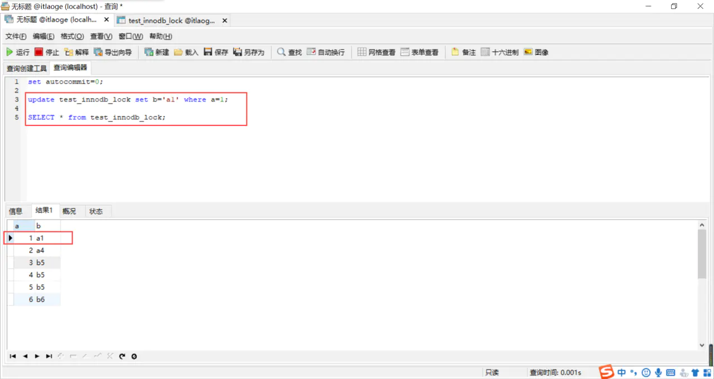

我们可以看到 A 窗口可以看到更新后的结果

- B 窗口执行

```sql
SELECT * from test_innodb_lock;
```

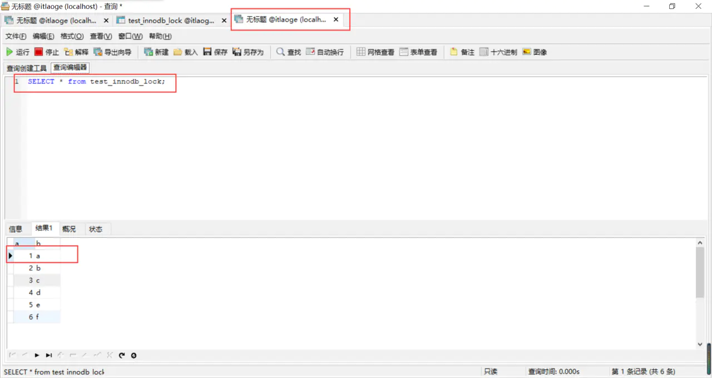

我们可以看到 B 窗口不能看到更新后的结果，看到的还是老数据，这是因为 a = 1 的这行记录被 A 窗口执行的 SQL 语句抢到了锁，并且没有执行 commit 提交操作。所以窗口 B 看到的还是老数据。这就是 MySQL 隔离级别中的"读已提交"。

- 窗口 A 执行 commit 操作

```sql
COMMIT;
```

- 窗口 B 查询

```sql
SELECT * from test_innodb_lock;
```

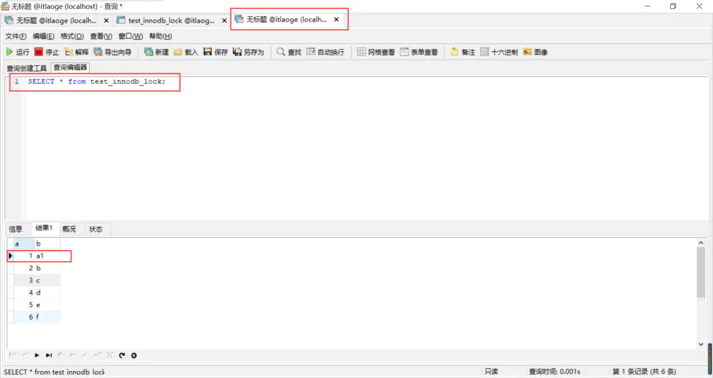

这个时候我们发现窗口 B 已经读取到最新数据了

### 行锁（写&写）

- 窗口 A 执行更新 a = 1 的记录

```sql
update test_innodb_lock set b='a2' where a=1;
```

这时候并没有 commit 提交，锁是窗口 A 持有。

- 窗口 B 也执行更新 a = 1 的记录

```sql
update test_innodb_lock set b='a3' where a=1;
```

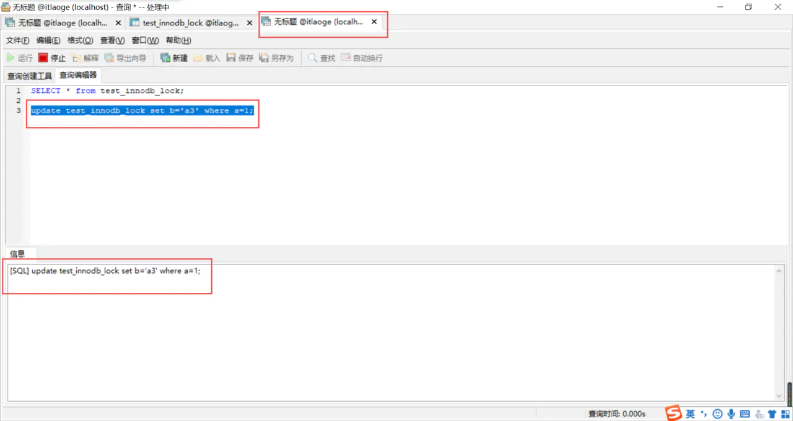

可以看到，窗口 B 一直处于阻塞状态，因为窗口 A 还没有执行 commit，还持有锁。窗口 B 抢不到 a = 1 这行记录的锁，所以一直阻塞等待。

- 窗口 A 执行 commit 操作

```sql
COMMIT;
```

- 窗口 B 的变化

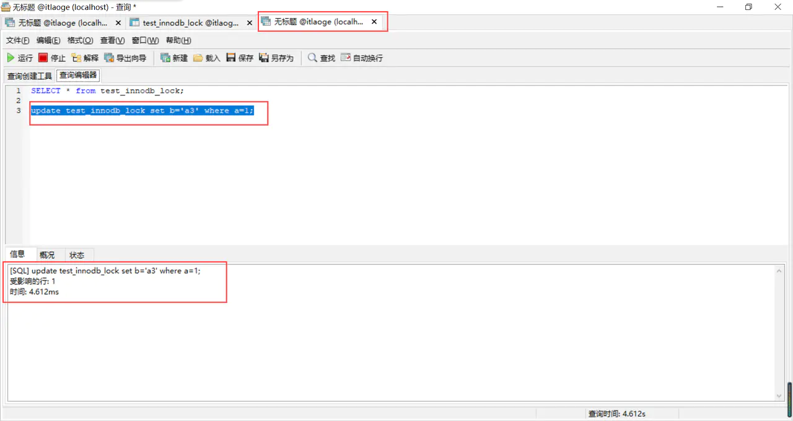

可以看到这个时候窗口 B 已经执行成功了

### 表锁

当索引失效的时候，行锁会升级成表锁，索引失效的其中一个方法是对索引自动 or 手动的换型。a 字段本身是 integer，我们加上引号，就变成了 String，这个时候索引就会失效了。

- 窗口 A 更新 a = 1 的记录

```sql
update test_innodb_lock set b='a4' where a=1 or a=2;
```

- 窗口 B 更新 a = 2 的记录

```sql
update test_innodb_lock set b='b1' where a=3;
```

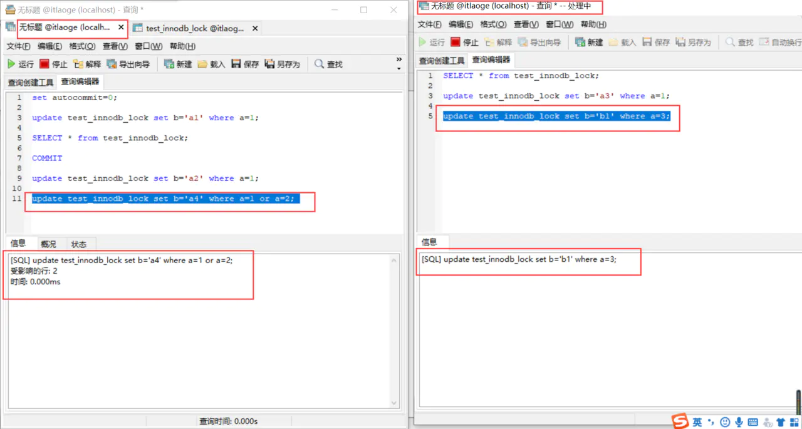

这个时候发现，虽然窗口 A 和 B 更新的行不一样，但是窗口 B 还是被阻塞住了，就是因为窗口 A 的索引失效，导致行锁升级成了表锁，把整个表锁住了，索引窗口 B 被阻塞了。

- 窗口 A 执行 commit 操作

```sql
COMMIT;
```

- 窗口 B 的变化


可以看到这个时候窗口 B 已经执行成功了

### 间隙锁

- 什么是间隙锁

当我们采用范围条件查询数据时，InnoDB 会对这个范围内的数据进行加锁。比如有 id 为：1、3、5、7 的 4 条数据，我们查找 1-7 范围的数据。那么 1-7 都会被加上锁。2、4、6 也在 1-7 的范围中，但是不存在这些数据记录，这些 2、4、6 就被称为间隙。

- 间隙锁的危害

范围查找时，会把整个范围的数据全部锁定住，即便这个范围内不存在的一些数据，也会被无辜的锁定住，比如我要在 1、3、5、7 中插入 2，这个时候 1-7 都被锁定住了，根本无法插入 2。在某些场景下会对性能产生很大的影响

- 间隙锁演示

我们先把字段 a 的值修改成 1、3、5、7、9

- 窗口 A 更新 a = 1~7 范围的数据

```sql
update test_innodb_lock set b='b5' where a>1 and a<7;
```

- 窗口 B 在 a = 2 的位置插入数据

```sql
insert into test_innodb_lock values(2, "b6");
```

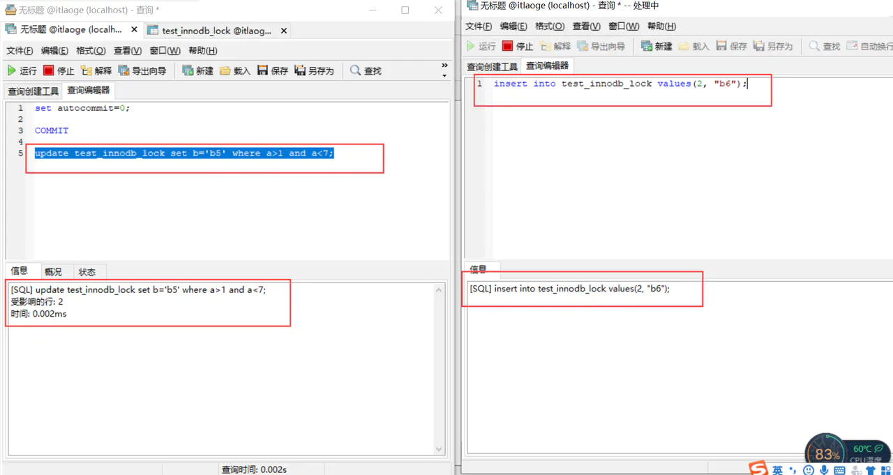

这个时候发现窗口 B 更新 a = 2 的操作一直在等待，因为 1~7 范围的数据被间隙锁，锁住了。只有等窗口 A 执行 commit，窗口 B 的 a = 2 才能更新成功

### 行锁分析

- 执行 SQL 分析命令

```sql
show status like 'innodb_row_lock%';
```

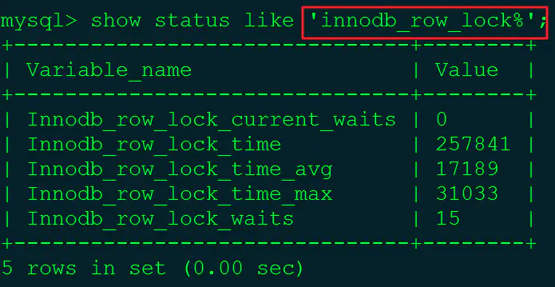

- Variable_name 说明

  - Innodb_row_lock_current_waits：当前正在等待锁定的数量。

  - Innodb_row_lock_time：从系统启动到现在锁定的时长。

  - Innodb_row_lock_time_avg：每次等待锁所花平均时间。

  - Innodb_row_lock_time_max：从系统启动到现在锁等待最长的一次所花的时间。

  - Innodb_row_lock_waits：系统启动后到现在总共等待锁的次数。

## show processlist 简介

### 语法

不同用户之间只能查看自己的数据，如果想查看所有的请用管理员查询

```sql
show processlist;
```

### 返回结果字段说明

- id

  > SQL 的 ID 标识，需要 kill 这个 SQL 进程的时候可以使用

- User

  > 当前连接用户

- Host

  > 所属的 IP 和端口

- db

  > 数据库名

- command

  > 连接状态，一般是`休眠`（sleep），`查询`（query），`连接`（connect），如果一条 SQL 语句是`query`状态，而且`time`时间很长，说明存在`问题`

- time

  > 连接状态持续的时间，单位是秒（s）

- state（`重点分析`）

  > 当前 SQL 语句的状态，是优化的重要参数

- info

  > 显示当前所执行的 SQL 语句

## state 详解

state 在优化中是很重要的字段，能提供给我们很多这条 SQL 线程的当前状态，帮助我们能定位分析问题。下面列举出 state 的一些常见的字段。

- state

  > `解释`：代表资源未释放，如果通过连接池连接数据库，那么 state 应该是一个稳定的范围。如果有大量的 SQL 请求忘记关闭数据库连接，会造成大量连接请求阻塞，数据库挂掉。

- checking table

  > `解释`：正在检查数据数据表，这个操作是系统自动的

- closing tables

  > `解释`：表示正在将表中修改的数据刷新到磁盘中去，然后关闭用完的表，这是一个很快的操作。

  > `优化建议`：如果这个过程很慢，那就需要看看磁盘是否满了，或者磁盘在进行大量的 IO 操作等等

- connect out

  > `解释`：主从复制里，从服务器正在连接主服务器

- creating tmp table

  > `解释`：正在创建临时表，临时存放查询结果

- copying to tmp table on disk

  > `解释`：当使用 order by、group by 或者 join 查询时，会出创建临时表的情况，当数据太大，会把内存中的临时表数据存储到硬盘上。

  > `优化建议`：一：优化索引，尽量减少创建临时表。二：优化 SQL 语句逻辑,可以用 Java 代码实现部分耗时的 SQL 逻辑。三：可以调节`tmp_table_size`和`max_heap_table_size`两个参数，增大内存中临时表的大小。

- flushing tables

  > 在执行刷新表，等待其他线程关闭数据库表

- killed

  > `解释`：发送了一个 kill 请求给某线程，那么这个线程将会检查 kill 标志位，同时会放弃下一个 kill 请求。MySQL 会在每次的主循环中检查 kill 标志位，不过有些情况下该线程可能会过一小段才能死掉。如果该线程程被其他线程锁住了，那么 kill 请求会在锁释放时马上生效。

- sending data

  > `解释`：这个字段字面上很容易误导人，大部分人觉得他仅仅是发送数据给客户端，但其实是`收集` + `发送`。当 MySQL 使用索引查询完后，得到一堆行的 id，如果有的查询列不在索引中，那么 MySQL 需要到 id 所在的数据行，将数据取出来返回给客户端。

- sorting for group / order

  > `解释`：SQL 语句中使用了 group 和 order 进行排序

  > `优化建议`：如果出现了创建临时表或者文件内排序的情况，比较耗时的情况下需要优化索引

- Waiting for net / reading from net / writing to net

  > `解释`：主要是网络状态的描述，如大量出现，要检查数据库网络连接状态和流量

  > `优化建议`：比如外挂流量攻击数据库时，会导致网络带宽被占满，大量的连接请求打到数据库，造成数据库崩溃，建议进行防流量攻击。

- locked

  > `解释`：SQL 被锁住了，如表锁，行锁，间隙锁等等。

  > `优化建议`：正确使用索引，避免索引失效升级为表锁。使用 innodb 搜索引擎，不要用 myisam。

- Opening tables

  > `解释`：一个 SQL 线程正在尝试打开数据表，这个过程正常的情况是很快的，但是如果有人在 alter table，或者 lock table 语句之前完之前，其他线程无法打开这个数据表。

- Waiting for tables

  > `解释`：该线程得到通知，数据表结构已经被修改了，需要重新打开数据表以取得新的结构。然后，为了能的重新打开数据表，必须等到所有其他线程关闭这个表。

  > 以下几种情况下会产生这个通知：FLUSH TABLES tbl_name、 ALTER TABLE、 RENAME TABLE、 REPAIR TABLE、 ANALYZE TABLE、或 OPTIMIZE TABLE。

- System lock

  > `解释`：正在等待取得一个外部的系统锁。如果当前没有运行多个 mysqld 服务器同时请求同一个表，那么可以通过增加--skip-external-locking 参数来禁止外部系统锁。默认情况下这个参数是关闭的。

### 哈希索引

hash大家应该非常的熟悉，就是我们老生常谈的HashMap里用到的技术。Hash索引其检索效率非常高，索引的检索可以一次定位。

可能很多人又有疑问了，既然Hash索引的效率这么高，为什么都用Hash索引而还要使用B-Tree索引呢?

任何事物都是有两面性的，Hash索引也一样，虽然Hash索引效率高，但是Hash索引本身由于其特殊性也带来了很多限制和弊端，主要有以下这些：

**原因一：**

Hash索引不能使用范围查询

Hash索引仅仅能满足"=","IN"和"<=>"查询(注意<>和＜＝＞是不同的操作），不能使用范围查询，例如WHERE price > 100。

由于Hash索引比较的是进行Hash运算之后的Hash值，所以它只能用于等值的过滤，不能用于基于范围的过滤。

**原因二：**

Hash索引不能利用部分索引键查询。

对于复合索引，Hash索引在计算Hash值的时候，是组合索引键合并后再一起计算Hash值，而不是单独计算Hash值。

所以通过复合索引的前面一个或几个索引键进行查询的时候，Hash索引也无法被利用。

**原因三：**

Hash索引在任何时候都不能避免表扫描。

Hash索引是将索引键通过Hash运算之后，将 Hash运算结果的Hash值和所对应的行指针信息存放于一个Hash表中。

由于不同索引键存在相同Hash值，所以无法从Hash索引中直接完成查询，还是要通过访问表中的实际数据进行相应的比较，并得到相应的结果。

hash索引out出局

### 平衡二叉树索引

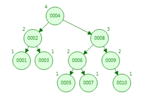

又称 AVL树。 它除了具备二叉查找树的基本特征之外，还具有一个非常重要的特点：它的左子树和右子树都是平衡二叉树。

且左子树和右子树的深度之差的绝对值（平衡因子 ）不超过1。也就是说AVL树每个节点的平衡因子只可能是-1、0和1（左子树高度减去右子树高度）。

**被淘汰的原因**

- 树的高度过高，高度越高，查找速度越慢

- 他支持范围查找，但是他需要在进行回旋查找

比如我要找到大于5的数据

第一步我先定位到5，然后在树上按照二叉树规则去回旋查找大于5其他数据6、7、8、9、10。。。

如果大于5的数据很多，那速度是很慢的。

### B树索引


大家可以看到B树和二叉树最大的区别在于：它一个节点可以存储两个值，这就意味着它的树高度，比二叉树的高度更低，它的查询速度就更快。这是他的优点

那为什么最终还是不用它呢，还是因为他在范围查找的时候，存在回旋查询的问题。同样order by排序的时候效率也很低，因为要把树上的数据手动排序一遍。

### 终极大佬：B+树


它是B数的升级版，B+树相比B树，新增叶子节点与非叶子节点关系。

叶子节点中包含了key和value，key存储的是1-10这些数字，value存储的是数据存储地址，非叶子节点中只是包含了key，不包含value。

所有相邻的叶子节点包含非叶子节点，使用链表进行结合，有一定顺序排序，从而范围查询效率非常高。

**比如我们要查找大于5的数据：**

- 首先我们定位到5的位置

- 然后直接将5后面的数据全部拿出来即可，因为这是有序链表，已经排好序了

我们在order by排序的时候为什么要使用索引进行排序，原因就在这。

## 索引为什么会失效

### 单值索引B+树图

单值索引在B+树的结构里，一个节点只存一个键值对

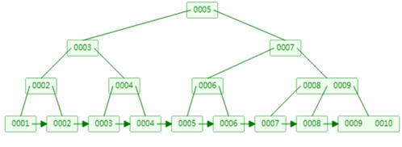

### 联合索引

开局一张图，由数据库的`a`字段和`b`字段组成一个`联合索引`。


从本质上来说，联合索引也是一个B+树，和单值索引不同的是，联合索引的键值对不是1，而是大于1个。

### a, b 排序分析

a顺序：1，1，2，2，3，3

b顺序：1，2，1，4，1，2

大家可以发现a字段是有序排列，b字段是无序排列（因为B+树只能选一个字段来构建有序的树）

一不小心又会发现，在a相等的情况下，b字段是有序的。

大家想想平时编程中我们要对两个字段排序，是不是先按照第一个字段排序，如果第一个字段出现相等的情况，就用第二个字段排序。这个排序方式同样被用到了B+树里。

### 分析最佳左前缀原理

#### 先举一个遵循最佳左前缀法则的例子

```sql
select * from testTable where a=1 and b=2
```

**`分析如下：`**

首先a字段在B+树上是有序的，所以我们可以通过二分查找法来定位到a=1的位置。

其次在a确定的情况下，b是相对有序的，因为有序，所以同样可以通过二分查找法找到b=2的位置。

#### 再来看看不遵循最佳左前缀的例子

```sql
select * from testTable where b=2
```

**`分析如下：`**

我们来回想一下b有顺序的前提：在a确定的情况下。

现在你的a都飞了，那b肯定是不能确定顺序的，在一个无序的B+树上是无法用二分查找来定位到b字段的。

所以这个时候，是用不上索引的。大家懂了吗？

### 范围查询右边失效原理

#### 举例

```sql
select * from testTable where a>1 and b=2
```

**`分析如下：`**

首先a字段在B+树上是有序的，所以可以用二分查找法定位到1，然后将所有大于1的数据取出来，a可以用到索引。

b有序的前提是a是确定的值，那么现在a的值是取大于1的，可能有10个大于1的a，也可能有一百个a。

大于1的a那部分的B+树里，b字段是无序的（开局一张图），所以b不能在无序的B+树里用二分查找来查询，b用不到索引。

### like索引失效原理

```sql
where name like "a%"

where name like "%a%"

where name like "%a"
```

**我们先来了解一下%的用途**

- `%放在右边`，代表查询以"a"开头的数据，如：abc

- `两个%%`，代表查询数据中包含"a"的数据，如：cab、cba、abc

- `%放在左边`，代表查询以"a"为结尾的数据，如cba

#### 为什么%放在右边有时候能用到索引

- %放右边叫做：`前缀`

- %%叫做：`中缀`

- %放在左边叫做：`后缀`

没错，这里依然是最佳左前缀法则这个概念

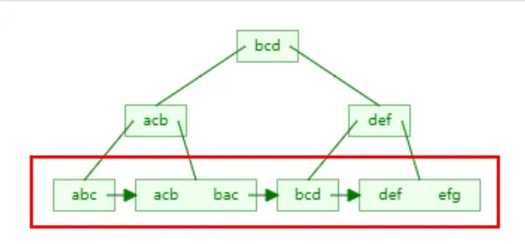

大家可以看到，上面的B+树是由字符串组成的。

`字符串的排序方式`：先按照第一个字母排序，如果第一个字母相同，就按照第二个字母排序。。。以此类推

**`开始分析`**

**一、%号放右边（前缀）**

由于B+树的索引顺序，是按照首字母的大小进行排序，前缀匹配又是匹配首字母。所以可以在B+树上进行有序的查找，查找首字母符合要求的数据。所以有些时候可以用到索引。

**二、%号放右边**

是匹配字符串尾部的数据，我们上面说了排序规则，尾部的字母是没有顺序的，所以不能按照索引顺序查询，就用不到索引。

**三、两个%%号**

这个是查询任意位置的字母满足条件即可，只有首字母是进行索引排序的，其他位置的字母都是相对无序的，所以查找任意位置的字母是用不上索引的。

### 总结

这里把一些经典的索引失效案例给大家分析了，希望能引发大家的思考，能够通过这些案例，明白其他情况索引失效的原理。

之后我们在讲讲，如何通过索引查询到数据整个流程，`InnoDB`和`MyISAM`两个引擎底层索引的实现区别。

## B+树在满足聚簇索引和覆盖索引的时候不需要回表查询数据，

在B+树的索引中，叶子节点可能存储了当前的key值，也可能存储了当前的key值以及整行的数据，这就是聚簇索引和非聚簇索引。 在InnoDB中，只有主键索引是聚簇索引，如果没有主键，则挑选一个唯一键建立聚簇索引。如果没有唯一键，则隐式的生成一个键来建立聚簇索引。

当查询使用聚簇索引时，在对应的叶子节点，可以获取到整行数据，因此不用再次进行回表查询。

## 什么是聚簇索引？何时使用聚簇索引与非聚簇索引

- 聚簇索引：将数据存储与索引放到了一块，找到索引也就找到了数据
- 非聚簇索引：将数据存储于索引分开结构，索引结构的叶子节点指向了数据的对应行，myisam通过key\_buffer把索引先缓存到内存中，当需要访问数据时（通过索引访问数据），在内存中直接搜索索引，然后通过索引找到磁盘相应数据，这也就是为什么索引不在key buffer命中时，速度慢的原因

澄清一个概念：innodb中，在聚簇索引之上创建的索引称之为辅助索引，辅助索引访问数据总是需要二次查找，非聚簇索引都是辅助索引，像复合索引、前缀索引、唯一索引，辅助索引叶子节点存储的不再是行的物理位置，而是主键值

何时使用聚簇索引与非聚簇索引


### 非聚簇索引一定会回表查询吗？

不一定，这涉及到查询语句所要求的字段是否全部命中了索引，如果全部命中了索引，那么就不必再进行回表查询。

举个简单的例子，假设我们在员工表的年龄上建立了索引，那么当进行`select age from employee where age < 20`的查询时，在索引的叶子节点上，已经包含了age信息，不会再次进行回表查询。