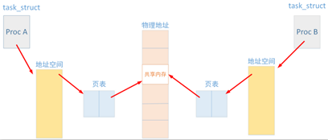
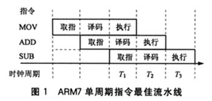

## 用户态和内核态的区别

**内核态**: CPU可以访问内存所有数据, 包括外围设备, 例如硬盘, 网卡. CPU也可以将自己从一个程序切换到另一个程序

**用户态**: 只能受限的访问内存, 且不允许访问外围设备。 占用CPU的能力被剥夺， CPU资源可以被其他程序获取

所有用户程序都是运行在用户态的, 但是有时候程序确实需要做一些内核态的事情, 例如从硬盘读取数据, 或者从键盘获取输入等. 

而唯一可以做这些事情的就是操作系统, 所以此时程序就需要先操作系统请求以程序的名义来执行这些操作.

这时需要一个这样的机制: 用户态程序切换到内核态, 但是不能控制在内核态中执行的指令，这种机制叫系统调用

## 操作系统怎么与硬件互动

（1）Shell将可执行文件加载到内存中以后，设置相关的寄存器。

（2）然后，开始执行里面的可执行文件，首先一条一条进行指令分析

（3）指令分析后，然后进行系统调用，产生中断信号。

（4）cpu收到中断信号跳转到中断服务程序

（5）中断服务程序，开始给硬件发送信号，进行驱动执行。

（6）计算机怎么与硬件沟通，通过寄存器地址访问硬件上的存储器，硬件把信息放在存储器里，每个存储器有个地址，cpu用地址号来读写数据。地址怎么产生的？程序代码里给出的，cpu加电从某个固定地址读出程序指令执行。

## 进程同步和线程同步

### 为什么要进程同步

多进程虽然提高了系统资源利用率和吞吐量，但是由于进程的异步性可能造成系统的混乱。进程同步的任务就是对多个相关进程在执行顺序上进行协调，使并发执行的多个进程之间可以有效的共享资源和相互合作，保证程序执行的可再现性。

### 同步机制需要遵循的原则：

①空闲让进：当没有进程处于临界区的时候，应该许可其他进程进入临界区的申请

②忙则等待：当前如果有进程处于临界区，如果有其他进程申请进入，则必须等待，保证对临界区的互斥访问

③有限等待：对要求访问临界资源的进程，需要在有限时间呃逆进入临界区，防止出现死等

④让权等待：当进程无法进入临界区的时候，需要释放处理机，边陷入忙等

### 进程同步的方式：原子操作、信号量、管程。

**线程同步方式：**

（1）互斥（信号)量，每个时刻只有一个线程可以访问公共资源。只有拥有互斥对象的线程才能访问公共资源，互斥对象只有一个，一个时刻只能有一个线程持有，所以保证了公共资源不会被多个线程同时访问。

（2）信号量，允许多个线程同时访问公共资源。当时控制了访问资源的线程的最大个数。

（3）临界区。任意时刻只能有一个线程进入临界区，访问临界资源。

## 线程同步的方式

线程是进程的子任务，是CPU调度和分派的基本单位，用于保证程序的实时性，实现进程内部的并发；线程是操作系统可识别的最小执行和调度单位。每个线程都独自占用一个虚拟处理器：独自的寄存器组，指令计数器和处理器状态。每个线程完成不同的任务，但是共享同一地址空间（也就是同样的动态内存，映射文件，目标代码等等），打开的文件队列和其他内核资源。

线程间同步的方式:

1、临界区：

通过多线程的串行化来访问公共资源或一段代码，速度快，适合控制数据访问；

2、互斥量 Synchronized/Lock：

采用互斥对象机制，只有拥有互斥对象的线程才有访问公共资源的权限。因为互斥对象只有一个，所以可以保证公共资源不会被多个线程同时访问

3、信号量 Semphare：

为控制具有有限数量的用户资源而设计的，它允许多个线程在同一时刻去访问同一个资源，但一般需要限制同一时刻访问此资源的最大线程数目。

4、事件(信号)，Wait/Notify：

通过通知操作的方式来保持多线程同步，还可以方便的实现多线程优先级的比较操作

## 进程的通信方式

**（1）匿名管道：**
在内核中申请一块固定大小的缓冲区，程序拥有写入和读取的权利，一般使用fork函数实现父子进程的通信。自带同步互斥机制。半双工，单向通信，两个管道实现双向通信。

**（2）命名管道：**

其思想是，在内存中创建一个共享文件，从而使通信双方利用这个共享文件来传递信息。由于这种方式具有单向传递数据的特点，所以这个作为传递消息的共享文件就叫做“管道”。

**（3）消息队列**

内核中创建一队列，队列中每个元素是一个数据报，不同的进程可以通过句柄去访问这个队列。

消息队列提供了⼀个从⼀个进程向另外⼀个进程发送⼀块数据的⽅法。

**特点：**

①消息队列可以认为是一个全局的一个链表，链表节点钟存放着数据报的类型和内容，有消息队列的标识符进行标记。

②消息队列允许一个或多个进程写入或者读取消息。

③消息队列的生命周期随内核。

④消息队列可实现双向通信。

**（4）信号量**

在内核中创建一个信号量集合（本质是个数组），数组的元素（信号量）都是1，使用P操作进行-1，使用V操作+1，对临界资源进行保护。信号量的本质就是计数器

**（5）共享内存** 

在Linux中，每个进程都有属于自己的进程控制块（PCB）和地址空间（Addr Space），并且都有一个与之对应的页表，负责将进程的虚拟地址与物理地址进行映射，通过内存管理单元（MMU）进行管理。两个不同的虚拟地址通过页表映射到物理空间的同一区域，它们所指向的这块区域即共享内存。

**为什么共享内存速度最快？**

借助上图说明：Proc A 进程给内存中写数据， Proc B 进程从内存中读取数据，在此期间一共发生了两次复制

（1）Proc A 到共享内存       

（2）共享内存到 Proc B，因为直接在内存上操作，所以共享内存的速度也就提高了。

**（6）信号**

在软件层上对终端机制的一种模拟，通知有事发生，与处理器收到一个中断请求是一致的。

**（7）套接字**

网络中不同机器间的进程的通信，应用广泛

## 共享内存的优缺点

**优点：** 我们可以看到使用共享内存进行进程间的通信真的是非常方便，而且函数的接口也简单，数据的共享还使进程间的数据不用传送，而是直接访问内存，也加快了程序的效率。同时，它也不像匿名管道那样要求通信的进程有一定的父子关系。

**缺点：** 共享内存没有提供同步的机制，这使得我们在使用共享内存进行进程间通信时，往往要借助其他的手段来进行进程间的同步工作。

我们可以使用共享内存作为一种独特的存储选项，提供快速读/写操作和进程互操作性等优势。对于 Web 应用程序，这意味着：

缓存存储（数据库查询、Web 服务数据、外部数据）、会话存储、应用程序之间的数据交换、此存储技术不仅对缓存有用，也对应用程序之间的数据交换也有用，只要数据以两端都可读的格式存储。不要低估共享内存在 Web 应用程序中的力量。可采用许多不同的方式来巧妙地实现这种存储，惟一的限制是开发人员的创造力和技能。

## 对mmap的理解

mmap()系统调用使得进程之间，通过映射同一个普通文件实现共享内存。普通文件被映射到进程地址空间后，进程可以向访问普通内存一样对文件进行访问，不必再调用read()、write()等操作。 

## 进程任务调度算法的特点以及使用场景

（1）时间片轮转调度算法（RR）：

（2）先来先服务调度算法（FCFS）：

（3）优先级调度算法（HPF）：在进程等待队列中选择优先级最高的来执行。

（4）多级反馈队列调度算法：先按按优先级分成不同的队列，再按时间片轮转。

（5）高响应比优先调度算法：根据“响应比=（进程执行时间+进程等待时间）/进程执行时间”这个公式得到的响应比来进行调度。

## 操作系统页置换算法

（1）先进先出算法

（2）最近最久未使用算法 (Least Recently Used, LRU)

（3）最不常用算法LFU：缺页时，置换访问次数最少的页面

（4）时钟置换算法（Clock）：仅对页面的访问情况进行大致统计，是LRU和FIFO的折中

一般选择时钟置换算法：LRU算法的性能接近于OPT，但是实现起来太麻烦，

LRU是最近最少使用页面置换算法(Least Recently Used),也就是首先淘汰最长时间未被使用的页面!

LFU是最近最不常用页面置换算法(Least Frequently Used),也就是淘汰一定时期内被访问次数最少的页!

## 段式页式段页式优缺点总结

**（1）页式管理；**

基本原理是将各进程的虚拟空间划分为若干个长度相等的页。

优点：没有外碎片，每个内碎片不超过页的大小。

缺点：程序全部装入内存，要求有相应的硬件支持，如地址变换机构缺页中断的产生和选择淘汰页面等都要求有相应的硬件支持。增加了机器成本和系统开销。

**（2）段式管理**

基本思想是把程序按内容或过程函数关系分成段，每段有自己的名字。

优点：可以分别编写和编译，可以针对不同类型的段采取不同的保护，可以按段为单位来进行共享，包括通过动态链接进行代码共享。

缺点：会产生碎片。

**（3）段页式管理；**

段页式管理是段式管理和页式管理相结合而成，具有两者的优点。

## 线程调度算法

抢占式。时间分片。

## 进程、线程、协程的区别，为什么协程效率高

协程，是一种比线程更加轻量级的存在，协程不是被操作系统内核所管理，而完全是由程序所控制（也就是在用户态执行）。这样带来的好处就是性能得到了很大的提升，不会像线程切换那样消耗资源。

## select、poll和epoll的区别

Linux中，提供了select、poll、epoll三种接口来实现IO复用

（1）select是第一个实现(1983左右在BSD里面实现的)，它存在很多问题：

- 会修改传入的参数数组，这个对于一个需要调用很多次的函数，是非常不友好的。

- select只能监视1024个链接。

- 任何一个I/O流出现了数据，select仅仅会返回，但是并不会告诉哪个I/O流上有数据，需要自己去遍历查找。

- select不是线程安全的。

（2）poll是14年以后(1997年）一帮人实现的，修复了select的很多问题：

- 不再修改传入的参数数组。
- 去掉了select只能监视1024个链接的限制。

（3）epoll是5年以后,在2002,大神DavideLibenzi实现的，继续修复了select和poll的绝大部分问题：

- 不仅告诉sock组里面数据，还会告诉具体哪个sock有数据。
- 线程安全的。

Linux2.6之后支持epoll

windows支持select而不支持epoll

## 磁盘寻道算法

**（1）先来先服务(FCFS):**

　　这是一种简单的磁盘调度算法。它根据进程请求访问磁盘的先后次序进行调度。此算法的优点是公平、简单，且每个进程的请求都能依次得到处理，不会出现某一进程的请求长期得不到满足的情况。但此算法由于未对寻道进行优化，致使平均寻道时间可能较长。

**（2）最短寻道时间优先(SSTF):**

  　　该算法选择这样的进程，其要求访问的磁道与当前磁头所在的磁道距离最近，以使每次的寻道时间最短，但这种调度算法却不能保证平均寻道时间最短。
    
**（3）扫描算法(SCAN):**

　　SCAN算法不仅考虑到欲访问的磁道与当前磁道的距离，更优先考虑的是磁头的当前移动方向。例如，当磁头正在自里向外移动时，SCAN算法所选择的下一个访问对象应是其欲访问的磁道既在当前磁道之外，又是距离最近的。这样自里向外地访问，直到再无更外的磁道需要访问才将磁臂换向，自外向里移动。这时，同样也是每次选择这样的进程来调度，即其要访问的磁道，在当前磁道之内，从而避免了饥饿现象的出现。由于这种算法中磁头移动的规律颇似电梯的运行，故又称为电梯调度算法。

**（4）循环扫描算法（CSCAN）**

　　CSCAN算法是对扫描算法的改进。如果对磁道的访问请求是均匀分布的，当磁头到达磁盘的一端，并反向运动时落在磁头之后的访问请求相对较少。这是由于这些磁道刚被处理，而磁盘另一端的请求密度相当高，且这些访问请求等待的时间较长，为了解决这种情况，循环扫描算法规定磁头单向移动。例如，只自里向外移动，当磁头移到最外的被访问磁道时，磁头立即返回到最里的欲访磁道，即将最小磁道号紧接着最大磁道号构成循环，进行扫描

## CPU相关

### 第一：CPU组成

CPU基本部分有了运算器、cache、控制器三大部分，称为中央处理器。 

**控制器的功能：**

（1）从指令cache中取出一条指令，并指出下一条指令在指令cache中的位置。

（2）对指令进行译码或测试，并产生相应的操作控制信号，以便启动规定的动作。比如一次数据cache的读/写操作，一个算术逻辑运算操作，或一个输入/输出操作。

（3）指挥并控制CPU、数据cache和输入/输出设备之间数据流动的方向。
运算器：算术逻辑单元（ALU）、通用寄存器、数据缓冲寄存器DR和状态条件寄存器PSW组成。

**运算器的功能：**

（1）执行所有的算术运算。

（2）执行所有的逻辑运算，并进行逻辑测试，如零值测试或两个值的比较。通常，一个算术操作产生一个运算结果，而一个逻辑操作则产生一个判决。

### 第二：CPU功能

（1）指令控制：由于程序是一个指令序列，这些指令的相互顺序不能任意颠倒，必须严格按程序规定的顺序进行。

（2）操作控制： CPU管理并产生由内存取出的每条指令的操作信号，把各种操作信号送往相应部件，从而控制这些部件按指令的要求进行动作。

（3）时间控制：对各种操作实施时间上的定时。

（4）数据加工：对数据进行算术运算和逻辑运算处理。

### 第三：CPU每个周期做什么事情

采用流水线划分的方式：取指 译码 执行

### 第四：不同的厂商CPU指令集是不一样的

CPU指令集 取决于 CPU的体系架构，目前主流的就是两类，ARM 和 X86，其他的也有，当然非主流。

指令集上有啥不一样呢，小例子，ARM 体系的寄存器叫做 R1，R2，R3。。。

X86 体系的寄存器叫做EAX， EBX，ECX。。。

### 第五：操作系统和CPU的关系

一个.c应用程序，经操作系统编译为CPU指令，在CPU架构上执行。注意：一个应用程序，由操作系统编译为ARM指令，就只能在ARM体系架构上运行；编译为x86指令，就只能在x86体系架构上运行。