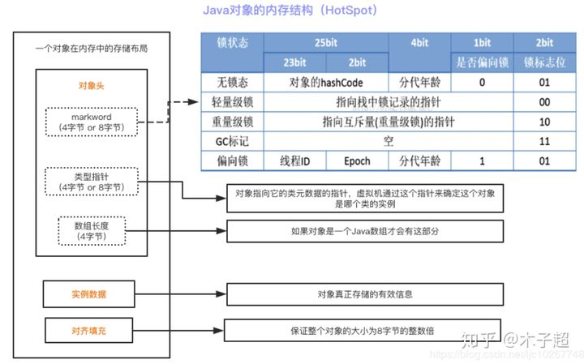
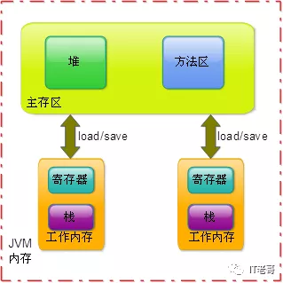
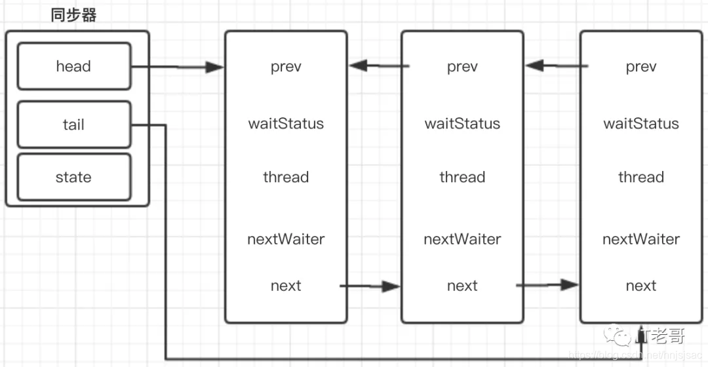
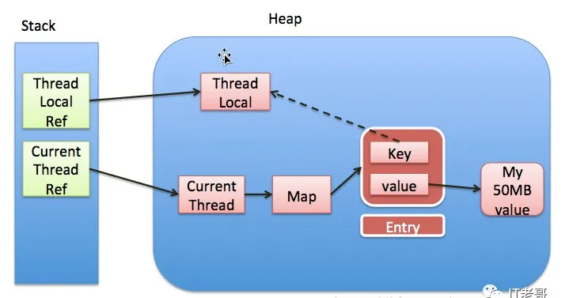
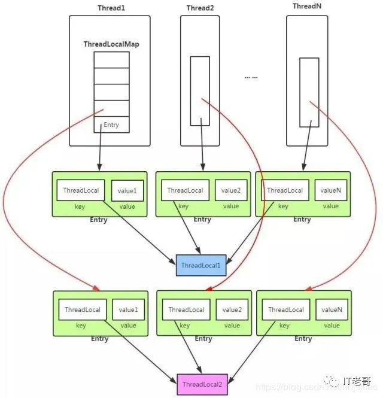
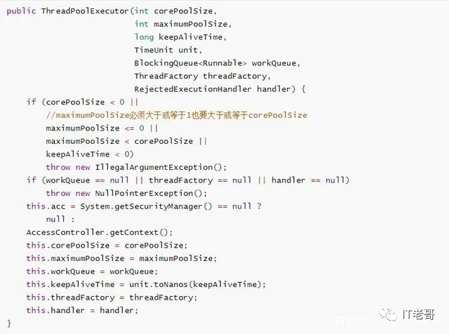

## 参考资料

[不可不说的Java“锁”事 - 美团技术团队](https://tech.meituan.com/2018/11/15/java-lock.html)

[Java精通并发-通过openjdk源码分析ObjectMonitor底层实现](https://www.cnblogs.com/webor2006/p/11442551.html)

[java并发系列-monitor机制实现](https://www.cnblogs.com/qingshan-tang/p/12698705.html)

[jvm：ObjectMonitor源码](https://blog.csdn.net/zwjyyy1203/article/details/106217887)

[白话Java锁--synchronized关键字](https://blog.csdn.net/weixin_44936828/article/details/89889663)

## synchronized

synchronized有如下3种使用方式

- 普通同步方法，锁是当前实例对象

- 静态同步方法，锁是当前类的class对象

- 同步方法块，锁是括号里面的对象

当一个线程访问同步代码块时，需要获得锁才能执行，当退出或者抛出异常的时候要释放锁。那么是怎么实现的呢，我们来看一段代码

```java
public class SynchronizedTest {
    public synchronized void test1(){
    }
    public void test2(){
        synchronized (this){
        }
    }
}
```

我们用javap来分析一下编译后的class文件，看看synchronized如何实现的


从这个截图上可以看出，同步代码块是使用monitorenter和monitorexit指令实现的， monitorenter插入到代码块开始的地方，monitorexit插入到代码块结束的地方，当monitor被持有后，就处于锁定状态，也就是上锁了。

下面我们深入分析一下synchronized实现锁的两个重要的概念：Java对象头和monitor

### Java对象头：

synchronized的锁是存在对象头里的，对象头由两部分数据组成：Mark Word（标记字段）、Klass Pointer（类型指针）

Mark Word存储了对象自身运行时数据，如hashcode、GC分代年龄、锁状态标志、线程持有的锁、偏向锁ID等等。是实现轻量级锁和偏向锁的关键，Klass Pointer是Java对象指向类元数据的指针，jvm通过这个指针确定这个对象是哪个类的实例



### monitor：

每个Java对象从娘胎里出来就带着一把看不见的锁， 叫做内部锁或者monitor锁，我们可以把它理解成一种同步机制，它是线程私有的数据结构。通常所说的对象的内置锁，是对象头Mark Word中的重量级锁指针指向的monitor对象，该对象是在HotSpot底层C++语言编写的(openjdk里面看)，简单看一下代码：

源码地址：[jdk8/hotspot/file/vm/runtime/objectMonitor.hpp](https://github.com/JetBrains/jdk8u_hotspot/blob/master/src/share/vm/runtime/objectMonitor.hpp)

```c++
// ObjectWaiter serves as a "proxy" or surrogate thread.
// TODO-FIXME: Eliminate ObjectWaiter and use the thread-specific
// ParkEvent instead.  Beware, however, that the JVMTI code
// knows about ObjectWaiters, so we'll have to reconcile that code.
// See next_waiter(), first_waiter(), etc.

class ObjectWaiter : public StackObj {
 public:
  enum TStates { TS_UNDEF, TS_READY, TS_RUN, TS_WAIT, TS_ENTER, TS_CXQ } ;
  enum Sorted  { PREPEND, APPEND, SORTED } ;
  ObjectWaiter * volatile _next;
  ObjectWaiter * volatile _prev;
  Thread*       _thread;
  jlong         _notifier_tid;
  ParkEvent *   _event;
  volatile int  _notified ;
  volatile TStates TState ;
  Sorted        _Sorted ;           // List placement disposition
  bool          _active ;           // Contention monitoring is enabled
 public:
  ObjectWaiter(Thread* thread);

  void wait_reenter_begin(ObjectMonitor *mon);
  void wait_reenter_end(ObjectMonitor *mon);
};


class ObjectMonitor {
  // initialize the monitor, exception the semaphore, all other fields
  // are simple integers or pointers
  ObjectMonitor() {
    _header       = NULL;
    _count        = 0;
    _waiters      = 0,
    _recursions   = 0;
    _object       = NULL;
    _owner        = NULL;
    _WaitSet      = NULL;
    _WaitSetLock  = 0 ;
    _Responsible  = NULL ;
    _succ         = NULL ;
    _cxq          = NULL ;
    FreeNext      = NULL ;
    _EntryList    = NULL ;
    _SpinFreq     = 0 ;
    _SpinClock    = 0 ;
    OwnerIsThread = 0 ;
    _previous_owner_tid = 0;
  }

 private:
  friend class ObjectSynchronizer;
  friend class ObjectWaiter;
  friend class VMStructs;

  // WARNING: this must be the very first word of ObjectMonitor
  // This means this class can't use any virtual member functions.

  volatile markOop   _header;       // displaced object header word - mark
  void*     volatile _object;       // backward object pointer - strong root

  double SharingPad [1] ;           // temp to reduce false sharing

  // All the following fields must be machine word aligned
  // The VM assumes write ordering wrt these fields, which can be
  // read from other threads.

 protected:                         // protected for jvmtiRawMonitor
  void *  volatile _owner;          // pointer to owning thread OR BasicLock
  volatile jlong _previous_owner_tid; // thread id of the previous owner of the monitor
  volatile intptr_t  _recursions;   // recursion count, 0 for first entry
 private:
  int OwnerIsThread ;               // _owner is (Thread *) vs SP/BasicLock
  ObjectWaiter * volatile _cxq ;    // LL of recently-arrived threads blocked on entry.
                                    // The list is actually composed of WaitNodes, acting
                                    // as proxies for Threads.
 protected:
  ObjectWaiter * volatile _EntryList ;     // Threads blocked on entry or reentry.
 private:
  Thread * volatile _succ ;          // Heir presumptive thread - used for futile wakeup throttling
  Thread * volatile _Responsible ;
  int _PromptDrain ;                // rqst to drain cxq into EntryList ASAP

  volatile int _Spinner ;           // for exit->spinner handoff optimization
  volatile int _SpinFreq ;          // Spin 1-out-of-N attempts: success rate
  volatile int _SpinClock ;
  volatile int _SpinDuration ;
  volatile intptr_t _SpinState ;    // MCS/CLH list of spinners

  // TODO-FIXME: _count, _waiters and _recursions should be of
  // type int, or int32_t but not intptr_t.  There's no reason
  // to use 64-bit fields for these variables on a 64-bit JVM.

  volatile intptr_t  _count;        // reference count to prevent reclaimation/deflation
                                    // at stop-the-world time.  See deflate_idle_monitors().
                                    // _count is approximately |_WaitSet| + |_EntryList|
 protected:
  volatile intptr_t  _waiters;      // number of waiting threads
 private:
 protected:
  ObjectWaiter * volatile _WaitSet; // LL of threads wait()ing on the monitor
 private:
  volatile int _WaitSetLock;        // protects Wait Queue - simple spinlock

 public:
  int _QMix ;                       // Mixed prepend queue discipline
  ObjectMonitor * FreeNext ;        // Free list linkage
  intptr_t StatA, StatsB ;
};
```


### 锁优化篇： 

JDK1.6引入了大量的优化，如：自旋锁、适应性自旋锁、锁消除、锁粗化、偏向锁、轻量级锁。锁主要存在四中状态，依次是：无锁状态、偏向锁状态、轻量级锁状态、重量级锁状态，他们会随着竞争的激烈而逐渐升级。但是有一点，不可以进行锁降级

### 一、自旋锁：

线程频繁的阻塞和唤醒对CPU来说是一件负担很重的工作，会给系统带来很大的压力。同时很多锁状态只会持续很短一段时间，为了这一段很短的时间频繁地阻塞和唤醒线程是非常不值得的。所以引入自旋锁。  所谓自旋锁，就是让该线程等待一段时间，不会被立即挂起，看持有锁的线程是否会很快释放锁，如果释放了，就可以抢到锁。那怎么等待呢？其实就是执行一段无意义的循环，大家是不是瞬间觉得好low，原来就是执行一段for循环，别急着下结论，我们继续来分析

执行一段无意义的循环。如果持有锁的线程很快就释放了锁，那么自旋的效率就非常好。但是如果自旋很久都没抢到锁，那自旋就是浪费资源，说的难听点就是占着茅坑不拉屎。所以说，自旋等待的时间或者次数必须要有一个限度，如果超过了定义的时间仍然没有获取到锁，则把它挂起。

自旋锁在JDK 1.4.2中引入，默认关闭，但是可以使用-XX:+UseSpinning开启，在JDK1.6中默认开启。同时自旋的默认次数为10次，可以通过参数-XX:PreBlockSpin来调整；但是无论你怎么调整这些参数，都无法满足不可预知的情况。于是JDK1.6引入自适应的自旋锁，让虚拟机会变得越来越聪明。

### 二、适应自旋锁

JDK 1.6引入了更加聪明的自旋锁，叫做自适应自旋锁。他的自旋次数是会变的，我用大白话来讲一下，就是线程如果上次自旋成功了，那么这次自旋的次数会更加多，因为虚拟机认为既然上次成功了，那么这次自旋也很有可能会再次成功。反之，如果某个锁很少有自旋成功，那么以后的自旋的次数会减少甚至省略掉自旋过程，以免浪费处理器资源。大家现在觉得没这么low了吧

### 三、锁消除

锁消除用大白话来讲，就是在一段程序里你用了锁，但是jvm检测到这段程序里不存在共享数据竞争问题，也就是变量没有逃逸出方法外，这个时候jvm就会把这个锁消除掉

我们程序员写代码的时候自然是知道哪里需要上锁，哪里不需要，但是有时候我们虽然没有显示使用锁，但是我们不小心使了一些线程安全的API时，如StringBuffer、Vector、HashTable等，这个时候会隐形的加锁。比如下段代码

```java
public void sbTest(){
    StringBuffer sb= new StringBuffer();
    for(int i = 0 ; i < 10 ; i++){
        sb.append(i);
    }
    System.out.println(sb.toString());
}
```

上面这段代码，JVM可以明显检测到变量sb没有逃逸出方法sbTest()之外，所以JVM可以大胆地将sbTest内部的加锁操作消除。

###  四、锁粗化

众所周知在使用锁的时候，要让锁的作用范围尽量的小，这样是为了在锁内执行代码尽可能少，缩短持有锁的时间，其他等待锁的线程能尽快拿到锁。在大多数的情况下这样做是正确的。但是连续加锁解锁操作，可能会导致不必要的性能损耗，比如下面这个for循环：

```java
锁粗化前：
for (...) {
  synchronized (obj) {
    // 一些操作
  }
}
锁粗化后：
synchronized (this) {
 for (...) {
   // 一些操作
 }
}
```

大家应该能看出锁粗化大概是什么意思了。就是将多个连续的加锁、解锁操作连接在一起，扩展成一个范围更大的锁。即加锁解锁操作会移到for循环之外。

### 五、偏向锁

当我们创建一个对象时，该对象的部分Markword关键数据如下。

| bit fields | 是否偏向锁 | 锁标志位 |
| ---------- | ---------- | -------- |
| hash       | 0          | 01       |

可以看出，偏向锁的标志位是“01”，状态是“0”，表示该对象还没有被加上偏向锁。（“1”是表示被加上偏向锁）。该对象被创建出来的那一刻，就有了偏向锁的标志位，这也说明了所有对象都是可偏向的，但所有对象的状态都为“0”，也同时说明所有被创建的对象的偏向锁并没有生效。

不过，当线程执行到临界区（critical section）时，此时会利用CAS(Compare and Swap)操作，将线程ID插入到Markword中，同时修改偏向锁的标志位。

所谓临界区，就是只允许一个线程进去执行操作的区域，即同步代码块。CAS是一个原子性操作

此时的Mark word的结构信息如下：

| bit fields | 是否偏向锁 | 锁标志位 |
| ---------- | ---------- | -------- |
| threadId   | 1          | 01       |

此时偏向锁的状态为“1”，说明对象的偏向锁生效了，同时也可以看到，哪个线程获得了该对象的锁。

偏向锁是jdk1.6引入的一项锁优化，其中的“偏”是偏心的偏。它的意思就是说，这个锁会偏向于第一个获得它的线程，在接下来的执行过程中，假如该锁没有被其他线程所获取，没有其他线程来竞争该锁，那么持有偏向锁的线程将永远不需要进行同步操作。也就是说:在此线程之后的执行过程中，如果再次进入或者退出同一段同步块代码，并不再需要去进行加锁或者解锁操作，而是会做以下的步骤：

- Load-and-test，也就是简单判断一下当前线程id是否与Markword当中的线程id是否一致.

- 如果一致，则说明此线程已经成功获得了锁，继续执行下面的代码.

- 如果不一致，则要检查一下对象是否还是可偏向，即“是否偏向锁”标志位的值。

- 如果还未偏向，则利用CAS操作来竞争锁，也即是第一次获取锁时的操作。

### 偏向锁释放锁

偏向锁的释放采用了一种只有竞争才会释放锁的机制，线程是不会主动去释放偏向锁，需要等待其他线程来竞争。偏向锁的撤销需要等待全局安全点（这个时间点是上没有正在执行的代码）。其步骤如下：

暂停拥有偏向锁的线程，判断锁对象石是否还处于被锁定状态；

撤销偏向锁，恢复到无锁状态或者轻量级锁的状态； 

### 六、轻量级锁 

自旋锁的目标是降低线程切换的成本。如果锁竞争激烈，我们不得不依赖于重量级锁，让竞争失败的线程阻塞；如果完全没有实际的锁竞争，那么申请重量级锁都是浪费的。轻量级锁的目标是，减少无实际竞争情况下，使用重量级锁产生的性能消耗，包括系统调用引起的内核态与用户态切换、线程阻塞造成的线程切换等。

顾名思义，轻量级锁是相对于重量级锁而言的。使用轻量级锁时，不需要申请互斥量，仅仅将Mark Word中的部分字节CAS更新指向线程栈中的Lock Record（Lock Record：JVM检测到当前对象是无锁状态，则会在当前线程的栈帧中创建一个名为LOCKRECOD表空间用于copy Mark word 中的数据），如果更新成功，则轻量级锁获取成功，记录锁状态为轻量级锁；否则，说明已经有线程获得了轻量级锁，目前发生了锁竞争（不适合继续使用轻量级锁），接下来膨胀为重量级锁。

当然，由于轻量级锁天然瞄准不存在锁竞争的场景，如果存在锁竞争但不激烈，仍然可以用自旋锁优化，自旋失败后再膨胀为重量级锁。

缺点：同自旋锁相似：如果锁竞争激烈，那么轻量级将很快膨胀为重量级锁，那么维持轻量级锁的过程就成了浪费。

### 七、重量级锁

轻量级锁膨胀之后，就升级为重量级锁了。重量级锁是依赖对象内部的monitor锁来实现的，而monitor又依赖操作系统的MutexLock(互斥锁)来实现的，所以重量级锁也被成为互斥锁。

当轻量级所经过锁撤销等步骤升级为重量级锁之后，它的Markword部分数据大体如下

| bit fields      | 锁标志位 |
| --------------- | -------- |
| 指向Mutex的指针 | 10       |

为什么说重量级锁开销大呢

主要是，当系统检查到锁是重量级锁之后，会把等待想要获得锁的线程进行阻塞，被阻塞的线程不会消耗cup。但是阻塞或者唤醒一个线程时，都需要操作系统来帮忙，这就需要从用户态转换到内核态，而转换状态是需要消耗很多时间的，有可能比用户执行代码的时间还要长。

互斥锁(重量级锁)也称为阻塞同步、悲观锁

### 八、总结 

偏向所锁，轻量级锁都是乐观锁，重量级锁是悲观锁。

一个对象刚开始实例化的时候，没有任何线程来访问它的时候。它是可偏向的，意味着，它现在认为只可能有一个线程来访问它，所以当第一个
线程来访问它的时候，它会偏向这个线程，此时，对象持有偏向锁。偏向第一个线程，这个线程在修改对象头成为偏向锁的时候使用CAS操作，并将
对象头中的ThreadID改成自己的ID，之后再次访问这个对象时，只需要对比ID，不需要再使用CAS在进行操作。

一旦有第二个线程访问这个对象，因为偏向锁不会主动释放，所以第二个线程可以看到对象时偏向状态，这时表明在这个对象上已经存在竞争了，检查原来持有该对象锁的线程是否依然存活，如果挂了，则可以将对象变为无锁状态，然后重新偏向新的线程，如果原来的线程依然存活，则马上执行那个线程的操作栈，检查该对象的使用情况，如果仍然需要持有偏向锁，则偏向锁升级为轻量级锁，（偏向锁就是这个时候升级为轻量级锁的）。如果不存在使用了，则可以将对象回复成无锁状态，然后重新偏向。

轻量级锁认为竞争存在，但是竞争的程度很轻，一般两个线程对于同一个锁的操作都会错开，或者说稍微等待一下（自旋），另一个线程就会释放锁。但是当自旋超过一定的次数，或者一个线程在持有锁，一个在自旋，又有第三个来访时，轻量级锁膨胀为重量级锁，重量级锁使除了拥有锁的线程以外的线程都阻塞，防止CPU空转。

## synchronized 和 ReentrantLock 的区别

synchronized 是和 if、else、for、while 一样的关键字，ReentrantLock 是类，这是二者的本质区别。

既然 ReentrantLock 是类，那么它就提供了比 synchronized 更多更灵活的特性，可以被继承、可以有方法、可以有各种各样的类变量，ReentrantLock 比 synchronized 的扩展性体现在几点上：

（1）ReentrantLock 可以对获取锁的等待时间进行设置，这样就避免了死锁

（2）ReentrantLock 可以获取各种锁的信息

（3）ReentrantLock 可以灵活地实现多路通知

另外，二者的锁机制其实也是不一样的:ReentrantLock 底层调用的是 Unsafe 的 park 方法加锁，synchronized 操作的应该是对象头中 mark word。

## 5.简述synchronized和java.util.concurrent.locks.Lock的异同？

主要相同点：Lock能完成synchronized所实现的所有功能。

主要不同点：Lock有比synchronized更精确的线程语义和更好的性能。synchronized会自动释放锁，而Lock一定要求程序员手工释放，并且必须在finally从句中释放。Lock还有更强大的功能，例如，它的tryLock方法可以非阻塞方式去拿锁。

## voliate

### voliate三特性

- 保证可见性；

- 不保证复合操作的原子性；

- 禁止指令重排。

### 第一：可见性

先给大家介绍一下JMM的内存模型



我们定义的共享变量就是存在主内存中，每个线程内的变量是在工作内存中操作的，当一个线程A修改了主内存里的一个共享变量，这个时候线程B是不知道这个值已经修改了，因为线程之间的工作内存是互相不可见的

那么这个时候voliate的作用就是让A、B线程可以互相感知到对方对共享变量的修改，当线程A更新了共享数据，会将数据刷回到主内存中，而线程B每次去读共享数据时去主内存中读取，这样就保证了线程之间的可见性

这种保证内存可见性的机制是：内存屏障(memory barrier)

内存屏障分为两种：Load Barrier 和 Store Barrier即读屏障和写屏障。

内存屏障有两个作用：

- 1.阻止屏障两侧的指令重排序；

- 2.强制把写缓冲区/高速缓存中的脏数据等写回主内存，让缓存中相应的数据失效。

### 第二：不保证复合操作的原子性

什么叫原子性？

所谓原子性，就是说一个操作不可被分割或加塞，要么全部执行，要么全不执行。

```java
i = 0;            ---1
j = i ;           ---2
i++;              ---3
i = j + 1;        ---4
```

上面四个操作，有哪个几个是原子操作，那几个不是？如果不是很理解，可能会认为都是原子性操作，其实只有1才是原子操作，其余均不是。

- 1---在Java中，对基本数据类型的变量和赋值操作都是原子性操作；

- 2---包含了两个操作：读取i，将i值赋值给j

- 3---包含了三个操作：读取i值、i + 1 、将+1结果赋值给i；

- 4---同三一样

Java只保证了基本数据类型的变量和赋值操作才是原子性的（注：在32位的JDK环境下，对64位数据的读取不是原子性操作*，如long、double）

### 第三：有序性（禁止jvm对代码进行重排序）

有序性：即程序执行的顺序按照代码的先后顺序执行。

一般来说，处理器为了提高程序运行效率，可能会对输入代码进行优化，它不保证程序中各个语句的执行先后顺序同代码中的顺序一致，但是它会保证程序最终执行结果和代码顺序执行的结果是一致的，但是不能随意重排序，不是你想怎么排序就怎么排序，它需要满足以下两个条件：

- 在单线程环境下不能改变程序运行的结果；

- 存在数据依赖关系的不允许重排序

## 说一个voliate的用法(这里涉及到了单例知识)

什么是DCL呢，其实就是double check lock的简写

DCL很多人都在单利中用过（`单例还有很多其他写法，具体看涉及模式复习题`），如下这种写法：

```java
public class Singleton {
    
   private static Singleton singleton;
    
   private Singleton(){}

   public static Singleton getInstance(){
       if(singleton == null){                              // 1
           synchronized (Singleton.class){                 // 2
               if(singleton == null){                      // 3
                   singleton = new Singleton();            // 4
               }
           }
       }
       return singleton;
   }
}
```

表面上这个代码看起来很完美，但是其实有问题

先说一下他完美的一面吧：

1、如果检查第一个singleton不为null,则不需要执行下面的加锁动作，极大提高了程序的性能；

2、如果第一个singleton为null,即使有多个线程同一时间判断，但是由于synchronized的存在，只会有一个线程能够创建对象；

3、当第一个获取锁的线程创建完成后singleton对象后，其他的在第二次判断singleton一定不会为null，则直接返回已经创建好的singleton对象；

**但是到底是哪里有错误呢**

首先创建一个对象分为三个步骤：

1、分配内存空间

2、初始化对象

3、讲内存空间的地址赋值给对象的引用

但是上面我讲了，jvm可能会对代码进行重排序，所以2和3可能会颠倒，

就会变成 1 —> 3 —> 2的过程，

那么当第一个线程A抢到锁执行初始化对象时，发生了代码重排序，3和2颠倒了，这个时候对象对象还没初始化，但是对象的引用已经不为空了，

所以当第二个线程B遇到第一个if判断时不为空，这个时候就会直接返回对象，但此时A线程还没执行完步骤2（初始化对象）。就会造成线程B其实是拿到一个空的对象。造成空指针问题。

### 解决方案：

既然上面的问题是由于jvm对代码重排序造成的，那我们禁止重排序不就好了吗？

voliate刚好可以禁止重排序，这样就不会存在2和3颠倒的问题了，所以改造后的代码如下：

```java
public class Singleton {
   //通过volatile关键字来确保安全
   private volatile static Singleton singleton;

   private Singleton(){}

   public static Singleton getInstance(){
       if(singleton == null){
           synchronized (Singleton.class){
               if(singleton == null){
                   singleton = new Singleton();
               }
           }
       }
       return singleton;
   }
}
```

## 说说 synchronized 关键字和 volatile 关键字的区别？

volatile 是变量修饰符；synchronized 是修饰类、方法、代码段。

volatile 仅能实现变量的修改可见性，不能保证原子性；而 synchronized 则可以保证变量的修改可见性和原子性。

volatile 不会造成线程的阻塞；synchronized 可能会造成线程的阻塞。

## AQS

全称：AbstractQueuedSynchronizer，是JDK提供的一个同步框架，内部维护着FIFO双向队列，即CLH同步队列。

AQS依赖它来完成同步状态的管理（voliate修饰的state，用于标志是否持有锁）。

如果获取同步状态state失败时，会将当前线程及等待信息等构建成一个Node，将Node放到FIFO队列里，同时阻塞当前线程，当线程将同步状态state释放时，会把FIFO队列中的首节的唤醒，使其获取同步状态state。

很多JUC包下的锁都是基于AQS实现的



### 独占式同步状态过程

在AQS中维护着一个上面的FIFO的同步队列，当线程获取同步状态失败后，则会加入到这个CLH同步队列的对尾并一直保持着自旋。

在CLH同步队列中的线程在自旋时会判断其前驱节点是否为首节点，如果为首节点则不断尝试获取同步状态sate，获取成功则退出CLH同步队列。当线程执行完逻辑后，会释放同步状态sate，释放后会唤醒其后继节点。

tryAcquire方法尝试去获取锁，获取成功返回true，否则返回false。该方法由继承AQS的子类自己实现。采用了`模板方法设计模式`。

如：ReentrantLock的Sync内部类，Sync的子类：NonfairSync和

### AQS定义两种资源共享方式

1、独占 ( Exclusive )：只有一个线程能执行，其原理是看哪个线程先把state +1 ，谁就抢到了锁，如 ReentrantLock。又可分为公平锁和非公平锁：

- 公平锁：按照线程在队列中的排队顺序，先到者先拿到锁

- 非公平锁：当线程要获取锁时，无视队列顺序直接去抢锁，谁抢到就是谁的，所以非公平锁效率较高

2、共享 ( Share )：多个线程可同时执行，其原理就是多个线程去操作state字段，来一个线程就 +1，来一个线程就 +1

线程运行结束后state -1 ，一直减到0，就释放锁了。如Semaphore、CountDownLatch。

## ThreadLocal

很多小伙伴认为ThreadLocal是多线程同步机制的一种，其实不然，他是为多线程环境下为变量线程安全提供的一种解决思路，他是解决多线程下成员变量的安全问题，不是解决多线程下共享变量的安全问题。

线程同步机制是多个线程共享一个变量，而ThreadLocal是每个线程创建一个自己的单独变量副本，所以每个线程都可以独立的改变自己的变量副本。并且不会影响其他线程的变量副本。

### ThreadLocalMap

ThreadLocal内部有一个非常重要的内部类：ThreadLocalMap，该类才是真正实现线程隔离机制的关键，ThreadLocalMap内部结构类似于map，由键值对key和value组成一个Entry，key为ThreadLocal本身，value是对应的线程变量副本

`注意：`

1、ThreadLocal本身不存储值，他只是提供一个查找到值的key给你。

2、ThreadLocal包含在Thread中，不是Thread包含在ThreadLocal中。

**ThreadLocalMap 和HashMap的功能类似，但是实现上却有很大的不同：**

- HashMap 的数据结构是数组+链表

- ThreadLocalMap的数据结构仅仅是数组

- HashMap 是通过链地址法解决hash 冲突的问题

- ThreadLocalMap 是通过开放地址法来解决hash 冲突的问题

- HashMap 里面的Entry 内部类的引用都是强引用

- ThreadLocalMap里面的Entry 内部类中的key 是弱引用，value 是强引用

### **链地址法：**

这种方法的基本思想是将所有哈希地址为i的元素构成一个称为同义词链的单链表，并将单链表的头指针存在哈希表的第i个单元中，因而查找、插入和删除主要在同义词链中进行。

### **开放地址法：**

这种方法的基本思想是一旦发生了冲突，就去寻找下一个空的散列地址(这非常重要，源码都是根据这个特性，必须理解这里才能往下走)，只要散列表足够大，空的散列地址总能找到，并将记录存入。

### **链地址法和开放地址法的优缺点：**

**开放地址法：**

- 容易产生堆积问题，不适于大规模的数据存储。

- 散列函数的设计对冲突会有很大的影响，插入时可能会出现多次冲突的现象。

- 删除的元素是多个冲突元素中的一个，需要对后面的元素作处理，实现较复杂。

**链地址法：**

- 处理冲突简单，且无堆积现象，平均查找长度短。

- 链表中的结点是动态申请的，适合构造表不能确定长度的情况。

- 删除结点的操作易于实现。只要简单地删去链表上相应的结点即可。

- 指针需要额外的空间，故当结点规模较小时，开放定址法较为节省空间。

### ThreadLocalMap 采用开放地址法原因

- ThreadLocal 中看到一个属性 HASH_INCREMENT = 0x61c88647 ，0x61c88647 是一个神奇的数字，让哈希码能均匀的分布在2的N次方的数组里, 即 Entry[] table，关于这个神奇的数字google 有很多解析，这里就不重复说了

- ThreadLocal 往往存放的数据量不会特别大（而且key 是弱引用又会被垃圾回收，及时让数据量更小），这个时候开放地址法简单的结构会显得更省空间，同时数组的查询效率也是非常高，加上第一点的保障，冲突概率也低

###  Thread、ThreadLocal、ThreadLocalMap之间的关系






从上面的结构图，我们已经窥见ThreadLocal的核心机制：

每个Thread线程内部都有一个Map。Map里面存储线程本地对象（key）和线程的变量副本（value）Thread内部的Map是由ThreadLocal维护的，由ThreadLocal负责向map获取和设置线程的变量值。所以对于不同的线程，每次获取副本值时，别的线程并不能获取到当前线程的副本值，形成了副本的隔离，彼此之间互不干扰。

### 内存泄露问题：

```java
// 部分源码
static class Entry extends WeakReference<ThreadLocal<?>> {
    /** The value associated with this ThreadLocal. */
    Object value;
 
    Entry(ThreadLocal<?> k, Object v) {
        super(k);
        value = v;
    }
}
```

从上面源码可以看出ThreadLocalMap中使用的 key 为ThreadLocal的弱引用，而 value 是强引用。

所以，如果ThreadLocal没有被外部强引用的情况下，在垃圾回收的时候会 key 会被清理掉，而 value 不会被清理掉。

这样一来，ThreadLocalMap中就会出现key为null的Entry。假如我们不做任何措施的话，value 永远无法被GC 回收，这个时候就可能会产生内存泄露。

我们上面介绍的get、set、remove等方法中，都会对key为null的Entry进行清除（expungeStaleEntry方法，将Entry的value清空，等下一次垃圾回收时，这些Entry将会被彻底回收）。

### 如何避免内存泄漏？

为了避免这种情况，我们可以在使用完ThreadLocal后，手动调用remove方法，以避免出现内存泄漏。

## CAS

### 什么是CAS ?

CAS的全称是Compare-And-Swap，它是一条CPU并发原语。

正如它的名字一样，比较并交换，它是一种很重要的同步思想。如果主内存的值跟期望值一样，那么就进行修改，否则一直重试，直到一致为止。

而原语的执行必须是连续的，在执行过程中不允许被中断，也就是说CAS是一条CPU的原子指令，不会造成所谓的数据不一致性问题。

它的功能是判断内存某个位置的值是否为预期值，如果是则更改为新的值，这个过程是原子的。

### 使用案例

```java
public class CasDemo {
  public static void main(String[] args) {
    //初始值
    AtomicInteger integer = new AtomicInteger(5);
    //比较并替换
    boolean flag = integer.compareAndSet(5, 10);
    boolean flag2 = integer.compareAndSet(5, 15);

    System.out.println("是否自选并替换 \t"+flag +"\t更改之后的值为："+integer.get());
    System.out.println("是否自选并替换 \t"+flag2 +"\t更改之后的值为："+integer.get());
  }
}
```

### CAS原理

在翻了源码之后，大致可以总结出两个关键点：

- 自旋；
- unsafe类。

当点开compareAndSet方法后:

```java
// AtomicInteger类内部
public final boolean compareAndSet(int expect, int update) {
  return unsafe.compareAndSwapInt(this, valueOffset, expect, update);
}
```

通过这个方法，我们可以找出AtomicInteger内部维护了volatile int value和private static final Unsafe unsafe两个比较重要的参数。（注意value是用volatile修饰）

还有变量private static final long valueOffset，表示该变量在内存中的偏移地址，因为Unsafe就是根据内存偏移地址获取数据的。

变量value用volatile修饰，保证了多线程之间的内存可见性。

```java
// AtomicInteger类内部
private static final Unsafe unsafe = Unsafe.getUnsafe();
private static final long valueOffset;

static {
  try {
      valueOffset = unsafe.objectFieldOffset
          (AtomicInteger.class.getDeclaredField("value"));
  } catch (Exception ex) { throw new Error(ex); }
}

private volatile int value;
```

然后我们通过compareAndSwapInt找到了unsafe类核心方法：

```
//unsafe内部类
public final int getAndAddInt(Object var1, long var2, int var4) {
  int var5;
  do {
      var5 = this.getIntVolatile(var1, var2);
  } while(!this.compareAndSwapInt(var1, var2, var5, var5 + var4));

  return var5;
}
```

AtomicInteger.compareAndSwapInt()调用了Unsafe.compareAndSwapInt()方法。Unsafe类的大部分方法都是native的，用来像C语言一样从底层操作内存。

这个方法的var1和var2，就是根据对象和偏移量得到在主内存的快照值var5。然后compareAndSwapInt方法通过var1和var2得到当前主内存的实际值。如果这个实际值跟快照值相等，那么就更新主内存的值为var5+var4。如果不等，那么就一直循环，一直获取快照，一直对比，直到实际值和快照值相等为止。

比如有A、B两个线程

一开始都从主内存中拷贝了原值为3；

1、A线程执行到var5=this.getIntVolatile，即var5=3。此时A线程挂起；

2、B修改原值为4，B线程执行完毕，由于加了volatile，所以这个修改是立即可见的；

3、A线程被唤醒，执行this.compareAndSwapInt()方法，发现这个时候主内存的值不等于快照值3，所以继续循环，重新从主内存获取。

4、线程A重新获取value值，因为变量value被volatile修饰，所以其他线程对它的修改，线程A总是能够看到，线程A继续执行compareAndSwapInt进行比较替换，直至成功。

### ABA问题

所谓ABA问题，其实用最通俗易懂的话语来总结就是狸猫换太子

就是比较并交换的循环，存在一个时间差，而这个时间差可能带来意想不到的问题。

比如有两个线程A、B：

1、一开始都从主内存中拷贝了原值为3；

2、A线程执行到var5=this.getIntVolatile，即var5=3。此时A线程挂起；

3、B修改原值为4，B线程执行完毕;

4、然后B觉得修改错了，然后再重新把值修改为3；

5、A线程被唤醒，执行this.compareAndSwapInt()方法，发现这个时候主内存的值等于快照值3，（但是却不知道B曾经修改过），修改成功。

尽管线程A CAS操作成功，但不代表就没有问题。有的需求，比如CAS，只注重头和尾，只要首尾一致就接受。但是有的需求，还看重过程，中间不能发生任何修改。这就引出了AtomicReference原子引用。

### AtomicReference原子引用

AtomicInteger对整数进行原子操作，如果是一个POJO呢？可以用AtomicReference来包装这个POJO，使其操作原子化。

```java
User user1 = new User("Jack",25);
User user2 = new User("Lucy",21);
AtomicReference<User> atomicReference = new AtomicReference<>();
atomicReference.set(user1);
System.out.println(atomicReference.compareAndSet(user1,user2)); // true
System.out.println(atomicReference.compareAndSet(user1,user2)); //false
```

本质是比较的是两个对象的地址是否相等。

### AtomicStampedReference和ABA问题的解决

使用AtomicStampedReference类可以解决ABA问题。这个类维护了一个“版本号”Stamp，其实有点类似乐观锁的意思。

在进行CAS操作的时候，不仅要比较当前值，还要比较版本号。只有两者都相等，才执行更新操作。

```java
AtomicStampedReference.compareAndSet(expectedReference,newReference,oldStamp,newStamp);
```

### CAS总结

任何技术都不是完美的，当然，CAS也有他的缺点：

CAS实际上是一种自旋锁，

- 一直循环，开销比较大。

- 只能保证一个变量的原子操作，多个变量依然要加锁。

- 引出了ABA问题（AtomicStampedReference可解决）。

而他的使用场景适合在一些并发量不高、线程竞争较少的情况，加锁太重。但是一旦线程冲突严重的情况下，循环时间太长，为给CPU带来很大的开销。

## 线程池

### 如何创建线程池

JDK中提供了创建线程池的类，大家首先想到的一定是Executors类，没错，可以通过Executors类来创建线程池，`但是不推荐`（原因后面会分析）。

Executors类只是个静态工厂，提供创建线程池的几个静态方法（内部屏蔽了线程池参数配置细节），而真正的线程池类是ThreadPoolExecutor。ThreadPoolExecutor构造方法如下：



### 参数解释

- `corePoolSize`：核心线程数。如果等于0，则任务执行完后，没有任务请求进入时销毁线程池中的线程。如果大于0，即使本地任务执行完毕，核心线程也不会被销毁。设置过大会浪费系统资源，设置过小导致线程频繁创建。

- `maximumPoolSize`：最大线程数。必须大于等于1，且大于等于corePoolSize。如果与corePoolSize相等，则线程池大小固定。如果大于corePoolSize，则最多创建maximumPoolSize个线程执行任务

- `keepAliveTime`：线程空闲时间。线程池中线程空闲时间达到keepAliveTime值时，线程会被销毁，只到剩下corePoolSize个线程为止。默认情况下，线程池的最大线程数大于corePoolSize时，keepAliveTime才会起作用。如果allowCoreThreadTimeOut被设置为true，即使线程池的最大线程数等于corePoolSize，keepAliveTime也会起作用（回收超时的核心线程）。

- `unit`：TimeUnit表示时间单位。

- `workQueue`：缓存队列。当请求线程数大于corePoolSize时，线程进入BlockingQueue阻塞队列。

- `threadFactory`：线程工厂。用来生产一组相同任务的线程。主要用于设置生成的线程名词前缀、是否为守护线程以及优先级等。设置有意义的名称前缀有利于在进行虚拟机分析时，知道线程是由哪个线程工厂创建的。

- `handler`：执行拒绝策略对象。当达到任务缓存上限时（即超过workQueue参数能存储的任务数），执行拒接策略，可以看作简单的限流保护。


### 线程池相关类结构


ExecutorService接口继承了Executor接口，定义了管理线程任务的方法。

ExecutorService的抽象类AbstractExecutorService提供了submit、invokeAll()等部分方法实现，但是核心方法Executor.execute()并没有实现。

因为所有任务都在这个方法里执行，不同的线程池实现策略会有不同，所以交由具体的线程池来实现。

### 线程池种类

- newFixedThreadPool：创建固定线程数的线程池。核心线程数等于最大线程数，不存在空闲线程，keepAliveTime为0。

  

- newSingleThreadExecutor：创建单线程的线程池，核心线程数和最大线程数都为1，相当于串行执行。

  

- newCachedThreadPool：核心线程数为0，最大线程数为Integer.MAX_VALUE，是一个高度可伸缩的线程池。存在OOM风险。keepAliveTime为60，工作线程处于空闲状态超过keepAliveTime会回收线程。

  

- newWorkStealingPool：JDK8引入，创建持有足够线程的线程池支持给定的并行度，并通过使用多个队列减少竞争。

  

### 禁止直接使用Executors创建线程池原因：

Executors.newCachedThreadPool和Executors.newScheduledThreadPool两个方法最大线程数为Integer.MAX_VALUE，如果达到上限，没有任务服务器可以继续工作，肯定会抛出OOM异常。

Executors.newSingleThreadExecutor和Executors.newFixedThreadPool两个方法的workQueue参数为new LinkedBlockingQueue<Runnable>()，容量为Integer.MAX_VALUE，如果瞬间请求非常大，会有OOM风险。


以上5个核心方法除Executors.newWorkStealingPool方法之外，其他方法都有OOM风险。

### 如果线程池满了怎么办

**会执行线程拒绝策略**

**ThreadPoolExecutor提供了四个公开的内部静态类：**

- AbortPolicy：默认，丢弃任务并抛出RejectedExecutionException异常。

- DiscardPolicy：丢弃任务，但是不抛出异常（不推荐）。
- DiscardOldestPolicy：抛弃队列中等待最久的任务，然后把当前任务加入队列中。
- CallerRunsPolicy：调用任务的run()方法绕过线程池直接执行。

**友好的拒绝策略：**

- 保存到数据库进行削峰填谷。在空闲时再提出来执行。
- 转向某个提示页面
- 打印日志

**如何自定义拒绝策略：**


### 为什么要用线程池？ 

池化技术相比大家已经屡见不鲜了，线程池、数据库连接池、Http 连接池等等都是对这个思想的应用。池化技术的思想主要是为了减少每次获取资源的消耗，提高对资源的利用率。

线程池提供了一种限制和管理资源（包括执行一个任务）。 每个线程池还维护一些基本统计信息，例如已完成任务的数量。

这里借用《Java 并发编程的艺术》提到的来说一下使用线程池的好处：

- 降低资源消耗。通过重复利用已创建的线程降低线程创建和销毁造成的消耗。

- 提高响应速度。当任务到达时，任务可以不需要的等到线程创建就能立即执行。

- 提高线程的可管理性。线程是稀缺资源，如果无限制的创建，不仅会消耗系统资源，还会降低系统的稳定性，使用线程池可以进行统一的分配，调优和监控。

## Java 多线程有几种实现方式？

- 继承Thread类

- 实现Runnable接口

- 实现Callable接口通过FutureTask包装器来创建Thread线程

- 通过线程池创建线程，使用线程池接口ExecutorService结合Callable、Future实现有返回结果的多线程。

## 实现Runnable接口和Callable接口的区别？

如果想让线程池执行任务的话需要实现的Runnable接口或Callable接口。 

Runnable接口或Callable接口实现类都可以被ThreadPoolExecutor或ScheduledThreadPoolExecutor执行。

两者的区别在于 Runnable 接口不会返回结果。

但是 Callable 接口可以返回结果。

## 守护线程是什么？

守护线程是运行在后台的一种特殊进程。它独立于控制终端并且周期性地执行某种任务或等待处理某些发生的事件。在 Java 中垃圾回收线程就是特殊的守护线程。

## sleep() 和 wait() 有什么区别？

- 类的不同：sleep() 是Thread类的静态方法，wait() 是Object的方法，Object又是所有类的父类，所以所有类都有wait() 方法。
- 释放锁：sleep() 不释放锁；wait() 释放锁 (不释放锁的话, 其他线程就无法唤醒该线程了)。
- 用法不同：
  - sleep() 时间到会自动恢复；wait() 可以使用 notify()/notifyAll()直接唤醒。
  - sleep() 方法不需要与synchronized一起使用，而wait()方法需要与synchronized一起使用（wait/notify等方法, 必须要使用对象锁来调用）

## 线程的 run() 和 start() 有什么区别？

start() 方法用于启动线程，run() 方法用于执行线程的运行时代码。run() 可以重复调用，而 start() 只能调用一次。

## notify()和 notifyAll()有什么区别？

notifyAll()会唤醒所有的线程，notify()之后唤醒一个线程。

notifyAll() 调用后，会将全部线程由等待池移到锁池，然后参与锁的竞争，竞争成功则继续执行，如果不成功则留在锁池等待锁被释放后再次参与竞争。

而 notify()只会唤醒一个线程，具体唤醒哪一个线程由虚拟机控制。

## 产生死锁的条件

1.互斥条件：一个资源每次只能被一个进程使用。

2.请求与保持条件：一个进程因请求资源而阻塞时，对已获得的资源保持不放。

3.不剥夺条件：进程已获得的资源，在末使用完之前，不能强行剥夺。

4.循环等待条件：若干进程之间形成一种头尾相接的循环等待资源关系。

## 怎么防止死锁？

- 尽量使用 tryLock(long timeout, TimeUnit unit)的方法(ReentrantLock、ReentrantReadWriteLock)，设置超时时间，超时可以退出防止死锁。

- 尽量使用 Java. util. concurrent 并发类代替自己手写锁。

- 尽量降低锁的使用粒度，

- 尽量不要几个功能用同一把锁。

- 尽量减少同步的代码块。

## 说说进程，线程，协程之间的区别

简而言之，**进程是程序运行和资源分配的基本单位**，一个程序至少有一个进程，一个进程至少有一个线程。进程在执行过程中拥有独立的内存单元，而多个线程共享内存资源，减少切换次数，从而效率更高。**线程是进程的一个实体，是 cpu 调度和分派的基本单位**，是比程序更小的能独立运行的基本单位。同一进程中的多个线程之间可以并发执行。

## 什么是多线程上下文切换

多线程的上下文切换是指 CPU 控制权由一个已经正在运行的线程切换到另外一个就绪并等待获取 CPU 执行权的线程的过程。

## 怎么检测一个线程是否持有对象监视器


Thread 类提供了一个 holdsLock(Object obj)方法，当且仅当对象 obj 的监视器被某条线程持有的时候才会返回 true，注意这是一个 static 方法，这意味着”某条线程”指的是当前线程。

## 怎么唤醒一个阻塞的线程

如果线程是因为调用了 wait()、sleep()或者 join()方法而导致的阻塞，可以中断线程，并且通过抛出 InterruptedException 来唤醒它；

如果线程遇到了 IO 阻塞，无能为力，因为 IO 是操作系统实现的，Java 代码并没有办法直接接触到操作系统。

## 一个线程如果出现了运行时异常怎么办?

如果这个异常没有被捕获的话，这个线程就停止执行了。另外重要的一点是：如果这个线程

持有某个某个对象的监视器，那么这个对象监视器会被立即释放。

## stop()和suspend()方法为何不推荐使用？

反对使用stop()，是因为它不安全。它会解除由线程获取的所有锁定，而且如果对象处于一种不连贯状态，那么其他线程能在那种状态下检查和修改它们。结果很难检查出真正的问题所在。

suspend()方法容易发生死锁。调用suspend()的时候，目标线程会停下来，但却仍然持有在这之前获得的锁定。此时，其他任何线程都不能访问锁定的资源，除非被"挂起"的线程恢复运行。对任何线程来说，如果它们想恢复目标线程，同时又试图使用任何一个锁定的资源，就会造成死锁。所以不应该使用suspend()，而应在自己的Thread类中置入一个标志，指出线程应该活动还是挂起。若标志指出线程应该挂起，便用wait()命其进入等待状态。若标志指出线程应当恢复，则用一个notify()重新启动线程。

## interrupt()、park()、wait()、interruputed() 区别

interrupt()相当于对该线程发起一个通知，相当于一个中止标志，但并不影响程序运行；并且如果当前线程是park()休眠状态，interrupt会唤醒该线程继续运行。

interrputed() 是一个静态方法，不管是谁调用该方法，其内部都是调用当前线程的isInterrupted()方法，并会重置当前线程的中止状态，比如在调用了interrupt()之后，第一次调用interrupted()会返回true，再调用就会返回flase。

wait() 它会中断当前线程进入休眠状态，直到有notify()唤醒该线程，它会释放持有的锁，进而其他线程可以获取到该锁，调用notify或者ntifyAll()可以进行唤醒

park() park是等待一个许可，unpark()是为某线程提供一个许可。当线程第一次调用park时，该线程阻塞，它会等待另一个线程调用unpark()给她它一个许可，进而该线程继续运行，一个线程unpark只会给一个permit，无论掉多少次都只会给一个，比如该线程再执行park()会继续阻塞，当另一个线程继续调用unpark()时，仍然会阻塞；当先调用unpark时，park的线程仍能也执行。park和unpark方法是Unsafe类提供的

**中断线程相关的方法**

中断线程有一些相应的方法，这里列出来一下。

**注意，如果是`Thread.method()`，则代表是静态方法。如果是`thread.method()`则代表着是类方法**

- `void thread.stop()`
  这个方法能中断正在运行的线程，但是已经不推荐使用了，在将来的版本或许弃用，因为强行中断运行中的线程，是不安全的。
- `void thread.interrupt()`
  如果正在运行wait()，sleep()，join()这三个方法阻塞了线程，那么将会使得线程抛出InterruptedException异常，这是一个中断阻塞的过程。如果是其它的正在运行的状态，那么将不会有任何影响，也不会中断线程，或者抛出异常，只会会打上一个中断线程的标志，是否中断线程，将由程序控制。
- `boolean thread.isInterrupted()`
  它会获取当前线程的标志，如果之前调用过`thread.interrupt()`，那么它的返回值是true。它的作用就是返回该线程是否有中断标志。多次调用这个方法的结果是一样的。
- `void Thread.interrupted()`
  与前面的方法不一样的是，这是一个静态方法，代表着不需要拿到线程对象就可以直接执行，所以它的作用是返回当前线程是否有中断标志。但是它的区别是，当调用这个方法之后，会清除程序的中断标志，就是如果当前线程已中断，第一次调用这个方法的返回值是true，第二次调用这个方法的返回值为false，因为调用方法时，会清除它的中断标志。

**中断线程**

for循环标记退出：

```java
public class ThreadBreak implements Runnable {

    @Override
    public void run() {
        for(int i = 0 ; i < 10000 ; i ++){
            boolean interruped = Thread.currentThread().isInterrupted();
            if(interruped){
                //有中断标记，中断
                break;
            }
            System.out.println(i);
        }

        System.out.println("over");
    }


    public static void main(String[] args) throws InterruptedException {
        Thread t = new Thread(new ThreadBreak());
        t.start();
        Thread.sleep(1);

        t.interrupt();
    }
}
```

打印结果如下：

```java
44
45
46
47
over
```

**阻塞的退出线程**

只要是在运行wait()，sleep()，join()的方法，它就会声明一个InterruptedException异常，也就是意味着这些方法并不是一定能执行完成，因为当调用线程的interrupt()方法时，就会中断这个阻塞的办法，从而进入到异常中，代码如下：

```java
public class ThreadBreak2 implements Runnable {
    @Override
    public void run() {
        try {
            Thread.sleep(20000);
            System.out.println("这段话不会输出");
        } catch (InterruptedException e) {
            //如果在sleep()的过程中调用了interrupt()方法，就会进入这里，因为会强行中断sleep()
            
            //这里打印出来的中断标记为false,因为只要进入了InterruptedException异常，中断标记就会被清除掉
            System.out.println("中断标记为:" + Thread.currentThread().isInterrupted());
            System.out.println("输出异常");
            e.printStackTrace();
        }
    }

    public static void main(String[] args) throws InterruptedException {
        Thread t = new Thread(new ThreadBreak2());
        t.start();

        Thread.sleep(100);

        t.interrupt();

        System.out.println("over");
    }
}
```

打印结果如下：

```java
over
中断标记为:false
输出异常
java.lang.InterruptedException: sleep interrupted
	at java.lang.Thread.sleep(Native Method)
	at com.xiaojiezhu.thread.ThreadBreak2.run(ThreadBreak2.java:10)
	at java.lang.Thread.run(Thread.java:748)
```

**注意：因为只要进入了InterruptedException异常，中断标记就会被清除掉**

这里会衍生出另一种情况，就是如果在进入阻塞方法之前，就有了中断标记呢？会发生什么，就如如下代码：

```java
for(int i = 0 ; i < 10000 ; i ++){
    System.out.println(i);
}
try {
    System.out.println("开始sleep");
    Thread.sleep(20000);
    System.out.println("结束sleep");

} catch (InterruptedException e) {
    e.printStackTrace();
}
```

实际上它会先执行完上面的for循环，因为for循环中是无法中止的，在进入sleep()的时候，瞬间就抛出异常

完整的测试代码如下：

```java
public class ThreadBreak3 implements Runnable {

    @Override
    public void run() {
        for(int i = 0 ; i < 10000 ; i ++){
            System.out.println(i);
        }
        try {
            System.out.println("开始sleep");
            Thread.sleep(20000);
            System.out.println("结束sleep");

        } catch (InterruptedException e) {
            e.printStackTrace();
        }

    }

    public static void main(String[] args) {
        Thread thread = new Thread(new ThreadBreak3());
        thread.start();

        thread.interrupt();
    }
}
```

打印结果如下：

```java
9997
9998
9999
开始sleep
java.lang.InterruptedException: sleep interrupted
	at java.lang.Thread.sleep(Native Method)
	at com.xiaojiezhu.thread.ThreadBreak3.run(ThreadBreak3.java:15)
	at java.lang.Thread.run(Thread.java:748)
```

## 什么是线程同步和互斥

同步就是协同步调，按预定的先后次序进行运行。如：你说完，我再说。这里的同步千万不要理解成那个同时进行，应是指协同、协助、互相配合。线程同步是指多线程通过特定的设置（如互斥量，事件对象，临界区）来控制线程之间的执行顺序（即所谓的同步）也可以说是在线程之间通过同步建立起执行顺序的关系，如果没有同步，那线程之间是各自运行各自的！

线程互斥是指对于共享的进程系统资源，在各单个线程访问时的排它性。当有若干个线程都要使用某一共享资源时，任何时刻最多只允许一个线程去使用，其它要使用该资源的线程必须等待，直到占用资源者释放该资源。线程互斥可以看成是一种特殊的线程同步。

## 同步和异步有何异同，在什么情况下分别使用他们？

如果数据将在线程间共享。例如正在写的数据以后可能被另一个线程读到，或者正在读的数据可能已经被另一个线程写过了，那么这些数据就是共享数据，必须进行同步存取。

当应用程序在对象上调用了一个需要花费很长时间来执行的方法，并且不希望让程序等待方法的返回时，就应该使用异步编程，在很多情况下采用异步途径往往更有效率。

## 并发 并行 同步 异步 多线程的区别

1. 并发：在操作系统中，是指一个时间段中有几个程序都处于已启动运行到运行完毕之间，且这几个程序都是在同一个处理机上运行。其中并发又有伪并发和真并发，伪并发是指单核处理器的并发，真并发是指多核处理器的并发。

2. 互斥：进程间相互排斥的使用临界资源的现象，就叫互斥。

3. 同步：进程之间的关系不是相互排斥临界资源的关系，而是相互依赖的关系。进一步的说明：就是前一个进程的输出作为后一个进程的输入，当第一个进程没有输出时第二个进程必须等待。具有同步关系的一组并发进程相互发送的信息称为消息或事件。

4. 并行：在单处理器中多道程序设计系统中，进程被交替执行，表现出一种并发的外部特种；在多处理器系统中，进程不仅可以交替执行，而且可以重叠执行。在多处理器上的程序才可实现并行处理。从而可知，并行是针对多处理器而言的。并行是同时发生的多个并发事件，具有并发的含义，但并发不一定并行，也亦是说并发事件之间不一定要同一时刻发生。

5. 多线程：多线程是程序设计的逻辑层概念，它是进程中并发运行的一段代码。多线程可以实现线程间的切换执行。

6. 异步：异步和同步是相对的，同步就是顺序执行，执行完一个再执行下一个，需要等待、协调运行。异步就是彼此独立,在等待某事件的过程中继续做自己的事，不需要等待这一事件完成后再工作。线程就是实现异步的一个方式。异步是让调用方法的主线程不需要同步等待另一线程的完成，从而可以让主线程干其它的事情。异步和多线程并不是一个同等关系,异步是最终目的,多线程只是我们实现异步的一种手段。异步是当一个调用请求发送给被调用者,而调用者不用等待其结果的返回而可以做其它的事情。实现异步可以采用多线程技术或则交给另外的进程来处理。

## 线程控制方法

- sleep( )：线程休眠

- join( )：线程加入

- yield( )：线程礼让

- setDaemon( )：线程守护

## 请说出你所知道的线程同步的方法。

- wait()：使一个线程处于等待状态，并且释放所持有的对象的lock。

- sleep()：使一个正在运行的线程处于睡眠状态，是一个静态方法，调用此方法要捕捉InterruptedException异常。

- notify()：唤醒一个处于等待状态的线程，注意的是在调用此方法的时候，并不能确切的唤醒某一个等待状态的线程，而是由JVM确定唤醒哪个线程，而且不是按优先级。

- notityAll()：唤醒所有处入等待状态的线程，注意并不是给所有唤醒线程一个对象的锁，而是让它们竞争。

## 什么是线程？

线程是操作系统能够进⾏运算调度的最⼩单位，它被包含在进程之中，是进程中的实际运作单位，可以使⽤多线程对进⾏运算提速。

## 什么是线程安全和线程不安全？

### 1、线程安全

线程安全:就是多线程访问时，采⽤了加锁机制，当⼀个线程访问该类的某个数据时，进⾏保护，其他线程不能进⾏访问，直到该线程读取完，其他线程才可使⽤。不会出现数据不⼀致或者数据污染。

Vector是⽤同步⽅法来实现线程安全的,⽽和它相似的ArrayList不是线程安全的。

### 2、线程不安全

线程不安全：就是不提供数据访问保护，有可能出现多个线程先后更改数据造成所得到的数据是脏数据

线程安全问题都是由全局变量及静态变量引起的。

若每个线程中对全局变量、静态变量只有读操作，⽽⽆写操作，⼀般来说，这个全局变量是线程安全的；

若有多个线程同时执⾏写操作，⼀般都需要考虑线程同步，否则的话就可能影响线程安全。

## 什么是乐观锁和悲观锁？

### 1、悲观锁

Java在JDK1.5之前都是靠synchronized关键字保证同步的，这种通过使⽤⼀致的锁定协议来协调对共享状态的访问，可以确保⽆论哪个线程持有共享变量的锁，都采⽤独占的⽅式来访问这些变量。独占锁其实就是⼀种悲观锁，所以可以说synchronized是悲观锁。

### 2、乐观锁

乐观锁（Optimistic Locking）其实是⼀种思想。相对悲观锁⽽⾔，乐观锁假设认为数据⼀般情况下不会造成冲突，所以在数据进⾏提交更新的时候，才会正式对数据的冲突与否进⾏检测，如果发现冲突了，则让返回⽤户错误的信息，让⽤户决定如何去做。

## ReentrantReadWriteLock读写锁的使⽤？

1、读写锁：分为读锁和写锁，多个读锁不互斥，读锁与写锁互斥，这是由jvm⾃⼰控制的，你只要上好相应的锁即可。

2、如果你的代码只读数据，可以很多⼈同时读，但不能同时写，那就上读锁；

3、如果你的代码修改数据，只能有⼀个⼈在写，且不能同时读取，那就上写锁。总之，读的时候上读锁，写的时候上写
锁！

## CyclicBarrier和CountDownLatch的⽤法及区别？

| CountDownLatch                                               | CyclicBarrier                                                |
| ------------------------------------------------------------ | ------------------------------------------------------------ |
| 减计数⽅式                                                   | 加计数⽅式                                                   |
| 计算为0时释放所有等待的线程                                  | 计数达到指定值时释放所有等待线程                             |
| 计数为0时，⽆法重置                                          | 计数达到指定值时，计数置为0重新开始                          |
| 调⽤countDown()⽅法计数减⼀，调⽤await()⽅法只进⾏阻塞，对计数没任何影响 | 调⽤await()⽅法计数加1，若加1后的值不等于构造⽅法的值，则线程阻塞 |
| 不可重复利⽤                                                 | 可重复利⽤                                                   |

## ReentrantLock 

ReentrantLock 是一个可重入且独占式锁，具有与 synchronized 监视器(monitor enter、monitor exit)锁基本相同的行为和语意。但与 synchronized 相比，它更加灵活、强大、增加了轮训、超时、中断等高级功能以及可以创建公平和非公平锁。

ReentrantLock 是基于 Lock 实现的可重入锁，所有的 Lock 都是基于 AQS 实现的，AQS 和 Condition 各自维护不同的对象，在使用 Lock 和 Condition 时，其实就是两个队列的互相移动。它所提供的共享锁、互斥锁都是基于对 state 的操作。而它的可重入是因为实现了同步器 Sync，在 Sync 的两个实现类中，包括了公平锁和非公平锁。

### 使用举例

- 初始化构造函数入参，选择是否为初始化公平锁。

- 其实一般情况下并不需要公平锁，除非你的场景中需要保证顺序性。

- 使用 ReentrantLock 切记需要在 finally 中关闭， lock.unlock()。

```java
ReentrantLock lock = new ReentrantLock(true);  // true：公平锁
lock.lock();
try {
    // todo
} finally {
    lock.unlock();
}
```

### 公平锁、非公平锁，选择

构造函数中选择公平锁（FairSync）、非公平锁（NonfairSync）。

```java
public ReentrantLock(boolean fair) {
    sync = fair ? new FairSync() : new NonfairSync();
}
```

**公平锁和非公平锁，主要是在方法 tryAcquire 中，是否有 !hasQueuedPredecessors() 判断。**

```java
static final class FairSync extends Sync {

    protected final boolean tryAcquire(int acquires) {
        final Thread current = Thread.currentThread();
        int c = getState();
        if (c == 0) {
            if (!hasQueuedPredecessors() &&
                compareAndSetState(0, acquires)) {
                setExclusiveOwnerThread(current);
                return true;
            }
        }
  ...
    }
}
```

### 队列首位判断

- 在这个判断中主要就是看当前线程是不是同步队列的首位，是：true、否：false

- 这部分就涉及到了公平锁的实现，CLH（Craig，Landin andHagersten）。 三个作者的首字母组合

```java
public final boolean hasQueuedPredecessors() {
    Node t = tail; // Read fields in reverse initialization order
    Node h = head;
    Node s;
    return h != t &&
        ((s = h.next) == null || s.thread != Thread.currentThread());
}
```

### 什么是公平锁

公平锁就像是马路边上的卫生间，上厕所需要排队。当然如果有人不排队，那么就是非公平锁了，比如领导要先上。

CLH 是一种基于单向链表的高性能、公平的自旋锁。AQS中的队列是CLH变体的虚拟双向队列（FIFO），AQS是通过将每条请求共享资源的线程封装成一个节点来实现锁的分配。

为了更好的学习理解 CLH 的原理，就需要有实践的代码。接下来以 CLH 为核心分别介绍4种公平锁的实现，从而掌握最基本的技术栈知识。

### 代码示例

```java
public class CLHLock implements Lock {

    private final ThreadLocal<CLHLock.Node> prev;
    private final ThreadLocal<CLHLock.Node> node;
    private final AtomicReference<CLHLock.Node> tail = new AtomicReference<>(new CLHLock.Node());

    private static class Node {
        private volatile boolean locked;
    }

    public CLHLock() {
        this.prev = ThreadLocal.withInitial(() -> null);
        this.node = ThreadLocal.withInitial(CLHLock.Node::new);
    }

    @Override
    public void lock() {
        final Node node = this.node.get();
        node.locked = true;
        Node pred_node = this.tail.getAndSet(node);
        this.prev.set(pred_node);
        // 自旋
        while (pred_node.locked);
    }

    @Override
    public void unlock() {
        final Node node = this.node.get();
        node.locked = false;
        this.node.set(this.prev.get());
    }
}
```

### 代码讲解

**Lock：**

- 通过 this.node.get() 获取当前节点，并设置 locked 为 true。

- 接着调用 this.tail.getAndSet(node)，获取当前尾部节点 pred_node，同时把新加入的节点设置成尾部节点。

- 之后就是把 this.prev 设置为之前的尾部节点，也就相当于链路的指向。

- 最后就是自旋 while (pred_node.locked)，直至程序释放。

**unlock：**

- 释放锁的过程就是拆链，把释放锁的节点设置为false node.locked = false。

- 之后最重要的是把当前节点设置为上一个节点，这样就相当于把自己的节点拆下来了，等着垃圾回收。