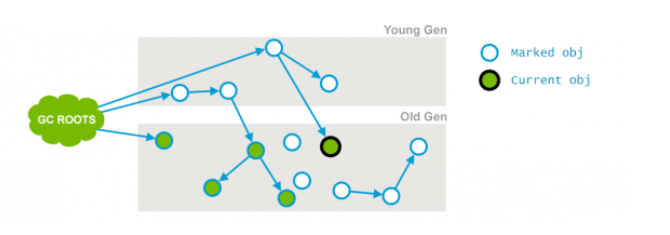
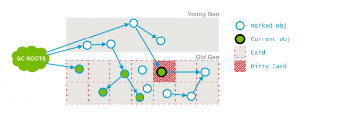
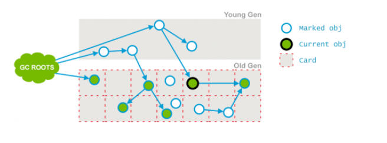
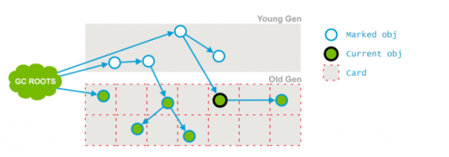
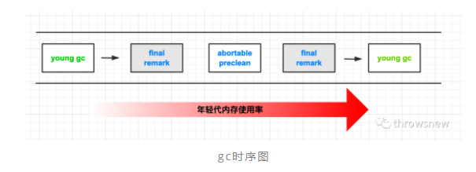
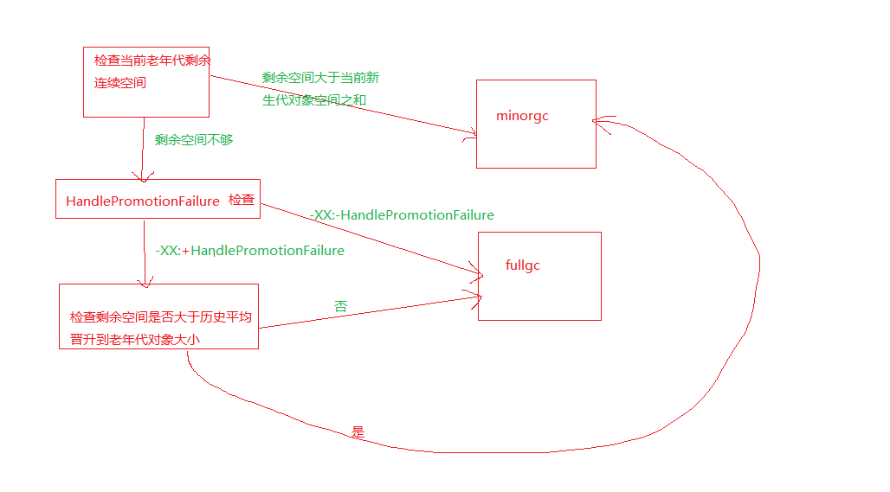
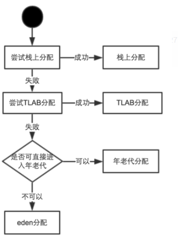

### 讲一下CMS的流程 - 顺丰

#### Phase1 ：Initial Mark【初始标记】

这个是CMS两次stop-the-world事件的其中一次，这个阶段的目标是：标记那些直接被GC root引用或被年轻代存活对象所引用的所有对象。用图来表示：


上面有些对象是直接被GC ROOTS所引用的，有些对象是被年轻代引用的，都会被标记出来。

#### Phase2 : Concurrent Mark 【并发标记】

在这个阶段Garbage Collector会遍历老年代，然后标记所有存活的对象。并发标记阶段，它会与用户的应用程序并发运行。并不是老年代所有的存活对象都会被标记，因为在标记期间用户的程序可能会改变一些引用。如下图：



在上面的图中，与阶段1的图进行对比，就会发现有一个对象的引用已经发生了变化，如标黑的那个对象。

#### Phase3 : Concurrent Preclean【并发预先清除】

这个阶段又是一个并发阶段，和应用线程并行运行。前一个阶段在并行运行的时候，一些对象的引用已经发生了变化，当这些引用发生变化的时候，JVM会标记堆的这个区域为Dirty Card(包含被标记但是改变了的对象，被认为"dirty")，这就是 [Card Marking](http://psy-lob-saw.blogspot.com.ee/2014/10/the-jvm-write-barrier-card-marking.html)。



在pre-clean阶段，那些能够从dirty card对象到达的对象也会被标记，这个标记做完之后，dirty card标记就会被清除了，如下：



此外，还为最后的Remark阶段执行了一些必要的管理和准备工作。

#### Phase4 : Concurrent Abortable Preclean【并发可中断的预先清除】

这也是一个并发阶段，同样不会影响用户的应用线程，这个阶段是为了尽量承担最终标记阶段（会产生STW）的工作。这个阶段持续时间依赖于很多的因素，由于这个阶段是在重复做很多相同的工作，直到满足一些条件（比如：重复迭代的次数、完成的工作量或者时钟时间等）。这一阶段可能会显著影响即将到来的“停止世界”暂停的持续时间，并且有很多重要的配置选项和失败模式。

#### Phase5 : Final Remark【最终重新标记】

这是第二个STW阶段，也是CMS中的最后一个，这个阶段的目标是标记老年代所有的存活对象，由于之前的阶段是并发执行的，GC线程可能跟不上应用程序的变化，为了完成标记老年代所有存活对象的目标，STW就非常有必要了。通常CMS的Final Remark阶段会在年代代尽可能干净的时候运行，目的是为了减少连续STW发生的可能性（年轻代存活对象过多的话，也会导致老年代涉及的存活对象会很多）。这个阶段会比前面的几个阶段更复杂一些。

**经历过以上五个阶段之后，老年代所有存活的对象都被标记过了，现在可以通过清除算法去清理那些老年代不再使用的对象。**

#### Phase6 : Concurrent Sweep【并发清除】

这里不需要STW，它是与用户的应用程序并发运行，这个阶段是：清除那些不再使用的对象，回收它们的占用空间为将来使用，如图：



#### Phase7 : Concurrent Reset【并发重置】

这个阶段也是并发执行的，它会重设CMS内部的数据结构，为下次的GC做准备。

### 听说过CMS的并发预处理和并发可中断预处理吗 - 阿里

在 jvm 中将老年代划分成多个 card，只要 card 内对象引用被应用线程修改，就把 card 标记为 dirty。然后 young gc 时会扫描老年代中 dirty card 对应的内存区域，记录其中的跨代引用，这种方式被称为**Card Marking**。jvm 使用 card marking 的方式，避免了 young gc 时扫描整个老年代存活对象，付出的代价是在每次修改引用时添加额外的汇编指令实现写屏障，和额外的内存来保存 card table。

#### Concurrent Preclean

现在回到 cms 回收器，在老年代 gc 时，同样使用到了 card marking，目的不是找到跨代引用（年轻代到老年代的跨代引用是通过从 gc root 遍历对象标记的），而是找到前面 concurrent-marking 阶段被应用线程并发修改的对象引用。

preclean 阶段是**对这些 card marking 产生的 dirty card 进行 clean**，cms gc 线程会扫描 dirty card 对应的内存区域，更新之前记录的过时的引用信息，并且去掉 dirty card 的标记，如下图所示：


在 preclean 执行后，dirty card 被清理，被修改的引用信息也被更新。

#### concurrent-abortable-preclean

concurrent-abortable-preclean 阶段目的是减轻 final remark 阶段（会暂停应用线程）的负担，这个阶段同样会对 dirty card 的扫描/清理，和 concurrent-preclean 的区别在于，concurrent-abortable-preclean 会重复地以迭代的方式执行，直到满足退出条件。**但是 concurrent-preclean 已经处理过 dirty card,为什么 jvm 还需要再执行一个类似的阶段呢？**

##### 连续 STW

首先我们考虑下这个情况：如果 final-remark 阶段开始时刚好进行了 young gc（比如 ParNew）,应用程序刚因为 young gc 暂停，然后又会因为 final-remark 暂停，造成**连续的长暂停**。除此之外，因为 young gc 线程修改了存活对象的引用地址，会产生很多需要重新扫描的对象，增加了 final-remark 的工作量。所以 concurrent-abortable-preclean 除了 clean card 的作用，还有**调度 final-remark 开始时机**的作用参考。cms 回收器认为，final-remark 最理想的执行时机就是年轻代占用在 50%时，这时刚好处于上次 young gc 完成（0%）和下次 young gc 开始（100%）的中间节点，如图所示：



##### 配置参数

abortable-preclean 的**中断条件**，配置参数是`-XX:CMSScheduleRemarkEdenPenetration=50`（默认值），表示当 eden 区内存占用到达 50%时，中断 abortable-preclean，开始执行 final-remark，对应**jvm 源码**片段如下：

```c++
//当eden占用比例超过配置，将_abort_preclean标记赋值为true
if ((_collectorState == AbortablePreclean) && !_abort_preclean) {
    size_t used = get_eden_used();
    size_t capacity = get_eden_capacity();
    assert(used <= capacity, "Unexpected state of Eden");
    if (used >  (capacity/100 * CMSScheduleRemarkEdenPenetration)) {
      _abort_preclean = true;
    }
}
```

abortable-preclean 的**触发条件**配置， `-XX:CMSScheduleRemarkEdenSizeThreshold=2m`（默认值），表示当 eden 内存占用超过 2mb 时才会执行 abortable-preclean，否则没有执行的必要。

abortable-preclean 的**主动退出条件**配置，`-XX:CMSMaxAbortablePrecleanTime=5000`和 CMSMaxAbortablePrecleanLoops，主要因为如果年轻代内存占用增长缓慢，那么 abortable-preclean 要长时间执行，可能因为 preclean 赶不上应用线程创造 dirty card 的速度导致 dirty card 越来越多，此时还不如执行一个 final-remark,对应 jvm 源码片段如下：

```c++
// Try and schedule the remark such that young gen
// occupancy is CMSScheduleRemarkEdenPenetration %.
// 保留原始注释，看下abortable_preclean的定位
void CMSCollector::abortable_preclean() {
  //校验触发条件
  if (get_eden_used() > CMSScheduleRemarkEdenSizeThreshold) {

    // 感受一下作者的纠结，他认为目前的主动退出条件有点蠢，FIX ME!!! 哈哈
    // One, admittedly dumb, strategy is to give up
    // after a certain number of abortable precleaning loops
    // or after a certain maximum time. We want to make
    // this smarter in the next iteration.
    // XXX FIX ME!!! YSR
    size_t loops = 0, workdone = 0, cumworkdone = 0, waited = 0;
    //should_abort_preclean会检查上面说的_abort_preclean是否为true
    while (!(should_abort_preclean() ||
             ConcurrentMarkSweepThread::should_terminate())) {
      workdone = preclean_work(CMSPrecleanRefLists2, CMSPrecleanSurvivors2);
      cumworkdone += workdone;
      loops++;
      // 主动停止执行
      if ((CMSMaxAbortablePrecleanLoops != 0) &&
          loops >= CMSMaxAbortablePrecleanLoops) {
        if (PrintGCDetails) {
          gclog_or_tty->print(" CMS: abort preclean due to loops ");
        }
        break;
      }
      if (pa.wallclock_millis() > CMSMaxAbortablePrecleanTime) {
        if (PrintGCDetails) {
          gclog_or_tty->print(" CMS: abort preclean due to time ");
        }
        break;
      }
      // 如果工作效率不高，主动暂停一会儿
      if (workdone < CMSAbortablePrecleanMinWorkPerIteration) {
        // Sleep for some time, waiting for work to accumulate
        stopTimer();
        cmsThread()->wait_on_cms_lock(CMSAbortablePrecleanWaitMillis);
        startTimer();
        waited++;
      }
    }
    //打印工作情况
    if (PrintCMSStatistics > 0) {
      gclog_or_tty->print(" [%d iterations, %d waits, %d cards)] ",
                          loops, waited, cumworkdone);
    }
  }
  return;
}
```

#### 总结

preclean: 清理 card marking 标记的 dirty card，更新引用记录

abortable-preclean: 调节 final-remark 阶段的运行时机

### G1两个Region不是连续的,而且之间还有可达的引用,我现在要回收一个,另一个怎么处理? - 阿里


### G1什么时候引发Full GC- 百度

#### JVM触发Full GC的条件应该都是一样的

#### 1.调用System.gc

```java
import java.util.ArrayList;
import java.util.List;

/**
 * 
 * created by: gaoxingliang@outlook.com
 * created:2016年3月20日
 */

/**
 * -XX:+UseSerialGC -Xms200M -Xmx200M -Xmn32m -XX:SurvivorRatio=8 -XX:+PrintGCDetails
 * @author gxl
 *
 */
public class SimulateFullGc
{
    public static void main(String[] args)
    {
        //模拟fullgc场景
        //场景1 使用System.gc
        List<Object> l = new ArrayList<Object>();
        for (int i =0; i< 100;i++)
        {
            l.add(new byte[1024*1024 ]);
            if (i % 10 ==0)
            {
                System.gc();
            }
        }

    }
}
```

> [Full GC (System) [Tenured: 0K->1495K(172032K), 0.0048354 secs] 2073K->1495K(201536K), [Perm : 2529K->2529K(21248K)], 0.0048900 secs] [Times: user=0.00 sys=0.00, real=0.00 secs]
> [Full GC (System) [Tenured: 1495K->11735K(172032K), 0.0064495 secs] 13310K->11735K(201536K), [Perm : 2532K->2532K(21248K)], 0.0064752 secs] [Times: user=0.00 sys=0.00, real=0.01 secs]

此方法的调用是建议JVM进行Full GC,虽然只是建议而非一定,但很多情况下它会触发 Full GC,从而增加Full GC的频率,也即增加了间歇性停顿的次数。强烈影响系建议能不使用此方法就别使用，让虚拟机自己去管理它的内存，可通过通过-XX:+ DisableExplicitGC来禁止RMI（Java远程方法调用）调用System.gc。

#### 2.老年代空间不足

```java
/**
 * 
 * created by: gaoxingliang@outlook.com
 * created:2016年3月20日
 */

/**
 * -XX:+UseSerialGC -Xms200M -Xmx200M -Xmn32m -XX:SurvivorRatio=8 -XX:+PrintGCDetails
 * @author gxl
 *
 */
public class SimulateFullGc
{
    public static void main(String[] args)
    {
        //模拟fullgc场景
        //老年代空间不足
        //按照上面的参数推算:老年代大小: 200 -32m = 168M


        byte [] MAXOBJ = new byte [1024 * 1024 * 100]; // 100M

        byte [] MAXOBJ2 = new byte [1024 * 1024 * 70]; // 60M
        MAXOBJ = null;

        byte [] MAXOBJ3 = new byte [1024 * 1024 * 100]; // 60M
    }
}
```

> [GC [DefNew: 5145K->470K(29504K), 0.0029970 secs][Tenured: 106496K->106966K(172032K), 0.0027630 secs] 107545K->106966K(201536K), [Perm : 2528K->2528K(21248K)], 0.0057990 secs] [Times: user=0.00 sys=0.02, real=0.01 secs]
> [Full GC [Tenured: 106966K->106952K(172032K), 0.0024331 secs] 106966K->106952K(201536K), [Perm : 2528K->2527K(21248K)], 0.0024488 secs] [Times: user=0.00 sys=0.00, real=0.00 secs]
> Exception in thread “main” java.lang.OutOfMemoryError: Java heap space
> at SimulateFullGc.main(SimulateFullGc.java:27)

旧生代空间只有在新生代对象转入及创建为大对象、大数组时才会出现不足的现象，当执行Full GC后空间仍然不足，则抛出如下错误： java.lang.OutOfMemoryError: Java heap space 为避免以上两种状况引起的FullGC，调优时应尽量做到让对象在Minor GC阶段被回收、让对象在新生代多存活一段时间及不要创建过大的对象及数组。

- 由Eden区、From Space区向To Space区复制时，对象大小大于To Space可用内存，则把该对象转存到老年代，且老年代的可用内存小于该对象大小
- 通过Minor GC后进入老年代的平均大小大于老年代的可用内存，如果发现统计数据说之前Minor GC的平均晋升大小比目前old gen剩余的空间大，则不会触发Minor GC而是转为触发full GC

#### 3.方法区空间不足

方式 在jdk6 上:

```java
import java.util.ArrayList;
import java.util.List;

/**
 * 
 * created by: gaoxingliang@outlook.com
 * created:2016年3月20日
 */

/**
 * -XX:+UseSerialGC -Xms200M -Xmx200M -Xmn32m -XX:SurvivorRatio=8 -XX:+PrintGCDetails -XX:MaxPermSize=10M
 * @author gxl
 *
 */
public class SimulateFullGc
{
    public static void main(String[] args)
    {
        //模拟fullgc场景
        //持久代空间不足
        List<String> list = new ArrayList<String>();
        int i = 0;
        while (true)
        {
            list.add(String.valueOf("ABCD:"  + i ++).intern());
        }
    }
}
```

> [GC [DefNew: 26240K->937K(29504K), 0.0040883 secs] 26240K->937K(201536K), 0.0041121 secs] [Times: user=0.02 sys=0.00, real=0.01 secs]
> [Full GC [Tenured: 0K->1325K(172032K), 0.0362063 secs] 17898K->1325K(201536K), [Perm : 20479K->20479K(20480K)], 0.0362549 secs] [Times: user=0.03 sys=0.00, real=0.04 secs]
> [Full GC [Tenured: 1325K->1325K(172032K), 0.0326822 secs] 1325K->1325K(201536K), [Perm : 20479K->20479K(20480K)], 0.0327085 secs] [Times: user=0.03 sys=0.00, real=0.03 secs]
> [Full GC [Tenured: 1325K->1325K(172032K), 0.0128924 secs] 1821K->1325K(201536K), [Perm : 20479K->3734K(20480K)], 0.0129210 secs] [Times: user=0.02 sys=0.00, real=0.01 secs]
> Exception in thread “main” java.lang.OutOfMemoryError: PermGen space
> at java.lang.String.intern(Native Method)
> at SimulateFullGc.main(SimulateFullGc.java:25)

String.intern 会拷贝实例到永久代中.

在jdk1.7 不会,所以可以加载class来模拟:

```java
import java.lang.reflect.Method;
import java.util.ArrayList;
import java.util.List;

import net.sf.cglib.proxy.Enhancer;
import net.sf.cglib.proxy.MethodInterceptor;
import net.sf.cglib.proxy.MethodProxy;

/**
 * 
 * created by: gaoxingliang@outlook.com
 * created:2016年3月20日
 */

/**
 * -XX:+UseSerialGC -Xms200M -Xmx200M -Xmn32m -XX:SurvivorRatio=8 -XX:+PrintGCDetails -XX:MaxPermSize=10M
 * @author gxl
 *
 */
public class SimulateFullGc
{
    public static void main(String[] args)
    {
        //模拟fullgc场景
        //持久代空间不足
        //class 加载信息
        //需要cglib + asm (http://forge.ow2.org/projects/asm/)
        while (true)
        {
            Enhancer en = new Enhancer();
            en.setSuperclass(OOMObject.class);
            en.setUseCache(false);
            en.setCallback(new MethodInterceptor()
            {

                @Override
                public Object intercept(Object arg0, Method arg1, Object[] arg2,
                        MethodProxy arg3) throws Throwable
                {
                    // TODO Auto-generated method stub
                    return null;
                }
            });
            en.create();
        }
    }
    static class OOMObject
    {

    }
}
```

> [GC [DefNew: 28043K->1735K(29504K), 0.0039443 secs] 33739K->7817K(201536K), 0.0039660 secs] [Times: user=0.03 sys=0.00, real=0.00 secs]
> [Full GC [Tenured: 6082K->7989K(172032K), 0.0322856 secs] 23097K->7989K(201536K), [Perm : 20479K->20479K(20480K)], 0.0323121 secs] [Times: user=0.05 sys=0.00, real=0.03 secs]
> [Full GC [Tenured: 7989K->7989K(172032K), 0.0233015 secs] 7989K->7989K(201536K), [Perm : 20479K->20479K(20480K)], 0.0233266 secs] [Times: user=0.01 sys=0.00, real=0.02 secs]
> [Full GC [Tenured: 7989K->7989K(172032K), 0.0199921 secs] 8515K->7989K(201536K), [Perm : 20479K->20479K(20480K)], 0.0200187 secs] [Times: user=0.03 sys=0.00, real=0.02 secs]
> [Full GC [Tenured: 7989K->3354K(172032K), 0.0250219 secs] 7989K->3354K(201536K), [Perm : 20479K->20477K(20480K)], 0.0250530 secs] [Times: user=0.02 sys=0.00, real=0.03 secs]
> Exception in thread “main” [Full GC [Tenured: 3354K->3355K(172032K), 0.0198650 secs] 3880K->3355K(201536K), [Perm : 20479K->20479K(20480K)], 0.0198919 secs] [Times: user=0.02 sys=0.00, real=0.02 secs]
> [Full GC [Tenured: 3355K->3355K(172032K), 0.0198493 secs] 3355K->3355K(201536K), [Perm : 20479K->20479K(20480K)], 0.0198762 secs] [Times: user=0.03 sys=0.00, real=0.02 secs]
> [Full GC [Tenured: 3355K->3355K(172032K), 0.0197512 secs] 3880K->3355K(201536K), [Perm : 20479K->20479K(20480K)], 0.0197814 secs] [Times: user=0.02 sys=0.00, real=0.02 secs]
> [Full GC [Tenured: 3355K->3285K(172032K), 0.0245018 secs] 3355K->3285K(201536K), [Perm : 20479K->20478K(20480K)], 0.0245283 secs] [Times: user=0.03 sys=0.00, real=0.02 secs]

JVM规范中运行时数据区域中的方法区，在HotSpot虚拟机中又被习惯称为永生代或者永生区，Permanet Generation中存放的为一些class的信息、常量、静态变量等数据，当系统中要加载的类、反射的类和调用的方法较多时，Permanet Generation可能会被占满，在未配置为采用CMS GC的情况下也会执行Full GC。如果经过Full GC仍然回收不了，那么JVM会抛出如下错误信息：
java.lang.OutOfMemoryError: PermGen space为避免Perm Gen占满造成Full GC现象，可采用的方法为增大Perm Gen空间或转为使用CMS GC。

#### 4.gc 担保失败

空间分配担保失败.
在发生MinorGC前,检查老年代是否有连续空间,如果有,则执行,如果没有,根据设置:-XX:-HandlePromotionFailure 指定,如果打开,那么继续检查,当前老年代最大可用连续空间大于平均历次晋升到老年代大小,如果大于,则进行MinorGC,否则进行FullGC,如果HandlePromotionFailure 不设置 直接进行FullGC.大致就是这样:


参数:-XX:-HandlePromotionFailure 在JDK 6U24中移除.后续判断只要剩余连续大于当前新生代或者历次晋升平均大小就会执行minorgc.

> Java HotSpot(TM) 64-Bit Server VM warning: ignoring option HandlePromotionFailure; support was removed in 6.0_24

```java
import java.lang.reflect.Field;

import sun.misc.Unsafe;

/**
 * 
 * created by: gaoxingliang@outlook.com
 * created:2016年3月20日
 */

/**
 * -Xms20M -Xmx20M -Xmn10m -XX:SurvivorRatio=8 -XX:+PrintGCDetails -XX:-HandlePromotionFailure -XX:MaxTenuringThreshold=1
 * @author gxl
 *
 */
public class SimulateFullGc
{
    private static final int MB = 1024 * 1024;

    public static void main(String[] args) throws Exception
    {
        // 模拟fullgc场景
        // 提升担保
        // 提升担保
        byte[] M6, M3, M4, M5, M7, M8;
        M6 = new byte[6 * MB];
        M6[0] = 0;
        M6[0] = 0;
        // 使用2次保证下次需要的时候可以晋升到老年代 会晋升那么 晋升经验值为6M
        M3 = new byte[4 * MB];
        M4 = new byte[2 * MB];
        M4 = null;
        M5 = new byte[2 * MB];
        M5[0] = 0;
        M5[0] = 0;
        M7 = new byte[2 * MB];
        M7[0] = 0;
        M7[0] = 0;
        M7 = null;
        M8 = new byte[3 * MB];
        // 最终如下对象 老年代 M6 + M8 = 9M
        // 年轻代:M3 + M5 = 6M = 6144K
        System.out.println("M6 HEX:0x" + Long.toHexString(addressOf(M6)));
        System.out.println("M5 HEX:0x" + Long.toHexString(addressOf(M5)));
        System.out.println("M3 HEX:0x" + Long.toHexString(addressOf(M3)));
        System.out.println("M8 HEX:0x" + Long.toHexString(addressOf(M8)));

    }

    private static Unsafe unsafe;

    static
    {
        try
        {
            Field field = Unsafe.class.getDeclaredField("theUnsafe");
            field.setAccessible(true);
            unsafe = (Unsafe) field.get(null);
        }
        catch (Exception e)
        {
            e.printStackTrace();
        }
    }

    public static long addressOf(Object o) throws Exception
    {
        Object[] array = new Object[] { o };

        long baseOffset = unsafe.arrayBaseOffset(Object[].class);
        int addressSize = unsafe.addressSize();
        long objectAddress;
        switch (addressSize)
        {
        case 4:
            objectAddress = unsafe.getInt(array, baseOffset);
            break;
        case 8:
            objectAddress = unsafe.getLong(array, baseOffset);
            break;
        default:
            throw new Error("unsupported address size: " + addressSize);
        }

        return (objectAddress);
    }
}
```

> [GC [DefNew: 6487K->149K(9216K), 0.0027691 secs] 6487K->6293K(19456K), 0.0027839 secs] [Times: user=0.00 sys=0.00, real=0.00 secs]
> [GC [DefNew: 6379K->6379K(9216K), 0.0000060 secs][Tenured: 6144K->6144K(10240K), 0.0048112 secs] 12523K->10389K(19456K), [Perm : 374K->374K(12288K)], 0.0048426 secs] [Times: user=0.00 sys=0.00, real=0.01 secs]
> [Full GC [Tenured: 8192K->6144K(10240K), 0.0032886 secs] 14485K->12437K(19456K), [Perm : 374K->374K(12288K)], 0.0033058 secs] [Times: user=0.02 sys=0.00, real=0.00 secs]
> M6 HEX:0x33990000
> M5 HEX:0x333b5520
> M3 HEX:0x32f90000
> M8 HEX:0x33f90010
> Heap
> def new generation total 9216K, used 6514K [0x32f90000, 0x33990000, 0x33990000)
> eden space 8192K, 79% used [0x32f90000, 0x335ec808, 0x33790000)
> from space 1024K, 0% used [0x33890000, 0x33890000, 0x33990000)
> to space 1024K, 0% used [0x33790000, 0x33790000, 0x33890000)
> tenured generation total 10240K, used 9216K [0x33990000, 0x34390000, 0x34390000)
> the space 10240K, 90% used [0x33990000, 0x34290020, 0x34290200, 0x34390000)
> compacting perm gen total 12288K, used 374K [0x34390000, 0x34f90000, 0x38390000)
> the space 12288K, 3% used [0x34390000, 0x343ed960, 0x343eda00, 0x34f90000)
> ro space 10240K, 54% used [0x38390000, 0x3890c510, 0x3890c600, 0x38d90000)
> rw space 12288K, 55% used [0x38d90000, 0x3942fb78, 0x3942fc00, 0x39990000)

*注意对象位置.*

#### 5.concurrent mode failure

CMS垃圾收集器特有的错误，CMS的垃圾清理和引用线程是并行进行的，如果在并行清理的过程中老年代的空间不足以容纳应用产生的垃圾，则会抛出“concurrent mode failure”。

concurrent mode failure影响:**老年代的垃圾收集器从CMS退化为Serial Old，所有应用线程被暂停，停顿时间变长。**

可能原因及方案:

原因1：CMS触发太晚
方案：将-XX:CMSInitiatingOccupancyFraction=N调小；

原因2：空间碎片太多
方案：开启空间碎片整理，并将空间碎片整理周期设置在合理范围；
-XX:+UseCMSCompactAtFullCollection （空间碎片整理）
-XX:CMSFullGCsBeforeCompaction=n

原因3：垃圾产生速度超过清理速度
晋升阈值过小；
Survivor空间过小，导致溢出；
Eden区过小，导致晋升速率提高；
存在大对象；


#### G1回收过程一: 年轻代GC

JVM启动时,G1先准备好Eden区,程序在运行过程中不断创建对象到Eden区,当Eden空间耗尽时,G1会启动一次年轻代垃圾回收过程。
 `年轻代垃圾回收只会回收Eden区和Survivor区。`
 YGC时,首先G1停止应用程序的执行(Stop-The-World),G1创建回收集(Collection Set),回收集是指需要被回收的内存分段的集合,年轻代回收过程的回收集包含年轻代Eden区和Survivor区所有的内存分段。

然后开始如下回收过程:
 `第一阶段,扫描根。`
 根是指static变量指向的对象,正在执行的方法调用链条上的局部变量等。跟引用连同RSet记录的外部引用作为扫描存活对象的入口。
 `第二阶段,更新RSet。`
 处理dirty card queue(见备注)中的card,更新RSet。此阶段完成后,RSet可以准确的反映老年代对所在的内存分段中对象的引用。

> 备注:
>  对于应用程序的引用赋值语句object.field=object,JVM会在之前和之后执行特殊的操作以在dirty card queue中入队一个保存了对象引用信息的card。在年轻代回收的时候,G1会对Dirty Card Queue中所有的card进行处理,以更新RSet,保证RSet实时准确的反映引用关系。
>  那为什么不在引用赋值语句处直接更新RSet呢?这是为了性能的需要,RSet的处理需要线程同步,开销会很大,使用队列性能会好很多。

`第三阶段,处理RSet。`
 识别被老年代对象指向的Eden中的对象,这些被指向的Eden中的对象被认为是存活的对象。
 `第四阶段,复制对象。`
 此阶段,对象树被遍历,Eden区内存段中存活的对象会被复制到Survivor区中空的内存分段,Survivor区内存段中存活的对象如果年龄未达阈值,年龄会加1,达到阈值会被复制到Old区中空的内存分段。如果Survivor空间不够,Eden空间的部分数据会直接晋升到老年代空间。
 `第五阶段,处理引用。`
 处理Soft,Weak,Phantom,Final,JNI Weak 等引用。最终Eden空间的数据为空,GC停止工作,而目标内存中的对象都是连续存储的,没有碎片,所以复制过程可以达到内存整理的效果,减少碎片。

#### G1回收过程二: 并发标记过程

`1. 初始标记阶段:` 标记从根节点直接可达的对象。这个阶段是STW的,并且会触发一次年轻代GC。
 `2. 根区域扫描(Root Region Scanning):` G1 GC扫描survivor区直接可达的老年代区域对象,并标记被引用的对象。这一过程必须在young GC之前完成。
 `3. 并发标记(Concurrent Marking):` 在整个堆中进行并发标记(和应用程序并发执行),此过程可能被young GC中断。在并发标记阶段,`若发现区域对象中的所有对象都是垃圾,那这个区域会被立即回收。`同时,并发标记过程中,会计算每个区域的对象活性(区域中存活对象的比例)。
 `4. 再次标记(Remark):` 由于应用程序持续进行,需要修正上一次的标记结果。是STW的。G1中采用了比CMS更快的初始快照法: snapshot-at-the-beginning(SATB)。
 `5. 独占清理(cleanup,STW):` 计算各个区域的存活对象和GC回收比例,并进行排序,识别可以混合回收的区域。为下阶段做铺垫。是STW的。
 `6. 并发清理阶段:` 识别并清理完全空闲的区域。

#### G1回收过程三: 混合回收

当越来越多的对象晋升到老年代old region时,为了避免堆内存被耗尽,虚拟机会触发一个混合的垃圾收集器,即Mixed GC,该算法并不是一个Old GC,除了回收整个Young Region,还会回收一部分的Old Region。这里需要注意: `是一部分老年代,而不是全部老年代`。可以选择哪些Old Region进行收集,从而可以对垃圾回收的耗时时间进行控制。也要注意的是Mixed GC并不是Full GC。


- 并发标记结束以后,老年代中百分百为垃圾的内存分段被回收了,部分为垃圾的内存分段被计算了出来。默认情况下,这些老年代的内存分段会分8次(可以通过-XX:G1MixedGCCountTarget设置)被回收。
- 混合回收的回收集(Collection Set)包括八分之一的老年代内存分段,Eden区内存分段,Survivor区内存分段。混合回收的算法和年轻代回收的算法完全一样,只是回收集多了老年代的内存分段。具体过程请参考上面的年轻代回收过程。
- 由于老年代中的内存分段默认分8次回收,G1会优先回收垃圾多的内存分段。`垃圾占内存分段比例越高,越会被先回收`。并且有一个阈值会决定内存分段是否被回收。-XX:G1MixedGCLiveThresholdPercent,默认为65%,意思是垃圾占内存分段比例要达到65%才会被回收。如果垃圾占比太低,意味着存活的对象占比高,在复制的时候会花费更多的时间。
- 混合回收并不一定要进行8次。有一个阈值-XX:G1HeapWastePercent,默认值为10%,意思是允许整个堆内存中有10%的空间被浪费,意味着如果发现可以回收的垃圾占堆内存的比例低于10%,则不再进行混合回收。因为GC会花费很多的时间但是回收到的内存却很少。

#### G1回收可选的过程四: Full GC

G1的初衷就是要避免Full GC的出现。按时如果上述方式不能正常工作,G1会`停止应用程序的执行`(Stop-The-World),使用`单线程`的内存回收算法进行垃圾回收,性能会非常差,应用程序停顿时间会很长。

要避免Full GC的发生,一旦发生需要进行调整。什么时候会发生Full GC呢?比如`堆内存太小`,当G1在复制存活对象的时候没有空的内存分段可用,则会回退到full gc,这种情况可以通过增大内存解决。

导致G1Full GC的原因可能有两个:

1. Evacuation的时候没有足够的to-space来存放晋升的对象;
2. 并发处理过程完成之前空间耗尽。


### CMS和G1的异同-百度

相同点：

- 都是并发的垃圾处理器

不同点：


### 说一个最熟悉的垃圾回收算法- 百度

### 吐量优先和响应时间优先的回收器有哪些- 百度

- 吞吐量优先：Parallel组合
- 响应时间优先：ParNew+CMS、G1

### 为什么压缩指针超过32G失效- 京东

JVM未开启指针压缩，采用64位地址编码来寻址，理论上可以寻址的范围是2^64（无限大），有点浪费。

开启指针压缩，采用32位地址编码来寻址，但理论上可以寻址的范围是2 ^ 32，也就是4GB，不过现在的电脑内存普遍都大于4GB，怎么解决这个问题？这就利用到了Java对象的大小一定是8字节对齐的特性，由于有内存填充，Java对象的大小一定是8字节的倍数，例如16字节、24字节、32字节等，这样Java对象在内存中的首地址低3位一定是000，如果在保存地址时将这3个0丢弃，然后在寻址时补齐，那么32位地址编码实际能表示35位的地址编码，也就可以用32位的地址编码访问2 ^ 35 = 32GB的内存。

超过32GB时，有两种解决方案：

- 指针压缩失效，采用64位地址编码寻址。
- Java对象采用16字节对齐，这样对象的地址低4位都是0，这样大量的空间将用来内存填充，本来指针压缩就想节约内存的，这倒好，产生更多浪费的空间，得不偿失。

### 讲一下JVM堆内存管理(对象分配过程) - 阿里

- [JVM 对象内存分配流程](https://blog.csdn.net/shanchahua123456/article/details/105162907)



1、如果对象没有逃逸，且栈空间足够。则首选打散后栈上分配。

2、1失败后，尝试堆中线程专属内存块分配。(eden堆中每个线程都有一块专属内存，避免多线程同步申请空间)

3、2失败后，判断是否触发条件直接进入老年代。(一般尽量避免这种情况出现)

4、共享eden区分配。


### 到底多大的对象会被直接扔到老年代- 阿里

举例而言，在G1 GC里，memory是被分成等大小的region，region的大小在1到32MB之间。如果任何object超过半个region的大小，就会直接被放进。在paralell gc中，因为没有region的概念，则会在object大于eden时才会直接进old gen。

HotSpot 虚拟机提供了-XX:PretenureSizeThreshold 参数，指定大于该设置值的对象直接在老年代分配，这样做的目的就是避免在 Eden 区及两个 Survivor区之间来回复制，产生大量的内存复制操作。
这样做的目的：1.避免大量内存复制,2.避免提前进行垃圾回收，明明内存有空间进行分配。
PretenureSizeThreshold 参数只对 Serial 和 ParNew 两款收集器有效。-XX:PretenureSizeThreshold=4m。


### 怎么判断内存泄漏 - 顺丰

### 什么是内存泄漏? GC调优有经验吗?一般出现GC问题你怎么解决? - 淘宝

- ThreadLocal value的内存泄露问题