## 请描述一下对象的创建过程 - 美团 顺丰

### 类的生命周期

解析：回答这个问题首先就要清楚类的生命周期

下图展示的是类的生命周期流向：　　　
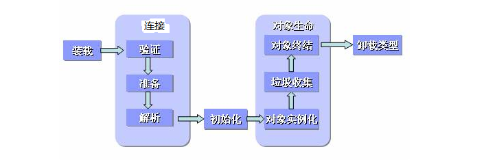

Java中对象的创建就是在堆上分配内存空间的过程，此处说的对象创建仅限于new关键字创建的普通Java对象，不包括数组对象的创建。

### 对象创建过程

1. 检测类是否被加载：
   　　当虚拟机执行到new时，会先去常量池中查找这个类的符号引用。如果能找到符号引用，说明此类已经被加载到方法区（方法区存储虚拟机已经加载的类的信息），可以继续执行；如果找不到符号引用，就会使用类加载器执行类的加载过程，类加载完成后继续执行。
2. 为对象分配内存：
   　　类加载完成以后，虚拟机就开始为对象分配内存，此时所需内存的大小就已经确定了。只需要在堆上分配所需要的内存即可。
3. 为分配的内存空间初始化零值：
   　　对象的内存分配完成后，还需要将对象的内存空间都初始化为零值，这样能保证对象即使没有赋初值，也可以直接使用
4. 对对象进行其他设置：
   　　分配完内存空间，初始化零值之后，虚拟机还需要对对象进行其他必要的设置，设置的地方都在对象头中，包括这个对象所属的类，类的元数据信息，对象的hashcode，GC分代年龄等信息。
5. 执行 init 方法：
   　　执行完上面的步骤之后，在虚拟机里这个对象就算创建成功了，但是对于Java程序来说还需要执行init方法才算真正的创建完成，因为这个时候对象只是被初始化零值了，还没有真正的去根据程序中的代码分配初始值，调用了init方法之后，这个对象才真正能使用。

> 到此为止一个对象就产生了，这就是new关键字创建对象的过程。过程如下

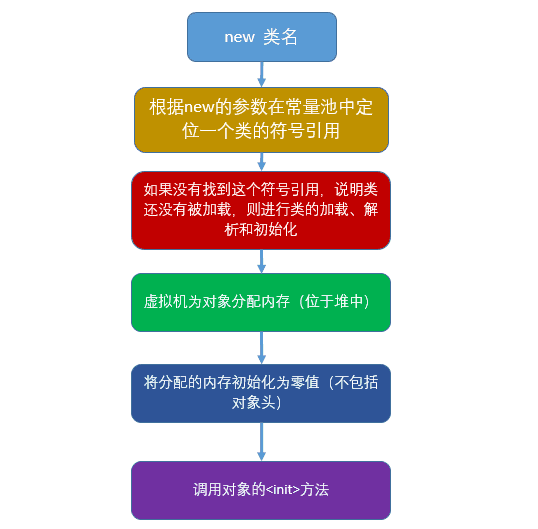


## 对象在内存中的内存布局- 美团 顺丰

**对象内存布局**

一个Java对象在内存中包括对象头、实例数据和对齐填充三个部分。如下图所示：


**Mark Word**
包含一系列的标记位比如hashcode、GC分代年龄、偏向锁位，锁标志位等。这个Mark Word在对象被加了不同量级的锁时所包含的内容和布局都有所不同，这涉及到锁升级的知识，暂不展开讨论

**Klass Pointer**
是一个指针，指向描述这个对象类型的元对象，例如Object.class，User.class等

**实例数据**
instance data：描述成员变量的信息，如果成员变量是引用类型，那么它就是一个指针。instance data的大小是所有成员变量的占用空间（基本数据类型大小+指针大小）

**对齐**
padding data：在java中，为了能够更加高效的利用内存空间，会将对象大小设定为8bytes的整数倍，如果对象头+实例数据的大小不是8bytes的倍数，那么会在padding区域填充几个字节，使得对象占用空间是8bytes的倍数


## Object o = new Object()在内存中占了多少字节? - 顺丰

那么对象布局中各个部分占用内存空间到底多大呢？由于目前64位操作系统已经基本普及，下面只分析64位操作系统下的情况

**指针压缩**
在64位系统中，一个指针占64 bits也就是8 bytes，而在32位系统中指针只占4个字节，于是为了能够减少内存消耗，从JDK1.6开始，JVM会默认支持指针压缩，会将指针大小压缩成4个字节，这涉及到两个参数：

- **-XX:+UseCompressedOops**：oops: ordinary object pointer，普通对象指针压缩，例如Object o = new Object();其中o就是个指向new Object()对象的指针，o在指针压缩前占用8个字节，在指针压缩后占用4个字节
- **-XX:+UseCompressedClassPointers**：压缩Klass Pointer，压缩前8个字节，压缩后4个字节

> Hotspot实现的JVM开启内存压缩的规则（64位机器）：
>
> - 4G以下，直接砍掉高32位
> - 4G~32G，默认开启内存压缩
> - 32G以上，压缩无效，使用64位
>
> 所以，内存并不是越大越好。

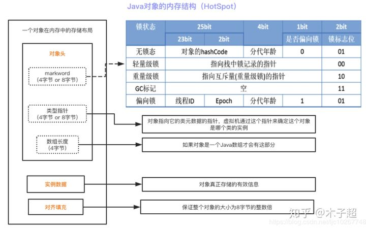

**普通对象内存各部分字节占用分配情况：**

1、`Mark Word`：8byte
2、`Klass Pointer`：

- -XX:+UseCompressedClassPointer的情况为 4byte
- -XX:-UseCompressedClassPointer的情况为 8byte

3、`实例数据instance data`：

如果成员变量是引用类型，字节占用情况：

- -XX:+UseCompressedOops 4byte
- -XX:-UseCompressedOops 8byte

如果成员变量是基本数据类型，那么占用空间就是基本数据类型的大小，Java的8大基本数据类型的大小如下：

| 数据类型 | 占用空间bytes |
| :------: | :-----------: |
|   byte   |       1       |
|  short   |       2       |
|   int    |       4       |
|   long   |       8       |
|  float   |       4       |
|  double  |       8       |
|   char   |       2       |
| boolean  |       1       |

4、`对齐padding`：如果对象头+实例数据的大小不是8 bytes的倍数，那么就填充这个区域，使得对象占用空间能被8个字节整除

**数组对象内存各部分字节占用分配情况：**

1、`markword` 8字节
2、`Klass Pointer`指针，同普通对象，压缩4字节，不压缩8字节
3、数组长度 4字节
4、数组数据
5、对齐8的倍数

**计算new Object()占用的字节数**

- 首先，`markword`占`8字节`
- `KlassPointer`：我的机器内存是8G，JVM默认是开启了内存压缩规则的，所以这里ClassPointer会占用`4字节`
- 实例数据：我只是new了一个Object()，没有任何的引用类型和费用用类型，这部分没有占用字节
- `Padding`对齐：前面8+4+0=12字节，因为要满足8的倍数，所以这里需要`补齐`至`16字节`

所以，`new Object()`占用16字节。

**计算new int[]{}占用的字节数**

- `markword`: 8字节
- `ClassPointer`：4字节
- `数组长度`：4字节
- `数组数据`：0字节
- `Padding`对齐：前面8+4+4+0=16，已经是8的倍数了，这里不需要对齐

因此，`new int[]{}`占用16字节。

**计算自定义的`new P()`占用的字节数**

```java
private static class P {
    // markword 8
    // ClassPinter 4 (+UseCompressedClassPointer时 为4；-UseCompressedClassPointer时 为8)
    
    // 4
    int id;
    // Oops 4
    String name;// 这是一个引用 +UseCompressedOops时 为8  -UseCompressedOops时 为4
    // Oops 4
    private int[] ages;
    // 1
    byte b1;
    // 1
    byte b2;
    //Oops 4
    Object o;
    // 8
    long i;
}
```

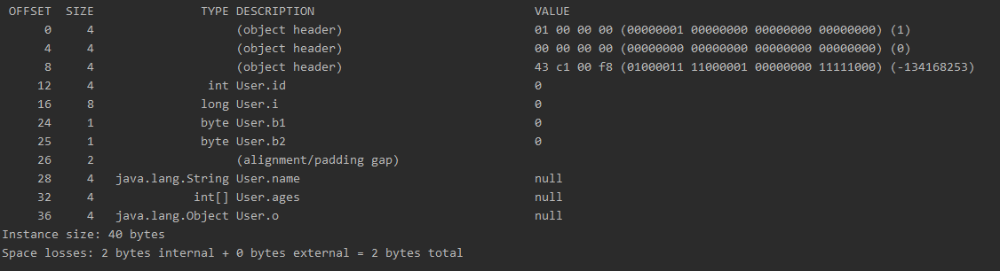

**证明对象内存布局**

我们需要引用一个依赖：openjdk提供的jol-core：

```xml
<dependency>
	<groupId>org.openjdk.jol</groupId>
	<artifactId>jol-core</artifactId>
	<version>0.9</version>
</dependency>
```

1、查看默认情况下没有成员变量的对象布局

示例代码：

```java
public class TestObj {
    public static void main(String[] args) {
        // 创建对象
        Object o = new Object();
        // 获得对象布局内容
        String s = ClassLayout.parseInstance(o).toPrintable();
        // 打印对象布局
        System.out.println(s);
    }
}
```

输出结果：

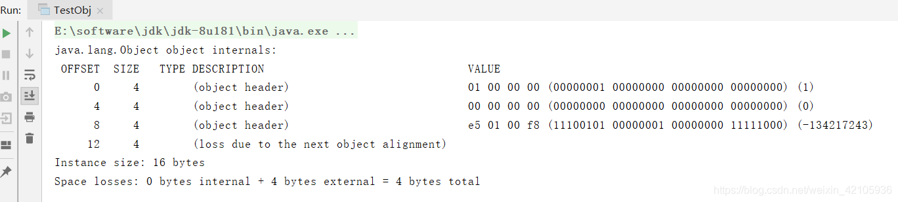

其中对象头（object header）有三个，前两个是Mark Word一共8个字节，后面一个是Klass Pointer，占4个字节，由于没有成员变量，所以实例数据没有占用空间，而最后4个字节描述信息为：loss due to the next object alignment，意思就是为了与下一个对象对齐而丢失的部分，也就是对齐填充空间

2、证明Klass Pointer在不开启压缩的情况下占用8个字节

我们只需要在jvm参数上加上-XX:-UseCompressedClassPointers即可，在IDEA工具中可以设置启动参数：

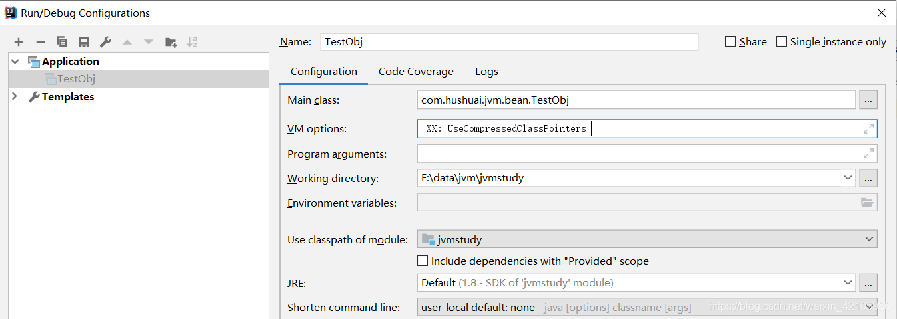

还是运行上述代码，运行程序结果：

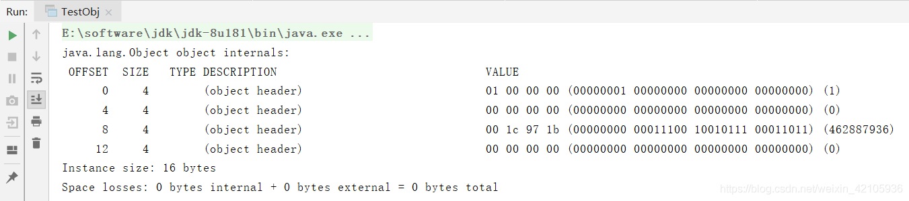

如上图所示，对象头已经占用16个字节，前8个字节是Mark Word，后8个字节就是未压缩的Klass Pointer。我们还注意到对齐填充也没有了，原因是此时对象占用空间16个字节已经是8bytes的倍数，所以不需要填充，这完全印证了前面的分析

3、证明实例数据的存在以及大小

示例代码：

```java
public class TestObj {
    public static void main(String[] args) {
        // 创建对象
        User user = new User(1, "zhangsan");
        // 获得对象布局内容
        String s = ClassLayout.parseInstance(user).toPrintable();
        // 打印对象布局
        System.out.println(s);
    }
}

class User {
    private int id;
    private String name;

    public User(int id, String name) {
        this.id = id;
        this.name = name;
    }
}
```

打印结果：

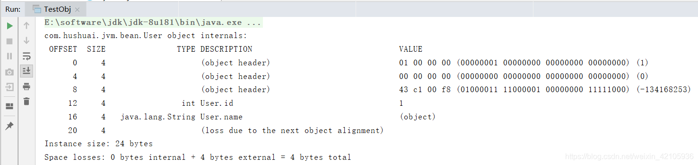

如上图所示，int类型的id占用4个字节，指向字符串对象的name指针占用4个字节，加上对齐，对象一共占用24 bytes

4、最后验证不开启指针压缩的情况下指针占用8 bytes

只需在jvm参数上加上-XX:-UseCompressedOops：

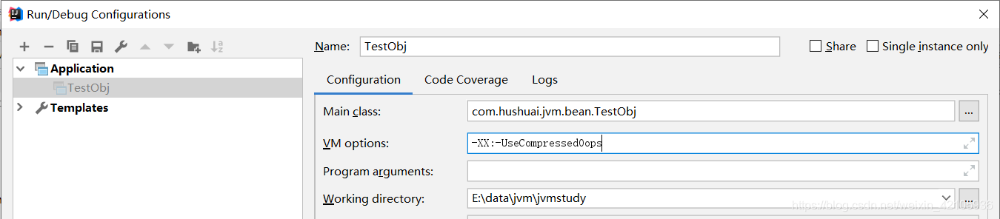

还是运行上面的代码，打印结果：


很显然，此时name指针已经占用了8个字节

一般来说，UseCompressedClassPointers和UseCompressedOops是默认开启的，我们无需关心也无需修改。但是有个隐藏的细节就是：UseCompressedClassPointers的开启依赖UseCompressedOops的开启，并且开启UseCompressedOops 也默认强制开启UseCompressedClassPointers，关闭UseCompressedOops 默认关闭UseCompressedClassPointers。


## 请描述锁的四种状态和升级过程 - 百度 阿里

在Java（1.6+）中锁的状态一共有四种，级别由低到高分别是：无锁、偏向锁、轻量级锁、重量级锁，这几个状态会随着竞争情况逐渐升级，其中锁可以升级，但是不能降级。Java中加锁的最简单方式就是加synchronized关键字，那么为什么锁会有这么多状态的锁呢？

在Java早期，synchronized叫做重量级锁，加锁过程需要操作系统在内核态访问核心资源，因此操作系统会在用户态与内核态之间切换，效率很低下。于是JDK1.6之后，JVM为了提高锁的获取与释放效率，对synchronized进行了优化，引入了偏向锁和轻量级锁，根据线程竞争情况对锁进行升级，在线程竞争不激烈的情况避免使用重量级锁。

在了解锁之前需要先了解一下**对象头**，我们都知道在Java中锁不是某一个具体的实物资源，而是对象上的某个标记，而这个标记就记录在对象头（Mark Word）上。Mark Word（对象头）是Java对象布局中的一个部分，那么Mark Word内部是什么样子的呢？

在32位虚拟机中：

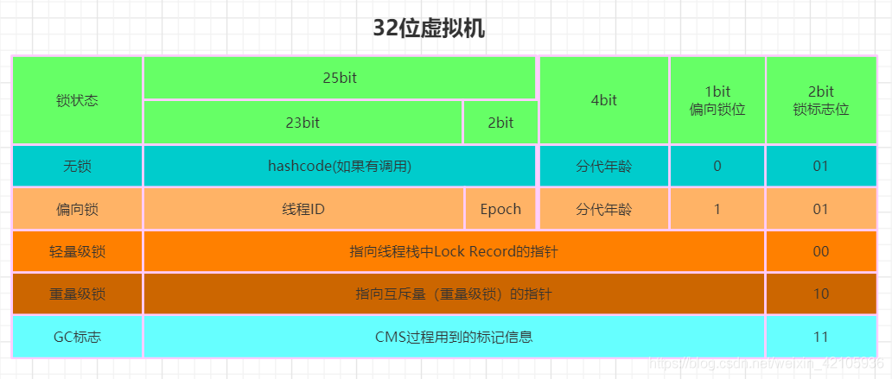

在64位虚拟机中：


由于现在计算机基本都是64位，所以下面以64位虚拟机为例，看一下锁具体是如何升级的
**无锁**：对象头中有31bit的空间来存储对象的hashcode，4bit用于存放对象分代年龄，1bit来表示是否是偏向锁，2bit存放锁标志位，偏向锁位与锁标志位合起来“001”就代表无锁。无锁就是没有对任何资源进行锁定，所有线程都能访问并修改资源。
**偏向锁**：对象头中记录了获得偏向锁的线程ID，偏向锁与锁标志位合起来“101”就代表偏向锁。有研究发现，在大多数情况下，锁很少被多个线程同时竞争，而且总是由同一个线程多次获得，因此只需要将获得锁的线程ID写入到锁对象Mark Word中，相当于告诉其他线程，这块资源已经被我占了。当线程访问资源结束后，不会主动释放偏向锁，当线程再次需要访问资源时，JVM就会通过Mark Word中记录的线程ID判断是否是当前线程，如果是，则继续访问资源。所以，在没有其他线程参与竞争时，锁就一直偏向被当前线程持有，当前线程就可以一直占用资源或者执行代码。
**轻量级锁**：一旦有另外一个线程参与锁竞争，偏向锁就会升级为轻量级锁，此时撤销偏向锁，锁标志位变为“00”。竞争的两个线程都在各自的线程栈帧中生成一个Lock Record空间，用于存储锁对象目前Mark Word的拷贝，用CAS操作将Mark Word设置为指向自己这个线程的LR（Lock Record）指针，设置成功者获得锁，其他参与竞争的线程如果未获取到锁，则会一直处于自旋等待的状态，直到竞争到锁。
**重量级锁**：长时间的自旋操作是很消耗CPU资源的，为了避免这种盲目的消耗，JVM会在有线程超过10次自旋，或者自旋次数超过CPU核数的一半（JDK1.6以后加入了自适应自旋-Adaptive Self Spinning，由JVM自己控制自旋次数）时，会升级到重量级锁。重量级锁底层是依赖操作系统的mutex互斥锁，也就是有操作系统来负责线程间的调度。重量级锁减少了自旋锁带来的CPU消耗，但是由于操作系统调度线程带来的线程阻塞会使程序响应速度变慢。

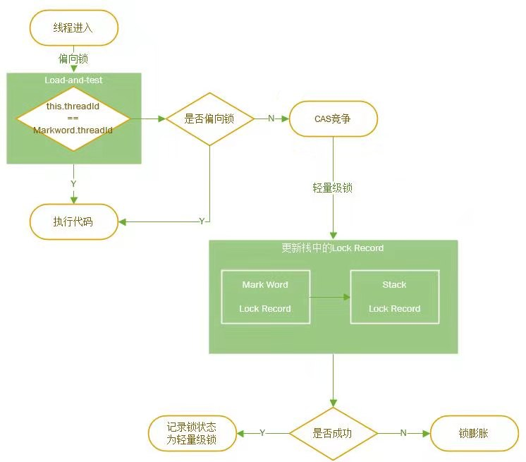


## 请描述synchrnoized和reentrantlock的底层实现及重入的底层原理 - 百度 阿里

### synchronized底层原理

参考资料：[jvm：ObjectMonitor源码](https://blog.csdn.net/zwjyyy1203/article/details/106217887)

#### 重量级锁

synchronized重量级锁是通过monitor机制实现的，在HotSpot虚拟机中，monitor是由C++中ObjectMonitor实现，源码地址：[objectMonitor.hpp](https://github.com/JetBrains/jdk8u_hotspot/blob/master/src/share/vm/runtime/objectMonitor.hpp)：

```c++
// ObjectWaiter serves as a "proxy" or surrogate thread.
// TODO-FIXME: Eliminate ObjectWaiter and use the thread-specific
// ParkEvent instead.  Beware, however, that the JVMTI code
// knows about ObjectWaiters, so we'll have to reconcile that code.
// See next_waiter(), first_waiter(), etc.

class ObjectWaiter : public StackObj {
 public:
  enum TStates { TS_UNDEF, TS_READY, TS_RUN, TS_WAIT, TS_ENTER, TS_CXQ } ;
  enum Sorted  { PREPEND, APPEND, SORTED } ;
  ObjectWaiter * volatile _next;
  ObjectWaiter * volatile _prev;
  Thread*       _thread;
  jlong         _notifier_tid;
  ParkEvent *   _event;
  volatile int  _notified ;
  volatile TStates TState ;
  Sorted        _Sorted ;           // List placement disposition
  bool          _active ;           // Contention monitoring is enabled
 public:
  ObjectWaiter(Thread* thread);

  void wait_reenter_begin(ObjectMonitor *mon);
  void wait_reenter_end(ObjectMonitor *mon);
};


class ObjectMonitor {
  // initialize the monitor, exception the semaphore, all other fields
  // are simple integers or pointers
  ObjectMonitor() {
    _header       = NULL;
    _count        = 0;
    _waiters      = 0,
    _recursions   = 0;
    _object       = NULL;
    _owner        = NULL;
    _WaitSet      = NULL;
    _WaitSetLock  = 0 ;
    _Responsible  = NULL ;
    _succ         = NULL ;
    _cxq          = NULL ;
    FreeNext      = NULL ;
    _EntryList    = NULL ;
    _SpinFreq     = 0 ;
    _SpinClock    = 0 ;
    OwnerIsThread = 0 ;
    _previous_owner_tid = 0;
  }

 private:
  friend class ObjectSynchronizer;
  friend class ObjectWaiter;
  friend class VMStructs;

  // WARNING: this must be the very first word of ObjectMonitor
  // This means this class can't use any virtual member functions.

  volatile markOop   _header;       // displaced object header word - mark
  void*     volatile _object;       // backward object pointer - strong root

  double SharingPad [1] ;           // temp to reduce false sharing

  // All the following fields must be machine word aligned
  // The VM assumes write ordering wrt these fields, which can be
  // read from other threads.

 protected:                         // protected for jvmtiRawMonitor
  void *  volatile _owner;          // pointer to owning thread OR BasicLock
  volatile jlong _previous_owner_tid; // thread id of the previous owner of the monitor
  volatile intptr_t  _recursions;   // recursion count, 0 for first entry
 private:
  int OwnerIsThread ;               // _owner is (Thread *) vs SP/BasicLock
  ObjectWaiter * volatile _cxq ;    // LL of recently-arrived threads blocked on entry.
                                    // The list is actually composed of WaitNodes, acting
                                    // as proxies for Threads.
 protected:
  ObjectWaiter * volatile _EntryList ;     // Threads blocked on entry or reentry.
 private:
  Thread * volatile _succ ;          // Heir presumptive thread - used for futile wakeup throttling
  Thread * volatile _Responsible ;
  int _PromptDrain ;                // rqst to drain cxq into EntryList ASAP

  volatile int _Spinner ;           // for exit->spinner handoff optimization
  volatile int _SpinFreq ;          // Spin 1-out-of-N attempts: success rate
  volatile int _SpinClock ;
  volatile int _SpinDuration ;
  volatile intptr_t _SpinState ;    // MCS/CLH list of spinners

  // TODO-FIXME: _count, _waiters and _recursions should be of
  // type int, or int32_t but not intptr_t.  There's no reason
  // to use 64-bit fields for these variables on a 64-bit JVM.

  volatile intptr_t  _count;        // reference count to prevent reclaimation/deflation
                                    // at stop-the-world time.  See deflate_idle_monitors().
                                    // _count is approximately |_WaitSet| + |_EntryList|
 protected:
  volatile intptr_t  _waiters;      // number of waiting threads
 private:
 protected:
  ObjectWaiter * volatile _WaitSet; // LL of threads wait()ing on the monitor
 private:
  volatile int _WaitSetLock;        // protects Wait Queue - simple spinlock

 public:
  int _QMix ;                       // Mixed prepend queue discipline
  ObjectMonitor * FreeNext ;        // Free list linkage
  intptr_t StatA, StatsB ;
};
```

重量级锁的加锁调用了[ObjectMonitor.cpp](https://github.com/JetBrains/jdk8u_hotspot/blob/master/src/share/vm/runtime/objectMonitor.cpp)中的enter方法

```java
void ATTR ObjectMonitor::enter(TRAPS) {
  Thread * const Self = THREAD ;
  void * cur ;
  //通过CAS操作尝试把monitor的_owner字段设置为当前线程
  cur = Atomic::cmpxchg_ptr (Self, &_owner, NULL) ;
  //获取锁失败
  if (cur == NULL) {
     assert (_recursions == 0   , "invariant") ;
     assert (_owner      == Self, "invariant") ;
     return ;
  }
 
//如果之前的_owner指向该THREAD，那么该线程是重入，_recursions++
  if (cur == Self) {
     _recursions ++ ;
     return ;
  }
//如果当前线程是第一次进入该monitor，设置_recursions为1，_owner为当前线程
  if (Self->is_lock_owned ((address)cur)) {
    assert (_recursions == 0, "internal state error");
    _recursions = 1 ;   //_recursions标记为1
    _owner = Self ;     //设置owner
    OwnerIsThread = 1 ;
    return ;
  }

  Self->_Stalled = intptr_t(this) ;
  //TrySpin是一个自旋获取锁的操作，此处就不列出源码了
  if (Knob_SpinEarly && TrySpin (Self) > 0) {
     Self->_Stalled = 0 ;
     return ;
  }
  /*
  *省略部分代码
  */
    for (;;) {
      EnterI (THREAD) ;
      /**
      *省略了部分代码
      **/
  }
}
```

1. 如果monitor的未被占用，则该线程进入monitor，然后将_recursions设置为1，该线程即为monitor的owner
2. 如果线程已经占有该monitor，只是重新进入，则_recursions加1.
3. 如果其他线程已经占用了monitor，则该线程进入阻塞状态，直到monitor的进入数为0，再重新尝试获取monitor的所有权

**锁🔒执行效果如下**：

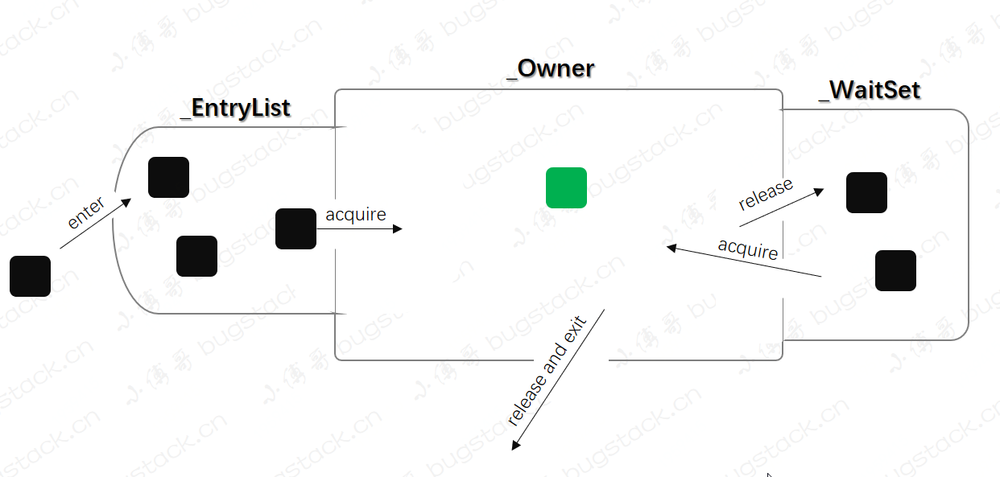

重量级锁的解锁调用了[ObjectMonitor.cpp](https://github.com/JetBrains/jdk8u_hotspot/blob/master/src/share/vm/runtime/objectMonitor.cpp)中的exit方法

```java
void ATTR ObjectMonitor::exit(TRAPS) {
   Thread * Self = THREAD ;
   if (THREAD != _owner) {
     if (THREAD->is_lock_owned((address) _owner)) {
       _owner = THREAD ;
       _recursions = 0 ;
       OwnerIsThread = 1 ;
     } else {
       TEVENT (Exit - Throw IMSX) ;
       if (false) {
          THROW(vmSymbols::java_lang_IllegalMonitorStateException());
       }
       return;
     }
   }
   if (_recursions != 0) {
     _recursions--;        // 如果_recursions次数不为0.自减
     TEVENT (Inflated exit - recursive) ;
     return ;
   }
   if ((SyncFlags & 4) == 0) {
      _Responsible = NULL ;
   }
 
   for (;;) {
      if (Knob_ExitPolicy == 0) {
         OrderAccess::release_store_ptr (&_owner, NULL) ;   // drop the lock
         OrderAccess::storeload() ;                         
         if ((intptr_t(_EntryList)|intptr_t(_cxq)) == 0 || _succ != NULL) {
            TEVENT (Inflated exit - simple egress) ;
            return ;
         }
         TEVENT (Inflated exit - complex egress) ;
         if (Atomic::cmpxchg_ptr (THREAD, &_owner, NULL) != NULL) {
            return ;
         }
         TEVENT (Exit - Reacquired) ;
      } else {
         if ((intptr_t(_EntryList)|intptr_t(_cxq)) == 0 || _succ != NULL) {
            OrderAccess::release_store_ptr (&_owner, NULL) ;  
            OrderAccess::storeload() ;
            if (_cxq == NULL || _succ != NULL) {
                TEVENT (Inflated exit - simple egress) ;
                return ;
            }
            if (Atomic::cmpxchg_ptr (THREAD, &_owner, NULL) != NULL) {
               TEVENT (Inflated exit - reacquired succeeded) ;
               return ;
            }
            TEVENT (Inflated exit - reacquired failed) ;
         } else {
            TEVENT (Inflated exit - complex egress) ;
         }
      }
      ObjectWaiter * w = NULL ;
      int QMode = Knob_QMode ;
      if (QMode == 2 && _cxq != NULL) {
          /**
          *模式2:cxq队列的优先权大于EntryList，直接从cxq队列中取出一个线程结点，准备唤醒
          **/
          w = _cxq ;
          ExitEpilog (Self, w) ;
          return ;
      }
 
      if (QMode == 3 && _cxq != NULL) {
          /**
          *模式3:将cxq队列插入到_EntryList尾部
          **/
          w = _cxq ;
          for (;;) {
             //CAS操作取出cxq队列首结点
             ObjectWaiter * u = (ObjectWaiter *) Atomic::cmpxchg_ptr (NULL, &_cxq, w) ;
             if (u == w) break ;
             w = u ; //更新w，自旋
          }
          ObjectWaiter * q = NULL ;
          ObjectWaiter * p ;
          for (p = w ; p != NULL ; p = p->_next) {
              guarantee (p->TState == ObjectWaiter::TS_CXQ, "Invariant") ;
              p->TState = ObjectWaiter::TS_ENTER ; //改变ObjectWaiter状态
              //下面两句为cxq队列反向构造一条链，即将cxq变成双向链表
              p->_prev = q ;
              q = p ;
          }
          ObjectWaiter * Tail ;
          //获得_EntryList尾结点
          for (Tail = _EntryList ; Tail != NULL && Tail->_next != NULL ; Tail = Tail->_next) ;
          if (Tail == NULL) {
              _EntryList = w ;//_EntryList为空，_EntryList=w
          } else {
              //将w插入_EntryList队列尾部
              Tail->_next = w ;
              w->_prev = Tail ;
          }
   }
 
      if (QMode == 4 && _cxq != NULL) {
         /**
         *模式四：将cxq队列插入到_EntryList头部
         **/
          w = _cxq ;
          for (;;) {
             ObjectWaiter * u = (ObjectWaiter *) Atomic::cmpxchg_ptr (NULL, &_cxq, w) ;
             if (u == w) break ;
             w = u ;
          }
          ObjectWaiter * q = NULL ;
          ObjectWaiter * p ;
          for (p = w ; p != NULL ; p = p->_next) {
              guarantee (p->TState == ObjectWaiter::TS_CXQ, "Invariant") ;
              p->TState = ObjectWaiter::TS_ENTER ;
              p->_prev = q ;
              q = p ;
          }
          if (_EntryList != NULL) {
            //q为cxq队列最后一个结点
              q->_next = _EntryList ;
              _EntryList->_prev = q ;
          }
          _EntryList = w ;
       }
 
      w = _EntryList  ;
      if (w != NULL) {
          ExitEpilog (Self, w) ;//从_EntryList中唤醒线程
          return ;
      }
      w = _cxq ;
      if (w == NULL) continue ; //如果_cxq和_EntryList队列都为空，自旋
 
      for (;;) {
          //自旋再获得cxq首结点
          ObjectWaiter * u = (ObjectWaiter *) Atomic::cmpxchg_ptr (NULL, &_cxq, w) ;
          if (u == w) break ;
          w = u ;
      }
      /**
      *下面执行的是：cxq不为空，_EntryList为空的情况
      **/
      if (QMode == 1) {//结合前面的代码，如果QMode == 1，_EntryList不为空，直接从_EntryList中唤醒线程
         // QMode == 1 : drain cxq to EntryList, reversing order
         // We also reverse the order of the list.
         ObjectWaiter * s = NULL ;
         ObjectWaiter * t = w ;
         ObjectWaiter * u = NULL ;
         while (t != NULL) {
             guarantee (t->TState == ObjectWaiter::TS_CXQ, "invariant") ;
             t->TState = ObjectWaiter::TS_ENTER ;
             //下面的操作是双向链表的倒置
             u = t->_next ;
             t->_prev = u ;
             t->_next = s ;
             s = t;
             t = u ;
         }
         _EntryList  = s ;//_EntryList为倒置后的cxq队列
      } else {
         // QMode == 0 or QMode == 2
         _EntryList = w ;
         ObjectWaiter * q = NULL ;
         ObjectWaiter * p ;
         for (p = w ; p != NULL ; p = p->_next) {
             guarantee (p->TState == ObjectWaiter::TS_CXQ, "Invariant") ;
             p->TState = ObjectWaiter::TS_ENTER ;
             //构造成双向的
             p->_prev = q ;
             q = p ;
         }
      }
      if (_succ != NULL) continue;
      w = _EntryList  ;
      if (w != NULL) {
          ExitEpilog (Self, w) ; //从_EntryList中唤醒线程
          return ;
      }
   }
}
```

#### 偏向锁、轻量级锁

synchronized的偏向锁、轻量级锁是通过改变对象头信息实现的，其底层代码在[synchronizer.cpp](https://github.com/JetBrains/jdk8u_hotspot/blob/master/src/share/vm/runtime/synchronizer.cpp)

- 偏向锁的加锁调用了fast_enter方法

  - 将对象头中的Mark Word的锁标志位修改为偏向锁
  - 在对象头的Mark Word中保存当前线程的id

  ```c++
  //偏向锁入口
  void ObjectSynchronizer::fast_enter(Handle obj, BasicLock* lock, bool attempt_rebias, TRAPS) {
   //UseBiasedLocking判断是否开启偏向锁
   if (UseBiasedLocking) {
      if (!SafepointSynchronize::is_at_safepoint()) {
        //获取偏向锁的函数调用
        BiasedLocking::Condition cond = BiasedLocking::revoke_and_rebias(obj, attempt_rebias, THREAD);
        if (cond == BiasedLocking::BIAS_REVOKED_AND_REBIASED) {
          return;
        }
      } else {
        assert(!attempt_rebias, "can not rebias toward VM thread");
        BiasedLocking::revoke_at_safepoint(obj);
      }
   }
   //不能偏向，就获取轻量级锁
   slow_enter (obj, lock, THREAD) ;
  }
  ```

- 轻量级锁的加锁调用了slow_enter方法

  - 将对象头中的Mark Word的锁标志位修改为轻量级锁
  - 将Mark Word写入当前线程栈的header
  - 将Mark Word更新为指向Lock Record的指针
  - owner指向Mark Word

  ```c++
  //轻量级锁入口
  void ObjectSynchronizer::slow_enter(Handle obj, BasicLock* lock, TRAPS) {
    markOop mark = obj->mark();  //获得Mark Word
    assert(!mark->has_bias_pattern(), "should not see bias pattern here");
    //是否无锁不可偏向，标志001
    if (mark->is_neutral()) {
      //图A步骤1
      lock->set_displaced_header(mark);
      //图A步骤2
      if (mark == (markOop) Atomic::cmpxchg_ptr(lock, obj()->mark_addr(), mark)) {
        TEVENT (slow_enter: release stacklock) ;
        return ;
      }
      // Fall through to inflate() ...
    } else if (mark->has_locker() && THREAD->is_lock_owned((address)mark->locker())) { //如果Mark Word指向本地栈帧，线程重入
      assert(lock != mark->locker(), "must not re-lock the same lock");
      assert(lock != (BasicLock*)obj->mark(), "don't relock with same BasicLock");
      lock->set_displaced_header(NULL);//header设置为null
      return;
    }
    lock->set_displace
   
    d_header(markOopDesc::unused_mark());
    //轻量级锁膨胀，膨胀完成之后尝试获取重量级锁
    ObjectSynchronizer::inflate(THREAD, obj())->enter(THREAD);
  }
  ```

  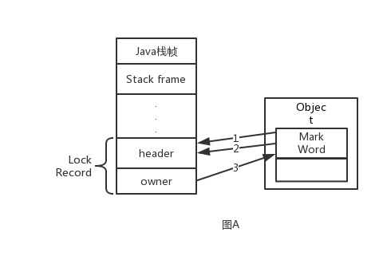

  1、将Mark Word写入header

  2、将Mark Word更新为指向Lock Record的指针

  3、owner指向Mark Word

- 偏向锁的解锁和轻量级锁的解锁都调用了fast_exit方法

  ```c++
  void ObjectSynchronizer::fast_exit(oop object, BasicLock* lock, TRAPS) {
    assert(!object->mark()->has_bias_pattern(), "should not see bias pattern here");
    markOop dhw = lock->displaced_header();
    markOop mark ;
    if (dhw == NULL) {//如果header为null，说明这是线程重入的栈帧，直接返回，不用回写
       mark = object->mark() ;
       assert (!mark->is_neutral(), "invariant") ;
       if (mark->has_locker() && mark != markOopDesc::INFLATING()) {
          assert(THREAD->is_lock_owned((address)mark->locker()), "invariant") ;
       }
       if (mark->has_monitor()) {
          ObjectMonitor * m = mark->monitor() ;
       }
       return ;
    }
   
    mark = object->mark() ;
    if (mark == (markOop) lock) {
       assert (dhw->is_neutral(), "invariant") ;
       //CAS将Mark Word内容写回
       if ((markOop) Atomic::cmpxchg_ptr (dhw, object->mark_addr(), mark) == mark) {
          TEVENT (fast_exit: release stacklock) ;
          return;
       }
    }
    //CAS操作失败，轻量级锁膨胀，为什么在撤销锁的时候会有失败的可能？
     ObjectSynchronizer::inflate(THREAD, object)->exit (THREAD) ;
  }
  
  void ObjectSynchronizer::slow_exit(oop object, BasicLock* lock, TRAPS) {
    fast_exit (object, lock, THREAD) ;
  }
  ```


### ReentrantLock底层原理

ReentrantLock是基于AQS实现的，其源码分析如下：

**无参构造器（默认为非公平锁）**

```java
public ReentrantLock() {
    sync = new NonfairSync();//默认是非公平的
}
```

**带布尔值的构造器（是否公平）**

```java
public ReentrantLock(boolean fair) {
    sync = fair ? new FairSync() : new NonfairSync();//fair为true，公平锁；反之，非公平锁
}
```

ReentrantLock内部定义了三个重要的静态内部类，Sync、NonFairSync、FairSync。Sync作为ReentrantLock中公用的同步组件，继承了AQS（要利用AQS复杂的顶层逻辑嘛，线程排队，阻塞，唤醒等等）；NonFairSync和FairSync则都继承Sync，调用Sync的公用逻辑，然后再在各自内部完成自己特定的逻辑（公平或非公平）。

**NonFairSync（非公平可重入锁）**

```java
static final class NonfairSync extends Sync {//继承Sync
    private static final long serialVersionUID = 7316153563782823691L;
    /** 获取锁 */
    final void lock() {
        if (compareAndSetState(0, 1))//CAS设置state状态，若原值是0，将其置为1
            setExclusiveOwnerThread(Thread.currentThread());//将当前线程标记为已持有锁
        else
            acquire(1);//若设置失败，调用AQS的acquire方法，acquire又会调用我们下面重写的tryAcquire方法。这里说的调用失败有两种情况：1当前没有线程获取到资源，state为0，但是将state由0设置为1的时候，其他线程抢占资源，将state修改了，导致了CAS失败；2 state原本就不为0，也就是已经有线程获取到资源了，有可能是别的线程获取到资源，也有可能是当前线程获取的，这时线程又重复去获取，所以去tryAcquire中的nonfairTryAcquire我们应该就能看到可重入的实现逻辑了。
    }
    protected final boolean tryAcquire(int acquires) {
        return nonfairTryAcquire(acquires);//调用Sync中的方法
    }
}

final boolean nonfairTryAcquire(int acquires) {
    final Thread current = Thread.currentThread();//获取当前线程
    int c = getState();//获取当前state值
    if (c == 0) {//若state为0，意味着没有线程获取到资源，CAS将state设置为1，并将当前线程标记我获取到排他锁的线程，返回true
        if (compareAndSetState(0, acquires)) {
            setExclusiveOwnerThread(current);
            return true;
        }
    }
    else if (current == getExclusiveOwnerThread()) {//若state不为0，但是持有锁的线程是当前线程
        int nextc = c + acquires;//state累加1
        if (nextc < 0) // int类型溢出了
            throw new Error("Maximum lock count exceeded");
        setState(nextc);//设置state，此时state大于1，代表着一个线程多次获锁，state的值即是线程重入的次数
        return true;//返回true，获取锁成功
    }
    return false;//获取锁失败了
}
```

简单总结下流程：

1. 先获取state值，若为0，意味着此时没有线程获取到资源，CAS将其设置为1，设置成功则代表获取到排他锁了；

2. 若state大于0，肯定有线程已经抢占到资源了，此时再去判断是否就是自己抢占的，是的话，state累加，返回true，重入成功，state的值即是线程重入的次数；

3. 其他情况，则获取锁失败。

**FairSync(可重入公平锁)**

```java
static final class FairSync extends Sync {
    private static final long serialVersionUID = -3000897897090466540L;

    final void lock() {
        acquire(1);//直接调用AQS的模板方法acquire，acquire会调用下面我们重写的这个tryAcquire
    }

    protected final boolean tryAcquire(int acquires) {
        final Thread current = Thread.currentThread();//获取当前线程
        int c = getState();//获取state值
        if (c == 0) {//若state为0，意味着当前没有线程获取到资源，那就可以直接获取资源了吗？NO!这不就跟之前的非公平锁的逻辑一样了嘛。看下面的逻辑
            if (!hasQueuedPredecessors() &&//判断在时间顺序上，是否有申请锁排在自己之前的线程，若没有，才能去获取，CAS设置state，并标记当前线程为持有排他锁的线程；反之，不能获取！这即是公平的处理方式。
                compareAndSetState(0, acquires)) {
                setExclusiveOwnerThread(current);
                return true;
            }
        }
        else if (current == getExclusiveOwnerThread()) {//重入的处理逻辑，与上文一致，不再赘述
            int nextc = c + acquires;
            if (nextc < 0)
                throw new Error("Maximum lock count exceeded");
            setState(nextc);
            return true;
        }
        return false;
    }
}

public final boolean hasQueuedPredecessors() {
    Node t = tail; // 尾结点
    Node h = head;//头结点
    Node s;
    return h != t &&
        ((s = h.next) == null || s.thread != Thread.currentThread());//判断是否有排在自己之前的线程
}
```

**可以看到，公平锁的大致逻辑与非公平锁是一致的，不同的地方在于有了!hasQueuedPredecessors()这个判断逻辑，即便state为0，也不能贸然直接去获取，要先去看有没有还在排队的线程，若没有，才能尝试去获取，做后面的处理。反之，返回false，获取失败。**

最后，来看看ReentrantLock的tryRelease，定义在Sync中

```java
protected final boolean tryRelease(int releases) {
    int c = getState() - releases;//减去1个资源
    if (Thread.currentThread() != getExclusiveOwnerThread())
        throw new IllegalMonitorStateException();
    boolean free = false;
    //若state值为0，表示当前线程已完全释放干净，返回true，上层的AQS会意识到资源已空出。若不为0，则表示线程还占有资源，只不过将此次重入的资源的释放了而已，返回false。
    if (c == 0) {
        free = true;//
        setExclusiveOwnerThread(null);
    }
    setState(c);
    return free;
}
```

#### lock

1、第一步。尝试去获取锁。如果尝试获取锁成功，方法直接返回。

2、第二步，入队。由于上文中提到线程A已经占用了锁，所以B和C执行tryAcquire失败，并且入等待队列。如果线程A拿着锁死死不放，那么B和C就会被挂起。

3、第三步，挂起。B和C相继执行acquireQueued(final Node node, int arg)。这个方法让已经入队的线程尝试获取锁，若失败则会被挂起。

线程入队后能够挂起的前提是，它的前驱节点的状态为SIGNAL，它的含义是“Hi，前面的兄弟，如果你获取锁并且出队后，记得把我唤醒！”。所以shouldParkAfterFailedAcquire会先判断当前节点的前驱是否状态符合要求，若符合则返回true，然后调用parkAndCheckInterrupt，将自己挂起。如果不符合，再看前驱节点是否>0(CANCELLED)，若是那么向前遍历直到找到第一个符合要求的前驱，若不是则将前驱节点的状态设置为SIGNAL。

 整个流程中，如果前驱结点的状态不是SIGNAL，那么自己就不能安心挂起，需要去找个安心的挂起点，同时可以再尝试下看有没有机会去尝试竞争锁。

最终队列可能会如下图所示

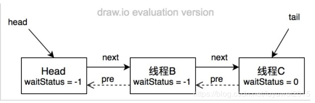

```java
static final class Node {
    /** waitStatus值，表示线程已被取消（等待超时或者被中断）*/
    static final int CANCELLED =  1;
    /** waitStatus值，表示后继线程需要被唤醒（unpaking）*/
    static final int SIGNAL    = -1;
    /**waitStatus值，表示结点线程等待在condition上，当被signal后，会从等待队列转移到同步到队列中 */
    /** waitStatus value to indicate thread is waiting on condition */
    static final int CONDITION = -2;
    /** waitStatus值，表示下一次共享式同步状态会被无条件地传播下去
        static final int PROPAGATE = -3;
        /** 等待状态，初始为0 */
    volatile int waitStatus;
    /**当前结点的前驱结点 */
    volatile Node prev;
    /** 当前结点的后继结点 */
    volatile Node next;
    /** 与当前结点关联的排队中的线程 */
    volatile Thread thread;
    /** ...... */
}
```

#### unlock

如果理解了加锁的过程，那么解锁看起来就容易多了。流程大致为先尝试释放锁，若释放成功，那么查看头结点的状态是否为SIGNAL，如果是则唤醒头结点的下个节点关联的线程，如果释放失败那么返回false表示解锁失败。这里我们也发现了，每次都只唤起头结点的下一个节点关联的线程。


## 请描述synchronized和ReentrantLock的异同 - 顺丰

**相同点：**

1、都是Java中的锁
2、都是可重入锁
3、加锁的目的是为了实现线程同步，保证线程安全。他们都是加锁方式同步，而且都是阻塞式同步，也就是说当一个线程获取对象锁之后，进入同步块，其他访问该同步块的线程都必须阻塞在该同步块外面等待，而进行线程阻塞和唤醒的代价是比较高的(操作系统需要在用户态和内核态之间来回切换，代价很高，不过可以通过对锁优化进行改善)。

**不同点：**

① **底层实现**上来说，synchronized 是**JVM**层面的锁，是**Java关键字**，通过monitor对象来完成（monitorenter与monitorexit），对象只有在同步块或同步方法中才能调用wait/notify方法，ReentrantLock 是从jdk1.5以来（java.util.concurrent.locks.Lock）提供的**API层面**的锁。

synchronized 的实现涉及到锁的升级，具体为无锁、偏向锁、自旋锁、向OS申请重量级锁，ReentrantLock实现则是通过利用CAS（CompareAndSwap）自旋机制保证线程操作的原子性和volatile保证数据可见性以实现锁的功能。

```java
synchronized (new Object()){

}

new ReentrantLock();
```

使用javap -c对如上代码进行反编译得到如下代码：

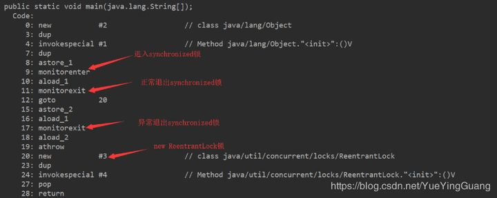

② **是否可手动释放：**

synchronized 不需要用户去手动释放锁，synchronized 代码执行完后系统会自动让线程释放对锁的占用； ReentrantLock则需要用户去手动释放锁，如果没有手动释放锁，就可能导致死锁现象。一般通过lock()和unlock()方法配合try/finally语句块来完成，使用释放更加灵活。

```java
private int number = 0;
private Lock lock = new ReentrantLock();
private Condition condition = lock.newCondition();
private AtomicInteger atomicInteger;

public void increment() throws Exception {
    lock.lock();
    try {

        while (number != 0) {
            condition.await();
        }
        //do something
        number++;
        System.out.println(Thread.currentThread().getName() + "\t" + number);
        condition.signalAll();
    } catch (Exception e) {
        e.printStackTrace();
    } finally {
        lock.unlock();
    }

}
```

③ **是否可中断**

synchronized是不可中断类型的锁，除非加锁的代码中出现异常或正常执行完成； ReentrantLock则可以中断，可通过trylock(long timeout,TimeUnit unit)设置超时方法，时间过了就放弃等待；或者将lockInterruptibly()放到代码块中，调用interrupt方法进行中断。

```java
public boolean tryLock(long timeout, TimeUnit unit) throws InterruptedException {
    return sync.tryAcquireNanos(1, unit.toNanos(timeout));
}
public void lockInterruptibly() throws InterruptedException {
    sync.acquireInterruptibly(1);
}
```

ReentrantLock中的lockInterruptibly()方法使得线程可以在被阻塞时响应中断，比如一个线程t1通过lockInterruptibly()方法获取到一个可重入锁，并执行一个长时间的任务，另一个线程通过interrupt()方法就可以立刻打断t1线程的执行，来获取t1持有的那个可重入锁。而通过ReentrantLock的lock()方法或者synchronized持有锁的线程是不会响应其他线程的interrupt()方法的，直到该方法主动释放锁之后才会响应interrupt()方法。下面看一个示例：

```java
import java.util.concurrent.TimeUnit;
import java.util.concurrent.locks.ReentrantLock;
 
/**
 * 测试ReentrantLock可中断锁的效果
 */
public class ThreadInteruptExample {
    ReentrantLock lock1=new ReentrantLock();
    ReentrantLock lock2=new ReentrantLock();
 
    /**
     * ReentrantLock响应中断
     * @throws Exception
     */
    public void reentrantLockInterupt() throws Exception{
        Thread t1=new Thread(new ReentrantLockTask(lock1,lock2));
        Thread t2=new Thread(new ReentrantLockTask(lock2,lock1));
        t1.start();
        t2.start();
        System.out.println(t1.getName()+"中断");
        //主线程睡眠1秒，避免线程t1直接响应run方法中的睡眠中断
        Thread.sleep(1000);
        t1.interrupt();
        //阻塞主线程，避免所有线程直接结束，影响死锁效果
        Thread.sleep(10000);
    }
 
 
    /**
     * Synchronized响应中断
     * @throws Exception
     */
    public void synchronizedInterupt() throws Exception{
        Object syn1=new Object();
        Object syn2=new Object();
        Thread t1=new Thread(new SynchronizedTask(syn1,syn2));
        Thread t2=new Thread(new SynchronizedTask(syn2,syn1));
        t1.start();
        t2.start();
        System.out.println(t1.getName()+"中断");
        //主线程睡眠1秒，避免线程t1直接响应run方法中的睡眠中断
        Thread.sleep(1000);
        t1.interrupt();
        //阻塞主线程，避免所有线程直接结束，影响死锁效果
        Thread.sleep(1000);
    }
 
    /**
     * ReentrantLock实现死锁
     */
    static class ReentrantLockTask implements Runnable{
 
        ReentrantLock lock1;
        ReentrantLock lock2;
 
        public ReentrantLockTask(ReentrantLock lock1, ReentrantLock lock2){
            this.lock1=lock1;
            this.lock2=lock2;
        }
 
        @Override
        public void run() {
            try {
                //可中断的获取锁
                lock1.lockInterruptibly();
                //lock1.lock();
                //睡眠200毫秒，保证两个线程分别已经获取到两个锁，实现相互的锁等待
                TimeUnit.MILLISECONDS.sleep(200);
                //lock2.lock();
                //可中断的获取锁
                lock2.lockInterruptibly();
            } catch (InterruptedException e) {
                e.printStackTrace();
            }finally {
                lock1.unlock();
                lock2.unlock();
                System.out.println("线程"+Thread.currentThread().getName()+"正常结束");
            }
 
        }
    }
 
    /**
     * Synchronized实现死锁
     */
    static class SynchronizedTask implements Runnable{
 
        Object lock1;
        Object lock2;
 
        public SynchronizedTask(Object lock1, Object lock2){
            this.lock1=lock1;
            this.lock2=lock2;
        }
 
        @Override
        public void run() {
            try {
                synchronized (lock1){
                    //睡眠200毫秒，再获取另一个锁，
                    //保证两个线程分别已经获取到两个锁，实现相互的锁等待
                    Thread.sleep(200);
                    synchronized (lock2){
                    }
                }
            } catch (InterruptedException e) {
                e.printStackTrace();
            }finally {
                System.out.println("线程"+Thread.currentThread().getName()+"正常结束");
            }
 
        }
    }
 
    public static void main(String[] args) throws Exception {
        ThreadInteruptExample demo=new ThreadInteruptExample();
        ThreadInteruptExample demo1=new ThreadInteruptExample();
        demo.reentrantLockInterupt();
        demo1.synchronizedInterupt();
    }
 
}
```

响应中断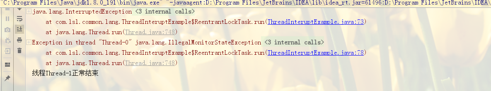

 执行完毕才响应中断-现象死锁


 ④ **是否公平锁**

synchronized为非公平锁 ReentrantLock则即可以选公平锁也可以选非公平锁，通过构造方法new ReentrantLock时传入boolean值进行选择，为空默认false非公平锁，true为公平锁。

```java
/**
* Creates an instance of {@code ReentrantLock}.
* This is equivalent to using {@code ReentrantLock(false)}.
*/
public ReentrantLock() {
    sync = new NonfairSync();
}

/**
* Creates an instance of {@code ReentrantLock} with the
* given fairness policy.
*
* @param fair {@code true} if this lock should use a fair ordering policy
*/
public ReentrantLock(boolean fair) {
    sync = fair ? new FairSync() : new NonfairSync();
}
```

⑤ **锁是否可绑定条件Condition**

synchronized不能绑定； ReentrantLock通过绑定Condition结合await()/singal()方法实现线程的精确唤醒，而不是像synchronized通过Object类的wait()/notify()/notifyAll()方法要么随机唤醒一个线程要么唤醒全部线程。

```java
示例：用ReentrantLock绑定三个条件实现线程A打印一次1，线程B打印两次2，线程C打印三次3
class Resource {
    private int number = 1;//A:1  B:2  C:3
    private Lock lock = new ReentrantLock();
    private Condition c1 = lock.newCondition();
    private Condition c2 = lock.newCondition();
    private Condition c3 = lock.newCondition();

    //1 判断
    public void print1() {

        lock.lock();

        try {
            //判断
            while (number != 1) {
                c1.await();
            }
            //2 do sth
            for (int i = 1; i < 2; i++) {
                System.out.println(Thread.currentThread().getName() + "\t" + number);
            }

            //3 通知
            number = 2;
            c2.signal();
        } catch (Exception e) {
            e.printStackTrace();
        } finally {
            lock.unlock();
        }
    }

    //1 判断
    public void print2() {

        lock.lock();

        try {
            //判断
            while (number != 2) {
                c2.await();
            }
            //2 do sth
            for (int i = 1; i < 3; i++) {
                System.out.println(Thread.currentThread().getName() + "\t" + number);
            }

            //3 通知
            number = 3;
            c3.signal();
        } catch (Exception e) {
            e.printStackTrace();
        } finally {
            lock.unlock();
        }
    }

    //1 判断
    public void print3() {

        lock.lock();

        try {
            //判断
            while (number != 3) {
                c3.await();
            }
            //2 do sth
            for (int i = 1; i < 4; i++) {
                System.out.println(Thread.currentThread().getName() + "\t" + number);
            }

            //3 通知
            number = 1;
            c1.signal();
        } catch (Exception e) {
            e.printStackTrace();
        } finally {
            lock.unlock();
        }
    }
}

public static void main(String[] args) {
    Resource resource = new Resource();

    new Thread(()->{
        for (int i = 1; i <= 2; i++) {
            resource.print1();
        }
    },"A").start();


    new Thread(()->{
        for (int i = 1; i <= 2; i++) {
            resource.print2();
        }
    },"B").start();


    new Thread(()->{
        for (int i = 1; i <= 2; i++) {
            resource.print3();
        }
    },"C").start();
}
```

输出结果为：

A 1 B 2 B 2 C 3 C 3 C 3 A 1 B 2 B 2 C 3 C 3 C 3

⑥ **锁的对象**

synchronzied锁的是对象，锁是保存在对象头里面的，根据对象头数据来标识是否有线程获得锁/争抢锁；ReentrantLock锁的是线程，根据进入的线程和int类型的state标识锁的获得/争抢。

⑦**灵活性**

synchronized锁的范围是整个方法或synchronized块部分，ReentrantLock因为是方法调用，可以跨方法，灵活性更大。

⑧**提供的高级功能**

ReentrantLock提供很多方法用来监听当前锁的信息，如：

```java
getHoldCount() 
getQueueLength()
isFair()
isHeldByCurrentThread()
isLocked()
```

总结：

| 比较方面         | SynChronized                                                 | ReentrantLock（实现了 Lock接口）                             |
| ---------------- | ------------------------------------------------------------ | ------------------------------------------------------------ |
| 1.原始构成       | 1.它是java语言的关键字，是原生语法层面的互斥，需要jvm实现    | 它是JDK 1.5之后提供的API层面的互斥锁类                       |
| 2.代码编写       | 2.采用synchronized不需要用户去手动释放锁，当synchronized方法或者synchronized代码块执行完之后，系统会自动让线程释放对锁的占用，更安全， | 而ReentrantLock则必须要用户去手动释放锁，如果没有主动释放锁，就有可能导致出现死锁现象。需要lock()和unlock()方法配合try/finally语句块来完成， |
| 3.灵活性         | 锁的范围是整个方法或synchronized块部分                       | Lock因为是方法调用，可以跨方法，灵活性更大                   |
| 4.等待可中断     | 不可中断，除非抛出异常(释放锁方式：    1.代码执行完，正常释放锁；    2.抛出异常，由JVM退出等待) | 持有锁的线程长期不释放的时候，正在等待的线程可以选择放弃等待,(方法：   1.设置超时方法 tryLock(long timeout, TimeUnit unit)，时间过了就放弃等待；   2.lockInterruptibly()放代码块中，调用interrupt()方法可中断，而synchronized不行) |
| 5.是否公平锁     | 非公平锁                                                     | 两者都可以，默认公平锁，构造器可以传入boolean值，true为公平锁，false为非公平锁， |
| 6.条件Condition  |                                                              | 通过多次newCondition可以获得多个Condition对象,可以简单的实现比较复杂的线程同步的功能. |
| 7.提供的高级功能 |                                                              | 提供很多方法用来监听当前锁的信息，如：` getHoldCount()  getQueueLength() isFair() isHeldByCurrentThread() isLocked()` |

## CAS是什么、CAS的ABA问题如何解决 - 百度 美团

**CAS的含义**

CAS是compare and swap的缩写，即我们所说的比较交换。CAS机制中使用了3个基本操作数：内存地址V，旧的预期值A，需要替换的值B。当需要更新一个变量的值的时候，只有当变量的预期值A和内存地址V中的实际值相同的时候，才会把内存地址V对应的值替换成B。

我们可以来看一个例子：

1、在内存地址V当中，存储着值为10的变量


2、此时线程1想要把变量的值增加1，对于线程1而言，它旧的预期值A=10，需要替换的最新值B=11。

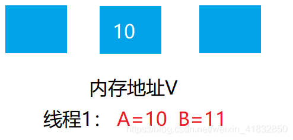

3、在线程1要提交更新之前，另外一个线程2抢先一步，将内存地址V中的值更新成了11。

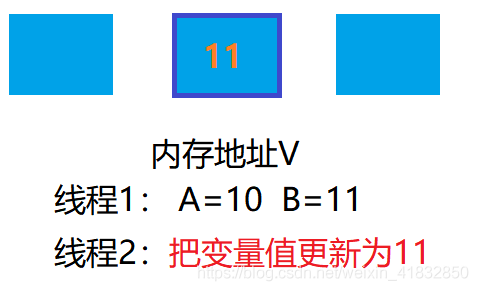

4、线程1开始提交更新的时候，按照CAS机制，首先进行A的值与内存地址V中的值进行比较，发现A不等于V中的实际值，于是提交失败。

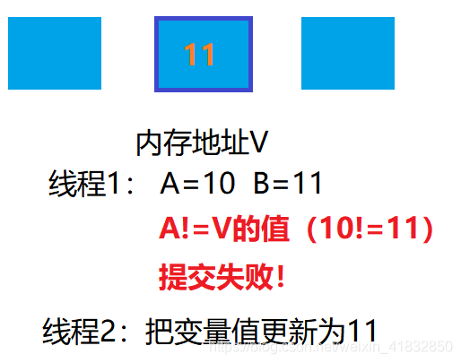

5.线程1重新获取内存地址V的当前值，并重新计算想要修改的值。在现在而言，线程1旧的预期值A=11，B=12.这个重新尝试的过程被称为**自旋**。

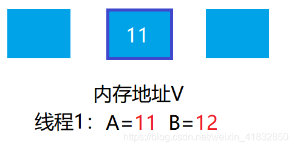

6、这一次比较幸运，没有其他线程改变该变量的值，所以线程1进行CAS机制，比较旧的预期值A与内存地址V中的值，发现相同，此时可以替换。


7、线程1进行替换，把地址V的值替换成B，也就是12。

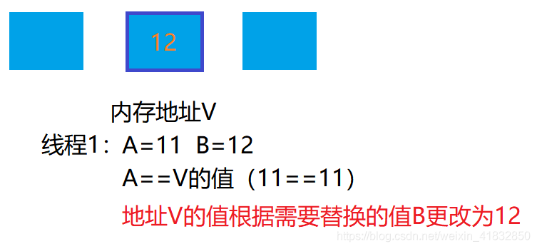

从思想上来看，synchronized属于悲观锁，悲观的认为程序中的并发问题十分严重，所以严防死守，只让一个线程操作该代码块。而CAS属于乐观锁，乐观地认为程序中的并发问题并不那么严重，所以让线程不断的去尝试更新。

在java中除了上面提到的Atomic操作类，以及Lock系列类的底层实现，甚至在jdk1.6以上，在synchronized转变为重量级锁之前，也会采用CAS机制。

CAS的优点自然是在并发问题不严重的时候性能比synchronized要快，缺点也有。

**CAS的问题**

1、CAS容易造成ABA问题。一个线程a将数值改成了b，接着又改成了a，此时CAS认为是没有变化，其实是已经变化过了，而这个问题的解决方案可以使用版本号标识，每操作一次version加1。在java5中，已经提供了AtomicStampedReference来解决问题。

2、CPU开销过大。在并发量比较高的时候，如果许多线程都尝试去更新一个变量的值，却又一直比较失败，导致提交失败，产生自旋，循环往复，会对CPU造成很大的压力和开销。

3、不能确保代码块的原子性（注意是代码块）。CAS机制所确保的是一个变量的原子性操作，而不能保证整个代码块的原子性，比如需要保证3个变量共同进行原子性的更新，就不得不使用synchronized或者lock了。

**ABA问题：**

1、假设内存中有一个值为A的变量，存储在内存地址V中。


2、此时有三个线程想要使用CAS的方式更新这个变量的值，每个线程的执行时间有略微偏差。线程1和线程2已经获取当前值，线程3还未获取当前值。

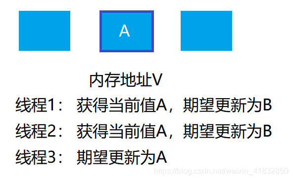

3、接下来，线程1先一步执行成功，把当前值成功从A更新为B；同时线程2因某种原因阻塞住，没有做更新操作，此时线程3在线程1更新之后，获取了当前值B。


4、在之后，线程2仍然处于阻塞状态，线程3继续执行，成功把当前值从B更新成A。

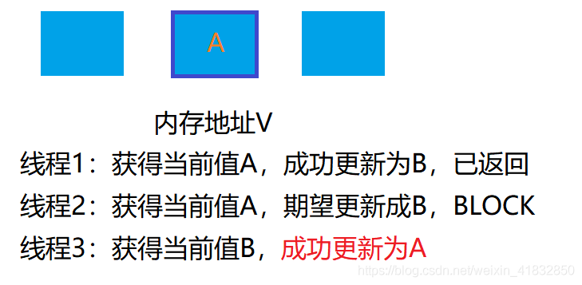

5、最后，线程2终于恢复了运行状态，由于阻塞之前已经获得到了”当前值A“，并且经过compare检测，内存地址V中的实际值也是A，所以成功把变量A的值更新为B。

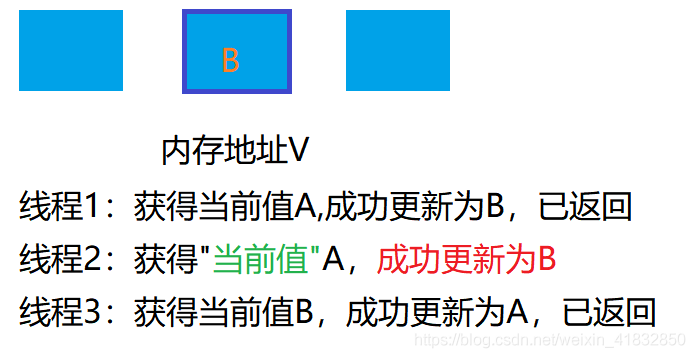

看起来这个例子没有什么问题，但如果结合实际，就可以发现它的问题所：我们假设一个取款机的例子。假如有一个遵循CAS机制的取款机。小肖有100元存款，需要提取50元。但由于取款机硬件出现了问题，导致取款操作同时提交了两遍，开启了两个线程，两个线程都是获取当前值100元，要更新成50元。理想情况下，应该一个线程更新成功，一个线程更新失败，小肖的存款只扣除一次，余额为50。

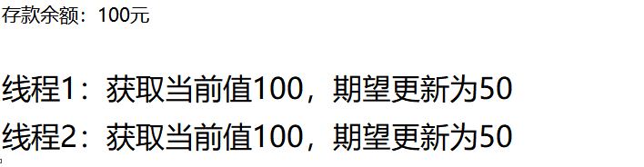

线程1首先执行成功，把余额100更新为50，同时线程2由于某种原因陷入了阻塞状态，这时候，小肖的妈妈汇款给了小肖50元。


线程2仍然是阻塞状态，线程3此时执行成功，把余额从50改成了100.


这时候，线程2恢复运行，由于之前阻塞的时候获得了”当前值“100，并且经过compare检测，此时存款也的确是100元，所以成功把变量值从100更新成50。


原本线程2应当提交失败，小肖的正确余额应该保持100元，结果由于ABA问题，最终小肖的余额为50元。

**添加版本号解决ABA问题**

真正要做到严谨的CAS机制，我们在compare阶段不仅需要比较内存地址V中的值是否和旧的期望值A相同，还需要比较变量的版本号是否一致。

我们仍然以刚才的例子来说明，假设地址V中存储着变量值A，当前版本号是01，线程1获取了当前值A和版本号01，想要更新为B，此时线程1陷入了阻塞状态。


这时候，内存地址V中的变量进行了多次改变，版本号提升到03，但是变量值仍然是A。


随后，线程1恢复运行，进行compare操作。首先经过比较，内存地址V中的值与当前值A相同，但是版本号不相同，所以这一次更新失败。

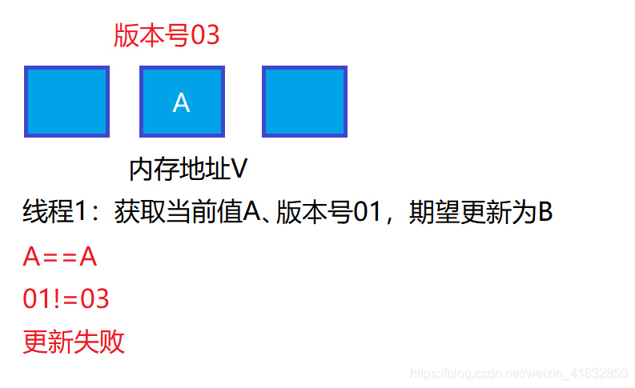

在Java中，AtomicStampedReference类就实现了用版本号做比较的CAS机制。

总结：**当一个值从A更新为B，再从B更新为A，普通CAS机制会误判通过检测。解决方案是使用版本号，通过比较值和版本号才判断是否可以替换。**


## 请谈一下AQS，为什么AQS的底层是CAS + volatile- 百度

AQS的全称为（AbstractQueuedSynchronizer，抽象队列同步器），这个类在java.util.concurrent.locks包下面。AQS是一个用来构建锁和同步器的框架，比如ReentrantLock，Semaphore，ReentrantReadWriteLock，SynchronousQueue，FutureTask等等皆是基于AQS的。

AQS是基于volatile+cas实现的，如果需要线程阻塞等待，唤醒机制，则使用LockSupport的park()和unpark()方法挂起、唤醒线程。

```java
public abstract class AbstractQueuedSynchronizer
    extends AbstractOwnableSynchronizer
    implements java.io.Serializable {
    // 继承自AbstractOwnableSynchronizer
    /**
     * The current owner of exclusive mode synchronization.
     */
    private transient Thread exclusiveOwnerThread;
    
    /**
     * Head of the wait queue, lazily initialized.  Except for
     * initialization, it is modified only via method setHead.  Note:
     * If head exists, its waitStatus is guaranteed not to be
     * CANCELLED.
     */
    private transient volatile Node head;

    /**
     * Tail of the wait queue, lazily initialized.  Modified only via
     * method enq to add new wait node.
     */
    private transient volatile Node tail;

    /**
     * The synchronization state.
     */
    private volatile int state;
    
    /**
     * Wait queue node class.
     *
     * <p>The wait queue is a variant of a "CLH" (Craig, Landin, and
     * Hagersten) lock queue. CLH locks are normally used for
     * spinlocks.  We instead use them for blocking synchronizers, but
     * use the same basic tactic of holding some of the control
     * information about a thread in the predecessor of its node.  A
     * "status" field in each node keeps track of whether a thread
     * should block.  A node is signalled when its predecessor
     * releases.  Each node of the queue otherwise serves as a
     * specific-notification-style monitor holding a single waiting
     * thread. The status field does NOT control whether threads are
     * granted locks etc though.  A thread may try to acquire if it is
     * first in the queue. But being first does not guarantee success;
     * it only gives the right to contend.  So the currently released
     * contender thread may need to rewait.
     *
     * <p>To enqueue into a CLH lock, you atomically splice it in as new
     * tail. To dequeue, you just set the head field.
     * <pre>
     *      +------+  prev +-----+       +-----+
     * head |      | <---- |     | <---- |     |  tail
     *      +------+       +-----+       +-----+
     * </pre>
     *
     * <p>Insertion into a CLH queue requires only a single atomic
     * operation on "tail", so there is a simple atomic point of
     * demarcation from unqueued to queued. Similarly, dequeuing
     * involves only updating the "head". However, it takes a bit
     * more work for nodes to determine who their successors are,
     * in part to deal with possible cancellation due to timeouts
     * and interrupts.
     *
     * <p>The "prev" links (not used in original CLH locks), are mainly
     * needed to handle cancellation. If a node is cancelled, its
     * successor is (normally) relinked to a non-cancelled
     * predecessor. For explanation of similar mechanics in the case
     * of spin locks, see the papers by Scott and Scherer at
     * http://www.cs.rochester.edu/u/scott/synchronization/
     *
     * <p>We also use "next" links to implement blocking mechanics.
     * The thread id for each node is kept in its own node, so a
     * predecessor signals the next node to wake up by traversing
     * next link to determine which thread it is.  Determination of
     * successor must avoid races with newly queued nodes to set
     * the "next" fields of their predecessors.  This is solved
     * when necessary by checking backwards from the atomically
     * updated "tail" when a node's successor appears to be null.
     * (Or, said differently, the next-links are an optimization
     * so that we don't usually need a backward scan.)
     *
     * <p>Cancellation introduces some conservatism to the basic
     * algorithms.  Since we must poll for cancellation of other
     * nodes, we can miss noticing whether a cancelled node is
     * ahead or behind us. This is dealt with by always unparking
     * successors upon cancellation, allowing them to stabilize on
     * a new predecessor, unless we can identify an uncancelled
     * predecessor who will carry this responsibility.
     *
     * <p>CLH queues need a dummy header node to get started. But
     * we don't create them on construction, because it would be wasted
     * effort if there is never contention. Instead, the node
     * is constructed and head and tail pointers are set upon first
     * contention.
     *
     * <p>Threads waiting on Conditions use the same nodes, but
     * use an additional link. Conditions only need to link nodes
     * in simple (non-concurrent) linked queues because they are
     * only accessed when exclusively held.  Upon await, a node is
     * inserted into a condition queue.  Upon signal, the node is
     * transferred to the main queue.  A special value of status
     * field is used to mark which queue a node is on.
     *
     * <p>Thanks go to Dave Dice, Mark Moir, Victor Luchangco, Bill
     * Scherer and Michael Scott, along with members of JSR-166
     * expert group, for helpful ideas, discussions, and critiques
     * on the design of this class.
     */
    static final class Node {
        /** Marker to indicate a node is waiting in shared mode */
        static final Node SHARED = new Node();
        /** Marker to indicate a node is waiting in exclusive mode */
        static final Node EXCLUSIVE = null;

        /** waitStatus value to indicate thread has cancelled */
        static final int CANCELLED =  1;
        /** waitStatus value to indicate successor's thread needs unparking */
        static final int SIGNAL    = -1;
        /** waitStatus value to indicate thread is waiting on condition */
        static final int CONDITION = -2;
        /**
         * waitStatus value to indicate the next acquireShared should
         * unconditionally propagate
         */
        static final int PROPAGATE = -3;

        /**
         * Status field, taking on only the values:
         *   SIGNAL:     The successor of this node is (or will soon be)
         *               blocked (via park), so the current node must
         *               unpark its successor when it releases or
         *               cancels. To avoid races, acquire methods must
         *               first indicate they need a signal,
         *               then retry the atomic acquire, and then,
         *               on failure, block.
         *   CANCELLED:  This node is cancelled due to timeout or interrupt.
         *               Nodes never leave this state. In particular,
         *               a thread with cancelled node never again blocks.
         *   CONDITION:  This node is currently on a condition queue.
         *               It will not be used as a sync queue node
         *               until transferred, at which time the status
         *               will be set to 0. (Use of this value here has
         *               nothing to do with the other uses of the
         *               field, but simplifies mechanics.)
         *   PROPAGATE:  A releaseShared should be propagated to other
         *               nodes. This is set (for head node only) in
         *               doReleaseShared to ensure propagation
         *               continues, even if other operations have
         *               since intervened.
         *   0:          None of the above
         *
         * The values are arranged numerically to simplify use.
         * Non-negative values mean that a node doesn't need to
         * signal. So, most code doesn't need to check for particular
         * values, just for sign.
         *
         * The field is initialized to 0 for normal sync nodes, and
         * CONDITION for condition nodes.  It is modified using CAS
         * (or when possible, unconditional volatile writes).
         */
        volatile int waitStatus;

        /**
         * Link to predecessor node that current node/thread relies on
         * for checking waitStatus. Assigned during enqueuing, and nulled
         * out (for sake of GC) only upon dequeuing.  Also, upon
         * cancellation of a predecessor, we short-circuit while
         * finding a non-cancelled one, which will always exist
         * because the head node is never cancelled: A node becomes
         * head only as a result of successful acquire. A
         * cancelled thread never succeeds in acquiring, and a thread only
         * cancels itself, not any other node.
         */
        volatile Node prev;

        /**
         * Link to the successor node that the current node/thread
         * unparks upon release. Assigned during enqueuing, adjusted
         * when bypassing cancelled predecessors, and nulled out (for
         * sake of GC) when dequeued.  The enq operation does not
         * assign next field of a predecessor until after attachment,
         * so seeing a null next field does not necessarily mean that
         * node is at end of queue. However, if a next field appears
         * to be null, we can scan prev's from the tail to
         * double-check.  The next field of cancelled nodes is set to
         * point to the node itself instead of null, to make life
         * easier for isOnSyncQueue.
         */
        volatile Node next;

        /**
         * The thread that enqueued this node.  Initialized on
         * construction and nulled out after use.
         */
        volatile Thread thread;

        /**
         * Link to next node waiting on condition, or the special
         * value SHARED.  Because condition queues are accessed only
         * when holding in exclusive mode, we just need a simple
         * linked queue to hold nodes while they are waiting on
         * conditions. They are then transferred to the queue to
         * re-acquire. And because conditions can only be exclusive,
         * we save a field by using special value to indicate shared
         * mode.
         */
        Node nextWaiter;
    }
    
    public class ConditionObject implements Condition, java.io.Serializable {
    	//条件队列;Node 复用了AQS中定义的Node
        private transient Node firstWaiter;
        private transient Node lastWaiter;
    }
}
```

- AQS使用成员变量exclusiveOwnerThread来记录占有该锁的线程
- 使用成员变量state来表示同步状态，通过CAS完成对state值的修改
- 通过内置的CLH队列来完成资源获取的排队工作（队列中的元素就是包装了线程的Node），同步队列中首节点是获取到锁的节点，它在释放锁的时会唤醒后继节点，后继节点获取到锁的时候，会把自己设为首节点
- 在AQS还存一个ConditionObject的内部类，它的使用机制和Object.wait、notify类似
- AQS中提供几个重要的方法:
  - tryAcquire获取锁
  - addWaiter获取锁失败后把当前线程放入队列中
  - acquireQueued使线程在等待队列中获取资源，一直获取到资源后才返回
  - tryRelease解锁

```java
public final void acquire(int arg) {
    if (!tryAcquire(arg) &&
        acquireQueued(addWaiter(Node.EXCLUSIVE), arg))
        selfInterrupt();
}

public final boolean release(int arg) {
    if (tryRelease(arg)) {
        Node h = head;
        if (h != null && h.waitStatus != 0)
            unparkSuccessor(h);
        return true;
    }
    return false;
}
```

```java
protected boolean tryAcquire(int arg);//尝试独占性加锁
protected boolean tryRelease(int arg);//对应tryAcquire释放锁
protected int tryAcquireShared(int arg);//尝试共享性加锁
protected boolean tryReleaseShared(int arg);//对应tryAcquireShared释放锁
protected boolean isHeldExclusively();//该线程是否正在独占资源，只有用到condition才需要取实现它
```

**为什么AQS的底层是CAS + volatile？**

- volatile保证了代码的可见性，例如加锁状态需要保证对其他线程是可见的
- cas机制保证变量操作是原子性的，保证线程的安全


## 请谈一下你对volatile的理解，volatile的可见性和禁止指令重排序是如何实现的 - 美团 阿里

**volatile**

Java中提供了一个关键字volatile，这个关键字能够保证线程可见性和禁止指令重排序

**volatile保证可见性**

volatile其实就是利用了缓存一致性协议，一旦某个变量被volatile修饰，那么一旦这个变量被线程修改，其他线程锁保持的该变量的缓存就会失效，需要从内存中获取最新值。如下案例：

```java
public class TestVolatile {
    private static /*volatile*/ boolean flag = false;

    public static void main(String[] args) throws InterruptedException {
        new Thread(() -> {
            while (true) {
                if (flag) {
                    break;
                }
            }
            System.out.println("m end");
        }).start();

        // 1s后由另一个线程修改flag的值
        Thread.sleep(1000);
        flag = true;
    }
}
```

两个线程共享变量flag，其中一个线程在做无限循环，直到flag为true时跳出循环，1s后另一个线程将flag改为true，如果flag不加volatile修饰，执行程序会发现程序停不下来。而如果用volatile修饰flag，程序大约会在1s后结束并打印“m end”。

**volatile禁止指令重排序**

利用volatile来禁止指令重排序的一个经典案例就是双重检查锁单例（DCL），代码如下:

```java
class Singleton{
    private volatile static Singleton singleton;

    private Singleton(){}

    public static Singleton getInstance(){
        if(singleton == null){
            synchronized (Singleton.class){
                if(singleton == null){
                    singleton = new Singleton();
                }
            }
        }
        return singleton;
    }
}
```

双重检查锁通过两次判空以及加synchronized锁来实现单例对象的创建，为了降低锁的粒度，只在创建对象的核心代码块外加synchronized。线程进入getInstance方法后，先判断singleton是否为null，如果为null，则尝试获取锁，如果获取到了锁，则进入synchronized代码块，此时第二次判断singleton是否为null，原因是可能会有多个线程同时进入了第一个if条件，第二个if判断能够保证只有一个线程能够创建对象。

单例模式不是这里重点，重点是静态变量singleton前面的修饰符为什么一定要加上volatile？下面有一个最简单的创建对象的代码：

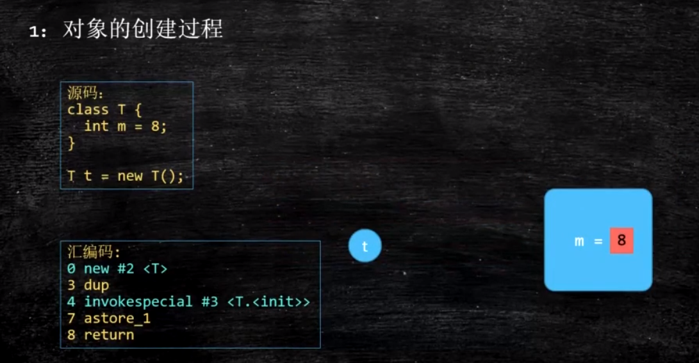

第一步new代表为对象分配内存，期间会将成员变量都设为默认值，成员m=0，此时对象还处于半初始化状态；第二步是执行构造方法，这一步会初始化成员变量，为成员变量赋予正确的值，此时m=8；第三步`astore_1`会将创建好的对象与栈中的变量t建立连接，也就是将t指向对象地址。

这个时候再看DCL代码，结合前面分析的，在创建Singleton对象的过程中，指令可能会发生重排序，第一步分配内存必然先执行，但是`invokespecial #3 <T.<init>>`和`astore_1`的执行顺序可能会颠倒，如果`astore_1`先执行，那么在很短的一段时间内变量Singleton就会指向一个还未完全初始化的半初始化对象，而这个半初始化对象是在内存中实际存在的，它!=null，假如此时另一个线程进入方法判断`singleton==null`不成立，就会将对象返回，如果对象被用于其他重要用途，则可能会带来严重的问题，因此为了规避指令重排序带来的将半初始化对象返回的问题，必须在单例对象前加修饰符volatile。

**为什么，synchronized 也有有序性的特点，还需要 volatile 关键字？**

因为，synchronized 的有序性，不是 volatile 的防止指令重排序。

那如果不加 volatile 关键字可能导致的结果，就是第一个线程在初始化初始化对象，设置 instance 指向内存地址时。第二个线程进入时，有指令重排。在判断 if (instance == null) 时就会有出错的可能，因为这会可能 instance 可能还没有初始化成功。

**Java是如何禁止指令重排序的呢？**

JVM通过给指令前后加上内存屏障，屏障两边的指令不可以重排序，保证有序。

**内存屏障**

**JVM层面：**JVM规定，在对volatile修饰的内存区域进行读写时，需要加屏障，也就是会在两条指令之间加一层特殊的屏障，阻止两条指令交换执行顺序，Java中的JSR（Java Specification Requests）规范规定的内存屏障有以下四种：

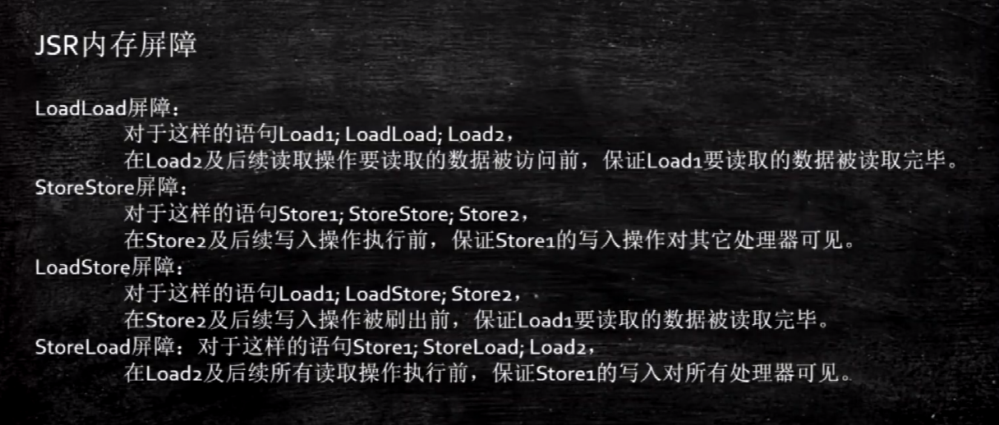

上面几种屏障的大致意思就是在写操作或读操作前后加上屏障，等完全执行完毕之后才可以进行下一步操作，也就是保证了指令必须有序执行。


这里的内存屏障只是Java的规定，在**CPU层面**会提供硬件支持：

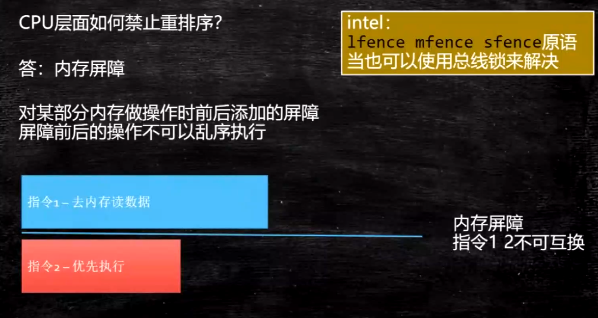


不同版本的JVM可能会有不同的实现，例如hotspot虚拟机则是利用CPU的自带指令lock，lock指令用于在多处理器中执行指令时对共享内存的独占使用，它的作用是能够将当前处理器对应缓存的内容刷新到内存，并使其他处理器对应的缓存失效。另外还提供了有序的指令无法越过这个内存屏障的作用。下图是hotspot中关于内存屏障的实现源码：
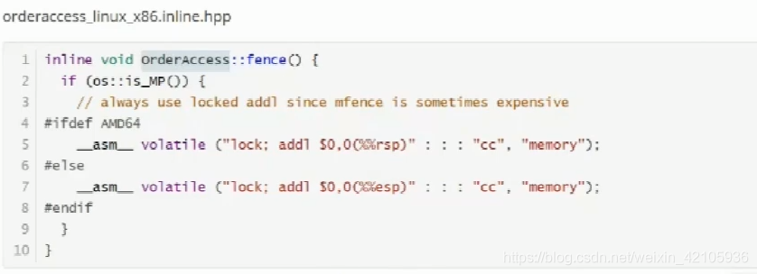


## DCL单例为什么要加volatile - 美团


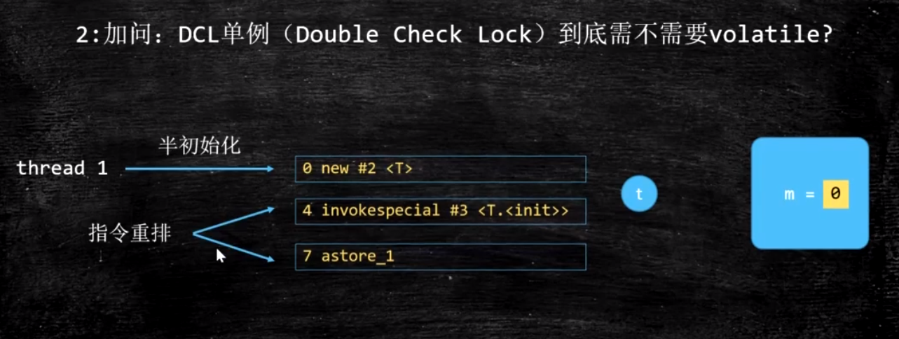

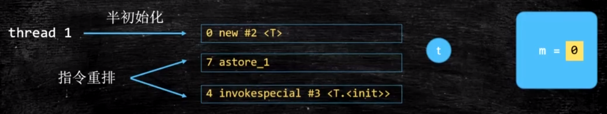

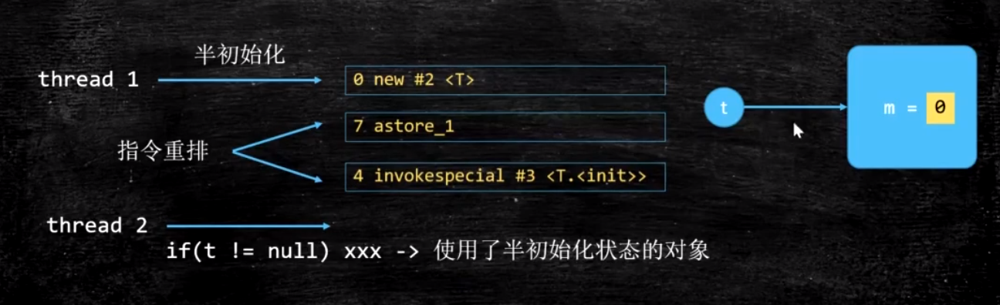


## 聊聊你对as-if-serial 和 happens-before 语义的理解 - 京东

### as-if-serial

`as-if-serial`语义的意思是：`不管怎么重排序，单线程程序的执行结果不能被改变。编译器、runtime和处理器都必须遵守as-if-serial语义`。所以编译器和处理器不会对存在`数据依赖关系`的操作做重排序，因为这种重排序会改变执行结果。但是，如果操作之间不存在数据依赖关系，这些操作就可能被编译器和处理器重排序。

下面还是以书中的实例(计算圆的面积)进行说明：

```java
double pi  = 3.14;           // A
double r   = 1.0;            // B
double area = pi * r * r;    // C
```

上面3个操作的数据依赖关系如图所示：

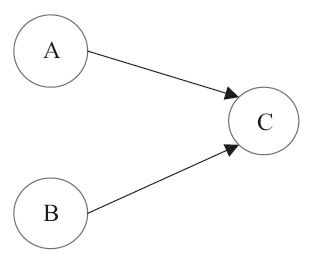

`A和C之间存在数据依赖关系，同时B和C之间也存在数据依赖关系`。因此在最终执行的指令序列中，C不能被重排序到A和B的前面(`因为C排到A和B的前面，程序的结果将会被改变`)。`但A和B之间没有数据依赖关系，编译器和处理器可以重排序A和B之间的执行顺序`。

该程序的两种可能执行顺序：

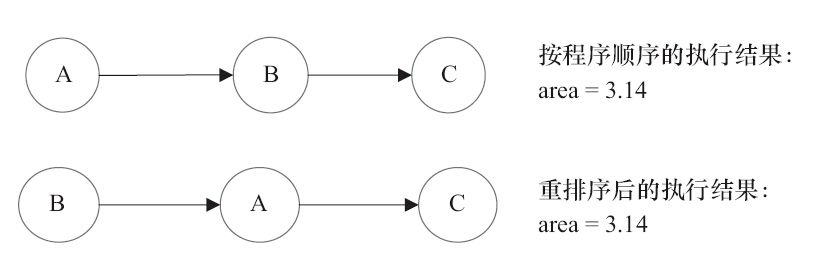

`as-if-serial语义`把单线程程序保护了起来，遵守`as-if-serial语义`的编译器、runtime和处理器共同为编写单线程程序的程序员创建了一个幻觉：`单线程程序是按程序的顺序来执行的`。

### happens-before原则

happens-before原则是Java内存模型中定义的两个操作之间的偏序关系。比如说操作A先行发生于操作B，那么在B操作发生之前，A操作产生的“影响”都会被操作B感知到。这里的影响是指修改了内存中的共享变量、发送了消息、调用了方法等。

JSR-133使用happens-before的概念来指定两个操作之间的执行顺序。由于这两个操作可以在一个线程之内，也可以是在不同线程之间。因此，**JMM可以通过happens-before关系向程序员提供跨线程的内存可见性保证**（如果A线程的写操作a与B线程的读操作b之间存在happens-before关系，尽管a操作和b操作在不同的线程中执行，但JMM向程序员保证a操作将对b操作可见）。具体的定义为：

1）如果一个操作happens-before另一个操作，那么第一个操作的执行结果将对第二个操作可见，而且第一个操作的执行顺序排在第二个操作之前。

2）两个操作之间存在happens-before关系，并不意味着Java平台的具体实现必须要按照happens-before关系指定的顺序来执行。如果重排序之后的执行结果，与按happens-before关系来执行的结果一致，那么这种重排序并不非法（也就是说，JMM允许这种重排序）。

上面的**1）是JMM对程序员的承诺**。

**从程序员的角度来说，可以这样理解happens-before关系：如果A happens-before B，那么Java内存模型将向程序员保证——A操作的结果将对B可见，且A的执行顺序排在B之前。注意，这只是Java内存模型向程序员做出的保证！**

上面的**2）是JMM对编译器和处理器重排序的约束原则**。

正如前面所言，JMM其实是在遵循一个基本原则：只要不改变程序的执行结果（指的是单线程程序和正确同步的多线程程序），编译器和处理器怎么优化都行。JMM这么做的原因是：程序员对于这两个操作是否真的被重排序并不关心，程序员关心的是程序执行时的语义不能被改变（即执行结果不能被改变）。因此，happens-before关系本质上和as-if-serial语义是一回事。

1. 程序顺序规则: 一个线程中的每个操作，happens-before于该线程中的任意后续操作；
2. 监视器锁规则: 对每一个锁的解锁，happens-before于随后对该锁的加锁；
3. Volatile变量规则：对一个volatile域的写，happens-before于任意后续对这个volatile域的读；
4. 线程启动规则：Thread的start()方法先行发生于这个线程的每一个操作；
5. 线程终止原则：线程的所有操作都先行于此线程的终止检测，可以通过Thread.join()方法结束、Thread.isAlive()的返回值等手段检测线程的终止；
6. 线程中断原则：对线程interrupt()方法的调用先行发生于被中断线程的代码检测到中断事件的发生，可以通过Thread.interrupt方法检测线程是否中断；
7. 对象终结规则：一个对象的初始化完成先于发生它的finalize()方法的开始；
8. 传递性: 如果A happens-before B, B happens-before C, 那么A happens-before C；

下面以一个具体的例子来讲下如何使用这些规则进行推论：

```java
double pi  = 3.14;    //A
double r   = 1.0;     //B
double area = pi * r * r; //C
```

依旧以上面计算圆面积的进行描述。利用程序顺序规则（规则1）存在三个happens-before关系：1. A happens-before B；2. B happens-before C；3. A happens-before C。这里的第三个关系是利用传递性进行推论的。A happens-before B，定义1要求A执行结果对B可见，并且A操作的执行顺序在B操作之前，但与此同时利用定义中的第二条，A，B操作彼此不存在数据依赖性，两个操作的执行顺序对最终结果都不会产生影响，在不改变最终结果的前提下，允许A，B两个操作重排序，即**happens-before关系并不代表了最终的执行顺序**。

### as-if-serial与happens-before的区别

下面来比较一下as-if-serial和happens-before：

> **as-if-serial VS happens-before**

1. as-if-serial语义保证单线程内程序的执行结果不被改变，happens-before关系保证正确同步的多线程程序的执行结果不被改变。
2. as-if-serial语义给编写单线程程序的程序员创造了一个幻境：单线程程序是按程序的顺序来执行的。happens-before关系给编写正确同步的多线程程序的程序员创造了一个幻境：正确同步的多线程程序是按happens-before指定的顺序来执行的。
3. as-if-serial语义和happens-before这么做的目的，都是为了在不改变程序执行结果的前提下，尽可能地提高程序执行的并行度。


## 请描述一下锁的分类以及JDK中的应用 - 阿里


[不可不说的Java“锁”事 - 美团技术团队](https://tech.meituan.com/2018/11/15/java-lock.html)


## 打开偏向锁是否效率一定会提升?自旋锁一定比重量级锁效率高吗? - 阿里

不一定，偏向锁和轻量级锁/自旋锁都是为竞争不激烈的情况设计的优化方案，如果竞争激励，锁升级反而会降低性能。

**引入偏向锁的目的：**在只有单线程执行情况下，尽量减少不必要的轻量级锁执行路径，轻量级锁的获取及释放依赖多次CAS原子指令，而偏向锁只依赖一次CAS原子指令置换ThreadID，之后只要判断线程ID为当前线程即可，偏向锁使用了一种等到竞争出现才释放锁的机制，消除偏向锁的开销还是蛮大的。如果同步资源或代码一直都是多线程访问的，那么消除偏向锁这一步骤对你来说就是多余的，可以通过-XX:-UseBiasedLocking=false来关闭
**引入轻量级锁的目的：**在多线程交替执行同步块的情况下，尽量避免重量级锁引起的性能消耗(用户态和核心态转换)，但是如果多个线程在同一时刻进入临界区，会导致轻量级锁膨胀升级重量级锁，所以轻量级锁的出现并非是要替代重量级锁


## 你了解ThreadLocal吗?你知道ThreadLocal中如何解决内存泄漏问题吗? - 京东 阿里

### 0、问题

1. 和Synchronized的区别
2. 存储在jvm的哪个区域
3. 真的只是当前线程可见吗
4. 会导致内存泄漏么
5. 为什么用Entry数组而不是Entry对象
6. 你学习的开源框架哪些用到了ThreadLocal
7. ThreadLocal里的对象一定是线程安全的吗
8. 笔试题

### 一、概述

#### 1、官方术语

ThreadLocal类是用来提供线程内部的局部变量。让这些变量在多线程环境下访问（get/set）时能保证各个线程里的变量相对独立于其他线程内的变量。

#### 2、大白话

ThreadLocal是一个关于创建线程局部变量的类。

通常情况下，我们创建的成员变量都是线程不安全的。因为他可能被多个线程同时修改，此变量对于多个线程之间彼此并不独立，是共享变量。而使用ThreadLocal创建的变量只能被当前线程访问，其他线程无法访问和修改。也就是说：将线程公有化变成线程私有化。

### 二、应用场景

- 每个线程都需要一个独享的对象（比如工具类，典型的就是`SimpleDateFormat`，每次使用都new一个多浪费性能呀，直接放到成员变量里又是线程不安全，所以把他用`ThreadLocal`管理起来就完美了。）

比如：

```java
/**
 * Description: SimpleDateFormat就一份，不浪费资源。
 *
 * @author TongWei.Chen 2020-07-10 14:00:29
 */
public class ThreadLocalTest05 {
 
    public static String dateToStr(int millisSeconds) {
        Date date = new Date(millisSeconds);
        SimpleDateFormat simpleDateFormat = ThreadSafeFormatter.dateFormatThreadLocal.get();
        return simpleDateFormat.format(date);
    }
 
    private static final ExecutorService executorService = Executors.newFixedThreadPool(100);
 
    public static void main(String[] args) {
        for (int i = 0; i < 3000; i++) {
            int j = i;
            executorService.execute(() -> {
                String date = dateToStr(j * 1000);
                // 从结果中可以看出是线程安全的，时间没有重复的。
                System.out.println(date);
            });
        }
        executorService.shutdown();
    }
}
 
class ThreadSafeFormatter {
    public static ThreadLocal<SimpleDateFormat> dateFormatThreadLocal = new ThreadLocal() {
        @Override
        protected SimpleDateFormat initialValue() {
            return new SimpleDateFormat("yyyy-MM-dd hh:mm:ss");
        }
    };
 
    // java8的写法，装逼神器
//    public static ThreadLocal<SimpleDateFormat> dateFormatThreadLocal =
//            ThreadLocal.withInitial(() -> new SimpleDateFormat("yyyy-MM-dd hh:mm:ss"));
}
```

> 细心的朋友已经发现了，这TM也是每个线程都创建一个`SimpleDateFormat`啊，跟直接在方法内部new没区别，错了，大错特错！1个请求进来是一个线程，他可能贯穿了N个方法，你这N个方法假设有3个都在使用`dateToStr()`，你直接new的话会产生三个`SimpleDateFormat`对象，而用`ThreadLocal`的话只会产生一个对象，一个线程一个。

- 每个线程内需要保存全局变量（比如在登录成功后将用户信息存到`ThreadLocal`里，然后当前线程操作的业务逻辑直接get取就完事了，有效的避免的参数来回传递的麻烦之处），一定层级上减少代码耦合度。

**再细化一点就是：**

- 比如存储 交易id等信息。每个线程私有。
- 比如aop里记录日志需要before记录请求id，end拿出请求id，这也可以。
- 比如jdbc连接池（很典型的一个`ThreadLocal`用法）
- spring框架的事务控制
- ....等等....

### 三、核心知识

#### 1、类关系

每个`Thread`对象中都持有一个`ThreadLocalMap`的成员变量。每个`ThreadLocalMap`内部又维护了N个`Entry`节点，也就是`Entry`数组，每个`Entry`代表一个完整的对象，key是`ThreadLocal`本身，value是`ThreadLocal`的泛型值。

核心源码如下

```java
// java.lang.Thread类里持有ThreadLocalMap的引用
public class Thread implements Runnable {
    ThreadLocal.ThreadLocalMap threadLocals = null;
}

// java.lang.ThreadLocal有内部静态类ThreadLocalMap
public class ThreadLocal<T> {
    static class ThreadLocalMap {
        private Entry[] table;
        // ThreadLocalMap内部有Entry类，Entry的key是ThreadLocal本身，value是泛型值
        static class Entry extends WeakReference<ThreadLocal<?>> {
            Object value;
            Entry(ThreadLocal<?> k, Object v) {
                super(k);
                value = v;
            }
        }
    }
}
```

#### 2、类关系图

> `ThreadLocal`内存结构图。

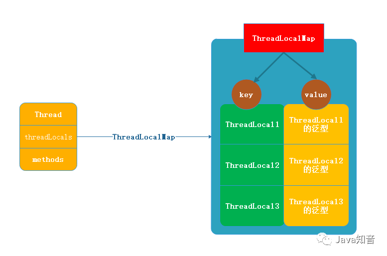

#### 3、主要方法

- `initialValue`：初始化。在`get`方法里懒加载的。
- `get`：得到这个线程对应的value。*如果调用get之前没set过，则get内部会执行`initialValue`方法进行初始化。*
- `set`：为这个线程设置一个新值。
- `remove`：删除这个线程对应的值，防止内存泄露的最佳手段。

##### 3.1、`initialValue`

###### 3.1.1、什么意思

见名知意，初始化一些value（泛型值）。懒加载的。

###### 3.1.2、触发时机

调用`get`方法之前没有调用`set`方法，则`get`方法内部会触发`initialValue`，也就是说`get`的时候如果没拿到东西，则会触发`initialValue`。

###### 3.1.3、补充说明

- 通常，每个线程最多调用一次此方法。但是如果已经调用了`remove()`，然后再次调用`get()`的话，则可以再次触发`initialValue`。
- 如果要重写的话一般建议采取匿名内部类的方式重写此方法，否则默认返回的是null。

> 比如：

```java
public static ThreadLocal<SimpleDateFormat> dateFormatThreadLocal = new ThreadLocal() {
    @Override
    protected SimpleDateFormat initialValue() {
        return new SimpleDateFormat("yyyy-MM-dd hh:mm:ss");
    }
};

// Java8的高逼格写法
public static ThreadLocal<SimpleDateFormat> dateFormatThreadLocal =
            ThreadLocal.withInitial(() -> new SimpleDateFormat("yyyy-MM-dd hh:mm:ss"));
```

###### 3.1.4、源码

```java
// 由子类提供实现。
// protected的含义就是交给子类干的。
protected T initialValue() {
    return null;
}
```

##### 3.2、`get`

###### 3.2.1、什么意思

获取当前线程下的ThreadLocal中的值。

###### 3.2.2、源码

```java
/**
 * 获取当前线程下的entry里的value值。
 * 先获取当前线程下的ThreadLocalMap，
 * 然后以当前ThreadLocal为key取出map中的value
 */
public T get() {
    // 获取当前线程
    Thread t = Thread.currentThread();
    // 获取当前线程对应的ThreadLocalMap对象。
    ThreadLocalMap map = getMap(t);
    // 若获取到了。则获取此ThreadLocalMap下的entry对象，若entry也获取到了，那么直接获取entry对应的value返回即可。
    if (map != null) {
        // 获取此ThreadLocalMap下的entry对象
        ThreadLocalMap.Entry e = map.getEntry(this);
        // 若entry也获取到了
        if (e != null) {
            @SuppressWarnings("unchecked")
            // 直接获取entry对应的value返回。
            T result = (T)e.value;
            return result;
        }
    }
    // 若没获取到ThreadLocalMap或没获取到Entry，则设置初始值。
    // 知识点：我早就说了，初始值方法是延迟加载，只有在get才会用到，这下看到了吧，只有在这获取没获取到才会初始化，下次就肯定有值了，所以只会执行一次！！！
    return setInitialValue();
}
```

###### 3.3、`set`

###### 3.3.1、什么意思

其实干的事和`initialValue`是一样的，都是set值，只是调用时机不同。set是想用就用，api摆在这里，你想用就调一下set方法。很自由。

###### 3.3.2、源码

```java
/**
 * 设置当前线程的线程局部变量的值
 * 实际上ThreadLocal的值是放入了当前线程的一个ThreadLocalMap实例中，所以只能在本线程中访问。
 */
public void set(T value) {
    // 获取当前线程
    Thread t = Thread.currentThread();
    // 获取当前线程对应的ThreadLocalMap实例，注意这里是将t传进去了，t是当前线程，就是说ThreadLocalMap是在线程里持有的引用。
    ThreadLocalMap map = getMap(t);
    // 若当前线程有对应的ThreadLocalMap实例，则将当前ThreadLocal对象作为key，value做为值存到ThreadLocalMap的entry里。
    if (map != null)
        map.set(this, value);
    else
        // 若当前线程没有对应的ThreadLocalMap实例，则创建ThreadLocalMap，并将此线程与之绑定
        createMap(t, value);
}
```

##### 3.4、`remove`

###### 3.4.1、什么意思

将当前线程下的ThreadLocal的值删除，目的是为了减少内存占用。主要目的是防止内存泄漏。内存泄漏问题下面会说。

###### 3.4.2、源码

```java
/**
 * 将当前线程局部变量的值删除，目的是为了减少内存占用。主要目的是防止内存泄漏。内存泄漏问题下面会说。
 */
public void remove() {
    // 获取当前线程的ThreadLocalMap对象，并将其移除。
    ThreadLocalMap m = getMap(Thread.currentThread());
    if (m != null)
        // 直接移除以当前ThreadLocal为key的value
        m.remove(this);
}
```

#### 4、ThreadLocalMap

为啥单独拿出来说下，我就是想强调一点：这个东西是归`Thread`类所有的。它的引用在`Thread`类里，这也证实了一个问题：`ThreadLocalMap`类内部为什么有`Entry`数组，而不是`Entry`对象？

因为你业务代码能new好多个`ThreadLocal`对象，各司其职。但是在一次请求里，也就是一个线程里，`ThreadLocalMap`是同一个，而不是多个，不管你new几次`ThreadLocal`，`ThreadLocalMap`在一个线程里就一个，因为再说一次，`ThreadLocalMap`的引用是在`Thread`里的，所以它里面的`Entry`数组存放的是一个线程里你new出来的多个`ThreadLocal`对象。

核心源码如下：

```java
// 在你调用ThreadLocal.get()方法的时候就会调用这个方法，它的返回是当前线程里的threadLocals的引用。
// 这个引用指向的是ThreadLocal里的ThreadLocalMap对象
ThreadLocalMap getMap(Thread t) {
    return t.threadLocals;
}

public class Thread implements Runnable {
    // ThreadLocal.ThreadLocalMap
    ThreadLocal.ThreadLocalMap threadLocals = null;
}
```

### 四、完整源码

#### 1、核心源码

```java
// 本地线程。Thread：线程。Local：本地
public class ThreadLocal<T> {
	// 构造器
	public ThreadLocal() {}
    
    // 初始值，用来初始化值用的，比如：ThreadLocal<Integer> count = new ThreadLocal<>();
    // 你想Integer value = count.get(); value++;这样是报错的，因为count现在还没值，取出来的是个null,所以你需要先重写此方法为value赋上初始值，本身方法是protected也代表就是为了子类重写的。
    // 此方法是一个延迟调用方法，在线程第一次调用get的时候才执行，下面具体分析源码就知道了。
	protected T initialValue() {}
   
    // 创建ThreadLocalMap，ThreadLocal底层其实就是一个map来维护的。
	void createMap(Thread t, T firstValue) {}
    
    // 返回该当前线程对应的线程局部变量值。
	public T get() {}

    // 获取ThreadLocalMap
	ThreadLocalMap getMap(Thread t) {}

    // 设置当前线程的线程局部变量的值
	public void set(T value) {}

    // 将当前线程局部变量的值删除，目的是为了减少内存占用。其实当线程结束后对应该线程的局部变量将自动被垃圾回收，所以无需我们调用remove，我们调用remove无非也就是加快内存回收速度。
	public void remove() {}
    
    // 设置初始值，调用initialValue
	private T setInitialValue() {}
    
    // 静态内部类，一个map来维护的！！！
    static class ThreadLocalMap {
        // ThreadLocalMap的静态内部类，继承了弱引用，这正是不会造成内存泄漏根本原因
        // Entry的key为ThreadLocal并且是弱引用。value是值
        static class Entry extends WeakReference<ThreadLocal<?>> {}
    }
}
```

#### 2、set()

```java
/**
 * 设置当前线程的线程局部变量的值
 * 实际上ThreadLocal的值是放入了当前线程的一个ThreadLocalMap实例中，所以只能在本线程中访问。
 */
public void set(T value) {
    // 获取当前线程
    Thread t = Thread.currentThread();
    // 获取当前线程对应的ThreadLocalMap实例
    ThreadLocalMap map = getMap(t);
    // 若当前线程有对应的ThreadLocalMap实例，则将当前ThreadLocal对象作为key，value做为值存到ThreadLocalMap的entry里。
    if (map != null)
        map.set(this, value);
    else
        // 若当前线程没有对应的ThreadLocalMap实例，则创建ThreadLocalMap，并将此线程与之绑定
        createMap(t, value);
}
```

#### 3、getMap()

```java
// 在你调用ThreadLocal.get()方法的时候就会调用这个方法，它的返回是当前线程里的threadLocals的引用。
// 这个引用指向的是ThreadLocal里的ThreadLocalMap对象
ThreadLocalMap getMap(Thread t) {
    return t.threadLocals;
}

public class Thread implements Runnable {
    // ThreadLocal.ThreadLocalMap
    ThreadLocal.ThreadLocalMap threadLocals = null;
}
```

#### 4、map.set()

```java
// 不多BB，就和HashMap的set一个道理，只是赋值key,value。
// 需要注意的是这里key是ThreadLocal对象，value是值
private void set(ThreadLocal<?> key, Object value) {}
```

#### 5、createMap()

```java
/**
 * 创建ThreadLocalMap对象。
 * t.threadLocals在上面的getMap中详细介绍了。此处不BB。
 * 实例化ThreadLocalMap并且传入两个值，一个是当前ThreadLocal对象一个是value。
 */
void createMap(Thread t, T firstValue) {
    t.threadLocals = new ThreadLocalMap(this, firstValue);
}

// ThreadLocalMap构造器。
ThreadLocalMap(ThreadLocal<?> firstKey, Object firstValue) {
    table = new Entry[INITIAL_CAPACITY];
    int i = firstKey.threadLocalHashCode & (INITIAL_CAPACITY - 1);
    // 重点看这里！！！！！！
    // new了一个ThreadLocalMap的内部类Entry，且将key和value传入。
    // key是ThreadLocal对象。
    table[i] = new Entry(firstKey, firstValue);
    size = 1;
    setThreshold(INITIAL_CAPACITY);
}

/**
 * 到这里朋友们应该真相大白了，其实ThreadLocal就是内部维护一个ThreadLocalMap，
 * 而ThreadLocalMap内部又维护了一个Entry对象。Entry对象是key-value形式，
 * key是ThreadLocal对象，value是传入的value
 * 所以我们对ThreadLocal的操作其实都是对内部的ThreadLocalMap.Entry的操作
 * 所以保证了线程之前互不干扰。
 */
```

#### 6、get()

```java
/**
 * 获取当前线程下的entry里的value值。
 * 先获取当前线程下的ThreadLocalMap，
 * 然后以当前ThreadLocal为key取出map中的value
 */
public T get() {
    // 获取当前线程
    Thread t = Thread.currentThread();
    // 获取当前线程对应的ThreadLocalMap对象。
    ThreadLocalMap map = getMap(t);
    // 若获取到了。则获取此ThreadLocalMap下的entry对象，若entry也获取到了，那么直接获取entry对应的value返回即可。
    if (map != null) {
        // 获取此ThreadLocalMap下的entry对象
        ThreadLocalMap.Entry e = map.getEntry(this);
        // 若entry也获取到了
        if (e != null) {
            @SuppressWarnings("unchecked")
            // 直接获取entry对应的value返回。
            T result = (T)e.value;
            return result;
        }
    }
    // 若没获取到ThreadLocalMap或没获取到Entry，则设置初始值。
    // 知识点：我早就说了，初始值方法是延迟加载，只有在get才会用到，这下看到了吧，只有在这获取没获取到才会初始化，下次就肯定有值了，所以只会执行一次！！！
    return setInitialValue();
}
```

#### 7、setInitialValue()

```java
// 设置初始值
private T setInitialValue() {
    // 调用初始值方法，由子类提供。
    T value = initialValue();
    // 获取当前线程
    Thread t = Thread.currentThread();
    // 获取map
    ThreadLocalMap map = getMap(t);
    // 获取到了
    if (map != null)
        // set
        map.set(this, value);
    else
        // 没获取到。创建map并赋值
        createMap(t, value);
    // 返回初始值。
    return value;
}
```

#### 8、initialValue()

```java
// 由子类提供实现。
// protected
protected T initialValue() {
    return null;
}
```

#### 9、remove()

```java
/**
 * 将当前线程局部变量的值删除，目的是为了减少内存占用。
 * 其实当线程结束后对应该线程的局部变量将自动被垃圾回收，所以无需我们调用remove，我们调用remove无非也就是加快内存回收速度。
 */
public void remove() {
    // 获取当前线程的ThreadLocalMap对象，并将其移除。
    ThreadLocalMap m = getMap(Thread.currentThread());
    if (m != null)
        m.remove(this);
}
```

#### 10、小结

只要捋清楚如下几个类的关系，`ThreadLocal`将变得so easy！

```
Thread`、`ThreadLocal`、`ThreadLocalMap`、`Entry
```

一句话总结就是：`Thread`维护了`ThreadLocalMap`，而`ThreadLocalMap`里维护了`Entry`，而`Entry`里存的是以`ThreadLocal`为key，传入的值为value的键值对。

### 五、答疑（面试题）

#### 1、和Synchronized的区别

问：他和线程同步机制（如：Synchronized）提供一样的功能，这个很吊啊。

答：放屁！同步机制保证的是多线程同时操作共享变量并且能正确的输出结果。ThreadLocal不行啊，他把共享变量变成线程私有了，每个线程都有独立的一个变量。举个通俗易懂的案例：网站计数器，你给变量count++的时候带上synchronized即可解决。ThreadLocal的话做不到啊，他没发统计，他只能说能统计每个线程登录了多少次。

#### 2、存储在jvm的哪个区域

问：线程私有，那么就是说ThreadLocal的实例和他的值是放到栈上咯？

答：不是。还是在堆的。ThreadLocal对象也是对象，对象就在堆。只是JVM通过一些技巧将其可见性变成了线程可见。

#### 3、真的只是当前线程可见吗

问：真的只是当前线程可见吗？

答：貌似不是，貌似通过`InheritableThreadLocal`类可以实现多个线程访问`ThreadLocal`的值，但是我没研究过，知道这码事就行了。

#### 4、会导致内存泄漏么

问：会导致内存泄漏么？

答：分析一下：

- 1、`ThreadLocalMap.Entry`的key会内存泄漏吗？
- 2、`ThreadLocalMap.Entry`的value会内存泄漏吗？

先看下key-value的核心源码

```java
static class Entry extends WeakReference<ThreadLocal<?>> {
    Object value;
    Entry(ThreadLocal<?> k, Object v) {
        super(k);
        value = v;
    }
}
```

先看继承关系，发现是继承了弱引用，而且key直接是交给了父类处理`super(key)`，父类是个弱引用，所以key完全不存在内存泄漏问题，因为他不是强引用，它可以被GC回收的。

> 弱引用的特点：如果这个对象只被弱引用关联，没有任何强引用关联，那么这个对象就可以被GC回收掉。弱引用不会阻止GC回收。这是jvm知识。

再看value，发现value是个强引用，但是想了下也没问题的呀，因为线程终止了，我管你强引用还是弱引用，都会被GC掉的，因为引用链断了（jvm用的可达性分析法，线程终止了，根节点就断了，下面的都会被回收）。

这么分析一点毛病都没有，但是忘了一个主要的角色，那就是**线程池**，线程池的存在核心线程是不会销毁的，只要创建出来他会反复利用，生命周期不会结束掉，但是key是弱引用会被GC回收掉，value强引用不会回收，所以形成了如下场面：

```
Thread->ThreadLocalMap->Entry(key为null)->value
```

由于value和Thread还存在链路关系，还是可达的，所以不会被回收，这样越来越多的垃圾对象产生却无法回收，早晨内存泄漏，时间久了必定OOM。

解决方案`ThreadLocal`已经为我们想好了，提供了`remove()`方法，这个方法是将value移出去的。所以用完后记得`remove()`。

#### 5、为什么用Entry数组而不是Entry对象

> 这个其实主要想考`ThreadLocalMap`是在`Thread`里持有的引用。

问：`ThreadLocalMap`内部的table为什么是数组而不是单个对象呢？

答：因为你业务代码能new好多个`ThreadLocal`对象，各司其职。但是在一次请求里，也就是一个线程里，`ThreadLocalMap`是同一个，而不是多个，不管你new几次`ThreadLocal`，`ThreadLocalMap`在一个线程里就一个，因为`ThreadLocalMap`的引用是在`Thread`里的，所以它里面的`Entry`数组存放的是一个线程里你new出来的多个`ThreadLocal`对象。

#### 6、你学习的开源框架哪些用到了ThreadLocal

Spring框架。

DateTimeContextHolder
RequestContextHolder

#### 7、ThreadLocal里的对象一定是线程安全的吗

未必，如果在每个线程中`ThreadLocal.set()`进去的东西本来就是多线程共享的同一个对象，比如static对象，那么多个线程的`ThreadLocal.get()`获取的还是这个共享对象本身，还是有并发访问线程不安全问题。

#### 8、笔试题

问：下面这段程序会输出什么？为什么？

```java
public class TestThreadLocalNpe {
    private static ThreadLocal<Long> threadLocal = new ThreadLocal();

    public static void set() {
        threadLocal.set(1L);
    }

    public static long get() {
        return threadLocal.get();
    }

    public static void main(String[] args) throws InterruptedException {
        new Thread(() -> {
            set();
            System.out.println(get());
        }).start();
        // 目的就是为了让子线程先运行完
        Thread.sleep(100);
        System.out.println(get());
    }
}
```

答：

```java
1
Exception in thread "main" java.lang.NullPointerException
 at com.chentongwei.study.thread.TestThreadLocalNpe.get(TestThreadLocalNpe.java:16)
 at com.chentongwei.study.thread.TestThreadLocalNpe.main(TestThreadLocalNpe.java:26)
```

为什么？

为什么输出个1，然后空指针了？

首先输出1是没任何问题的，其次主线程空指针是为什么？

如果你这里回答

```java
1
1
```

那我恭喜你，你连`ThreadLocal`都不知道是啥，这明显两个线程，子线程和主线程。子线程设置1，主线程肯定拿不到啊，`ThreadLocal`和线程是嘻嘻相关的。这个不多费口舌。

说说为什么是空指针？

因为你get方法用的long而不是Long，那也应该返回null啊，大哥，long是基本类型，默认值是0，没有null这一说法。`ThreadLocal`里的泛型是Long，get却是基本类型，这需要拆箱操作的，也就是会执行`null.longValue()`的操作，这绝逼空指针了。

> 看似一道Javase的基础题目，实则隐藏了很多知识。

### 六、ThreadLocal工具类

```java
package com.duoku.base.util;
 
import com.google.common.collect.Maps;
import org.springframework.core.NamedThreadLocal;
 
import java.util.Map;
 
/**
 * Description:
 *
 * @author TongWei.Chen 2019-09-09 18:35:30
 */
public class ThreadLocalUtil {
 
    private static final ThreadLocal<Map<String, Object>> threadLocal = new NamedThreadLocal("xxx-threadlocal") {
        @Override
        protected Map<String, Object> initialValue() {
            return Maps.newHashMap();
        }
    };
 
    public static Map<String, Object> getThreadLocal(){
        return threadLocal.get();
    }
    
    public static <T> T get(String key) {
        Map map = threadLocal.get();
        // todo:copy a new one
        return (T)map.get(key);
    }
 
    public static <T> T get(String key,T defaultValue) {
        Map map = threadLocal.get();
        return (T)map.get(key) == null ? defaultValue : (T)map.get(key);
    }
 
    public static void set(String key, Object value) {
        Map map = threadLocal.get();
        map.put(key, value);
    }
 
    public static void set(Map<String, Object> keyValueMap) {
        Map map = threadLocal.get();
        map.putAll(keyValueMap);
    }
 
    public static void remove() {
        threadLocal.remove();
    }
 
}
```