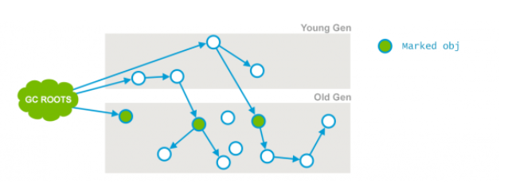
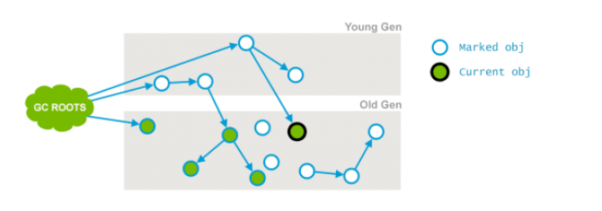
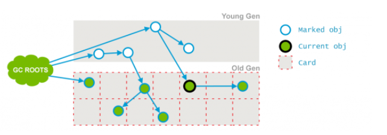

### 讲一下CMS的流程 - 顺丰

#### Phase1 ：Initial Mark【初始标记】

这个是CMS两次stop-the-world事件的其中一次，这个阶段的目标是：标记那些直接被GC root引用或被年轻代存活对象所引用的所有对象。用图来表示：



上面有些对象是直接被GC ROOTS所引用的，有些对象是被年轻代引用的，都会被标记出来。

#### Phase2 : Concurrent Mark 【并发标记】

在这个阶段Garbage Collector会遍历老年代，然后标记所有存活的对象。并发标记阶段，它会与用户的应用程序并发运行。并不是老年代所有的存活对象都会被标记，因为在标记期间用户的程序可能会改变一些引用。如下图：



在上面的图中，与阶段1的图进行对比，就会发现有一个对象的引用已经发生了变化，如标黑的那个对象。

#### Phase3 : Concurrent Preclean【并发预先清除】

这个阶段又是一个并发阶段，和应用线程并行运行。前一个阶段在并行运行的时候，一些对象的引用已经发生了变化，当这些引用发生变化的时候，JVM会标记堆的这个区域为Dirty Card(包含被标记但是改变了的对象，被认为"dirty")，这就是 [Card Marking](http://psy-lob-saw.blogspot.com.ee/2014/10/the-jvm-write-barrier-card-marking.html)。


在pre-clean阶段，那些能够从dirty card对象到达的对象也会被标记，这个标记做完之后，dirty card标记就会被清除了，如下：


此外，还为最后的Remark阶段执行了一些必要的管理和准备工作。

#### Phase4 : Concurrent Abortable Preclean【并发可中断的预先清除】

这也是一个并发阶段，同样不会影响用户的应用线程，这个阶段是为了尽量承担最终标记阶段（会产生STW）的工作。这个阶段持续时间依赖于很多的因素，由于这个阶段是在重复做很多相同的工作，直到满足一些条件（比如：重复迭代的次数、完成的工作量或者时钟时间等）。这一阶段可能会显著影响即将到来的“停止世界”暂停的持续时间，并且有很多重要的配置选项和失败模式。

#### Phase5 : Final Remark【最终重新标记】

这是第二个STW阶段，也是CMS中的最后一个，这个阶段的目标是标记老年代所有的存活对象，由于之前的阶段是并发执行的，GC线程可能跟不上应用程序的变化，为了完成标记老年代所有存活对象的目标，STW就非常有必要了。通常CMS的Final Remark阶段会在年代代尽可能干净的时候运行，目的是为了减少连续STW发生的可能性（年轻代存活对象过多的话，也会导致老年代涉及的存活对象会很多）。这个阶段会比前面的几个阶段更复杂一些。

**经历过以上五个阶段之后，老年代所有存活的对象都被标记过了，现在可以通过清除算法去清理那些老年代不再使用的对象。**

#### Phase6 : Concurrent Sweep【并发清除】

这里不需要STW，它是与用户的应用程序并发运行，这个阶段是：清除那些不再使用的对象，回收它们的占用空间为将来使用，如图：



#### Phase7 : Concurrent Reset【并发重置】

这个阶段也是并发执行的，它会重设CMS内部的数据结构，为下次的GC做准备。

### 听说过CMS的并发预处理和并发可中断预处理吗 - 阿里

在 jvm 中将老年代划分成多个 card，只要 card 内对象引用被应用线程修改，就把 card 标记为 dirty。然后 young gc 时会扫描老年代中 dirty card 对应的内存区域，记录其中的跨代引用，这种方式被称为**Card Marking**。jvm 使用 card marking 的方式，避免了 young gc 时扫描整个老年代存活对象，付出的代价是在每次修改引用时添加额外的汇编指令实现写屏障，和额外的内存来保存 card table。

#### Concurrent Preclean

现在回到 cms 回收器，在老年代 gc 时，同样使用到了 card marking，目的不是找到跨代引用（年轻代到老年代的跨代引用是通过从 gc root 遍历对象标记的），而是找到前面 concurrent-marking 阶段被应用线程并发修改的对象引用。

preclean 阶段是**对这些 card marking 产生的 dirty card 进行 clean**，cms gc 线程会扫描 dirty card 对应的内存区域，更新之前记录的过时的引用信息，并且去掉 dirty card 的标记，如下图所示：


在 preclean 执行后，dirty card 被清理，被修改的引用信息也被更新。

#### concurrent-abortable-preclean

concurrent-abortable-preclean 阶段目的是减轻 final remark 阶段（会暂停应用线程）的负担，这个阶段同样会对 dirty card 的扫描/清理，和 concurrent-preclean 的区别在于，concurrent-abortable-preclean 会重复地以迭代的方式执行，直到满足退出条件。**但是 concurrent-preclean 已经处理过 dirty card,为什么 jvm 还需要再执行一个类似的阶段呢？**

##### 连续 STW

首先我们考虑下这个情况：如果 final-remark 阶段开始时刚好进行了 young gc（比如 ParNew）,应用程序刚因为 young gc 暂停，然后又会因为 final-remark 暂停，造成**连续的长暂停**。除此之外，因为 young gc 线程修改了存活对象的引用地址，会产生很多需要重新扫描的对象，增加了 final-remark 的工作量。所以 concurrent-abortable-preclean 除了 clean card 的作用，还有**调度 final-remark 开始时机**的作用参考。cms 回收器认为，final-remark 最理想的执行时机就是年轻代占用在 50%时，这时刚好处于上次 young gc 完成（0%）和下次 young gc 开始（100%）的中间节点，如图所示：


##### 配置参数

abortable-preclean 的**中断条件**，配置参数是`-XX:CMSScheduleRemarkEdenPenetration=50`（默认值），表示当 eden 区内存占用到达 50%时，中断 abortable-preclean，开始执行 final-remark，对应**jvm 源码**片段如下：

```c++
//当eden占用比例超过配置，将_abort_preclean标记赋值为true
if ((_collectorState == AbortablePreclean) && !_abort_preclean) {
    size_t used = get_eden_used();
    size_t capacity = get_eden_capacity();
    assert(used <= capacity, "Unexpected state of Eden");
    if (used >  (capacity/100 * CMSScheduleRemarkEdenPenetration)) {
      _abort_preclean = true;
    }
}
```

abortable-preclean 的**触发条件**配置， `-XX:CMSScheduleRemarkEdenSizeThreshold=2m`（默认值），表示当 eden 内存占用超过 2mb 时才会执行 abortable-preclean，否则没有执行的必要。

abortable-preclean 的**主动退出条件**配置，`-XX:CMSMaxAbortablePrecleanTime=5000`和 CMSMaxAbortablePrecleanLoops，主要因为如果年轻代内存占用增长缓慢，那么 abortable-preclean 要长时间执行，可能因为 preclean 赶不上应用线程创造 dirty card 的速度导致 dirty card 越来越多，此时还不如执行一个 final-remark,对应 jvm 源码片段如下：

```c++
// Try and schedule the remark such that young gen
// occupancy is CMSScheduleRemarkEdenPenetration %.
// 保留原始注释，看下abortable_preclean的定位
void CMSCollector::abortable_preclean() {
  //校验触发条件
  if (get_eden_used() > CMSScheduleRemarkEdenSizeThreshold) {

    // 感受一下作者的纠结，他认为目前的主动退出条件有点蠢，FIX ME!!! 哈哈
    // One, admittedly dumb, strategy is to give up
    // after a certain number of abortable precleaning loops
    // or after a certain maximum time. We want to make
    // this smarter in the next iteration.
    // XXX FIX ME!!! YSR
    size_t loops = 0, workdone = 0, cumworkdone = 0, waited = 0;
    //should_abort_preclean会检查上面说的_abort_preclean是否为true
    while (!(should_abort_preclean() ||
             ConcurrentMarkSweepThread::should_terminate())) {
      workdone = preclean_work(CMSPrecleanRefLists2, CMSPrecleanSurvivors2);
      cumworkdone += workdone;
      loops++;
      // 主动停止执行
      if ((CMSMaxAbortablePrecleanLoops != 0) &&
          loops >= CMSMaxAbortablePrecleanLoops) {
        if (PrintGCDetails) {
          gclog_or_tty->print(" CMS: abort preclean due to loops ");
        }
        break;
      }
      if (pa.wallclock_millis() > CMSMaxAbortablePrecleanTime) {
        if (PrintGCDetails) {
          gclog_or_tty->print(" CMS: abort preclean due to time ");
        }
        break;
      }
      // 如果工作效率不高，主动暂停一会儿
      if (workdone < CMSAbortablePrecleanMinWorkPerIteration) {
        // Sleep for some time, waiting for work to accumulate
        stopTimer();
        cmsThread()->wait_on_cms_lock(CMSAbortablePrecleanWaitMillis);
        startTimer();
        waited++;
      }
    }
    //打印工作情况
    if (PrintCMSStatistics > 0) {
      gclog_or_tty->print(" [%d iterations, %d waits, %d cards)] ",
                          loops, waited, cumworkdone);
    }
  }
  return;
}
```

#### 总结

preclean: 清理 card marking 标记的 dirty card，更新引用记录

abortable-preclean: 调节 final-remark 阶段的运行时机

### G1两个Region不是连续的,而且之间还有可达的引用,我现在要回收一个,另一个怎么处理? - 阿里


### G1什么时候引发Full GC- 百度

#### G1回收过程一: 年轻代GC

JVM启动时,G1先准备好Eden区,程序在运行过程中不断创建对象到Eden区,当Eden空间耗尽时,G1会启动一次年轻代垃圾回收过程。
 `年轻代垃圾回收只会回收Eden区和Survivor区。`
 YGC时,首先G1停止应用程序的执行(Stop-The-World),G1创建回收集(Collection Set),回收集是指需要被回收的内存分段的集合,年轻代回收过程的回收集包含年轻代Eden区和Survivor区所有的内存分段。

然后开始如下回收过程:
 `第一阶段,扫描根。`
 根是指static变量指向的对象,正在执行的方法调用链条上的局部变量等。跟引用连同RSet记录的外部引用作为扫描存活对象的入口。
 `第二阶段,更新RSet。`
 处理dirty card queue(见备注)中的card,更新RSet。此阶段完成后,RSet可以准确的反映老年代对所在的内存分段中对象的引用。

> 备注:
>  对于应用程序的引用赋值语句object.field=object,JVM会在之前和之后执行特殊的操作以在dirty card queue中入队一个保存了对象引用信息的card。在年轻代回收的时候,G1会对Dirty Card Queue中所有的card进行处理,以更新RSet,保证RSet实时准确的反映引用关系。
>  那为什么不在引用赋值语句处直接更新RSet呢?这是为了性能的需要,RSet的处理需要线程同步,开销会很大,使用队列性能会好很多。

`第三阶段,处理RSet。`
 识别被老年代对象指向的Eden中的对象,这些被指向的Eden中的对象被认为是存活的对象。
 `第四阶段,复制对象。`
 此阶段,对象树被遍历,Eden区内存段中存活的对象会被复制到Survivor区中空的内存分段,Survivor区内存段中存活的对象如果年龄未达阈值,年龄会加1,达到阈值会被复制到Old区中空的内存分段。如果Survivor空间不够,Eden空间的部分数据会直接晋升到老年代空间。
 `第五阶段,处理引用。`
 处理Soft,Weak,Phantom,Final,JNI Weak 等引用。最终Eden空间的数据为空,GC停止工作,而目标内存中的对象都是连续存储的,没有碎片,所以复制过程可以达到内存整理的效果,减少碎片。

#### G1回收过程二: 并发标记过程

`1. 初始标记阶段:` 标记从根节点直接可达的对象。这个阶段是STW的,并且会触发一次年轻代GC。
 `2. 根区域扫描(Root Region Scanning):` G1 GC扫描survivor区直接可达的老年代区域对象,并标记被引用的对象。这一过程必须在young GC之前完成。
 `3. 并发标记(Concurrent Marking):` 在整个堆中进行并发标记(和应用程序并发执行),此过程可能被young GC中断。在并发标记阶段,`若发现区域对象中的所有对象都是垃圾,那这个区域会被立即回收。`同时,并发标记过程中,会计算每个区域的对象活性(区域中存活对象的比例)。
 `4. 再次标记(Remark):` 由于应用程序持续进行,需要修正上一次的标记结果。是STW的。G1中采用了比CMS更快的初始快照法: snapshot-at-the-beginning(SATB)。
 `5. 独占清理(cleanup,STW):` 计算各个区域的存活对象和GC回收比例,并进行排序,识别可以混合回收的区域。为下阶段做铺垫。是STW的。
 `6. 并发清理阶段:` 识别并清理完全空闲的区域。

#### G1回收过程三: 混合回收

当越来越多的对象晋升到老年代old region时,为了避免堆内存被耗尽,虚拟机会触发一个混合的垃圾收集器,即Mixed GC,该算法并不是一个Old GC,除了回收整个Young Region,还会回收一部分的Old Region。这里需要注意: `是一部分老年代,而不是全部老年代`。可以选择哪些Old Region进行收集,从而可以对垃圾回收的耗时时间进行控制。也要注意的是Mixed GC并不是Full GC。


- 并发标记结束以后,老年代中百分百为垃圾的内存分段被回收了,部分为垃圾的内存分段被计算了出来。默认情况下,这些老年代的内存分段会分8次(可以通过-XX:G1MixedGCCountTarget设置)被回收。
- 混合回收的回收集(Collection Set)包括八分之一的老年代内存分段,Eden区内存分段,Survivor区内存分段。混合回收的算法和年轻代回收的算法完全一样,只是回收集多了老年代的内存分段。具体过程请参考上面的年轻代回收过程。
- 由于老年代中的内存分段默认分8次回收,G1会优先回收垃圾多的内存分段。`垃圾占内存分段比例越高,越会被先回收`。并且有一个阈值会决定内存分段是否被回收。-XX:G1MixedGCLiveThresholdPercent,默认为65%,意思是垃圾占内存分段比例要达到65%才会被回收。如果垃圾占比太低,意味着存活的对象占比高,在复制的时候会花费更多的时间。
- 混合回收并不一定要进行8次。有一个阈值-XX:G1HeapWastePercent,默认值为10%,意思是允许整个堆内存中有10%的空间被浪费,意味着如果发现可以回收的垃圾占堆内存的比例低于10%,则不再进行混合回收。因为GC会花费很多的时间但是回收到的内存却很少。

#### G1回收可选的过程四: Full GC

G1的初衷就是要避免Full GC的出现。按时如果上述方式不能正常工作,G1会`停止应用程序的执行`(Stop-The-World),使用`单线程`的内存回收算法进行垃圾回收,性能会非常差,应用程序停顿时间会很长。

要避免Full GC的发生,一旦发生需要进行调整。什么时候会发生Full GC呢?比如`堆内存太小`,当G1在复制存活对象的时候没有空的内存分段可用,则会回退到full gc,这种情况可以通过增大内存解决。

导致G1Full GC的原因可能有两个:

1. Evacuation的时候没有足够的to-space来存放晋升的对象;
2. 并发处理过程完成之前空间耗尽。


### CMS和G1的异同-百度

相同点：


不同点：


### 说一个最熟悉的垃圾回收算法- 百度

### 吐量优先和响应时间优先的回收器有哪些- 百度

### 为什么压缩指针超过32G失效- 京东

JVM未开启指针压缩，采用64位地址编码来寻址，理论上可以寻址的范围是2^64（无限大），有点浪费。

开启指针压缩，采用32位地址编码来寻址，但理论上可以寻址的范围是2 ^ 32，也就是4GB，不过现在的电脑内存普遍都大于4GB，怎么解决这个问题？这就利用到了Java对象的大小一定是8字节对齐的特性，由于有内存填充，Java对象的大小一定是8字节的倍数，例如16字节、24字节、32字节等，这样Java对象在内存中的首地址低3位一定是000，如果在保存地址时将这3个0丢弃，然后在寻址时补齐，那么32位地址编码实际能表示35位的地址编码，也就可以用32位的地址编码访问2 ^ 35 = 32GB的内存。

超过32GB时，有两种解决方案：

- 指针压缩失效，采用64位地址编码寻址。
- Java对象采用16字节对齐，这样对象的地址低4位都是0，这样大量的空间将用来内存填充，本来指针压缩就想节约内存的，这倒好，产生更多浪费的空间，得不偿失。

### 讲一下JVM堆内存管理(对象分配过程) - 阿里

### ThreadLocal有没有内存泄漏问题-阿里蘑菇街

### 到底多大的对象会被直接扔到老年代- 阿里

举例而言，在G1 GC里，memory是被分成等大小的region，region的大小在1到32MB之间。如果任何object超过半个region的大小，就会直接被放进。在paralell gc中，因为没有region的概念，则会在object大于eden时才会直接进old gen。

HotSpot 虚拟机提供了-XX:PretenureSizeThreshold 参数，指定大于该设置值的对象直接在老年代分配，这样做的目的就是避免在 Eden 区及两个 Survivor区之间来回复制，产生大量的内存复制操作。
这样做的目的：1.避免大量内存复制,2.避免提前进行垃圾回收，明明内存有空间进行分配。
PretenureSizeThreshold 参数只对 Serial 和 ParNew 两款收集器有效。-XX:PretenureSizeThreshold=4m。

### 怎么判断内存泄漏 - 顺丰

### 什么是内存泄漏? GC调优有经验吗?一般出现GC问题你怎么解决? - 淘宝