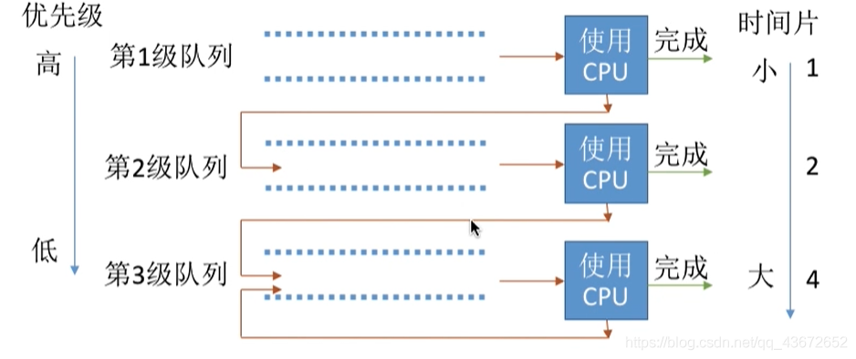

## 分页和分段的区别

页和分段系统有许多相似之处,但在概念上两者完全不同,主要表现在：

1、页是信息的物理单位,分页是为实现离散分配方式,以消减内存的外零头,提高内存的利用率；或者说,分页仅仅是由于系统管理的需要,而不是用户的需要.
段是信息的逻辑单位,它含有一组其意义相对完整的信息.分段的目的是为了能更好的满足用户的需要.

2、页的大小固定且由系统确定,把逻辑地址划分为页号和页内地址两部分,是由机器硬件实现的,因而一个系统只能有一种大小的页面.
段的长度却不固定,决定于用户所编写的程序,通常由编辑程序在对源程序进行编辑时,根据信息的性质来划分.

3、分页的作业地址空间是维一的,即单一的线性空间,程序员只须利用一个记忆符,即可表示一地址.
分段的作业地址空间是二维的,程序员在标识一个地址时,既需给出段名,又需给出段内地址.

## rip是什么

路由信息协议RIP（Routing Information Protocol）是基于距离矢量算法的路由协议，利用跳数来作为计量标准。在带宽、配置和管理方面要求较低，主要适合于规模较小的网络中。

## 常见的几种进程调度算法

### 先来先服务（FCFS）

- 算法思想：主要从“公平”的角度考虑（类似于我们生活中排队买东西的例子）
- 算法规则：按照作业/进程到达的先后顺序进行服务
- 用于作业/进程调度： 是否可抢占：非抢占的算法
- 优缺点：
  - 优点：公平、算法实现简单；
  - 缺点：排在长作业后面的短作业需要等待很长时间，带权周转时间很大，对短作业来说体验很不好。 是否会导致饥饿：不会

### 短作业优先（SJF）

- 算法思想：追求最少的平均等待时间，最少的平均周转时间、最少的平均带权周转时间
- 算法规则：最短作业/进程优先得到服务（所谓“最短”，是指要求服务时间最短）
- 是否可抢占: SJF和SPF是非抢占的算法。但是也有抢占式的版本–最短剩余时间优先算法
- 优缺点：
  优点：“最短的”平均等待事件、平均周转时间
  缺点：不公平。对短作业有利。可能产生饥饿喜爱你想。
- 是否会导致饥饿：会。如果有不断地短作业到来，可能使长作业长时间得不到服务，产生“饥饿”现象。如果一直得不到服务，则称为饿死。

### 高响应比优先（HRRN）

- 算法思想：要综合考虑作业/进程的等待时间和要被服务的时间
- 算法规则：在每次调度时先计算各个作业或进程的响应比，高响应比的进程被优先服务
- 响应比 =（进程等待时间+要求服务的时间）/ 要求服务的时间
- 是否可抢占：非抢占的算法。因此只有当前运行的作业或者进程主动放弃处理机时，才需要调度，才需要计算响应比。
- 优缺点：综合考虑了等待时间和运行时间（要求服务时间）；等待时间相同时，要求服务时间短的优先；服务时间相等时，要求等待时间长的优先，对于长时间来说，随着等待时间越来越久，其响应比也会越来越大，从而避免长作业饥饿的问题。
- 是否会导致饥饿：否

**以上这几种算法主要关心对用户的公平性、平均周转时间、平均等待时间等评价系统整体性能的指标，但是不关心“响应时间”，也并不区分任务的紧急程度，因此对于用户来说，交互性是很糟糕的。所示这些算法一般适用于早期的批处理系统，当然，FCFS算法也常结合其他的算法来使用，在现在也扮演着很重要角色。**

### 时间片轮转调度算法（RR）

- 算法思想：公平地、轮流地为各个进程服务，让每个进程在一定时间内都可以得到响应（进程间调度）
- 算法规则：按照各进程到达就绪队列的顺序，轮流让各个进程执行一个时间片。若进程未在一个时间片内执行完。则剥夺处理机，将进程重新放到就绪队列队尾重新排队。
- 用于作业/进程：用于进程调度（只有作业放入内存建立相对应的进程后，才能被分配处理机时间片）
- 是否可抢占：可抢占（时钟装置发出时钟中断来通知CPU时间片已到）
- 优点：公平；响应快，适用于分时操作系统；
- 缺点：由于高频的进程切换,因此有一定开销；不区分任务的紧急程度。
- 是否会导致饥饿：不会
- 时间片太大或者太小造成的影响：
  - 如果时间片太大，使得每个进程都会在一个时间片内完成，时间片调度算法就会退化为先来先服务算法，并且会增大进程响应时间。因此时间片不能太大。
  - 如果时间片太小，进程调度、切换是有时间代价的，它会导致进程切换过于频繁，系统会花费大量的时间来处理进程间的切换，从而导致实际用于进程执行的时间比例减少。可见时间片也不能太小。
    一般来说，设计时间片的时候要让切换进程的开销占比不超过1%。

### 优先级调度算法

- 算法思想：随着计算机的发展，特别是实时操作系统的出现，越来越多的应用场景需要根据任务的紧急程度来决定处理进程的顺序、
- 算法规则：调度时选择优先级最高的进程
- 用于作业/进程：既可用于作业调度，也可用于进程调度。甚至还会用于在之后学习的IO调度
- 是否是可抢占的：抢占式和非抢占式都有。非抢占式只需要在进程主动放弃处理机时进程调度即可，而抢占式还需在就绪队列变化时，检查是否会发生抢占。
- 优点：有优先级区分紧急程度，适用于实时操作系统。可灵活地调整对各个作业/进程的编号程度。
- 缺点：若有源源不断的高优先级进程到来，低优先级进程可能会导致饥饿。
- 是否会导致饥饿：会

就绪队列未必只有一个，可以按照不同的优先级来组织。另外，也可以把优先级高的进程排在更靠近队头的位置。

**根据优先级是否可以动态改变，可将优先级分为静态优先级和动态优先级两种。**

1. 静态优先级：创建进程时就确定，之后一直不变
2. 动态优先级：创建进程的时候有个初始值，之后会根据情况动态地调整优先级。

**通常：系统进程优先级高于用户进程；前台进程优先级高于后台进程，操作系统更偏好IO型进程（或IO繁忙型进程）
注：与IO进程相对的是计算型进程（或称CPU繁忙型进程）**

### 多级反馈队列调度算法

- 算法思想：对其他调度算法的综合
- 算法规则：
  1、设置多级就绪队列，各级队列优先级从高到低，时间片从小到大
  2、新进程到达时先进入1级队列，按照先来先服务原则排队等待被分配时间片，若用完时间片还未结束，则进程进入下一级队列，则重新放回该队列队尾。
  3、只有第k级队列为空时，才会为k+1级队头的进程分配时间片
  用于进程调度
- 是否可抢占：抢占式算法，在K级队列的进程运行过程中，如果更上级别的队列中新进入了一个进程，则由于新进程处于优先级更高的队列中，因此新进程先在处理机运行，原来运行的进程放回k级队列队尾。
- 优点：对各类型进程相对公平（FCFS的优点）；每个新到达的进程都可以很快就得到响应（RR的优点）；短进程只用较少的时间就可完成。（SPF的优点）；不必实现估计进程的运行时间（避免用户作假）；可灵活地调整对各类进程的偏好程度，比如CpU密集型进程、I/O密集型进程（拓展：可以将因I/O而阻塞的进程重新放回原队列，这样I/O型进程就可以保持较高优先级）
- 是否会导致饥饿： 会



[进程切换与线程切换的区别](https://www.cnblogs.com/ltyc/p/14349588.html)

一、什么是虚拟内存

```
虚拟内存是操作系统为每个进程提供的一种抽象，每个进程都有属于自己的，私有的、地址连续的虚拟内存，当然我们知道最终进程的数据及代码必然要放到物理内存上，那么必须有某种机制能记住虚拟地址空间中的某个数据 被放到了那个物理内存地址上，这就是所谓的地址空间映射，也就是虚拟内存地址与物理地址的映射关系，操作系统通过页表记住这种映射关系，页表中记录了虚拟内存地址到物理内存地址的映射关系。有了页表就可以将虚拟地址转换为物理内存地址了，这种机制就是虚拟内存。
```

二、进程切换和线程切换的区别

```
进程切换与线程切换的一个最主要区别就在于进程切换涉及到虚拟地址空间的切换而线程切换则不会。因为每个进程都有自己的虚拟地址空间，而线程是共享所在进程的虚拟地址空间的，因此同一个进程中的线程进行线程切换时不涉及虚拟地址空间的转换。

举一个不太恰当的例子，线程切换就好比你从主卧走到次卧，反正主卧和次卧都在同一个房子中(虚拟地址空间)，因此你无需换鞋子、换衣服等等。但是进程切换就不一样了，进程切换就好比从你家到别人家，这是两个不同的房子(不同的虚拟地址空间)，出发时要换好衣服、鞋子等等，到别人家后还要再换鞋子等等。

因此我们可以形象的认为线程是处在同一个屋檐下的，这里的屋檐就是虚拟地址空间，因此线程间切换无需虚拟地址空间的切换；而进程则不同，两个不同进程位于不同的屋檐下，即进程位于不同的虚拟地址空间，因此进程切换涉及到虚拟地址空间的切换，这也是为什么进程切换要比线程切换慢的原因。
```

三、为什么虚拟地址切换很慢

```
现在我们已经知道了进程都有自己的虚拟地址空间，把不腻地址转化为物理地址需要查找页表，页表查找是一个很慢的过程，因此通常使用Cache来缓存常用的地址映射，这样可以加速页表查找，这个Cache就是TLB，Translation Lookaside Buffer，我们不需要关心这个名字，只需要知道TLB本质上就是一个cache，是用来加速页表查找的。由于每个进程都有自己的虚拟地址空间，那么显然每个进程都有自己的页表，那么当进程切换后页表也要进行切换，页表切换后TLB就失效了，cache失效导致命中率降低，那么虚拟地址转换为物理地址就会变慢，表现出来的就是程序运行会变慢，而线程切换不会导致TLB失效，因为线程无需切换地址空间，因此我们通常说线程切换比进程切换快，原因就在这里。
```

## 原码、反码、补码区别

 我们以 int 类型的数1为例，因为int类型的数占用4字节（32位），每个字节8bit。

所以整数1在计算机中表示为：

00000000 00000000 00000000 00000001（原）

32位，所以需要填一堆0.。这个就是原码。

—— 原码：一个整数，按照绝对值大小转换成的二进制数，称为原码。

—— 反码：将二进制数按位取反，所得的新二进制数称为原二进制数的反码。取反操作：0变1，1变0。

00000000 00000000 00000000 00000001的反码为 

11111111 11111111 11111111 11111110（反）

—— 补码：补码：反码加1称为补码。

**划重点的，补码就是负数在计算机中的二进制表示方法。**

**意思就是说，负数在二进制中的表示，是通过对应绝对值（整数），先写成对应的原码，然后得到反码，然后将反码加上1，所得数称为补码。补码就是负数。**

**因此-1在计算机中用二进制表示的过程：通过1变成原码，按位取反获得反码，然后在最后一位加一就得到**

**11111111 11111111 11111111 11111111（补）**


