## 分页和分段的区别

页和分段系统有许多相似之处,但在概念上两者完全不同,主要表现在：

1、页是信息的物理单位,分页是为实现离散分配方式,以消减内存的外零头,提高内存的利用率；或者说,分页仅仅是由于系统管理的需要,而不是用户的需要.
段是信息的逻辑单位,它含有一组其意义相对完整的信息.分段的目的是为了能更好的满足用户的需要.

2、页的大小固定且由系统确定,把逻辑地址划分为页号和页内地址两部分,是由机器硬件实现的,因而一个系统只能有一种大小的页面.
段的长度却不固定,决定于用户所编写的程序,通常由编辑程序在对源程序进行编辑时,根据信息的性质来划分.

3、分页的作业地址空间是维一的,即单一的线性空间,程序员只须利用一个记忆符,即可表示一地址.
分段的作业地址空间是二维的,程序员在标识一个地址时,既需给出段名,又需给出段内地址.

## rip是什么

路由信息协议RIP（Routing Information Protocol）是基于距离矢量算法的路由协议，利用跳数来作为计量标准。在带宽、配置和管理方面要求较低，主要适合于规模较小的网络中。

## 常见的几种进程调度算法

### 先来先服务（FCFS）

- 算法思想：主要从“公平”的角度考虑（类似于我们生活中排队买东西的例子）
- 算法规则：按照作业/进程到达的先后顺序进行服务
- 用于作业/进程调度： 是否可抢占：非抢占的算法
- 优缺点：
  - 优点：公平、算法实现简单；
  - 缺点：排在长作业后面的短作业需要等待很长时间，带权周转时间很大，对短作业来说体验很不好。 是否会导致饥饿：不会

### 短作业优先（SJF）

- 算法思想：追求最少的平均等待时间，最少的平均周转时间、最少的平均带权周转时间
- 算法规则：最短作业/进程优先得到服务（所谓“最短”，是指要求服务时间最短）
- 是否可抢占: SJF和SPF是非抢占的算法。但是也有抢占式的版本–最短剩余时间优先算法
- 优缺点：
  优点：“最短的”平均等待事件、平均周转时间
  缺点：不公平。对短作业有利。可能产生饥饿喜爱你想。
- 是否会导致饥饿：会。如果有不断地短作业到来，可能使长作业长时间得不到服务，产生“饥饿”现象。如果一直得不到服务，则称为饿死。

### 高响应比优先（HRRN）

- 算法思想：要综合考虑作业/进程的等待时间和要被服务的时间
- 算法规则：在每次调度时先计算各个作业或进程的响应比，高响应比的进程被优先服务
- 响应比 =（进程等待时间+要求服务的时间）/ 要求服务的时间
- 是否可抢占：非抢占的算法。因此只有当前运行的作业或者进程主动放弃处理机时，才需要调度，才需要计算响应比。
- 优缺点：综合考虑了等待时间和运行时间（要求服务时间）；等待时间相同时，要求服务时间短的优先；服务时间相等时，要求等待时间长的优先，对于长时间来说，随着等待时间越来越久，其响应比也会越来越大，从而避免长作业饥饿的问题。
- 是否会导致饥饿：否

**以上这几种算法主要关心对用户的公平性、平均周转时间、平均等待时间等评价系统整体性能的指标，但是不关心“响应时间”，也并不区分任务的紧急程度，因此对于用户来说，交互性是很糟糕的。所示这些算法一般适用于早期的批处理系统，当然，FCFS算法也常结合其他的算法来使用，在现在也扮演着很重要角色。**

### 时间片轮转调度算法（RR）

- 算法思想：公平地、轮流地为各个进程服务，让每个进程在一定时间内都可以得到响应（进程间调度）
- 算法规则：按照各进程到达就绪队列的顺序，轮流让各个进程执行一个时间片。若进程未在一个时间片内执行完。则剥夺处理机，将进程重新放到就绪队列队尾重新排队。
- 用于作业/进程：用于进程调度（只有作业放入内存建立相对应的进程后，才能被分配处理机时间片）
- 是否可抢占：可抢占（时钟装置发出时钟中断来通知CPU时间片已到）
- 优点：公平；响应快，适用于分时操作系统；
- 缺点：由于高频的进程切换,因此有一定开销；不区分任务的紧急程度。
- 是否会导致饥饿：不会
- 时间片太大或者太小造成的影响：
  - 如果时间片太大，使得每个进程都会在一个时间片内完成，时间片调度算法就会退化为先来先服务算法，并且会增大进程响应时间。因此时间片不能太大。
  - 如果时间片太小，进程调度、切换是有时间代价的，它会导致进程切换过于频繁，系统会花费大量的时间来处理进程间的切换，从而导致实际用于进程执行的时间比例减少。可见时间片也不能太小。
    一般来说，设计时间片的时候要让切换进程的开销占比不超过1%。

### 优先级调度算法

- 算法思想：随着计算机的发展，特别是实时操作系统的出现，越来越多的应用场景需要根据任务的紧急程度来决定处理进程的顺序、
- 算法规则：调度时选择优先级最高的进程
- 用于作业/进程：既可用于作业调度，也可用于进程调度。甚至还会用于在之后学习的IO调度
- 是否是可抢占的：抢占式和非抢占式都有。非抢占式只需要在进程主动放弃处理机时进程调度即可，而抢占式还需在就绪队列变化时，检查是否会发生抢占。
- 优点：有优先级区分紧急程度，适用于实时操作系统。可灵活地调整对各个作业/进程的编号程度。
- 缺点：若有源源不断的高优先级进程到来，低优先级进程可能会导致饥饿。
- 是否会导致饥饿：会

就绪队列未必只有一个，可以按照不同的优先级来组织。另外，也可以把优先级高的进程排在更靠近队头的位置。

**根据优先级是否可以动态改变，可将优先级分为静态优先级和动态优先级两种。**

1. 静态优先级：创建进程时就确定，之后一直不变
2. 动态优先级：创建进程的时候有个初始值，之后会根据情况动态地调整优先级。

**通常：系统进程优先级高于用户进程；前台进程优先级高于后台进程，操作系统更偏好IO型进程（或IO繁忙型进程）
注：与IO进程相对的是计算型进程（或称CPU繁忙型进程）**

### 多级反馈队列调度算法

- 算法思想：对其他调度算法的综合
- 算法规则：
  1、设置多级就绪队列，各级队列优先级从高到低，时间片从小到大
  2、新进程到达时先进入1级队列，按照先来先服务原则排队等待被分配时间片，若用完时间片还未结束，则进程进入下一级队列，则重新放回该队列队尾。
  3、只有第k级队列为空时，才会为k+1级队头的进程分配时间片
  用于进程调度
- 是否可抢占：抢占式算法，在K级队列的进程运行过程中，如果更上级别的队列中新进入了一个进程，则由于新进程处于优先级更高的队列中，因此新进程先在处理机运行，原来运行的进程放回k级队列队尾。
- 优点：对各类型进程相对公平（FCFS的优点）；每个新到达的进程都可以很快就得到响应（RR的优点）；短进程只用较少的时间就可完成。（SPF的优点）；不必实现估计进程的运行时间（避免用户作假）；可灵活地调整对各类进程的偏好程度，比如CpU密集型进程、I/O密集型进程（拓展：可以将因I/O而阻塞的进程重新放回原队列，这样I/O型进程就可以保持较高优先级）
- 是否会导致饥饿： 会


[进程切换与线程切换的区别](https://www.cnblogs.com/ltyc/p/14349588.html)

一、什么是虚拟内存

```
虚拟内存是操作系统为每个进程提供的一种抽象，每个进程都有属于自己的，私有的、地址连续的虚拟内存，当然我们知道最终进程的数据及代码必然要放到物理内存上，那么必须有某种机制能记住虚拟地址空间中的某个数据 被放到了那个物理内存地址上，这就是所谓的地址空间映射，也就是虚拟内存地址与物理地址的映射关系，操作系统通过页表记住这种映射关系，页表中记录了虚拟内存地址到物理内存地址的映射关系。有了页表就可以将虚拟地址转换为物理内存地址了，这种机制就是虚拟内存。
```

二、进程切换和线程切换的区别

```
进程切换与线程切换的一个最主要区别就在于进程切换涉及到虚拟地址空间的切换而线程切换则不会。因为每个进程都有自己的虚拟地址空间，而线程是共享所在进程的虚拟地址空间的，因此同一个进程中的线程进行线程切换时不涉及虚拟地址空间的转换。

举一个不太恰当的例子，线程切换就好比你从主卧走到次卧，反正主卧和次卧都在同一个房子中(虚拟地址空间)，因此你无需换鞋子、换衣服等等。但是进程切换就不一样了，进程切换就好比从你家到别人家，这是两个不同的房子(不同的虚拟地址空间)，出发时要换好衣服、鞋子等等，到别人家后还要再换鞋子等等。

因此我们可以形象的认为线程是处在同一个屋檐下的，这里的屋檐就是虚拟地址空间，因此线程间切换无需虚拟地址空间的切换；而进程则不同，两个不同进程位于不同的屋檐下，即进程位于不同的虚拟地址空间，因此进程切换涉及到虚拟地址空间的切换，这也是为什么进程切换要比线程切换慢的原因。
```

三、为什么虚拟地址切换很慢

```
现在我们已经知道了进程都有自己的虚拟地址空间，把不腻地址转化为物理地址需要查找页表，页表查找是一个很慢的过程，因此通常使用Cache来缓存常用的地址映射，这样可以加速页表查找，这个Cache就是TLB，Translation Lookaside Buffer，我们不需要关心这个名字，只需要知道TLB本质上就是一个cache，是用来加速页表查找的。由于每个进程都有自己的虚拟地址空间，那么显然每个进程都有自己的页表，那么当进程切换后页表也要进行切换，页表切换后TLB就失效了，cache失效导致命中率降低，那么虚拟地址转换为物理地址就会变慢，表现出来的就是程序运行会变慢，而线程切换不会导致TLB失效，因为线程无需切换地址空间，因此我们通常说线程切换比进程切换快，原因就在这里。
```

## 原码、反码、补码区别

 我们以 int 类型的数1为例，因为int类型的数占用4字节（32位），每个字节8bit。

所以整数1在计算机中表示为：

00000000 00000000 00000000 00000001（原）

32位，所以需要填一堆0.。这个就是原码。

—— 原码：一个整数，按照绝对值大小转换成的二进制数，称为原码。

—— 反码：将二进制数按位取反，所得的新二进制数称为原二进制数的反码。取反操作：0变1，1变0。

00000000 00000000 00000000 00000001的反码为 

11111111 11111111 11111111 11111110（反）

—— 补码：补码：反码加1称为补码。

**划重点的，补码就是负数在计算机中的二进制表示方法。**

**意思就是说，负数在二进制中的表示，是通过对应绝对值（整数），先写成对应的原码，然后得到反码，然后将反码加上1，所得数称为补码。补码就是负数。**

**因此-1在计算机中用二进制表示的过程：通过1变成原码，按位取反获得反码，然后在最后一位加一就得到**

**11111111 11111111 11111111 11111111（补）**


## HTTP如何实现缓存，怎样告诉浏览器这个可以被缓存以及缓存时间

浏览器是如何知道使用缓存的，其实这都是通过http中，浏览器将最后修改时间发送请求给web服务器，web服务器收到请求后跟服务器上的文档最后修改的时间对比，如果web服务器上最新文档修改时间小于或者等于浏览器发送过来的，则发送304给浏览器，使用缓存版本。

### 缓存的概念

缓存这个东西真的是无处不在， 有浏览器端的缓存， 有服务器端的缓存，有代理服务器的缓存， 有ASP.NET页面缓存，对象缓存。 数据库也有缓存， 等等。

http中具有缓存功能的是浏览器缓存，以及缓存代理服务器。

http缓存的是指:当Web请求抵达缓存时， 如果本地有“已缓存的”副本，就可以从本地存储设备而不是从原始服务器中提取这个文档。

### 缓存的好处

缓存的好处是显而易见的， 好处有，

1. 减少了冗余的数据传输，节省了网费。
2. 减少了服务器的负担， 大大提高了网站的性能
3. 加快了客户端加载网页的速度

### Fiddler可以方便地查看缓存的header

Fiddler中把header都分门别类的放在一起，这样方便查看。

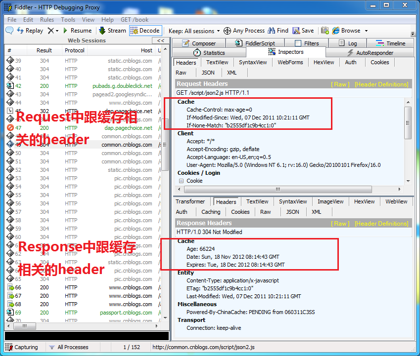

### 如何判断缓存新鲜度

Web服务器通过2种方式来判断浏览器缓存是否是最新的。

第一种， 浏览器把缓存文件的最后修改时间通过 header ”**If-Modified-Since**“来告诉Web服务器。

第二种， 浏览器把缓存文件的ETag, 通过header "**If-None-Match**", 来告诉Web服务器。

### 通过最后修改时间, 来判断缓存新鲜度

1. 浏览器客户端想请求一个文档，  首先检查本地缓存，发现存在这个文档的缓存，  获取缓存中文档的最后修改时间，通过： If-Modified-Since， 发送Request给Web服务器。
2. Web服务器收到Request，将服务器的文档修改时间（Last-Modified）: 跟request header 中的，If-Modified-Since相比较， 如果时间是一样的， 说明缓存还是最新的， Web服务器将发送304 Not Modified给浏览器客户端， 告诉客户端直接使用缓存里的版本。如下图。

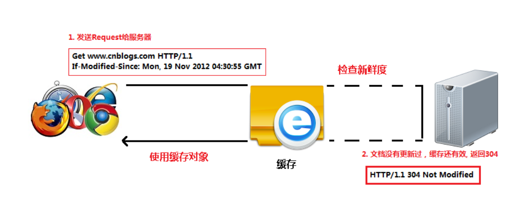

3.假如该文档已经被更新了。Web服务器将发送该文档的最新版本给浏览器客户端， 如下图。

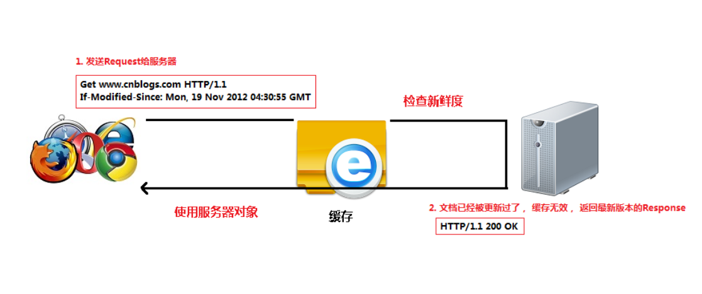

实例： 打开Fiddler, 然后打开博客园首页。然后F5刷新几次浏览器。 你会看到博客园首页也用了缓存。

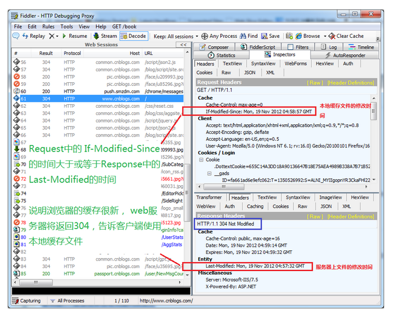

### 与缓存有关的header

我们来看看每个header的具体含义。

**Request**

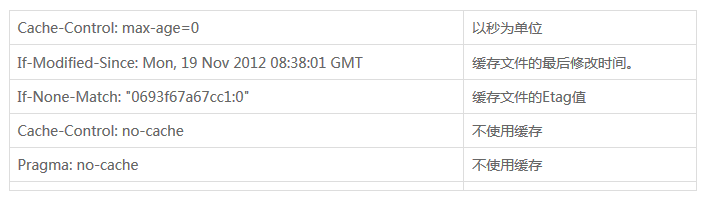

**Response**

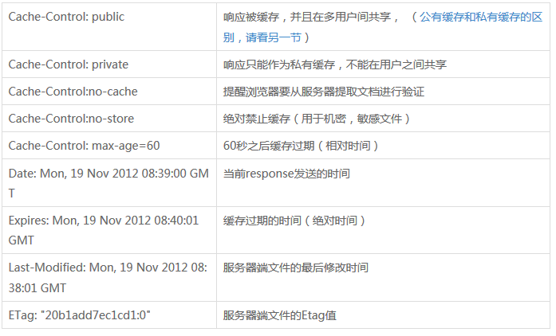

如果同时存在cache-control和Expires怎么办呢？

浏览器总是优先使用cache-control，如果没有cache-control才考虑Expires

### ETag

ETag是实体标签（Entity Tag）的缩写， 根据实体内容生成的一段hash字符串（类似于MD5或者SHA1之后的结果），可以标识资源的状态。 当资源发送改变时，ETag也随之发生变化。

ETag是Web服务端产生的，然后发给浏览器客户端。浏览器客户端是不用关心Etag是如何产生的。

为什么使用ETag呢？ 主要是为了解决Last-Modified 无法解决的一些问题。

1. 某些服务器不能精确得到文件的最后修改时间， 这样就无法通过最后修改时间来判断文件是否更新了。
2. 某些文件的修改非常频繁，在秒以下的时间内进行修改. Last-Modified只能精确到秒。
3. 一些文件的最后修改时间改变了，但是内容并未改变。 我们不希望客户端认为这个文件修改了

**实例:**

打开Fiddler, 打开博客园首页。 你可以看到很多图片，或者CSS文件都是用了缓存。 这些都是通过比较ETag的值，来判断文件是否更新了。

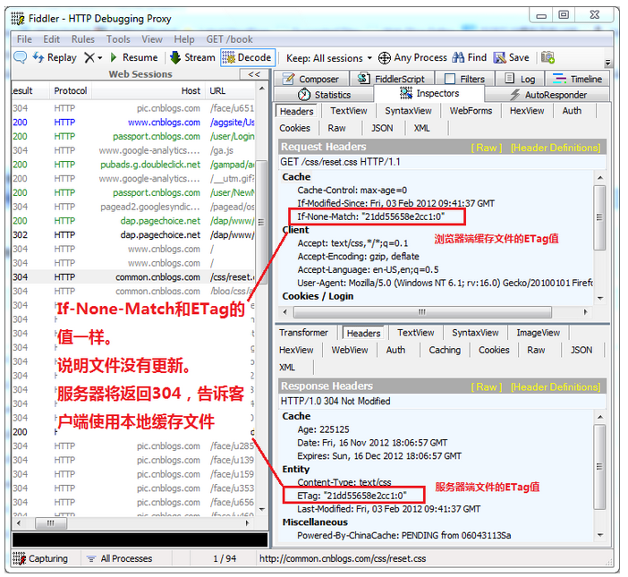

### 浏览器不使用缓存

CTRL+F5强制刷新浏览器，或者设置IE。  可以让浏览器不使用缓存。

1. 浏览器发送Http request, 给Web 服务器， header中带有Cache-Control: no-cache.   明确告诉Web服务器，客户端不使用缓存。
2. Web服务器将把最新的文档发送给浏览器客户端.

**实例:**

打开Fiddler, 打开博客园首页， 然后按CTRL+F5强制刷新浏览器，你将看到

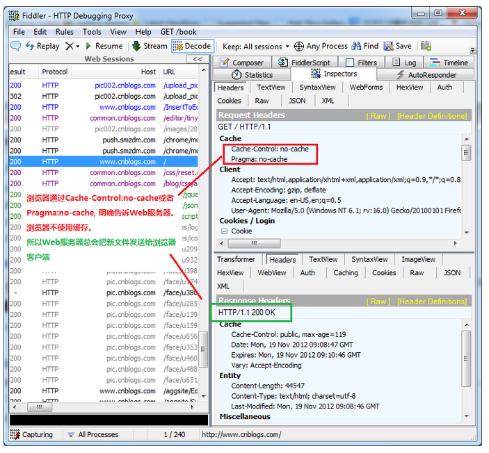

Pragma: no-cache的作用和Cache-Control: no-cache一模一样。 都是不使用缓存。

Pragma: no-cache 是HTTP 1.0中定义的， 所以为了兼容HTTP 1.0. 所以会同时使用Pragma: no-cache和Cache-Control: no-cache

### 直接使用缓存，不去服务器验证

按F5刷新浏览器和在地址栏里输入网址然后回车。 这两个行为是不一样的。

按F5刷新浏览器， 浏览器会去Web服务器验证缓存。

如果是在地址栏输入网址然后回车，浏览器会"直接使用有效的缓存", 而不会发http request 去服务器验证缓存，这种情况叫做缓存命中，如下图


**实例**： 比较第一次访问博客园主页和第二次博客园主页

1. 启动Fiddler, 用firefox打开博客园主页， 发现有50多个session。
2. 按CTRL+X将Fiddler中的所有session删除。 关闭firefox,重新打开一个firefox，打开博客园主页。   发现只有30多个session.

分析；  少了的session是因为firefox直接用了缓存，而没有发http request。


### 如何设置IE不使用缓存

打开IE。点击工具栏上的， 工具->Internet选项->常规->浏览历史记录 设置. 选择“从不”。然后保存。

然后点击“删除”  把Internet临时文件都删掉 （IE缓存的文件就是Internet临时文件）。

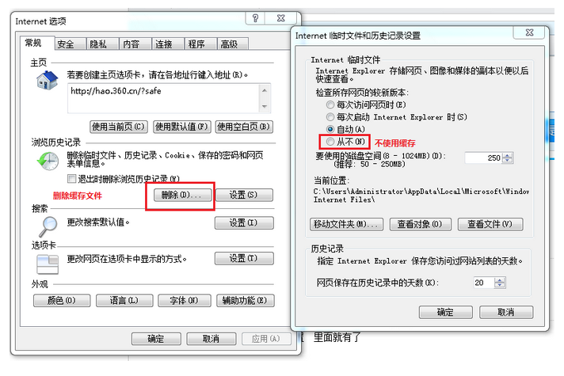

### 公有缓存和私有缓存的区别

Cache-Control: **public 指可以公有缓存， 可以是数千名用户共享的。**

Cache-Control: **private 指只支持私有缓存， 私有缓存是单个用户专用的。**


## HTTP断点续传是如何实现的？

其实断点续传的原理很简单，就是在Http的请求上和一般的下载有所不同而已。

打个比方，浏览器请求服务器上的一个文时，所发出的请求如下：假设服务器域名为wwww.scu.edu.cn，文件名为down.zip。

```http
GET /down.zip HTTP/1.1
Accept: image/gif, image/x-xbitmap, image/jpeg, image/pjpeg, application/vnd.ms-
excel, application/msword, application/vnd.ms-powerpoint, */*
Accept-Language: zh-cn
Accept-Encoding: gzip, deflate
User-Agent: Mozilla/4.0 (compatible; MSIE 5.01; Windows NT 5.0)
Connection: Keep-Alive
```

服务器收到请求后，按要求寻找请求的文件，提取文件的信息，然后返回给浏览器，返回信息如下：

```http
200
Content-Length=106786028
Accept-Ranges=bytes
Date=Mon, 30 Apr 2001 12:56:11 GMT
ETag=W/"02ca57e173c11:95b"
Content-Type=application/octet-stream
Server=Microsoft-IIS/5.0
Last-Modified=Mon, 30 Apr 2001 12:56:11 GMT
```

所谓断点续传，也就是要从文件已经下载的地方开始继续下载。所以在客户端浏览器传给Web服务器的时候要多加一条信息--从哪里开始。下面是用自己编的一个"浏览器"来传递请求信息给Web服务器，要求从2000070字节开始。

```http
GET /down.zip HTTP/1.0
User-Agent: NetFox
RANGE: bytes=2000070-
Accept: text/html, image/gif, image/jpeg, *; q=.2, */*; q=.2
```

仔细看一下就会发现多了一行RANGE: bytes=2000070-这一行的意思就是告诉服务器down.zip这个文件从2000070字节开始传，前面的字节不用传了。服务器收到这个请求以后，返回的信息如下：

```http
206
Content-Length=106786028
Content-Range=bytes 2000070-106786027/106786028
Date=Mon, 30 Apr 2001 12:55:20 GMT
ETag=W/"02ca57e173c11:95b"
Content-Type=application/octet-stream
Server=Microsoft-IIS/5.0
Last-Modified=Mon, 30 Apr 2001 12:55:20 GMT
```

和前面服务器返回的信息比较一下，就会发现增加了一行：Content-Range=bytes 2000070-106786027/106786028返回的代码也改为206了，而不再是200了。

知道了以上原理，就可以进行断点续传的编程了。

## mysql存储引擎你知道哪些

下面重点介绍几种常用的存储引擎， 并对比各个存储引擎之间的区别， 如下表所示 ： 

| 特点         | InnoDB               | MyISAM   | MEMORY | MERGE | NDB  |
| ------------ | -------------------- | -------- | ------ | ----- | ---- |
| 存储限制     | 64TB                 | 有       | 有     | 没有  | 有   |
| 事务安全     | ==支持==             |          |        |       |      |
| 锁机制       | ==行锁(适合高并发)== | ==表锁== | 表锁   | 表锁  | 行锁 |
| B树索引      | 支持                 | 支持     | 支持   | 支持  | 支持 |
| 哈希索引     |                      |          | 支持   |       |      |
| 全文索引     | 支持(5.6版本之后)    | 支持     |        |       |      |
| 集群索引     | 支持                 |          |        |       |      |
| 数据索引     | 支持                 |          | 支持   |       | 支持 |
| 索引缓存     | 支持                 | 支持     | 支持   | 支持  | 支持 |
| 数据可压缩   |                      | 支持     |        |       |      |
| 空间使用     | 高                   | 低       | N/A    | 低    | 低   |
| 内存使用     | 高                   | 低       | 中等   | 低    | 高   |
| 批量插入速度 | 低                   | 高       | 高     | 高    | 高   |
| 支持外键     | ==支持==             |          |        |       |      |

## B+树结构

- B+树索引：B+树是b树的变种，主要区别在于：B+树的非叶子节点只存储 key + 指向下一层节点的指针，也就是只存索引，不存数据，数据都保存在叶子节点中。另外，B+树的叶子节点之间通过指针来连接，构成一个有序链表，因此对整棵树的遍历只需要一次线性遍历叶子结点即可。

- 索引有三个优点： ①减少了服务器需要扫描的数据量；②帮助服务器避免排序；③将随机IO变为顺序IO，因为 B+ 树索引是有序的，它将相邻的数据都存储在一起。

- 索引的缺点：创建索引和维护索引会耗费时间；索引会占用物理空间；当对表进行增删改时，索引也需要动态维护，这样会降低数据的维护速度。一般在频繁使用或需要排序的字段上建立索引，而对于很少查询或重复值较多的列，不适合建立索引。

## innodb和myisam的B+树索引结构有什么区别

- 一是主索引的区别，InnoDB的数据文件本身就是索引文件。而MyISAM的索引和数据是分开的。

- 二是辅助索引的区别：InnoDB的辅助索引data域存储相应记录主键的值而不是地址。而MyISAM的辅助索引和主索引没有多大区别。

## 2000万数据的b+树有几层？怎么计算的

- B+树一个节点的大小设为一页或页的倍数最为合适。因为如果一个节点的大小 < 1页，那么读取这个节点的时候其实读取的还是一页，这样就造成了资源的浪费。

- 在 MySQL 中 B+ 树的一个节点大小为“1页”，也就是16k。之所以设置为一页，是因为对于大部分业务，一页就足够了：

  - 首先InnoDB的B+树中，非叶子节点存的是key + 指针；叶子节点存的是数据行。
  - 对于叶子节点，如果一行数据大小为1k，那么一页就能存16条数据；对于非叶子节点，如果key使用的是bigint，则为8字节，指针在mysql中为6字节，一共是14字节，则16k能存放 16 * 1024 / 14 = 1170 个索引指针。于是可以算出，对于一颗高度为2的B+树，根节点存储索引指针节点，那么它有1170个叶子节点存储数据，每个叶子节点可以存储16条数据，一共 1170 x 16 = 18720 条数据。而对于高度为3的B+树，就可以存放 1170 x 1170 x 16 = 21902400 条数据（两千多万条数据），也就是对于两千多万条的数据，我们只需要高度为3的B+树就可以完成，通过主键查询只需要3次IO操作就能查到对应数据。所以在 InnoDB 中B+树高度一般为3层时，就能满足千万级的数据存储，所以一个节点为1页，也就是16k是比较合理的。

## page size可以修改吗

我们知道Innodb的数据页是16K,而且是一个硬性的规定，系统里没更改的办法，希望将来MySQL也能也Oracle一样支持多种数据页的大小。

但实际应用中有时16K显的有点大了，特别是很多业务在Oracle或是SQL SERVER运行的挺好的情况下迁到了MySQL上发现IO增长太明显的情况下，就会想到更改数据页大小了。

实际上innodb的数据页大小也是可以更改的，只是需要在源码层去更改，然后重新rebuild一下MySQL.

更改办法(以MySQL-5.1.38源码为例）：

位置在storage/innobase/include/univ.i ，在univ.i中查找：UNIV_PAGE_SIZE

```c++
/*
  DATABASE VERSION CONTROL
  ========================
*/
 
/* The universal page size of the database */
#define UNIV_PAGE_SIZE     (2 * 8192) /* NOTE! Currently, this has to be a
   power of 2 */
/* The 2-logarithm of UNIV_PAGE_SIZE: */
#define UNIV_PAGE_SIZE_SHIFT 14
 
/* Maximum number of parallel threads in a parallelized operation */
#define UNIV_MAX_PARALLELISM 32
```

UNIV_PAGE_SIZE就是数据页大小，默认的是16K. 后面的备注里标明，该值是可以设置必须为2的次方。对于该值可以设置成4k,8k,16k,32K,64K，在大也没意义了。

同时更改了UNIV_PAGE_SIZE后需要更改 UNIV_PAGE_SIZE_SHIFT 该值是2的多少次方为UNIV_PAGE_SIZE，所以设置数据页分别情况如下：

```c++
#define UNIV_PAGE_SIZE_SHIFT 12 if UNIV_PAGE_SIZ=4K
#define UNIV_PAGE_SIZE_SHIFT 13 if UNIV_PAGE_SIZ=8K
#define UNIV_PAGE_SIZE_SHIFT 15 if UNIV_PAGE_SIZ=32K
```

例子：更改innodb的数据页为8K,相应修改为：

```c++
/*
  DATABASE VERSION CONTROL
  ========================
*/
  
/* The universal page size of the database */
#define UNIV_PAGE_SIZE     8192  /* NOTE! Currently, this has to be a
   power of 2 */
/* The 2-logarithm of UNIV_PAGE_SIZE: */
#define UNIV_PAGE_SIZE_SHIFT 13
  
/* Maximum number of parallel threads in a parallelized operation */
#define UNIV_MAX_PARALLELISM 32
```

重新编译，然后测试测试，再测试。Good luck!

## innodb行锁的加锁机制说一下

**行锁的类型**

行锁分 共享锁 和 排它锁。

**共享锁又称：**读锁。当一个事务对某几行上读锁时，允许其他事务对这几行进行读操作，但不允许其进行写操作，也不允许其他事务给这几行上排它锁，但允许上读锁。

**排它锁又称：**写锁。当一个事务对某几个上写锁时，不允许其他事务写，但允许读。更不允许其他事务给这几行上任何锁。包括写锁。

## 并发事务处理带来的问题

　　相对于串行处理来说，并发事务处理能大大增加数据库资源的利用率，提高数据库系统的事务吞吐量，从而可以支持更多的用户。但并发事务处理也会带来一些问题，主要包括以下几种情况。

　　**更新丢失**（Lost Update）：当两个或多个事务选择同一行，然后基于最初选定的值更新该行时，由于每个事务都不知道其他事务的存在，就会发生丢失更新问题－－最后的更 新覆盖了由其他事务所做的更新。例如，两个编辑人员制作了同一文档的电子副本。每个编辑人员独立地更改其副本，然后保存更改后的副本，这样就覆盖了原始文 档。最后保存其更改副本的编辑人员覆盖另一个编辑人员所做的更改。如果在一个编辑人员完成并提交事务之前，另一个编辑人员不能访问同一文件，则可避免此问 题。
　　**脏读**（Dirty Reads）：一个事务正在对一条记录做修改，在这个事务完成并提交前，这条记录的数据就处于不一致状态；这时，另一个事务也来读取同一条记录，如果不加 控制，第二个事务读取了这些“脏”数据，并据此做进一步的处理，就会产生未提交的数据依赖关系。这种现象被形象地叫做"脏读"。
　　**不可重复读**（Non-Repeatable Reads）：一个事务在读取某些数据后的某个时间，再次读取以前读过的数据，却发现其读出的数据已经发生了改变、或某些记录已经被删除了！这种现象就叫做“不可重复读”。
　　**幻读**（Phantom Reads）：一个事务按相同的查询条件重新读取以前检索过的数据，却发现其他事务插入了满足其查询条件的新数据，这种现象就称为“幻读”。

| 读数据一致性及允许的并发副作用隔离级别 | 读数据一致性                             | 脏读   | 不可重复读 | 幻读   |
| -------------------------------------- | ---------------------------------------- | ------ | ---------- | ------ |
| 未提交读（Read uncommitted）           | 最低级别，只能保证不读取物理上损坏的数据 | 是     | 是         | 是     |
| 已提交度（Read committed）             | 语句级                                   | 否     | 是         | 是     |
| **可重复读（Repeatable read）**        | **事务级**                               | **否** | **否**     | **是** |
| 可序列化（Serializable）               | 最高级别，事务级                         | 否     | 否         | 否     |

## TCP粘包、拆包

基于TCP的网络编程中， 数据传输是基于连接的，所以当网络出现堵塞或者发送频率过高的时候，就会出现粘包的情况。**粘包就是并不是一个接收对应一个发送，有可能一个接收对应多个发送，也可能一个接收少于一个发送。**由于我们在网络编程中，经常以对象作为发送的单元，所以接受端必须对粘包做处理，还原原来的对象。


下图说明了接受端接收到数据的各种情况：

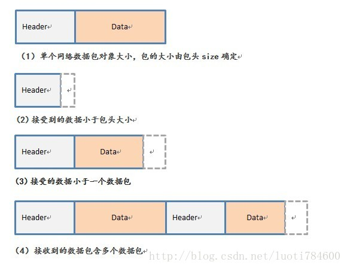

当然，接收到第一种情况是最理想的，也不须处理。本文针对2 3 4情况做处理。

算法解析：

首先有一个对象用于保存上次未能处理的数据，和上次为处理数据的长度。

1.  将本次接收到的数据拼接到上一次未处理数据后面，为未处理数据。

2.  判断未处理数据长度是否大于包头，

     若小于包头，直接退出(包头保存长度信息) ， 否则转3。

3. 根据包头判断对象大小是否大于未处理数据长度，若是转3， 否则保存未处理数据退出。

4. 截出第一个对象进行处理，剩下的数据重新保存到未处理对象，继续转2循环.

```c++
// TcpDataSplit.cpp : 定义控制台应用程序的入口点。
//
 
#include "stdafx.h"
#include <stdio.h>
#include <stdlib.h>
#include <string.h>
 
#define MAX_NETPACK_SIZE	10000
#define MAX_DATA_SIZE			4086
 
/* 数据包头类型 */
struct NetDataHeader_t
{
	int nDataType;											//数据包类型，标识对应的对象类型
	int nDataSize;											//数据包中szData真实数据的长度
};
 
/*  数据包类型 */
struct NetDataBase_t
{
	NetDataHeader_t  dataHeader;			//数据包头
	char	 szData[MAX_DATA_SIZE];				//真实数据
};
 
/**
    其实NetDataBase_t是基础类型，由此我们可以延伸出很多子类型，
	所以我们要清楚，每个类型的长度是不一样的，不都是sizeof(NetDataBase_t)，
	就是各个类型对象大小不一样，比如：
	在派生结构体中，NetDataPeople_t和NetDataSchool_t是两个各异的结构体，
	但他们都有相关的Header部分指明结构体类型和长度。
*/
struct NetDataPeople_t
{
	NetDataHeader_t dataHeader;	
	int		nAge;
	char    szName[10];
};
 
struct NetDataSchool_t
{
	NetDataHeader_t dataHeader;	
	char    szShoolName[20];
	char    szShoolAddress[30];
};
 
/**
    处理整理好的对象。
*/
bool HandleNetPack(NetDataHeader_t* pDataHeader);
 
 
bool TcpDataSplit(const char* szRecNetData, int nRecSize)
{
	/**
	    对于szLastSaveData, nRemainSize,为了简单，本例子只
		作为静态变量使用，因此只限于一个socket的数据接收，
		假如要同时处理多个socket数据，请放在对应容器里保存
	*/
	static char szLastSaveData[MAX_NETPACK_SIZE];
	static int nRemainSize = 0;
	static bool bFirst = true;
 
	if (bFirst)
	{
		memset(szLastSaveData, 0, sizeof(szLastSaveData));
		bFirst = false;
	}
 
	/* 本次接收到的数据拼接到上次数据 */
	memcpy( (char*)(szLastSaveData+nRemainSize), szRecNetData, nRecSize );
	nRemainSize = nRecSize + nRemainSize;
 
	/* 强制转换成NetDataPack指针 */
	NetDataHeader_t* pDataHead = (NetDataHeader_t*)szLastSaveData;
 
	/**
	   核心算法 
	*/
	while ( nRemainSize >sizeof(NetDataHeader_t) &&
				nRemainSize >= pDataHead->nDataSize +sizeof(NetDataHeader_t) )
	{
			HandleNetPack(pDataHead);
			int  nRecObjectSize = sizeof(NetDataHeader_t) + pDataHead->nDataSize;		//本次收到对象的大小
			nRemainSize -= nRecObjectSize ;				
			pDataHead = (NetDataHeader_t*)( (char*)pDataHead + nRecObjectSize );		//移动下一个对象头
	}
	
	/* 余下数据未能组成一个对象，先保存起来 */
	if (szLastSaveData != (char*)pDataHead)
	{
		memmove(szLastSaveData, (char*)pDataHead, nRemainSize);
		memset( (char*)( szLastSaveData+nRemainSize), 0, sizeof(szLastSaveData)-nRemainSize );
	}
	
	return true;
}
 
 
/**
    处理整理好的对象。
*/
bool HandleNetPack(NetDataHeader_t* pDataHeader)
{
	//处理数据包
	if  (pDataHeader->nDataType == 1)
	{
		NetDataPeople_t* pPeople = (NetDataPeople_t*)pDataHeader;
		printf("收到People对象，Age:%d, Name:%s\n", pPeople->nAge, pPeople->szName);
	}
	else if (pDataHeader->nDataType == 2)
	{
		NetDataSchool_t* pSchool = (NetDataSchool_t*)pDataHeader;
		printf("收到School对象，SchoolName:%s, SchoolAddress:%s\n", pSchool->szShoolName, pSchool->szShoolAddress);
	}
 
	return true;
}
 
int _tmain(int argc, _TCHAR* argv[])
{
	/* 本例子以两个对象作为接收到的数据 */
	NetDataPeople_t  people;
	people.dataHeader.nDataSize = sizeof(people) - sizeof(NetDataHeader_t);
	people.dataHeader.nDataType = 1;
	people.nAge = 20;
	sprintf(people.szName, "Jim");		//real data
 
	NetDataSchool_t  school;
	school.dataHeader.nDataSize = sizeof(school) - sizeof(NetDataHeader_t);
	school.dataHeader.nDataType = 2;
	sprintf(school.szShoolName, "清华大学");		//real data
	sprintf(school.szShoolAddress, "北京市北京路");		//real data
 
	/* 将两个对象数据合并到一个地址里面以便重现粘包 */
	char szSendData[sizeof(people)+sizeof(school)];
	memcpy(szSendData,  (char*)&people,  sizeof(people));
	memcpy(szSendData+sizeof(people),  (char*)&school,  sizeof(school));
 
	//这里进行收数据操作，这里省略。。。
 
	/**
	    特意设置粘包：
		1.第一次只发送3个字节，还不足以构建包头
		2.第二次发送10个字节，总共13个，但第一个对象大小是8+14=18；因此第一个对象people还没收满
		3.第三次发送剩下的全部，第一个对象剩下的部分与第二个对象粘在一起，验证处理
	*/
	TcpDataSplit((char*)szSendData, 3);
	TcpDataSplit((char*)szSendData+3,  10);
	TcpDataSplit((char*)szSendData+13,  sizeof(szSendData)-13);
 
	getchar();
	return 0;
}
```

---

我们都知道TCP属于传输层的协议，传输层除了有TCP协议外还有UDP协议。那么UDP是否会发生粘包或拆包的现象呢？

答案是不会。UDP是基于报文发送的，从UDP的帧结构可以看出，在UDP首部采用了16bit来指示UDP数据报文的长度，因此在应用层能很好的将不同的数据报文区分开，从而避免粘包和拆包的问题。

- 而TCP是基于字节流的，虽然应用层和TCP传输层之间的数据交互是大小不等的数据块，但是TCP把这些数据块仅仅看成一连串无结构的字节流，没有边界；

- 另外从TCP的帧结构也可以看出，在TCP的首部没有表示数据长度的字段，基于上面两点，在使用TCP传输数据时，才有粘包或者拆包现象发生的可能。

### 粘包、拆包表现形式

现在假设客户端向服务端连续发送了两个数据包，用packet1和packet2来表示，那么服务端收到的数据可以分为三种，现列举如下：

第一种情况，接收端正常收到两个数据包，即没有发生拆包和粘包的现象，此种情况不在本文的讨论范围内。


第二种情况，接收端只收到一个数据包，由于TCP是不会出现丢包的，所以这一个数据包中包含了发送端发送的两个数据包的信息，这种现象即为粘包。这种情况由于接收端不知道这两个数据包的界限，所以对于接收端来说很难处理。


第三种情况，这种情况有两种表现形式，如下图。接收端收到了两个数据包，但是这两个数据包要么是不完整的，要么就是多出来一块，这种情况即发生了拆包和粘包。这两种情况如果不加特殊处理，对于接收端同样是不好处理的。


**粘包、拆包发生原因**

发生TCP粘包或拆包有很多原因，现列出常见的几点，可能不全面，欢迎补充，

1、要发送的数据大于TCP发送缓冲区剩余空间大小，将会发生拆包。

2、待发送数据大于MSS（最大报文长度），TCP在传输前将进行拆包。

3、要发送的数据小于TCP发送缓冲区的大小，TCP将多次写入缓冲区的数据一次发送出去，将会发生粘包。

4、接收数据端的应用层没有及时读取接收缓冲区中的数据，将发生粘包。

等等。

**粘包、拆包解决办法**

通过以上分析，我们清楚了粘包或拆包发生的原因，那么如何解决这个问题呢？解决问题的关键在于如何给每个数据包添加边界信息，常用的方法有如下几个：

1、发送端给每个数据包添加包首部，首部中应该至少包含数据包的长度，这样接收端在接收到数据后，通过读取包首部的长度字段，便知道每一个数据包的实际长度了。

2、发送端将每个数据包封装为固定长度（不够的可以通过补0填充），这样接收端每次从接收缓冲区中读取固定长度的数据就自然而然的把每个数据包拆分开来。

3、可以在数据包之间设置边界，如添加特殊符号，这样，接收端通过这个边界就可以将不同的数据包拆分开。

等等。

## HashMap底层为什么用红黑树而不用AVL

RB-Tree和AVL树作为BBST，其实现的算法时间复杂度相同，AVL作为最先提出的BBST，貌似RB-tree实现的功能都可以用AVL树是代替，那么为什么还需要引入RB-Tree呢？

红黑树不追求"完全平衡"，即不像AVL那样要求节点的 |balFact| <= 1，它只要求部分达到平衡，但是提出了为节点增加颜色，红黑是用非严格的平衡来换取增删节点时候旋转次数的降低，任何不平衡都会在三次旋转之内解决，而AVL是严格平衡树，因此在增加或者删除节点的时候，根据不同情况，旋转的次数比红黑树要多。

就插入节点导致树失衡的情况，AVL和RB-Tree都是最多两次树旋转来实现复衡rebalance，旋转的量级是O(1)

删除节点导致失衡，AVL需要维护从被删除节点到根节点root这条路径上所有节点的平衡，旋转的量级为O(logN)，而RB-Tree最多只需要旋转3次实现复衡，只需O(1)，所以说RB-Tree删除节点的rebalance的效率更高，开销更小！

AVL的结构相较于RB-Tree更为平衡，插入和删除引起失衡，如2所述，RB-Tree复衡效率更高；当然，由于AVL高度平衡，因此AVL的Search效率更高啦。

针对插入和删除节点导致失衡后的rebalance操作，红黑树能够提供一个比较"便宜"的解决方案，降低开销，是对search，insert ，以及delete效率的折衷，总体来说，RB-Tree的统计性能高于AVL.
故引入RB-Tree是功能、性能、空间开销的折中结果。

- AVL更平衡，结构上更加直观，时间效能针对读取而言更高；维护稍慢，空间开销较大。
- 红黑树，读取略逊于AVL，维护强于AVL，空间开销与AVL类似，内容极多时略优于AVL，维护优于AVL。

基本上主要的几种平衡树看来，红黑树有着良好的稳定性和完整的功能，性能表现也很不错，综合实力强，在诸如STL的场景中需要稳定表现。

红黑树的查询性能略微逊色于AVL树，因为其比AVL树会稍微不平衡最多一层，也就是说红黑树的查询性能只比相同内容的AVL树最多多一次比较，但是，红黑树在插入和删除上优于AVL树，AVL树每次插入删除会进行大量的平衡度计算，而红黑树为了维持红黑性质所做的红黑变换和旋转的开销，相较于AVL树为了维持平衡的开销要小得多

总结：实际应用中，若搜索的次数远远大于插入和删除，那么选择AVL，如果搜索，插入删除次数几乎差不多，应该选择RB。

## Bean的作用域

Spring 3中为Bean定义了5中作用域，分别为singleton（单例）、prototype（原型）、request、session和global session，5种作用域说明如下：

singleton：单例模式，Spring IoC容器中只会存在一个共享的Bean实例，无论有多少个Bean引用它，始终指向同一对象。Singleton作用域是Spring中的缺省作用域，也可以显示的将Bean定义为singleton模式，配置为：

prototype:原型模式，每次通过Spring容器获取prototype定义的bean时，容器都将创建一个新的Bean实例，每个Bean实例都有自己的属性和状态，而singleton全局只有一个对象。根据经验，对有状态的bean使用prototype作用域，而对无状态的bean使用singleton作用域。

request：在一次Http请求中，容器会返回该Bean的同一实例。而对不同的Http请求则会产生新的Bean，而且该bean仅在当前Http Request内有效。针对每一次Http请求，Spring容器根据该bean的定义创建一个全新的实例，且该实例仅在当前Http请求内有效，而其它请求无法看到当前请求中状态的变化，当当前Http请求结束，该bean实例也将会被销毁。

session：在一次Http Session中，容器会返回该Bean的同一实例。而对不同的Session请求则会创建新的实例，该bean实例仅在当前Session内有效。同Http请求相同，每一次session请求创建新的实例，而不同的实例之间不共享属性，且实例仅在自己的session请求内有效，请求结束，则实例将被销毁。

global Session：在一个全局的Http Session中，容器会返回该Bean的同一个实例，仅在使用portlet context时有效。

## 什么是长连接、短连接？

在HTTP/1.0中默认使用短连接。也就是说，客户端和服务器每进行一次HTTP操作，就建立一次连接，任务结束就中断连接。当客户端浏览器访问的某个HTML或其他类型的Web页中包含有其他的Web资源（如JavaScript文件、图像文件、CSS文件等），每遇到这样一个Web资源，浏览器就会重新建立一个HTTP会话。

而从HTTP/1.1起，默认使用长连接，用以保持连接特性。使用长连接的HTTP协议，会在响应头加入这行代码：

```http
Connection:keep-alive
```

在使用长连接的情况下，当一个网页打开完成后，客户端和服务器之间用于传输HTTP数据的TCP连接不会关闭，客户端再次访问这个服务器时，会继续使用这一条已经建立的连接。Keep-Alive不会永久保持连接，它有一个保持时间，可以在不同的服务器软件（如Apache）中设定这个时间。实现长连接需要客户端和服务端都支持长连接。

HTTP协议的长连接和短连接，实质上是TCP协议的长连接和短连接。


## 线程进程区别

进程是资源分配的最小单位，线程是CPU调度的最小单位


线程池
---

### 什么是线程池

线程池一种线程使用模式，线程池会维护多个线程，等待着分配可并发执行的任务，当有任务需要线程执行时，从线程池中分配线程给该任务而不用主动的创建线程。

### 线程池的好处

如果在我们平时如果需要用到线程时，我们一般是这样做的：创建线程(T1)，使用创建的线程来执行任务(T2)，任务执行完成后销毁当前线程(T3)，这三个阶段是必须要有的。

而如果使用线程池呢？

线程池会预先创建好一定数量的线程，需要的时候申请使用，在一个任务执行完后也不需要将该线程销毁，很明显的节省了T1和T3这两阶段的时间。

同时我们的线程由线程池来统一进行管理，这样也提高了线程的可管理性。

### JDK中的线程池

上面我们实现了一个简易的线程池，稍微理解线程池的基本运作原理。现在我们来认识一些JDK中提供了线程池吧。

#### ThreadPoolExecutor

```java
public class ThreadPoolExecutor extends AbstractExecutorService
```


ThreadPoolExecutor是一个ExecutorService ，使用可能的几个合并的线程执行每个提交的任务，通常使用Executors工厂方法配置，通过Executors可以配置多种适合不同场景的线程池。

**ThreadPoolExecutor中的主要参数**

```java
ThreadPoolExecutor(int corePoolSize, int maximumPoolSize, long keepAliveTime, TimeUnit unit, BlockingQueue<Runnable> workQueue, RejectedExecutionHandler handler) 
```

**corePoolSize**

线程池中的核心线程数，当外部提交一个任务时，线程池就创建一个新线程执行任务，直到当前线程数等于corePoolSize时不再创建新线程；  
如果当前线程数为corePoolSize，继续提交的任务被保存到阻塞队列中，等待被执行；  
如果执行了线程池的prestartAllCoreThreads()方法，线程池会提前创建并启动所有核心线程。

**maximumPoolSize**

线程池中允许的最大线程数。如果当前阻塞队列已满，还在继续提交任务，则创建新的线程执行任务，前提是当前线程数小于maximumPoolSize。

**keepAliveTime**

线程空闲时的存活时间，即当线程没有任务执行时，继续存活的时间。默认情况下，线程一般不会被销毁，该参数只在线程数大于corePoolSize时才有用。

**workQueue**

workQueue必须是阻塞队列。当线程池中的线程数超过corePoolSize的时候，线程会进入阻塞队列进行等待。阻塞队列可以使有界的也可以是无界的。

**threadFactory**

创建线程的工厂，通过自定义的线程工厂可以给每个新建的线程设置一个线程名。Executors静态工厂里默认的threadFactory，线程的命名规则是“pool-{数字}-thread-{数字}”。

**RejectedExecutionHandler**

线程池的饱和处理策略，当阻塞队列满了，且没有空闲的工作线程，如果继续提交任务，必须采取一种策略处理该任务，线程池提供了4种策略：

*   AbortPolicy：直接抛出异常，默认的处理策略
*   CallerRunsPolicy：使用调用者所属的线程来执行当前任务
*   DiscardOldestPolicy：丢弃阻塞队列中靠最前的任务，并执行当前任务
*   DiscardPolicy：直接丢弃该任务  
    如果上述提供的处理策略无法满足业务需求，也可以根据场景实现RejectedExecutionHandler接口，自定义饱和策略，如记录日志或持久化存储不能处理的任务。

**ThreadPoolExecutor中的主要执行流程**

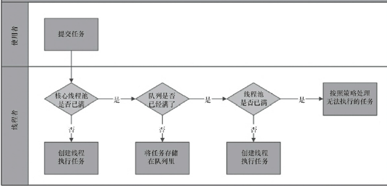

1.  线程池判断核心线程池里的线程(corePoolSize)是否都在执行任务。如果不是，则创建一个新的工作线程来执行任务。如果核心线程池里的线程都在执行任务，则进入2。
2.  线程池判断工作队列(workQueue)是否已满。如果工作队列没有满，则将新提交的任务存储在该队列里。如果工作队列满了，则进入3。
3.  线程池判断线程池的线程(maximumPoolSize)是否都处于工作状态。如果没有，则创建一个新的工作线程来执行任务。如果已经满了，则交给饱和策略来处理这个任务。

这里需要注意的是核心线程池大小指得是corePoolSize参数，而线程池工作线程数指的是maximumPoolSize。

#### Executor

实际上我们在使用线程池时，并不一定需要自己来定义上面介绍的参数的值，JDK为我们提供了一个调度框架。通过这个调度框架我们可以轻松的创建好线程池以及异步的获取任务的执行结果。

**调度框架的组成**

**任务**

一般是指需要被执行的任务，多为使用者提供。被提交的任务需要实现Runnable接口或Callable接口。

**任务的执行**

Executor是任务执行机制的核心接口，其将任务的提交和执行分离开来。ExecutorService继承了Executor并做了一些扩展，可以产生Future为跟踪一个或多个异步任务执行。任务的执行主要是通过实现了Executor和ExecutorService接口的类来进行实现。例如：ThreadPoolExecutor和ScheduledThreadPoolExecutor。

**结果获取**

对结果的获取可以通过Future接口以及其子类接口来实现。Future接口提供了一系列诸如检查是否就绪，是否执行完成，阻塞以及获取结果等方法。

#### Executors工厂中的线程池

**FixedThreadPool**

```java
new ThreadPoolExecutor(nThreads, nThreads, 0L, 
                        TimeUnit.MILLISECONDS, new LinkedBlockingQueue<Runnable>());
```


该线程池中corePoolSize和maximumPoolSize参数一致。同时使用无界阻塞队列，将会导致maximumPoolSize和keepAliveTime已经饱和策略无效，因为队列会一直接收任务，直到OOM。

**SingleThreadExecutor**

```java
new ThreadPoolExecutor(1, 1, 0L, TimeUnit.MILLISECONDS,
                                    new LinkedBlockingQueue<Runnable>())
```


该线程池中corePoolSize和maximumPoolSize都为1，表示始终只有一个线程在工作，适用于需要保证顺序地执行各个任务；并且在任意时间点，不会有多个线程是活动的应用场景。同时使用无界阻塞队列，当任务多时极有可能OOM。

**CachedThreadPool**

```java
new ThreadPoolExecutor(0, Integer.MAX_VALUE, 60L, TimeUnit.SECONDS,
                                      new SynchronousQueue<Runnable>()
```


CachedThreadPool类型的线程池corePoolSize为0，表示任务将会提交给队列，但是SynchronousQueue又是一个不包含任何容量的队列。所以每一个任务提交过来都会创建一个新的线程来执行，该类型的线程池适用于执行很多的短期异步任务的程序，或者是负载较轻的服务器。如果当任务的提交速度一旦超过任务的执行速度，在极端情况下可能会因为创建过多线程而耗尽CPU和内存资源。

**ScheduledThreadPool**

对于定时任务类型的线程池，Executor可以创建两种不同类型的线程池：ScheduledThreadPoolExecutor和SingleThreadScheduledExecutor，前者是包含若干个线程的ScheduledThreadPoolExecutor，后者是只包含一个的ScheduledThreadPoolExecutor。

ScheduledThreadPoolExecutor适用于需要多个后台线程执行周期任务，同时为了满足资源管理的需求而需要限制后台线程的数量的应用场景。

SingleThreadScheduledExecutor适用于需要单个后台线程执行周期任务，同时需要保证顺序地执行各个任务的应用场景。

```java
new ThreadPoolExecutor(corePoolSize, Integer.MAX_VALUE, 0, NANOSECONDS, new DelayedWorkQueue());
```


在对该类型线程池进行实例化时，我们可以看到maximumPoolSize设置为了Integer的最大值，所以很明显在极端情况下和CachedThreadPool类型一样可能会因为创建过多线程而耗尽CPU和内存资源。

DelayedWorkQueue是一种延时阻塞队列，此队列的特点为其中元素只能在其延迟到期时才被使用。ScheduledThreadPool类型在执行任务时和其他线程池有些不同。

1.  ScheduledThreadPool类型线程池中的线程(假设现在线程A开始取任务)从DelayedWorkQueue中取已经到期的任务。
2.  线程A获取到任务后开始执行。
3.  任务执行完成后设置该任务下一次执行的时间。
4.  将该任务重新放入到线程池中。

ScheduledThreadPool中存在着定时任务和延时任务两种。

延时任务通过`schedule(...)`方法以及重载方法和`scheduleWithFixedDelay`实现，延时任务通过设置某个时间间隔后执行，`schedule(...)`仅执行一次。

定时任务由`scheduleAtFixedRate`实现。该方法创建并执行在给定的初始延迟之后，随后以给定的时间段进行周期性动作，即固定时间间隔的任务。

特殊的`scheduleWithFixedDelay`方法是创建并执行在给定的初始延迟之后首先启用的定期动作，随后在一个执行的终止和下一个执行的开始之间给定的延迟，即固定延时间隔的任务。

固定时间间隔的任务不论每次任务花费多少时间，下次任务开始执行时间是确定的。对于`scheduleAtFixedRate`方法中，若任务处理时长超出设置的定时频率时长,本次任务执行完才开始下次任务,下次任务已经处于超时状态,会马上开始执行。若任务处理时长小于定时频率时长,任务执行完后,定时器等待,下次任务会在定时器等待频率时长后执行。

固定延时间隔的任务是指每次执行完任务以后都等待一个固定的时间。由于操作系统调度以及每次任务执行的语句可能不同，所以每次任务执行所花费的时间是不确定的，也就导致了每次任务的执行周期存在一定的波动。

需要注意的是定时或延时任务中所涉及到时间、周期不能保证实时性及准确性，实际运行中会有一定的误差。

#### Callable/Future

在介绍实现多线程的时候我们有简单介绍过Runnable和Callable的，这两者基本相同，不同在于Callable可以返回一个结果，而Runnable不返回结果。对于Callable接口的使用方法和Runnable基本相同，同时我们也可以选择是否对结果进行接收处理。在Executors中提供了将Runnable转换为Callable的api：`Callable<Object> callable(Runnable task)`。

Future是一个用于接收Runnable和Callable计算结果的接口，当然它还提供了查询任务状态，中断或者阻塞任务以及查询结果的能力。

```java
boolean cancel(boolean mayInterruptIfRunning)  //尝试取消执行此任务。  
V get()  //等待计算完成，然后检索其结果。  
V get(long timeout, TimeUnit unit) //等待最多在给定的时间，然后检索其结果（如果可用）。  
boolean isCancelled() //如果此任务在正常完成之前被取消，则返回 true 。  
boolean isDone() //如果任务已完成返回true。  
```


FutureTask是对Future的基本实现，具有启动和取消计算的方法，查询计算是否完整，并检索计算结果。FutureTask对Future做了一定得扩展：

```java
void run() //将此future设置为其计算结果，除非已被取消。  
protected boolean runAndReset()  //执行计算而不设置其结果，然后重置为初始状态，如果计算遇到异常或被取消，则不执行此操作。  
protected void set(V v) //将此Future的结果设置为给定值，除非Future已被设置或已被取消。  
protected void setException(Throwable t) //除非已经设置了此 Future 或已将其取消，否则它将报告一个 ExecutionException，并将给定的 throwable 作为其原因。  
```


FutureTask除了实现Future接口外，还实现了Runnable接口。所以FutureTask可以由Executor执行，也可以由调用线程直接执行futureTask.run()。

当FutureTask处于未启动或已启动状态时，执行FutureTask.get()方法将导致调用线程阻塞；

当FutureTask处于已完成状态时，执行FutureTask.get()方法将导致调用线程立即返回结果或抛出异常。

当FutureTask处于未启动状态时，执行FutureTask.cancel()方法将导致此任务永远不会被执行；

当FutureTask处于已启动状态时，执行FutureTask.cancel(true)方法将以中断执行此任务线程的方式来尝试停止该任务；

当FutureTask处于已启动状态时，执行FutureTask.cancel(false)方法将不会对正在执行此任务的线程产生影响（让正在执行的任务运行完成）。

#### 关于是否使用Executors

在之前阿里巴巴出的java开发手册中，有明确提出禁止使用Executors：

> 【强制】线程池不允许使用 Executors 去创建，而是通过 ThreadPoolExecutor 的方式，  
> 这样的处理方式让写的同学更加明确线程池的运行规则，规避资源耗尽的风险。

在上面我们分析过使用Executors创建的几种线程池的使用场景和缺点，大多数情况下出问题在于可能导致OOM，在我实际使用中基本没有遇到过这样的情况。但是考虑到阿里巴巴这样体量的并发请求，可能遇到这种情况的几率较大。所以我们还是应该根据实际情况考虑是否使用，当然实际遵循阿里巴巴开发手册来可能会更好一点，毕竟这是国类顶尖公司常年在生产中积累下的经验。

最后，在本节中只是简单介绍线程池及其基本原理，帮助更好的理解线程池。并不涉及具体如何使用。

## http1.0和http1.1区别

- 长连接
  - 要建立长连接，可以在请求消息中包含Connection: Keep-Alive头域，如果服务器愿意维持这条连接，在响应消息中也会包含一个Connection: Keep-Alive的头域。
- Host域
  -  HTTP1.1在Request消息头里头多了一个Host域，而且是必传的，HTTP1.0则没有这个域。在HTTP1.0中认为每台服务器都绑定一个唯一的IP地址，因此，请求消息中的URL并没有传递主机名（hostname）。但随着虚拟主机技术的发 展，在一台物理服务器上可以存在多个虚拟主机（Multi-homed Web Servers），并且它们共享一个IP地址。HTTP1.1的请求消息和响应消息都应支持Host头域，且请求消息中如果没有Host头域会报告一个错误（400 Bad Request）。此外，服务器应该接受以绝对路径标记的资源请求。
- 带宽优化
  - HTTP/1.0中，存在一些浪费带宽的现象，例如客户端只是需要某个对象的一部分，而服务器却将整个对象送过来了。又比如下载大文件时不支持断点续传功能，在发生断连后不得不重新下载完整的包。HTTP/1.1中在请求消息中引入了range头域，它支持只请求资源的某个部分。在响应消息中Content-Range头域声明了返回的这部分对象的偏移值和长度。如果服务器相应地返回了对象所请求范围的内容，则响应码为206（Partial Content），它可以防止Cache将响应误以为是完整的一个对象。
- 消息传递
- 缓存
- Request method&&Status code
  - HTTP1.1增加了OPTIONS,PUT, DELETE, TRACE, CONNECT这些Request方法；HTTP1.1 增加新的status code


## 一根绳子切成三段,组成三角形的几率是多少?

==怎么还有概率题==

我们只要把不等式组的解集表示平面直角坐标系的一块面积即可.初中数学即可解决问题.

设绳长为12,分成的三段分别为x,y,12-x-y,且x>y>12-x-y,则x,x应满足以下5条关系：x+y<12, x>0, y>0, x>y, y>12-x-y,在平面直角坐标系中是以(12,0), (6,6), (4,4)为顶点的三角形区域,易求出面积等于12.

由于x>y>12-x-y,只需再满足x<6,这三段就能构成三角形.即在上述5条关系后再加上第6条：x<6,组成了以(6,3), (6,6), (4,4)为顶点的三角形区域,易求出面积等于3.

问题就解决了,构成三角形的概率是3/12=1/4

最后说一句,这个结果不受x=6的特殊情况影响.因为图形是由无数个点组成的.