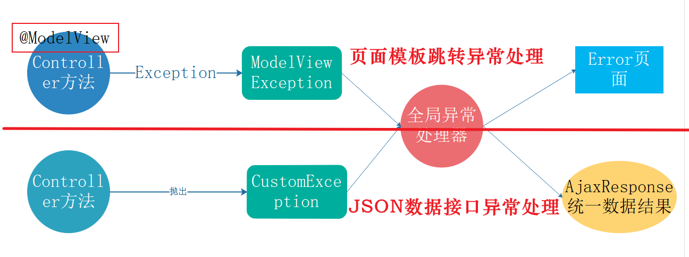

## 1、CommandLineRunner、ApplicationRunner、ApplicationListener的运用

想在SpringBoot初始化后在ServletContext写入一些属性，例如读取数据库的一些配置到系统中，用于渲染页面，例如我想把网站的icon图标变成可以设置的，把icon上传至腾讯云，然后数据库存储url，到需要thymeleaf渲染网页时渲染上去，此外，还有网站的标题、keywords这些我也想存在数据库中，到渲染的时候渲染上去。

当时想到的就是在SpringBoot启动过程中，将这些数据存到servletContext对象中，这个对象整个应用只有一份，而且thymeleaf模版引擎还提供了内置对象获取它，实现的思路其实很明确，就是在SpringBoot启动过程中，查询数据库，将数据放入ServletContext对象，将这些属性从thymeleaf的内置对象${#servletContext}取出渲染到页面上。

一开始网上找这个功能实现的方法，有博客提到自定义一个实现CommandLineRunner或者ApplicationRunner接口的类，然后继在实类中使用@Autowried注解注入ServletContext对象，和查询数据库的DAO或者Service对象，用于对数据库的查询，这个类中的run方法可以在Springboot调用，将查询的参数保存在ServletContext对象中，

如果在网站的运行过程中，修改了这些数据，一方面的在数据库中更新，另一方面在ServletContext对象更新，更新完后刷新网页就可以了。

当时查了挺久的，事后发现好像也没那么难，但我不是很理解CommandLineRunner或者ApplicationRunner怎么调用的。

然后最近看Spring源码，想起了这个问题，发现它在什么时候调用的呢，我在主函数的run方法上打上断点，然后跟踪，发现了Spring IOC容器初始化完成后，也就是那个著名的refresh方法执行后调用的，方法名字叫callRunners，传入它们的参数一个是String可变参数，一个是对象，这两个接口没有太大区别，而且正因为它在refresh方法后调用，所以才能使用@Autowried注入Bean。

这还没完，我在读源码时，发现了一个更有意思的事情，其实实现这个方法不仅可以使用CommandLineRunner或者ApplicationRunner，还可以使用Listener实现，监听IOC初始化完成后的事件，也就是ContextRefreshedEvent。也就是说，写一个自定义监听器，实现ApplicationListener接口，然后监听的事件是ContextRefreshedEvent，也可以在SpringBoot初始化时查询数据库，然后通过事件ContextRefreshedEvent对象获取到ApplicationContext，接着获取到servletContext，写入数据。那么这个事件是在什么时候发布的呢？在refresh中的最后一个方法finishRefresh()发布的，它里面有一个publishEvent(new ContextRefreshedEvent(this));。

通过这个功能，我不仅通过阅读源码解决了心中的疑惑，还探索了通过监听器的实现方案，还学会了观察者模式，前面还一直不太理解Spring的监听器到底怎么使用观察者模式的。


## 2、Aware接口

使用Redis做mybatis二级缓存时，要自定义一个实现了mybatis Cache接口的实现类，一般可以叫RedisCache，因为要操作Redis，需要拿到RedisTemplate，因为这个类由Mybatis管理，使用@Autowire会产生一些错误，然后我看网上的方式都是拿到ApplicationContext，也就是IOC容器，然后通过最原始的getBean方法拿到RedisTemplate，那么如果拿到ApplicationContext呢？可以编写一个工具类，实现Spring提供的ApplicationContextAware接口，然后就可以将注入的ApplicationContext保存成类静态变量。当时觉得这个方法老神奇了，然后最近读Spring源码，我就很想知道，这个东西在哪注入的，然后发现在refresh中的finishBeanFactoryInitialization方法中调用，这也是Spring最最核心的方法，在这个方法中，Spring的单例非懒得的所有对象将实例化，这里说一下Spring Bean的初始化流程，主要分为两步实例化和初始化，实例化就是把这个对象new出来，然后初始化有很多步骤，第一步就是填充属性，调用populateBean方法，第二步就是我们要找到注入Aware接口的方法，叫invokeAwareMethods，然后初始化还调用BeanPostProcessor.before方法，ben的init-method方法，BeanPostProcessor.after方法，才最终完成Bean的整个实例化过程。

在此，我在想一个问题，既然ApplicationContext可以通过这个方法拿到，那么ServletContext是不是也可以通过这个方法拿到呢？我就看了一下源码，真的有ServletContextAware接口，然后我们也可以编写一个工具类，优雅获取ServletContext。


## 3、防止XSS注入

在问答社区项目中，我设计了评论提交的功能，然后我在腾讯云部署了这个项目，然后在Github挂了链接，然后有网友来访问，本意我也想测试测试，过了今天，手机一直收到安全问题，让我整改，我还不知道发生了啥，然后我一查数据库，才发现有人在我网站中提交一些代码，才发现项目有一个特别大的漏洞，那就是没有防止XSS注入。怎么解决的呢，我在网上找到了一个叫Hutool的包，里面提供了各种各样的工具类，里面有一个Html工具类，提供了encode方法，可以将一些字符转化为安全字符，防止 xss 注入和 SQL 注入，这就是防止有小坏蛋故意写一些可执行的 js 代码，然后提交评论，在后台面板就会执行这一段代码，比较危险，使用 encode 方法就可以将 标签给转化成，这样转化之后，js 代码就不会执行了。


## 4、Controller全局异常处理的不同策略

我们做页面模板开发时(非前后端分离的应用)，Controller发生异常我们该怎么办？

**应该统一跳转到error.html页面，并且不能影响JSON数据接口的全局统一异常处理**。



以下是我给出答案：

1. 用面向切面的方式，将Exception转换为ModelAndViewException。
2. 全局异常处理器拦截ModelAndViewException，返回ModelAndView，即error.html页面
3. 切入点是带@ModelView注解的Controller层方法

**使用这种方法处理页面类异常，程序员只需要涉及到页面跳转的Controller方法上加@ModelView注解即可。** 当该方法抛出异常的时候就会自动跳转到error页面。

```java
@ModelView
@GetMapping("/freemarker")
public String index(Model model) {
    List<ArticleVO> articles = articleRestService.getAll();
    model.addAttribute("articles", articles);
    return "fremarkertemp";
}
```

**用面向切面的方法处理页面全局异常**

ModelView 注解，只起到标注的作用

```java
@Documented
@Retention(RetentionPolicy.RUNTIME)
@Target({ElementType.METHOD})//只能在方法上使用此注解
public @interface ModelView {

}
```

以@ModelView注解为切入点，面向切面编程,将所有捕获到的Exception转换为ModelViewException抛出。

```java
@Aspect
@Component
@Slf4j
public class ModelViewAspect {
    
    //设置切入点：这里直接拦截被@ModelView注解的方法
    @Pointcut("@annotation(com.zimug.boot.launch.exception.ModelView)")
    public void pointcut() { }
    
    /**
     * 当有ModelView的注解的方法抛出异常的时候，做如下的处理
     */
    @AfterThrowing(pointcut="pointcut()",throwing="e")
    public void afterThrowable(Throwable e) {
        throw ModelViewException.transfer(e);
    }
}
```

新定义一个异常类ModelViewException，将捕获到的异常Exception转化为ModelViewException

```java
public class ModelViewException extends RuntimeException{

    //将Exception 转换为ModelViewException
    public static ModelViewException transfer(Throwable cause) {
        return new ModelViewException(cause);
    }

    private ModelViewException(Throwable cause) {
        super(cause);
    }
}
```

全局异常处理器处理ModelViewException，将异常页面定位到error.html:

```java
@ExceptionHandler(ModelViewException.class)
public ModelAndView viewExceptionHandler(HttpServletRequest req, ModelViewException e) {
    ModelAndView modelAndView = new ModelAndView();

    //将异常信息设置如modelAndView
    modelAndView.addObject("exception", e);
    modelAndView.addObject("url", req.getRequestURL());
    modelAndView.setViewName("error");

    //返回ModelAndView
    return modelAndView;
}
```


## 5、优雅的返回数据

为了返回json数据，我定义了一个统一的数据格式AjaxResponse，包括状态码，信息，和要返回的数据，但每次Controller的返回值都要写AjaxResponse，这样不够优雅，我能不能在返回结果时，如果返回对象，我就直接写那个对象，返回集合，我就写集合类型。为了优雅的返回结果，我上网查询，发现还真有这个功能，需要定义了一个兜底的数据返回处理逻辑类，这个类要加上@ControllerAdvice，和全局异常处理一样，然后还要实现ResponseBodyAdvice 接口。实现ResponseBodyAdvice 接口的作用是：在将数据返回给用户之前，做最后一步的处理。也就是说，ResponseBodyAdvice 的处理过程在全局异常处理的后面。

具体的处理逻辑如下：

- 如果Controller或全局异常处理响应的结果body是AjaxResponse，就直接return给前端。
- 如果Controller或全局异常处理响应的结果body不是AjaxResponse，就将body封装为AjaxResponse之后再return给前端。


